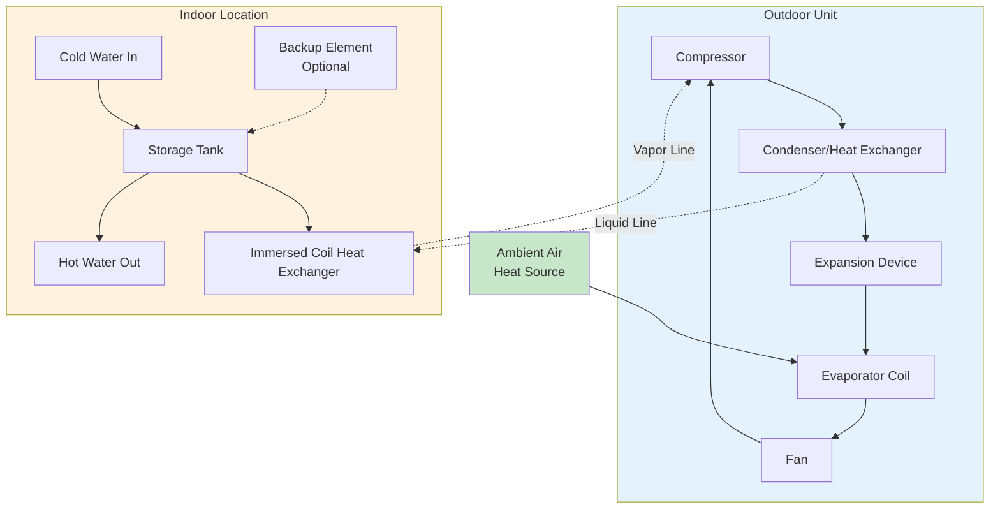

Split system heat pump water heaters (HPWHs) separate the heat pump module from the storage tank, connected by refrigerant lines. This configuration places the compressor, condenser coil, and heat rejection components outdoors while the storage tank remains inside, offering installation flexibility and performance advantages over integrated units.

## System Architecture

Split HPWHs consist of three primary components:

**Outdoor Unit:**
- Compressor (rotary or scroll type)
- Air-source evaporator coil
- Expansion device
- Defrost controls
- Fan assembly

**Indoor Storage Tank:**
- Water storage vessel (40-120 gallons typical)
- Refrigerant-to-water heat exchanger (wrap-around or immersed coil)
- Temperature and pressure relief valve
- Electrical backup elements (optional)

**Refrigerant Lines:**
- Liquid line (smaller diameter)
- Vapor line (larger diameter)
- Insulation to prevent heat loss and condensation
- Disconnect fittings for service

## Refrigerant Line Sizing

Proper refrigerant line sizing is critical for system efficiency and capacity. Line diameter depends on refrigerant type, line length, and capacity.

**Pressure Drop Calculation:**

The pressure drop in refrigerant lines follows the Darcy-Weisbach equation:

$$\Delta P = f \frac{L}{D} \frac{\rho v^2}{2}$$

Where:
- $\Delta P$ = pressure drop (Pa)
- $f$ = friction factor (dimensionless)
- $L$ = line length (m)
- $D$ = inside diameter (m)
- $\rho$ = refrigerant density (kg/m³)
- $v$ = velocity (m/s)

**Maximum Line Length Impact on Capacity:**

Capacity reduction due to line length:

$$Q_{actual} = Q_{rated} \times \left(1 - \alpha \frac{L - L_{rated}}{L_{max}}\right)$$

Where:
- $Q_{actual}$ = actual capacity (W)
- $Q_{rated}$ = rated capacity at standard line length (W)
- $\alpha$ = derating coefficient (typically 0.05-0.10)
- $L$ = actual line length (m)
- $L_{rated}$ = rated line length (typically 7.5 m)
- $L_{max}$ = maximum allowable length (m)

**Typical Line Sizing (R-134a, 3 kW unit):**

| Line Length | Liquid Line OD | Vapor Line OD | Capacity Loss |
|-------------|----------------|---------------|---------------|
| 0-15 ft (4.5 m) | 1/4" (6.35 mm) | 3/8" (9.52 mm) | 0% |
| 15-25 ft (7.6 m) | 1/4" (6.35 mm) | 1/2" (12.7 mm) | 2-5% |
| 25-50 ft (15 m) | 3/8" (9.52 mm) | 5/8" (15.9 mm) | 5-10% |
| 50-75 ft (23 m) | 3/8" (9.52 mm) | 3/4" (19.0 mm) | 10-15% |

## Outdoor Placement Considerations

**Temperature Operating Range:**

Standard split HPWHs operate effectively down to 40°F (4°C) ambient temperature. Cold climate models extend this range:

$$\text{COP}_{ambient} = \text{COP}_{rated} \times \left(1 - \beta \frac{T_{rated} - T_{ambient}}{T_{rated} - T_{min}}\right)$$

Where:
- $\text{COP}_{ambient}$ = coefficient of performance at ambient temperature
- $\text{COP}_{rated}$ = rated COP at 55°F (13°C)
- $\beta$ = temperature derating factor (0.4-0.6)
- $T_{rated}$ = rated temperature (55°F / 13°C)
- $T_{ambient}$ = actual ambient temperature (°F or °C)
- $T_{min}$ = minimum operating temperature (°F or °C)

**Cold Climate Performance:**

Below 40°F (4°C), split HPWHs face performance challenges:
- Reduced evaporator capacity due to lower heat source temperature
- Increased defrost cycle frequency
- Higher compressor power consumption
- COP reduction of 15-30% per 10°F decrease

Cold climate models incorporate:
- Enhanced vapor injection (EVI) compressors
- Demand defrost controls
- Increased evaporator surface area
- Variable-speed compressor operation

## Split vs Integrated Comparison

| Factor | Split System | Integrated System |
|--------|--------------|-------------------|
| **Installation Flexibility** | High - separate components | Low - single unit placement |
| **Indoor Noise** | 35-45 dB (tank only) | 45-55 dB (compressor indoors) |
| **Heat Source** | Outdoor air | Indoor conditioned air |
| **Cooling Effect** | None indoors | 3,000-5,000 BTU/hr cooling |
| **Space Requirement** | Tank only (2.5-3 ft²) | Clearance for airflow (12-15 ft²) |
| **Line Set Cost** | $150-500 (15-50 ft) | None |
| **Installation Complexity** | Higher - refrigerant handling | Lower - plug-in operation |
| **Climate Suitability** | Cold climates (outdoor air) | Moderate climates (indoor air) |
| **First Cost** | $2,500-4,500 | $1,500-2,500 |
| **Operating Efficiency** | COP 2.0-3.5 (varies with outdoor temp) | COP 2.5-4.0 (stable indoor temp) |
| **Maintenance Access** | Outdoor unit exposed | All components accessible |
| **Lifespan** | 12-15 years | 10-12 years |

## Installation Guidelines

**Refrigerant Line Routing:**

1. Minimize vertical rise between outdoor unit and tank (maximum 30 ft recommended)
2. Install liquid line trap at outdoor unit if tank is above compressor
3. Insulate both lines to prevent heat loss and condensation
4. Support lines every 4-6 ft to prevent sagging
5. Avoid sharp bends (minimum bend radius 5× tube diameter)

**Outdoor Unit Placement:**

- Clearance: 24" front, 12" sides, 48" above for airflow
- Elevated base pad to prevent snow blockage
- Protected from prevailing winds if possible
- Access for service and defrost drainage
- Noise consideration for neighboring properties

**Electrical Requirements:**

Split HPWHs typically require:
- Outdoor unit: 208-240V, 15-20A dedicated circuit
- Indoor tank (if backup elements): 208-240V, 20-30A circuit
- GFCI protection per NEC 422.5
- Disconnect within sight of outdoor unit

**Vacuum and Refrigerant Charging:**

1. Evacuate system to 500 microns or lower
2. Charge to manufacturer specification (typically 2-6 lbs R-134a or R-410A)
3. Verify subcooling (8-12°F liquid line) and superheat (10-15°F vapor line)
4. Leak test all brazed joints and fittings

## Performance Optimization

**Maximize Efficiency:**

- Set tank temperature to 120°F (49°C) for domestic use (140°F for dishwashers without booster)
- Schedule heating during warmer daytime hours if time-of-use rates apply
- Insulate hot water distribution lines to reduce standby losses
- Size tank to minimize electric backup element operation

**Cold Climate Strategies:**

- Install outdoor unit on south-facing wall for solar gain
- Use wind barriers or enclosures (maintain airflow clearances)
- Enable demand defrost mode rather than timed defrost
- Consider supplemental electric backup for temperatures below 20°F (-7°C)

## Advantages and Limitations

**Advantages:**

- No impact on indoor conditioned space (no cooling effect)
- Reduced indoor noise levels
- Flexible tank placement independent of heat pump location
- Suitable for cold climates with outdoor air heat source
- Can utilize existing water heater closet

**Limitations:**

- Higher installation cost due to refrigerant line set
- Requires certified HVAC technician for refrigerant work
- Performance degrades with decreasing outdoor temperature
- Outdoor unit exposed to weather and potential damage
- Longer refrigerant lines reduce efficiency
- Defrost cycles reduce capacity in cold weather

## Sizing and Selection

For residential applications, split HPWH capacity should meet the first-hour rating (FHR) based on peak demand:

$$\text{FHR} = \text{Tank Volume} \times 0.7 + \text{Recovery Rate} \times 1 \text{ hour}$$

Where recovery rate for split systems typically ranges from 15-25 gallons per hour at 90°F rise, depending on outdoor temperature and unit capacity.

**Standard Residential Sizing:**

- 1-2 occupants: 40-50 gallon tank, 2.5 kW heat pump
- 3-4 occupants: 50-65 gallon tank, 3.0 kW heat pump
- 5+ occupants: 80-120 gallon tank, 4.0 kW heat pump or multiple units

Split system HPWHs provide installation flexibility and reduced indoor noise compared to integrated units, making them ideal for applications where indoor space is limited or outdoor air provides a more advantageous heat source. Proper refrigerant line sizing, outdoor unit placement, and cold climate considerations are essential for optimal performance and longevity.
