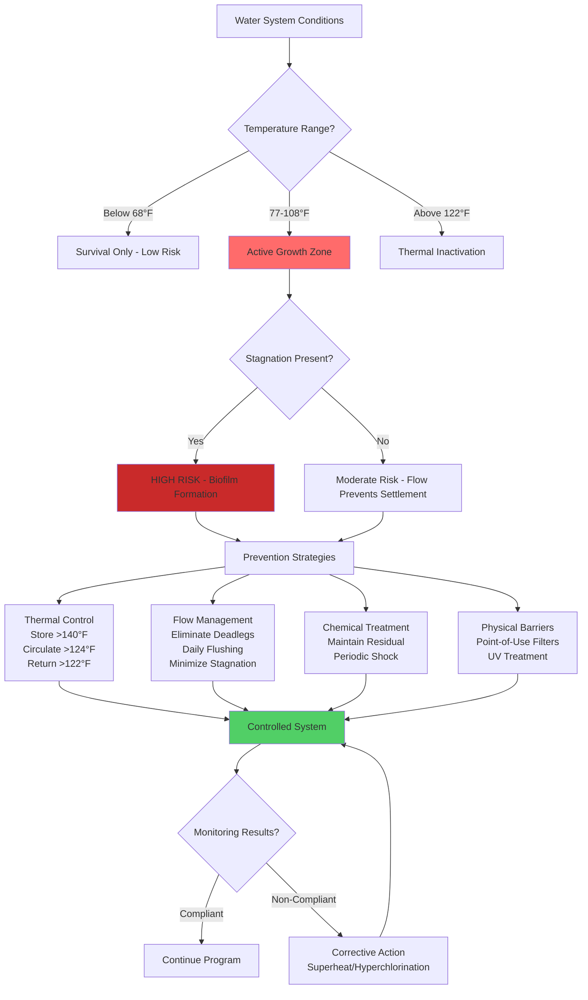

## Overview

Legionella pneumophila represents a critical public health concern in building water systems, particularly domestic hot water (DHW) installations. This opportunistic pathogen thrives in stagnant water at temperatures between 77°F (25°C) and 108°F (42°C), causing Legionnaires' disease through inhalation of contaminated aerosols. Effective prevention requires understanding the bacterium's growth conditions and implementing physics-based control strategies.

## Temperature-Based Control Principles

Thermal control remains the most fundamental Legionella prevention strategy, exploiting the bacterium's temperature sensitivity.

### Critical Temperature Thresholds

**Growth and survival temperatures:**
- Below 68°F (20°C): Legionella survives but does not multiply
- 77-108°F (25-42°C): Optimal growth range; population doubles every 3-6 hours
- 95-98.6°F (35-37°C): Peak multiplication rate
- Above 122°F (50°C): Growth ceases; bacteria begin to die
- 131°F (55°C): 90% inactivation in 5-6 hours
- 140°F (60°C): 90% inactivation in 2 minutes
- 158°F (70°C): Near-instantaneous death

### Thermal Inactivation Kinetics

The thermal death time relationship follows first-order kinetics:

$$t_{kill} = \frac{\ln(N_0/N_f)}{k(T)}$$

Where:
- $t_{kill}$ = time required for specified inactivation (minutes)
- $N_0$ = initial bacterial concentration (CFU/mL)
- $N_f$ = final bacterial concentration (CFU/mL)
- $k(T)$ = temperature-dependent inactivation rate constant (min$^{-1}$)

For 99% reduction ($N_f = 0.01 \times N_0$):

$$t_{99} = \frac{4.605}{k(T)}$$

**Practical inactivation times for 99% reduction:**

| Temperature | $t_{99}$ (minutes) | Application |
|-------------|-------------------|-------------|
| 131°F (55°C) | 360-480 | Minimum storage temperature |
| 140°F (60°C) | 2-3 | Standard pasteurization |
| 149°F (65°C) | 0.3-0.5 | High-temperature disinfection |
| 158°F (70°C) | <0.1 | Emergency superheat |

## ASHRAE 188 Water Management Programs

ANSI/ASHRAE Standard 188-2018, "Legionellosis: Risk Management for Building Water Systems," establishes a systematic approach to Legionella prevention through water management programs (WMPs).

### Core WMP Components

1. **Team assembly**: Multidisciplinary group including facilities, infection control, and engineering personnel
2. **System characterization**: Detailed mapping of all water systems, identifying areas of concern
3. **Hazard analysis**: Assessment of conditions promoting Legionella growth
4. **Control measures**: Implementation of physical and operational controls
5. **Monitoring**: Regular testing and verification of control effectiveness
6. **Response protocols**: Procedures for detecting and correcting control failures
7. **Documentation**: Comprehensive records of all activities and decisions

### High-Risk System Features

**Conditions requiring enhanced control:**
- Deadlegs and low-flow areas with stagnation time >7 days
- Water temperature in growth range (77-108°F)
- Presence of biofilm, scale, or sediment
- Aerosol-generating devices (showers, cooling towers, decorative fountains)
- Immunocompromised building occupants (healthcare facilities)

## Legionella Growth and Prevention Strategies

## Prevention Method Comparison

| Method | Mechanism | Effectiveness | Capital Cost | Operating Cost | Limitations |
|--------|-----------|---------------|--------------|----------------|-------------|
| **Thermal (Pasteurization)** | Protein denaturation at T >140°F | 99.9% reduction in 2 min at 140°F | Low (existing equipment) | Moderate (energy for heating) | Scalding risk; energy intensive; scale formation |
| **UV Disinfection** | DNA damage by 254 nm radiation | 99-99.9% with proper dose (40 mJ/cm²) | Moderate ($5,000-$50,000) | Low (lamp replacement) | No residual protection; turbidity sensitive; requires pre-filtration |
| **Copper-Silver Ionization** | Oligodynamic effect disrupts metabolism | 90-99% reduction | High ($10,000-$100,000) | Low (electrode replacement) | Requires 6-8 weeks for biofilm penetration; pH and hardness dependent |
| **Chlorine Dioxide** | Oxidation of cell membranes | 99.9% reduction at 0.5 ppm | Moderate (generation equipment) | Moderate (chemical costs) | Difficult control; corrosion concerns; odor/taste issues |
| **Monochloramine** | Biofilm penetration and oxidation | 95-99% reduction at 2-3 ppm | Moderate | Moderate | Requires continuous feed; nitrification concerns; regulatory approval needed |

## System Design and Operational Protocols

### Storage and Distribution Design

**Hot water storage:**
- Maintain storage tank temperature ≥140°F (60°C)
- Provide adequate insulation to minimize heat loss (R-12 minimum)
- Install mixing valves at point-of-use to prevent scalding (120°F delivery)
- Size tanks for <24-hour turnover to minimize stagnation

**Recirculation system:**
- Return line temperature must remain ≥122°F (50°C) at furthest point
- Flow velocity: 2-4 ft/s to prevent settlement while minimizing erosion
- Balance system to maintain uniform temperatures throughout
- Install thermostatic balancing valves at remote branches

### Flushing Protocols

Regular flushing prevents stagnation in low-use areas:

**Daily flushing for infrequently used outlets:**
- Duration: Minimum 5 minutes or until temperature stabilizes
- Target temperature: ≥122°F for hot water; ≤68°F for cold water
- Apply to: Guest rooms, seasonal facilities, emergency fixtures

**Hyperchlorination (corrective action):**
- Free chlorine: 20-50 ppm throughout system
- Contact time: 2-24 hours depending on concentration
- Flush until residual <2 ppm before restoring service

**Superheat-and-flush (thermal shock):**
1. Raise storage temperature to 160-170°F (71-77°C)
2. Flush each outlet for 5-10 minutes until 160°F achieved
3. Repeat weekly for 3-4 weeks if contamination persists

### Biofilm Control

Biofilm provides protection for Legionella against temperature and disinfectants:

**Prevention measures:**
- Maintain water velocity >1 ft/s in all pipes
- Use smooth pipe materials (Type L copper, PEX-b, CPVC)
- Control nutrient sources (organic carbon, iron, manganese)
- Prevent sediment accumulation in storage tanks (annual draining)

**Removal strategies:**
- Mechanical cleaning of storage tanks during shutdown
- Combined thermal-chemical treatment for established biofilm
- Point-of-use filtration (0.2 μm) for critical applications

## Monitoring and Verification

**Temperature monitoring:**
- Storage tank: Daily verification ≥140°F
- Return line: Weekly measurement at furthest point (≥122°F)
- Mixing valve output: Monthly verification 120°F ± 5°F

**Microbiological testing:**
- Routine surveillance: Quarterly samples at sentinel locations
- Action level: >1 CFU/mL Legionella at any location
- Expanded testing: If action level exceeded or healthcare outbreak suspected
- Sample locations: Storage tank, return line, deadlegs, problem fixtures

**System inspection:**
- Visual examination of tanks, expansion tanks, and deadlegs annually
- Pressure/temperature gauge verification quarterly
- Mixing valve calibration annually

## Conclusion

Legionella prevention in domestic hot water systems requires integrated engineering controls addressing temperature management, flow dynamics, and biofilm prevention. Thermal control through maintaining storage ≥140°F and circulation ≥122°F provides the most reliable primary defense. ASHRAE 188 water management programs formalize this approach through systematic hazard analysis and verification. Supplemental chemical or physical treatments offer additional layers of protection for high-risk facilities. Success depends on proper design, diligent operation, and continuous monitoring to ensure control measures remain effective.
