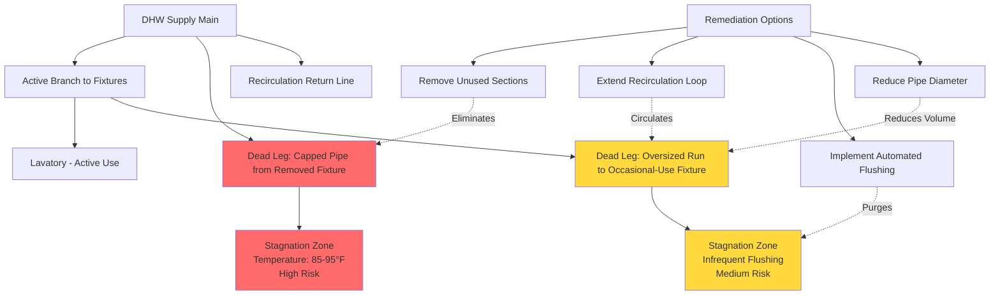

## Overview

Dead legs represent one of the most critical risk factors for *Legionella* colonization in domestic hot water (DHW) systems. These unused or infrequently used pipe runs create zones of water stagnation where temperatures fall into the growth range (77-113°F / 25-45°C) and disinfectant residuals dissipate. ASHRAE Standard 188 identifies dead leg elimination as a primary control measure in water management programs.

A dead leg is defined as any section of piping with a terminus that does not deliver water to fixtures under normal operation. This includes capped-off branches from past renovations, oversized pipe runs to infrequently used fixtures, and improperly designed recirculation loops that fail to reach terminal branches.

## Temperature Decay in Dead Legs

Water temperature in dead legs decays according to Newton's Law of Cooling, creating ideal conditions for bacterial amplification. The temperature at time $t$ is given by:

$$T(t) = T_{\infty} + (T_0 - T_{\infty})e^{-kt}$$

Where:
- $T(t)$ = water temperature at time $t$ (°F)
- $T_0$ = initial water temperature (°F)
- $T_{\infty}$ = ambient pipe environment temperature (°F)
- $k$ = cooling constant dependent on pipe material, insulation, and diameter (hr⁻¹)
- $t$ = stagnation time (hours)

For copper pipe exposed to 70°F ambient conditions, typical cooling constants range from 0.15 to 0.35 hr⁻¹ depending on insulation thickness. Uninsulated 1-inch copper pipe with initial water at 120°F drops to 95°F (growth-permissive range) within 2-4 hours of stagnation.

## Stagnation Time Calculation

The critical stagnation time—the duration before water reaches growth-permissive temperatures—depends on pipe volume and thermal characteristics:

$$t_{\text{stagnation}} = \frac{V \rho c_p}{hA} \ln\left(\frac{T_0 - T_{\infty}}{T_{\text{critical}} - T_{\infty}}\right)$$

Where:
- $V$ = pipe volume (ft³)
- $\rho$ = water density (62.4 lb/ft³)
- $c_p$ = specific heat of water (1.0 BTU/lb·°F)
- $h$ = overall heat transfer coefficient (BTU/hr·ft²·°F)
- $A$ = pipe surface area (ft²)
- $T_{\text{critical}}$ = threshold temperature for bacterial growth (113°F)

This calculation establishes maximum allowable dead leg lengths based on expected usage frequency and temperature maintenance capabilities.

## Maximum Dead Leg Length Criteria

ASHRAE 188 and various state plumbing codes establish maximum dead leg lengths to limit stagnation volume:

| Pipe Diameter | Maximum Dead Leg Length | Water Volume | Flushing Time (2 GPM) |
|---------------|-------------------------|--------------|----------------------|
| 0.5 inch | 8 feet | 0.13 gallons | 4 seconds |
| 0.75 inch | 12 feet | 0.35 gallons | 10 seconds |
| 1.0 inch | 18 feet | 0.61 gallons | 18 seconds |
| 1.25 inch | 24 feet | 1.23 gallons | 37 seconds |
| 1.5 inch | Not recommended | 1.76 gallons | 53 seconds |
| 2.0 inch | Requires recirculation | 3.26 gallons | 98 seconds |

Some jurisdictions adopt more stringent criteria, limiting dead legs to 6 feet for 0.75-inch pipe or requiring recirculation within 3 pipe diameters of all fixtures in healthcare facilities.

## Dead Leg Identification and Remediation

Common dead leg locations include:

- Capped branches from demolished or relocated fixtures
- Oversized distribution piping to low-flow fixtures
- Recirculation loops that terminate before reaching fixture branches
- Manifold systems with unused or abandoned takeoffs
- Emergency fixtures (eyewash stations, safety showers) without flushing protocols

## Dead Leg Prevention Strategies

| Strategy | Effectiveness | Implementation Cost | Maintenance Requirement | Best Application |
|----------|---------------|---------------------|------------------------|------------------|
| **Physical Removal** | Excellent (100%) | Moderate to High | None | Permanently abandoned fixtures |
| **Recirculation Extension** | Excellent (95-100%) | High | Low (pump maintenance) | High-use facilities, healthcare |
| **Automated Flushing** | Good (80-90%) | Moderate | Moderate (valve/timer maintenance) | Infrequently used fixtures |
| **Manual Flushing Protocol** | Fair (60-75%) | Low | High (compliance dependent) | Low-risk facilities |
| **Pipe Diameter Reduction** | Good (85-95%) | Moderate | None | Retrofit situations |
| **Self-Draining Configuration** | Good (90-95%) | Moderate | None | Specialty applications |

## Recirculation Loop Design

Properly designed recirculation systems eliminate dead legs by maintaining continuous water flow. The recirculation return should connect within:

$$L_{\text{max}} = \frac{Q_{\text{circ}} \cdot 60}{v \cdot A_{\text{pipe}}}$$

Where:
- $L_{\text{max}}$ = maximum distance from recirculation return (feet)
- $Q_{\text{circ}}$ = recirculation flow rate (GPM)
- $v$ = minimum velocity to prevent stagnation (0.5 ft/s)
- $A_{\text{pipe}}$ = pipe cross-sectional area (ft²)

Reverse-return configurations ensure balanced flow to all branches, preventing preferential flow paths that leave distant sections stagnant.

## Flushing Protocols for Unavoidable Dead Legs

When dead legs cannot be eliminated due to code-required emergency fixtures or intermittently used equipment, establish flushing protocols:

**Frequency Requirements:**
- High-risk facilities (healthcare): Daily flushing
- Moderate-risk facilities (hotels, offices): Weekly flushing
- Low-risk facilities (residential): Monthly flushing

**Flushing Duration:**
Calculate the time required to purge the dead leg volume at fixture flow rate:

$$t_{\text{flush}} = \frac{V_{\text{deadleg}} \cdot 3}{Q_{\text{fixture}}}$$

Where the factor of 3 ensures three complete volume exchanges. For example, a 0.75-inch pipe with 12 feet of dead leg (0.35 gallons) requires 32 seconds of flushing at 2 GPM.

**Automated Flushing Systems:**
Solenoid valves with programmable timers or building automation system (BAS) integration provide reliable flushing without relying on manual compliance. Temperature sensors can verify that fresh hot water has reached the fixture.

## Fixture Abandonment Procedures

When fixtures are removed during renovations:

1. **Trace the supply branch** to the nearest tee or main distribution line
2. **Cut and cap at the connection point**, not mid-run
3. **Verify no downstream branches** remain active
4. **Document the modification** in facility drawings
5. **Pressure test** the modified system

Never cap pipes mid-run, as this creates hidden dead legs that are difficult to identify during water management assessments.

## Documentation and Monitoring

Water management programs must document:

- Dead leg inventory with locations, lengths, and diameters
- Flushing schedules and compliance logs
- Temperature monitoring at dead leg terminations
- Corrective actions when temperatures fall below thresholds

Quarterly facility surveys should identify new dead legs created by maintenance activities or occupancy changes.

## References

- ASHRAE Standard 188-2018: *Legionellosis: Risk Management for Building Water Systems*
- ASHRAE Guideline 12-2020: *Managing the Risk of Legionellosis Associated with Building Water Systems*
- CDC *Toolkit for Controlling Legionella in Common Sources of Exposure*
- Uniform Plumbing Code (UPC) Section 609: *Hot Water Distribution Systems*
