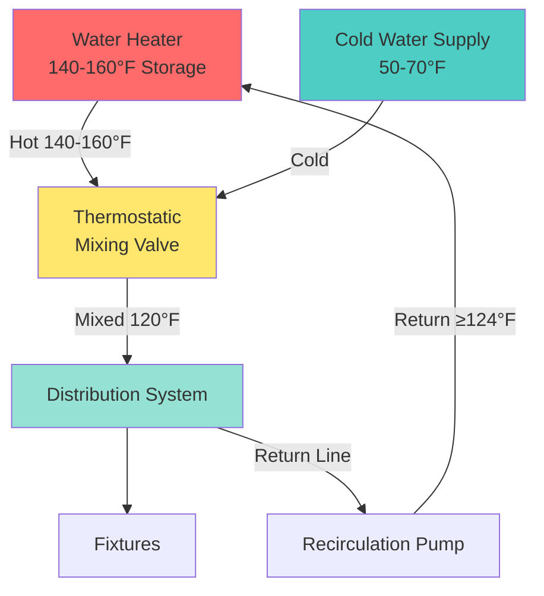

## High Temperature Storage

High temperature storage represents the primary passive defense against Legionella pneumophila proliferation in domestic hot water systems. This approach maintains water storage temperatures at 140°F (60°C) or above, creating thermally hostile conditions that prevent bacterial colonization and provide continuous pasteurization.

## Thermal Inactivation Principles

Legionella bacteria exhibit temperature-dependent survival characteristics. The thermal kill rate follows first-order kinetics, where the time required for bacterial inactivation decreases exponentially with temperature:

$$
\ln\left(\frac{N}{N_0}\right) = -kt
$$

Where:
- $N/N_0$ = fraction of surviving bacteria
- $k$ = temperature-dependent death rate constant (min⁻¹)
- $t$ = exposure time (minutes)

For 90% reduction (1-log kill):

$$
t_{90} = \frac{2.303}{k}
$$

The relationship between temperature and kill time demonstrates the effectiveness of thermal control:

| Storage Temperature | Time for 90% Kill | Time for 99.9% Kill | Practical Effect |
|---------------------|-------------------|---------------------|------------------|
| 122°F (50°C) | 80-124 min | 240-372 min | Growth possible |
| 131°F (55°C) | 5-6 min | 15-18 min | Partial control |
| 140°F (60°C) | 32 seconds | 96 seconds | Effective control |
| 150°F (66°C) | 2 seconds | 6 seconds | Rapid disinfection |
| 158°F (70°C) | Instantaneous | <2 seconds | Complete disinfection |

## System Configuration

High temperature storage systems require careful design to balance Legionella control with scald prevention:

## Storage Temperature Selection

**140°F (60°C) Minimum Standard**

ASHRAE 188 and WHO guidelines establish 140°F as the minimum effective storage temperature for Legionella control. At this temperature:

- Bacterial kill occurs within 32 seconds
- Recirculation systems maintain bacteriostatic conditions
- System provides margin against temperature stratification

**150-160°F (66-71°C) Enhanced Protection**

Higher storage temperatures provide additional safety factors:

- Faster kill times compensate for temperature drops in distribution
- Greater protection against dead legs and low-flow areas
- Accommodation for heat loss in large facilities

## Energy Considerations

High temperature storage increases energy consumption through multiple mechanisms:

**Standby Heat Loss**

Heat loss from storage tanks follows:

$$
Q_{loss} = UA(T_{storage} - T_{ambient})
$$

Where:
- $U$ = overall heat transfer coefficient (Btu/hr·ft²·°F)
- $A$ = tank surface area (ft²)
- $T_{storage}$ = storage temperature (°F)
- $T_{ambient}$ = ambient temperature (°F)

Increasing storage temperature from 120°F to 140°F in a 70°F mechanical room increases standby losses by approximately 40%.

**Distribution Losses**

Higher storage temperatures increase losses in uninsulated or poorly insulated piping. However, these losses are partially offset by reduced flow requirements when mixing down to delivery temperature.

## Scald Prevention

Water at 140°F causes second-degree burns in 5 seconds, third-degree burns in 15 seconds. Scald prevention requires:

**Thermostatic Mixing Valves (TMVs)**

ASSE 1017 or ASSE 1070 certified mixing valves installed at:
- Water heater outlet (master TMV)
- Point-of-use for high-risk applications (healthcare, schools)

**Design Requirements**

- Set mixed outlet temperature to 120°F maximum for general use
- 105-110°F for healthcare patient care areas
- TMV must fail-safe to shut off hot water if cold supply fails
- Provide adequate cold water supply pressure

**Validation**

Temperature verification at fixtures:
- Initial commissioning: measure at all fixture types
- Annual verification: representative sampling
- Document temperatures between 110-120°F at outlets

## Distribution System Integration

High temperature storage effectiveness depends on distribution system design:

**Recirculation Requirements**

Return line temperature must maintain ≥124°F (51°C) to prevent bacterial growth. The temperature at the furthest fixture before return should not drop below:

$$
T_{return,min} = 124°F + \Delta T_{loss}
$$

**Dead Legs**

Unused piping sections receive no thermal benefit from high storage temperatures. Dead legs exceeding 8 pipe diameters in length or containing more than 3 cups (24 oz) volume require elimination or periodic flushing.

**Stratification Control**

Storage tanks require adequate mixing or multiple inlet/outlet arrangements to prevent thermal stratification where cooler zones support bacterial growth.

## Regulatory Framework

**ASHRAE 188-2018**

Requires hazard analysis and control for building water systems. High temperature storage represents a primary control measure where:
- Occupancy includes vulnerable populations
- Building complexity creates extended piping runs
- Previous Legionella incidents occurred

**WHO Guidelines**

Recommends hot water storage ≥60°C (140°F) and distribution temperatures that maintain >50°C (122°F) throughout the system, with <2°C temperature drop from calorifier to point of use.

**Local Codes**

Many jurisdictions now mandate Legionella control plans incorporating thermal control. Verify local requirements for:
- Minimum storage temperatures
- TMV installation requirements
- Temperature monitoring and documentation

## Monitoring and Verification

Effective high temperature storage requires ongoing verification:

- **Storage temperature**: Daily verification at heater, logged automatically
- **Mixed delivery temperature**: Weekly spot checks at TMVs
- **Return line temperature**: Continuous monitoring at furthest point
- **Fixture temperatures**: Monthly or quarterly verification program

Documentation demonstrates due diligence for regulatory compliance and supports hazard analysis required under ASHRAE 188.

## Limitations

High temperature storage does not eliminate all Legionella risk:

- Dead legs and stagnant zones remain vulnerable
- Temperature drops in distribution compromise effectiveness
- Scale and biofilm provide thermal protection for bacteria
- Cold water systems require separate control measures

Comprehensive Legionella control integrates high temperature storage with proper system design, water quality management, and operational protocols.
