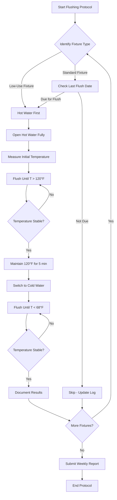

## Overview

Routine flushing eliminates stagnant water conditions that promote Legionella proliferation in domestic hot water systems. Stagnation allows water temperatures to drift into the growth range (77-108°F) and depletes residual disinfectants. Systematic flushing protocols form a critical operational component of ASHRAE 188 water management programs.

## Physical Basis for Flushing

Legionella bacteria replicate in biofilm and stagnant water where:

1. **Temperature conditions favor growth**: Water temperatures between 77°F and 108°F provide optimal proliferation rates
2. **Nutrient accumulation occurs**: Stagnant water accumulates organic matter and corrosion products
3. **Disinfectant residuals decay**: Chlorine or other biocides degrade over time without replenishment
4. **Biofilm development accelerates**: Stationary water facilitates bacterial attachment and biofilm formation

Flushing displaces stagnant water with fresh supply water, resets temperature profiles, and introduces residual disinfectant.

## Flush Volume Calculations

The volume required to fully exchange stagnant water depends on pipe geometry and fixture characteristics.

### Pipe Volume Formula

$$V_{pipe} = \frac{\pi D^2 L}{4}$$

Where:
- $V_{pipe}$ = pipe volume (in³)
- $D$ = internal pipe diameter (in)
- $L$ = pipe length from circulation loop to fixture (in)

### Flush Time Calculation

$$t_{flush} = \frac{V_{pipe}}{Q_{fixture}}$$

Where:
- $t_{flush}$ = required flush duration (min)
- $V_{pipe}$ = pipe volume (gal)
- $Q_{fixture}$ = fixture flow rate (gpm)

### Temperature Stabilization Criterion

Flushing continues until outlet temperature stabilizes:

$$\Delta T = T_{outlet} - T_{supply} \leq 2°F$$

Where:
- $T_{outlet}$ = measured fixture outlet temperature (°F)
- $T_{supply}$ = supply temperature at circulation loop (°F)
- $\Delta T$ = acceptable temperature deviation (°F)

## Flushing Frequency by Building Type

| Building Type | Low-Use Fixtures | Standard Fixtures | High-Risk Areas | Documentation Frequency |
|---------------|------------------|-------------------|-----------------|-------------------------|
| Healthcare Facilities | Weekly | Monthly | Daily | Each Event |
| Hotels/Dormitories | Weekly | Bi-weekly | Weekly | Weekly Summary |
| Office Buildings | Weekly | Monthly | Weekly | Weekly Summary |
| Schools | Daily (breaks) | Quarterly | Weekly | Weekly Summary |
| Industrial | Bi-weekly | Quarterly | Weekly | Monthly Summary |
| Residential Multi-Family | Vacant units: weekly | Monthly | N/A | Monthly Summary |

**Low-use fixtures**: Used less than twice per week
**High-risk areas**: Immunocompromised patients, ICU, transplant units

## Flushing Procedure Workflow

## Standard Flushing Procedures

### Weekly Low-Use Fixture Flushing

1. **Identification Phase**
   - Identify all fixtures used less than twice per week
   - Include guest rooms, emergency showers, utility sinks, break room fixtures

2. **Hot Water Flush Sequence**
   - Open hot water valve fully
   - Measure initial outlet temperature
   - Flush until outlet temperature exceeds 120°F
   - Maintain 120°F for minimum 5 minutes
   - Verify temperature stability (< 2°F variation over 1 minute)

3. **Cold Water Flush Sequence**
   - Switch to cold water only
   - Flush until outlet temperature below 68°F
   - Maintain temperature for minimum 2 minutes
   - Verify temperature stability

4. **Documentation Requirements**
   - Fixture identifier and location
   - Start and end temperatures (hot and cold)
   - Flush duration for each phase
   - Date, time, and operator name

### Monthly System Flushing

Extended flushing for fixtures in regular use but with potential dead-leg stagnation:

1. Flush all fixtures for minimum 10 minutes (hot water)
2. Target outlets: 124°F minimum at fixture
3. Verify recirculation system maintains 122°F return temperature
4. Document temperature profile across building zones

### Thermal Shock Procedure

Applied to fixtures with confirmed or suspected Legionella presence:

1. **Preparation**
   - Increase water heater setpoint to 140-150°F
   - Verify scald protection devices are temporarily bypassed or removed
   - Post signage warning occupants

2. **Execution**
   - Flush each fixture with 140°F water for 30 minutes minimum
   - Maintain outlet temperature above 131°F (10-minute Legionella kill time)
   - Monitor for consistent temperature throughout flush

3. **Cool-Down and Restoration**
   - Reduce water heater setpoint to operational temperature
   - Reinstall scald protection devices
   - Resume normal operations after system stabilizes

## Critical Considerations for Seldom-Used Fixtures

**Priority fixtures requiring weekly attention:**
- Emergency eyewash and safety showers
- Vacant guest rooms or patient rooms
- Seasonal-use facilities (closed wings, summer camps)
- Redundant or backup fixtures
- Dead-end branch lines with minimal flow

**Extended absence protocols:**
- Buildings closed more than 1 week: full system flush before reopening
- Individual fixtures unused more than 2 weeks: thermal shock treatment recommended

## Documentation and Record Keeping

ASHRAE 188 requires documented evidence of flushing activities:

**Minimum documentation elements:**
- Fixture identification system (room number, tag, or unique identifier)
- Scheduled frequency vs. actual completion date
- Temperature measurements (initial and final, hot and cold)
- Flush duration
- Operator performing procedure
- Anomalies or deviations from protocol

**Record retention:**
- Maintain flushing logs for minimum 3 years
- Electronic logging systems preferred for trend analysis
- Corrective actions documented for fixtures failing temperature criteria

## Integration with Water Management Programs

Routine flushing operates as one control measure within comprehensive ASHRAE 188 water management programs:

1. **Hazard analysis identifies** stagnation-prone fixtures and system segments
2. **Control limits establish** acceptable temperature ranges and maximum stagnation time
3. **Monitoring procedures verify** flushing effectiveness through temperature measurement
4. **Corrective actions address** fixtures consistently failing to achieve target temperatures
5. **Program validation confirms** Legionella control through periodic sampling

Flushing protocols must be integrated with temperature maintenance, disinfectant residual monitoring, and system design modifications to address persistent stagnation issues.

## Effectiveness Verification

Temperature alone does not confirm Legionella elimination. Verification requires:

- Periodic microbiological sampling (quarterly or as specified by water management team)
- Trend analysis of flush temperatures across building zones
- Investigation of fixtures requiring extended flush times
- Correlation of flushing compliance with Legionella detection rates

Facilities with consistent flushing protocol compliance demonstrate significantly reduced Legionella colonization compared to buildings with sporadic or absent flushing programs.
