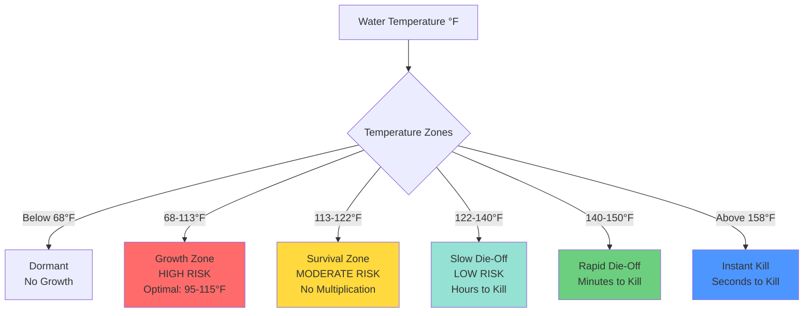

## Overview

Temperature control represents the most fundamental and effective strategy for Legionella prevention in domestic hot water systems. The bacterium *Legionella pneumophila* exhibits temperature-dependent growth characteristics that form the basis for engineering controls. Proper temperature management requires balancing two competing risks: maintaining temperatures sufficiently high to prevent bacterial proliferation while avoiding scalding injuries at points of use.

## Temperature-Growth Relationship

Legionella bacteria demonstrate well-defined thermal sensitivity:

**Growth and Survival Zones:**
- Below 68°F (20°C): Dormant, minimal multiplication
- 68°F to 113°F (20°C to 45°C): Growth range, optimal at 95-115°F (35-43°C)
- 113°F to 122°F (45°C to 50°C): Survival but no multiplication
- 122°F to 140°F (50°C to 60°C): Gradual die-off begins
- Above 140°F (60°C): Rapid thermal inactivation

## Thermal Kill Kinetics

The rate of Legionella inactivation follows first-order kinetics, described by the thermal death time relationship:

$$\log_{10}\left(\frac{N}{N_0}\right) = -\frac{t}{D_T}$$

Where:
- $N$ = bacterial concentration at time $t$
- $N_0$ = initial bacterial concentration
- $t$ = exposure time (minutes)
- $D_T$ = decimal reduction time at temperature $T$ (minutes for 90% kill)

**Decimal Reduction Times (D-values):**

$$D_{140°F} \approx 120 \text{ min}$$
$$D_{150°F} \approx 2 \text{ min}$$
$$D_{158°F} \approx 0.33 \text{ min (20 sec)}$$
$$D_{160°F} \approx 0.08 \text{ min (5 sec)}$$

For a 99.9% kill (3-log reduction):

$$t_{99.9\%} = 3 \times D_T$$

At 140°F, this requires approximately 6 hours of continuous exposure, while at 158°F, only 1 minute is needed.

## Temperature Control Strategies

### Storage Temperature Requirements

**ASHRAE 188 Standard:**
- Minimum storage temperature: **140°F (60°C)**
- Rationale: Prevents Legionella multiplication in the water heater tank
- Implementation: Set aquastat or controller to maintain 140-150°F

**WHO Guidelines:**
- Storage: **≥140°F (60°C)** continuously
- Distribution: **≥122°F (50°C)** throughout system
- Return temperature: **≥124°F (51°C)** in recirculation lines

### Distribution and Delivery Temperatures

| Parameter | Temperature | Purpose | Standard |
|-----------|-------------|---------|----------|
| Storage tank | 140-150°F (60-65°C) | Prevent growth in tank | ASHRAE 188, WHO |
| Hot water supply | 140°F (60°C) min | Prevent growth in distribution | ASHRAE 188 |
| Recirculation return | 124°F (51°C) min | Maintain distribution temp | WHO, ASHRAE 188 |
| Point of use (with TMV) | 120°F (49°C) max | Prevent scalding | ASSE 1017, ASSE 1070 |
| Point of use (healthcare) | 105-110°F (40-43°C) | Patient safety | FGI Guidelines |

### Thermostatic Mixing Valve Configuration

Thermostatic mixing valves (TMVs) resolve the temperature paradox by allowing high distribution temperatures while delivering safe temperatures at fixtures.

**System Architecture:**
1. Water heater maintains 140-150°F storage
2. Hot water distributed at 140°F throughout building
3. Master TMV or point-of-use TMVs reduce to 120°F at fixtures
4. Cold water supply remains isolated until mixing point

**TMV Performance Requirements:**
- ASSE 1017 (point-of-use): ±3°F outlet temperature stability
- ASSE 1070 (master valve): ±5°F outlet temperature stability
- Maximum outlet temperature: 120°F (49°C) residential, 105-110°F healthcare
- Fail-safe design: cold water failure must stop hot water flow

## Scalding Risk vs. Bacterial Risk

The fundamental tension in domestic hot water design:

**Scalding Time to Injury:**

$$t_{burn} = \frac{C}{(T_{water} - T_{skin})^n}$$

Where empirical data shows:
- 140°F: Scalding injury in ~5 seconds (adults), <1 second (children)
- 130°F: Scalding injury in ~30 seconds
- 120°F: Scalding injury in ~5 minutes
- 110°F: Safe for indefinite exposure

**Risk Comparison Table:**

| Temperature | Legionella Risk | Scalding Risk | Application |
|-------------|-----------------|---------------|-------------|
| 120°F | Very High (growth zone) | Low (5 min to burn) | ❌ Unsafe for storage/distribution |
| 130°F | High (survival zone) | Moderate (30 sec to burn) | ❌ Insufficient for prevention |
| 140°F | Very Low (die-off zone) | Very High (<5 sec to burn) | ✓ Storage/distribution only |
| 150°F | Minimal (rapid kill) | Extreme (instant burn) | ✓ Thermal disinfection protocol |
| 158-160°F | None (instant kill) | Extreme (instant severe burn) | ✓ Thermal shock treatment only |

## Thermal Disinfection Protocols

When Legionella contamination is detected, thermal disinfection (heat shock) provides emergency remediation:

**Protocol:**
1. Raise water heater temperature to 160-170°F (71-77°C)
2. Flush all fixtures sequentially until 160°F water flows for ≥5 minutes
3. Maintain elevated temperature for 24-48 hours
4. Return to 140-150°F storage temperature
5. Resample system after 48 hours

**Disinfection Effectiveness:**

At 160°F, the thermal kill rate achieves:

$$\text{Log reduction} = \frac{t}{D_{160°F}} = \frac{5 \text{ min}}{0.08 \text{ min}} \approx 62.5 \text{ (complete sterilization)}$$

## Temperature Monitoring and Control

**Critical Control Points:**
- Water heater outlet: Continuous monitoring, alarm if <140°F
- Recirculation return: Daily verification, maintain >124°F
- Dead-end branches: Weekly temperature checks
- Point-of-use TMVs: Monthly calibration verification

**Control System Requirements:**
- Temperature sensors: ±2°F accuracy, calibrated annually
- Aquastat differential: Maximum 10°F to minimize cycling
- Recirculation pump: VFD control to maintain return temperature
- Alarms: Low temperature (<140°F storage) and high temperature (>130°F post-TMV)

## Design Considerations

**System Design Principles:**
1. **Eliminate dead legs:** All branches must have flow or drain completely
2. **Minimize storage volume:** Reduces stagnation risk, improves turnover
3. **Insulate hot water piping:** Maintains distribution temperature, reduces heat loss
4. **Size recirculation pumps properly:** Balance flow ensures all branches stay hot
5. **Install TMVs strategically:** Master valves for zones, point-of-use for high-risk areas

**Energy Efficiency vs. Safety:**

Maintaining 140°F storage increases standby losses. Energy penalty calculation:

$$Q_{loss} = UA(T_{storage} - T_{ambient})$$

Increasing storage from 120°F to 140°F in typical 80-gallon tank increases standby loss by approximately 15-20%, but this is non-negotiable for Legionella prevention. Proper insulation and efficient equipment minimize the energy penalty.

## Regulatory and Code Requirements

- **ASHRAE 188-2018:** Mandates written water management programs including temperature monitoring
- **WHO Guidelines:** Specifies storage ≥140°F, distribution ≥122°F
- **State Plumbing Codes:** Many require TMVs when storage exceeds 140°F
- **Joint Commission:** Healthcare facilities must monitor and document temperatures
- **FGI Guidelines:** Healthcare design requirements for patient care areas

## Summary

Effective Legionella prevention through temperature control requires maintaining storage and distribution temperatures at or above 140°F while protecting building occupants from scalding through properly installed and maintained thermostatic mixing valves. This dual-temperature strategy—hot for distribution, safe for delivery—represents the engineering standard for balancing microbiological safety and scalding prevention in domestic hot water systems.
