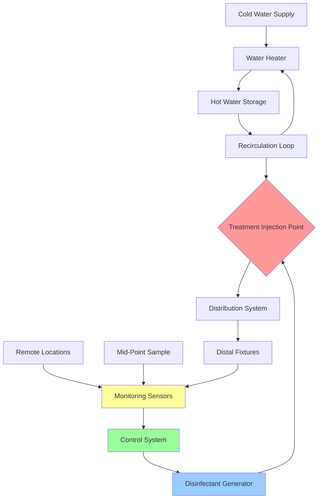

## Water Treatment Methods for Legionella Prevention

Supplemental disinfection represents a critical layer of defense against Legionella pneumophila in domestic hot water systems. While temperature control provides primary prevention, chemical and physical treatment methods offer continuous protection against biofilm formation and bacterial amplification, particularly in systems where maintaining optimal temperatures proves challenging.

## Supplemental Disinfection Fundamentals

Effective water treatment addresses three critical objectives: planktonic bacteria inactivation, biofilm penetration, and residual protection throughout the distribution system. ASHRAE 188 emphasizes that supplemental disinfection serves as a complement to, not a replacement for, proper system design and temperature management.

The CT concept (concentration × time) governs disinfection efficacy:

$$CT = C \cdot t$$

where $C$ is disinfectant concentration (mg/L) and $t$ is contact time (minutes). Required CT values for Legionella inactivation vary by disinfectant and temperature.

## Primary Treatment Technologies

### Chlorine Dioxide

Chlorine dioxide (ClO₂) provides superior biofilm penetration compared to free chlorine while avoiding trihalomethane formation. The system generates ClO₂ on-site through sodium chlorite reaction:

$$5NaClO_2 + 4HCl \rightarrow 4ClO_2 + 5NaCl + 2H_2O$$

Target residual concentrations range from 0.4 to 0.8 mg/L at the system's distal points. The chemical demand calculation follows:

$$D = \frac{Q \cdot C \cdot 1440}{E \cdot 1000}$$

where:
- $D$ = daily disinfectant demand (kg/day)
- $Q$ = system flow rate (L/min)
- $C$ = target concentration (mg/L)
- $E$ = generation efficiency (0.85-0.95 for ClO₂)
- 1440 = minutes per day

### Copper-Silver Ionization

Electrolytic generation of copper (Cu²⁺) and silver (Ag⁺) ions provides long-term residual disinfection with minimal operational complexity. Target concentrations:
- Copper: 0.2 to 0.8 mg/L
- Silver: 0.02 to 0.08 mg/L

The ionization rate required to maintain target levels:

$$R = \frac{(C_t - C_m) \cdot V}{t \cdot \eta}$$

where:
- $R$ = ionization rate (mg/hr)
- $C_t$ = target concentration (mg/L)
- $C_m$ = measured concentration (mg/L)
- $V$ = system volume (L)
- $t$ = circulation time (hr)
- $\eta$ = ion release efficiency

### Monochloramine

Monochloramine formation through ammonia and chlorine combination provides stable residual disinfection with reduced corrosion compared to free chlorine:

$$NH_3 + HOCl \rightarrow NH_2Cl + H_2O$$

The optimal chlorine-to-ammonia ratio (by weight) ranges from 4:1 to 5:1. Target residual: 2.0 to 3.0 mg/L as Cl₂.

Chemical feed rate calculation:

$$F = \frac{Q \cdot C \cdot 1440}{P \cdot 1000}$$

where:
- $F$ = feed rate (L/day or kg/day)
- $Q$ = water flow (L/min)
- $C$ = required dose (mg/L)
- $P$ = product purity (decimal)

## Treatment System Integration

## Treatment Method Comparison

| Parameter | Chlorine Dioxide | Copper-Silver | Monochloramine |
|-----------|-----------------|---------------|----------------|
| **Target Residual** | 0.4-0.8 mg/L | Cu: 0.2-0.8 mg/L Ag: 0.02-0.08 mg/L | 2.0-3.0 mg/L |
| **Biofilm Penetration** | Excellent | Very Good | Good |
| **CT₉₉ at 25°C (min·mg/L)** | 2.5-5.0 | 15-30 | 100-150 |
| **pH Sensitivity** | Moderate (6.5-8.5) | Low (6.0-9.0) | High (7.0-8.5) |
| **Corrosion Risk** | Low | Moderate (galvanic) | Low-Moderate |
| **Capital Cost** | High | Moderate | Moderate-High |
| **Operating Cost** | Moderate | Low | Moderate |
| **Monitoring Complexity** | Moderate | High (2 ions) | High (Cl₂, NH₃) |
| **Regulatory Acceptance** | Excellent | Good | Excellent |
| **Temperature Stability** | Decreases >40°C | Excellent | Good |
| **THM Formation** | None | None | Minimal |

## Biofilm Control Mechanisms

Effective Legionella control requires biofilm disruption. Penetration depth follows:

$$d = \sqrt{\frac{D \cdot t}{k}}$$

where:
- $d$ = penetration depth (μm)
- $D$ = diffusion coefficient (cm²/s)
- $t$ = contact time (s)
- $k$ = biofilm reaction constant

Copper-silver ionization and chlorine dioxide demonstrate superior biofilm penetration compared to traditional chlorination due to smaller molecular size and enhanced oxidation potential.

## Monitoring and Verification

ASHRAE 188 and CDC guidelines mandate continuous monitoring at multiple system locations:

1. **Primary injection point**: Verify generator output
2. **Mid-system locations**: Confirm distribution adequacy
3. **Distal points**: Validate end-point protection
4. **Dead legs and low-flow areas**: Identify problem zones

Sampling frequency:
- Daily: Automated sensor readings
- Weekly: Manual verification samples
- Monthly: Comprehensive system audit
- Quarterly: Legionella culture testing

The disinfectant decay rate determines required feed adjustments:

$$C(t) = C_0 \cdot e^{-kt}$$

where:
- $C(t)$ = concentration at time $t$
- $C_0$ = initial concentration
- $k$ = decay constant (1/hr)

## Critical Implementation Considerations

**Material compatibility**: Verify all system components tolerate the selected disinfectant. Copper-silver ionization requires evaluation of galvanic corrosion potential in mixed-metal systems.

**Water chemistry**: Baseline water quality significantly affects treatment performance. High chloride content accelerates corrosion with copper-silver systems. Elevated organic content increases chlorine dioxide demand.

**Hydraulic residence time**: Calculate system volume and flow rates to ensure adequate contact time before first fixture:

$$t_c = \frac{V}{Q} \cdot 60$$

where $t_c$ is contact time (minutes), $V$ is pipe volume (L), and $Q$ is flow rate (L/min).

**System turnover**: Target complete system water replacement within 24 hours to prevent stagnation despite supplemental disinfection.

## Regulatory Framework

CDC guidelines (June 2021) and ASHRAE 188-2018 establish supplemental disinfection as a recognized control measure when:
- Temperature maintenance proves impractical
- High-risk populations require enhanced protection
- System complexity creates temperature dead zones
- Historical Legionella colonization occurred

State and local regulations may impose additional requirements for healthcare facilities, cooling towers, and public water systems. Consult jurisdiction-specific codes before implementation.

## Operational Best Practices

1. Establish baseline water quality through comprehensive testing
2. Calculate chemical demand based on system volume and flow
3. Install injection equipment with proper backflow prevention
4. Deploy multi-point monitoring with automated alarming
5. Implement written operating procedures and maintenance schedules
6. Train operators on generator operation and safety protocols
7. Maintain detailed treatment logs and residual records
8. Conduct quarterly validation through microbiological testing

Supplemental disinfection effectiveness depends on proper design, consistent operation, and vigilant monitoring. No single technology eliminates Legionella risk; comprehensive water management programs incorporating multiple control measures provide optimal protection.
