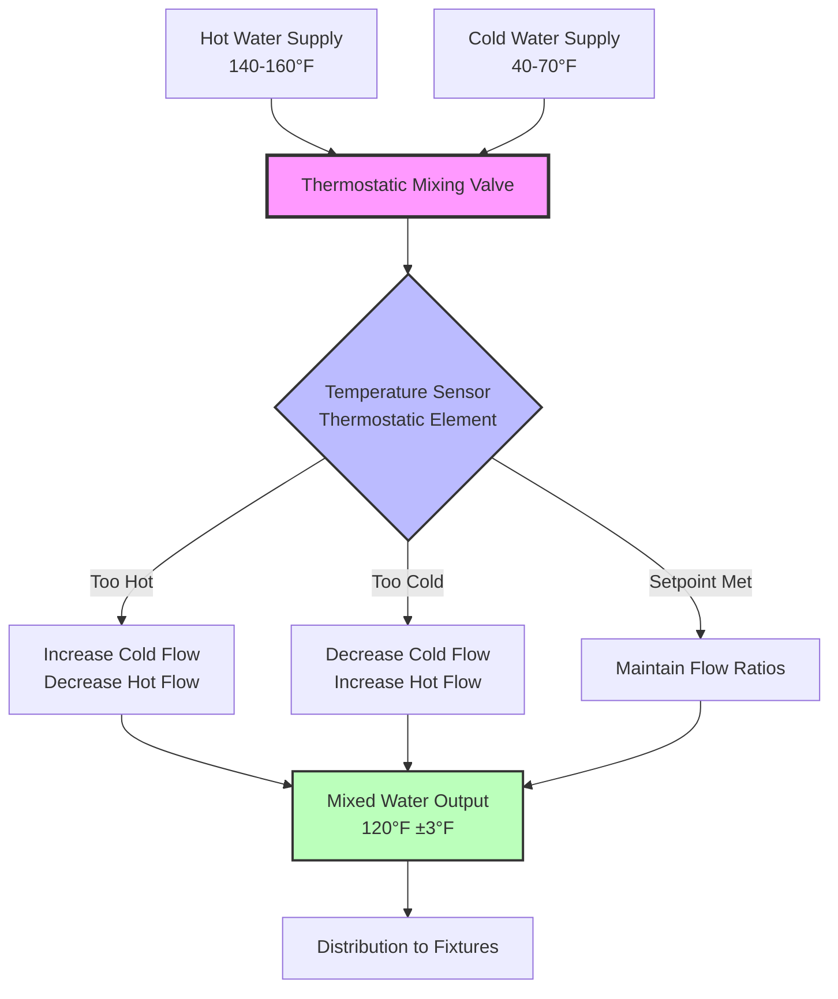
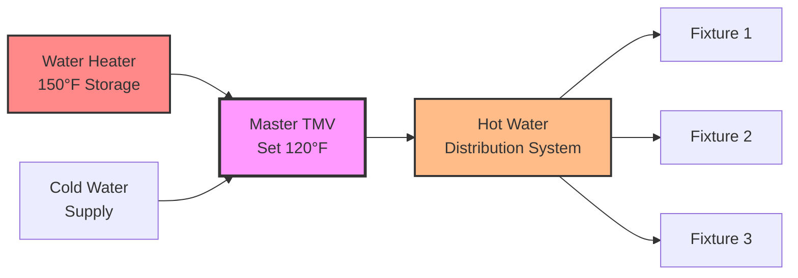
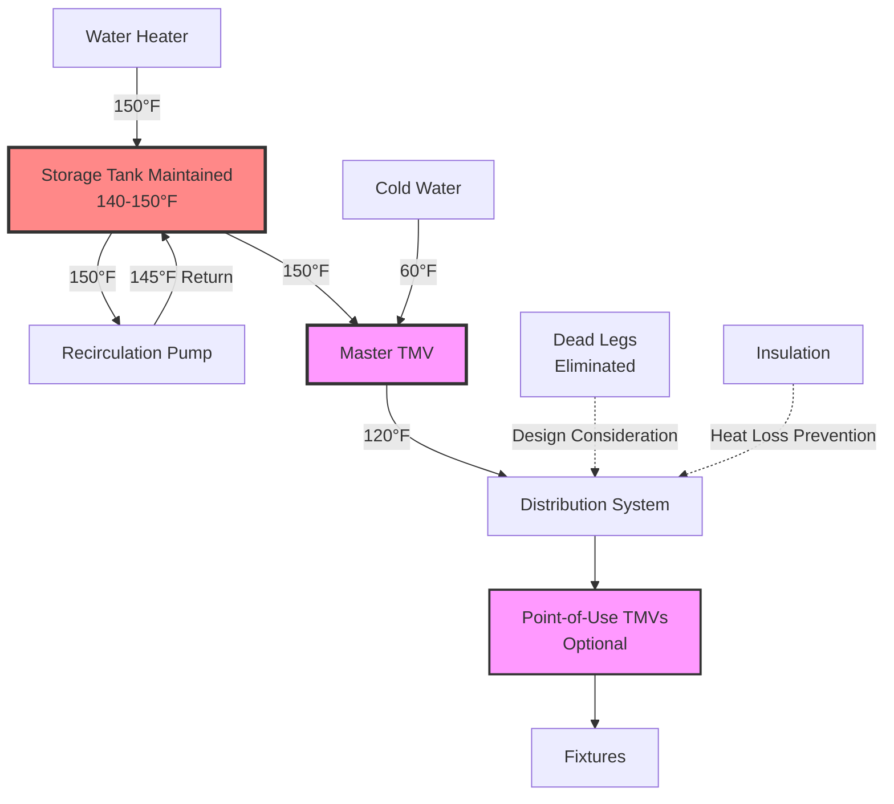

## Overview

Thermostatic mixing valves (TMVs) blend hot water from storage tanks with cold water to deliver safe, regulated temperatures at fixtures while enabling storage at elevated temperatures for Legionella control. These valves function as automatic temperature regulators, responding dynamically to variations in inlet pressures and temperatures to maintain consistent mixed water delivery.

The fundamental challenge in domestic hot water systems centers on conflicting temperature requirements: storage above 140°F (60°C) inhibits Legionella pneumophila bacteria growth, while delivery temperatures above 120°F (49°C) present scalding hazards. Thermostatic mixing valves resolve this conflict through precision temperature control at the point of blending.

## Operating Principles

### Thermostatic Element Mechanics

The core of a TMV consists of a thermostatic element containing wax or liquid with high thermal expansion coefficients. This element expands or contracts in response to mixed water temperature changes, mechanically repositioning internal porting to adjust hot and cold water flow ratios.

The temperature control relationship follows:

$$Q_{mixed} = Q_{hot} + Q_{cold}$$

Where the mixed water temperature becomes:

$$T_{mixed} = \frac{\dot{m}_{hot} c_p T_{hot} + \dot{m}_{cold} c_p T_{cold}}{\dot{m}_{hot} c_p + \dot{m}_{cold} c_p}$$

Simplifying with constant specific heat:

$$T_{mixed} = \frac{\dot{m}_{hot} T_{hot} + \dot{m}_{cold} T_{cold}}{\dot{m}_{hot} + \dot{m}_{cold}}$$

The mixing valve adjusts $\dot{m}_{hot}$ and $\dot{m}_{cold}$ continuously to maintain the setpoint $T_{mixed}$.

### Response Characteristics

TMV response depends on thermal mass of the thermostatic element and heat transfer rates. The time constant for valve adjustment typically ranges from 2-5 seconds, calculated as:

$$\tau = \frac{m_{element} c_{p,element}}{hA}$$

Where:
- $m_{element}$ = mass of thermostatic element (kg)
- $c_{p,element}$ = specific heat of element material (J/kg·K)
- $h$ = convective heat transfer coefficient (W/m²·K)
- $A$ = surface area of element (m²)

Faster response requires lower thermal mass and higher surface area-to-volume ratios.

## ASSE 1017 Standard Requirements

The American Society of Sanitary Engineering Standard 1017 establishes performance requirements for temperature-actuated mixing valves for hot water distribution systems.

### Performance Criteria

| Requirement | Specification | Test Condition |
|------------|---------------|----------------|
| Maximum Outlet Temperature | ≤ Setpoint + 3°F | Under all flow conditions |
| High Limit Stop | Required | Factory-set or field-adjustable |
| Cold Water Failure Response | Complete hot water shutoff | Within 5 seconds |
| Hot Water Failure Response | Complete cold water flow | Immediate pass-through |
| Pressure Variation Compensation | ±11°F maximum change | 50% pressure variation |
| Temperature Stability | ±3°F of setpoint | Continuous operation |
| Flow Rate Range | 0.5 to rated GPM | Manufacturer specification |

### Fail-Safe Operation

ASSE 1017 mandates fail-safe provisions:

**Cold Water Supply Failure**: The valve must prevent hot water flow to protect against scalding. A spring-loaded internal mechanism forces closure of the hot water port when cold water pressure drops below operational thresholds.

**Hot Water Supply Failure**: Cold water must flow freely to maintain service, even at reduced temperatures. This prevents system disruption from heater outages.

## Installation Configurations

### Master Mixing Valve Configuration

A master TMV installed at the water heater output provides system-wide temperature regulation:

**Advantages:**
- Single control point for entire system
- Reduced valve count and maintenance
- Consistent temperature throughout distribution
- Lower installed cost for large systems

**Disadvantages:**
- Entire system limited to single temperature
- No accommodation for varied use requirements
- Larger valve capacity required
- Recirculation system still exposed to elevated temperatures without point-of-use mixing

### Point-of-Use Mixing Configuration

Individual TMVs at each fixture or fixture group provide localized control:

**Applications:**
- Healthcare facilities requiring specific temperatures by use
- Facilities with varying demographic groups (elderly care at lower temperatures)
- Systems requiring different temperatures for handwashing (105-110°F) versus dishwashing (120-140°F)
- Retrofit installations where distribution piping cannot accommodate system-wide changes

### Hybrid Approach

Combined master valve with point-of-use tempering for critical fixtures:

1. Master valve reduces distribution system to 130-135°F
2. Point-of-use valves further reduce to 105-120°F at fixtures
3. Some fixtures receive 130-135°F water for sanitization requirements

## Sizing and Selection

### Flow Rate Calculations

TMV sizing requires determination of peak simultaneous flow demand. The valve must deliver required flow while maintaining temperature accuracy across the operating range.

$$\dot{V}_{mixed} = \frac{T_{hot} - T_{mixed}}{T_{hot} - T_{cold}} \times \dot{V}_{total}$$

Example calculation:
- Hot water supply: 150°F
- Cold water supply: 60°F
- Mixed water target: 120°F
- Total flow required: 10 GPM

$$\dot{V}_{hot} = \frac{120 - 60}{150 - 60} \times 10 = \frac{60}{90} \times 10 = 6.67 \text{ GPM}$$

$$\dot{V}_{cold} = 10 - 6.67 = 3.33 \text{ GPM}$$

The valve must handle 6.67 GPM hot water and 3.33 GPM cold water input to deliver 10 GPM mixed output.

### Pressure Drop Considerations

TMVs introduce additional pressure drop in the distribution system:

$$\Delta P = K \frac{\rho v^2}{2}$$

Typical K-values for TMVs range from 5-15 depending on valve design and position. At 10 GPM through a 3/4" valve (v ≈ 10 ft/s):

$$\Delta P = 10 \times \frac{62.4 \times 10^2}{2 \times 144} = 21.7 \text{ psi}$$

This significant pressure drop must be accounted for in system hydraulic calculations.

## Legionella Control Integration

### High-Temperature Storage Strategy

Thermostatic mixing valves enable the optimal Legionella control approach:

**Storage Temperature**: 140-150°F (60-66°C)
- Complete Legionella kill at 140°F within 32 minutes
- More rapid kill at 150°F (2 minutes exposure)
- No growth occurs above 122°F (50°C)

**Delivery Temperature**: 120°F (49°C) or lower
- Reduces scalding risk significantly
- First-degree burn time: 5 minutes at 120°F vs 5 seconds at 140°F
- Complies with plumbing codes for residential fixtures

The temperature differential effectiveness:

| Temperature | Legionella Status | Burn Time (Adult) |
|-------------|------------------|-------------------|
| 150°F (66°C) | Killed in 2 min | Instant (1 sec) |
| 140°F (60°C) | Killed in 32 min | 5 seconds |
| 130°F (54°C) | Growth stops | 30 seconds |
| 120°F (49°C) | Slow growth | 5 minutes |
| 110°F (43°C) | Optimal growth | No burn risk |

### System Design for Legionella Control

**Critical Design Elements:**

1. **Tank Temperature**: Maintained at 140-150°F continuously
2. **Recirculation Return**: Minimum 140°F at furthest point
3. **Master Mixing**: Reduces to safe delivery temperature
4. **Dead Leg Elimination**: No stagnant water zones
5. **Insulation**: Maintains temperature in distribution

## Code Requirements and Standards

### Model Plumbing Codes

**International Plumbing Code (IPC)**:
- Section 607.3: Maximum temperature 140°F at source
- Section 416.5: Requires master TMV when source exceeds 140°F
- Tempering valves must comply with ASSE 1017

**Uniform Plumbing Code (UPC)**:
- Section 608.3: Temperature limitation to 120°F at fixtures
- Healthcare facilities: 110°F maximum at patient-accessible fixtures
- ASSE 1017 or ASSE 1070 compliance required

### Application-Specific Requirements

| Application | Maximum Temperature | Standard | Notes |
|-------------|-------------------|----------|-------|
| Residential Fixtures | 120°F | IPC/UPC | Some jurisdictions 110°F |
| Public Lavatories | 110°F | ADA Guidelines | Scald prevention priority |
| Healthcare (Patient) | 110°F | FGI Guidelines | Vulnerable population |
| Healthcare (Service) | 140°F | Sanitation codes | Dishwashing, laundry |
| Schools/Daycare | 110°F | IPC Section 416.5 | Child protection |
| Showers (Public) | 120°F maximum | IPC Section 424 | With individual controls |

## Maintenance and Testing

### Periodic Verification

TMVs require regular testing to verify accurate temperature control:

**Quarterly Testing Protocol:**
1. Verify delivery temperature with calibrated thermometer
2. Check for ±3°F deviation from setpoint
3. Measure inlet hot and cold temperatures
4. Document flow rates during testing
5. Inspect for leaks or corrosion

**Annual Testing Protocol:**
1. Full disassembly and inspection of thermostatic element
2. Cleaning of internal components
3. Replacement of seals and gaskets
4. Calibration verification across full flow range
5. Cold-water failure test
6. Pressure variation test

### Common Failure Modes

| Failure Mode | Symptom | Cause | Resolution |
|--------------|---------|-------|------------|
| Temperature Drift | Setpoint deviation > 5°F | Element degradation | Replace thermostatic element |
| Incomplete Mixing | Temperature fluctuations | Scale buildup | Descale or replace internals |
| Reduced Flow | Low output pressure | Internal restriction | Clean strainers, check ports |
| Fail-Safe Inoperable | No shutoff on cold failure | Spring failure | Replace fail-safe mechanism |
| Leaking | External water seepage | Seal deterioration | Replace gaskets/seals |

### Scale and Sediment Impact

Hard water conditions accelerate TMV maintenance requirements. Calcium carbonate precipitation increases dramatically above 140°F:

$$\text{Scaling Tendency} \propto [Ca^{2+}][CO_3^{2-}] \times T$$

Systems with hardness above 120 mg/L (as CaCO₃) benefit from:
- Water softening upstream of heater
- Regular descaling procedures
- Thermostatic elements with larger clearances
- Annual preventive maintenance vs. biennial

## Energy Considerations

### Standby Heat Loss

Elevated storage temperatures increase standby losses through tank walls:

$$Q_{loss} = UA(T_{tank} - T_{ambient})$$

For a 50-gallon tank with U = 0.5 BTU/hr·ft²·°F and surface area 25 ft²:

At 150°F storage in 70°F space:
$$Q_{loss} = 0.5 \times 25 \times (150-70) = 1000 \text{ BTU/hr}$$

At 120°F storage in 70°F space:
$$Q_{loss} = 0.5 \times 25 \times (120-70) = 625 \text{ BTU/hr}$$

The 375 BTU/hr increase represents approximately 60% higher standby loss, or roughly 3,285 kWh/year additional energy for electric heaters.

### Distribution System Losses

Higher distribution temperatures also increase pipe losses:

$$Q_{pipe} = \frac{2\pi L}{\frac{1}{h_i r_i} + \frac{\ln(r_o/r_i)}{k} + \frac{1}{h_o r_o}}(T_{water} - T_{ambient})$$

Maintaining distribution at 120°F (via master mixing) versus 150°F reduces these losses by approximately 25% in typical installations.

## Advanced Applications

### Electronic Thermostatic Mixing Valves

Modern electronic TMVs incorporate:
- Digital temperature sensors with ±0.5°F accuracy
- Motorized actuators for precise flow control
- Building automation system integration
- Remote monitoring and adjustment capability
- Historical temperature logging
- Predictive maintenance alerts

These systems achieve ±1°F accuracy versus ±3°F for mechanical valves but require electrical power and controls integration.

### Multi-Temperature Systems

Complex facilities may require multiple delivery temperatures:

**Hospital Example:**
- Patient showers: 105°F (anti-scald priority)
- Staff handwashing: 110°F (comfort)
- Kitchen sanitization: 180°F (no TMV)
- Laundry: 140°F (direct from storage)
- General fixtures: 120°F (master TMV)

This requires careful zoning, multiple TMV stations, and clear labeling to prevent cross-connection.

## Conclusion

Thermostatic mixing valves represent essential safety devices in modern domestic hot water systems, enabling simultaneous achievement of Legionella control through elevated storage temperatures and scald prevention through regulated delivery temperatures. Proper selection, installation per ASSE 1017 standards, and regular maintenance ensure reliable protection for building occupants while maintaining water quality and system efficiency.

The dual temperature strategy—store hot, deliver safe—provides the most effective approach to comprehensive hot water system safety, making TMVs indispensable components in healthcare, institutional, commercial, and increasingly residential applications.
