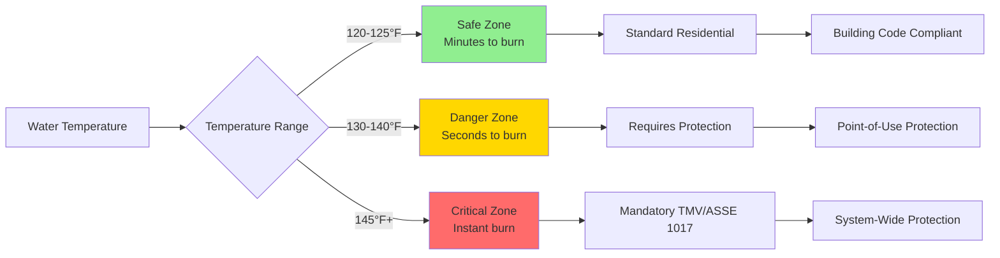
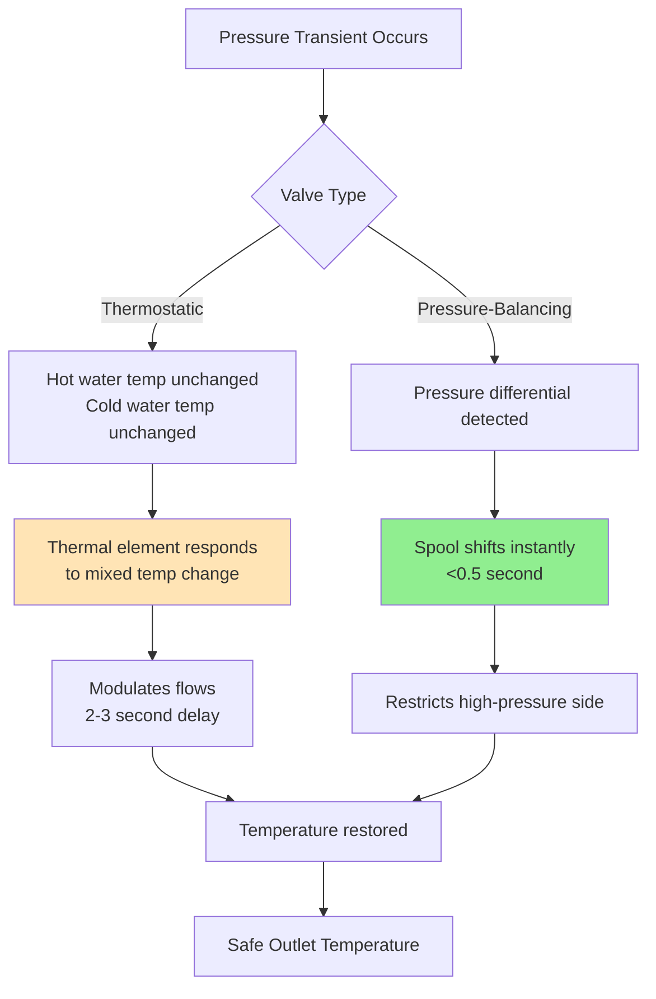

Anti-scald protection devices prevent thermal injury by limiting domestic hot water delivery temperatures through thermostatic or pressure-compensating mechanisms. Understanding the physics of heat transfer to tissue and the exponential relationship between temperature and burn time is critical for proper system design and code compliance.

## Heat Transfer to Tissue and Burn Mechanisms

Thermal injury to human tissue occurs when heat flux exceeds the body's ability to dissipate energy through blood perfusion and conduction. The severity of burns depends on both temperature and exposure duration, governed by the thermal dose:

$$\Omega = \int_0^t \exp\left(\frac{E_a}{R}\left(\frac{1}{T_{ref}} - \frac{1}{T(t)}\right)\right) dt$$

Where $\Omega$ is the damage integral (dimensionless), $E_a$ is the activation energy for protein denaturation (approximately 627 kJ/mol for epidermis), $R$ is the universal gas constant (8.314 J/mol·K), $T_{ref}$ is the reference temperature (311 K or 100°F), and $T(t)$ is the tissue temperature as a function of time.

For practical applications, empirical relationships correlate water temperature with time to third-degree burns. The skin's thermal response follows one-dimensional transient conduction during initial contact:

$$q'' = \frac{k_{tissue}(T_{water} - T_{skin})}{\sqrt{\pi \alpha_{tissue} t}}$$

Where $q''$ is heat flux (W/m²), $k_{tissue}$ is thermal conductivity (~0.5 W/m·K), $\alpha_{tissue}$ is thermal diffusivity (~1.4×10⁻⁷ m²/s), and $t$ is exposure time.

## Time-Temperature Burn Relationships

Experimental data establishes critical exposure thresholds for adult skin:

| Water Temperature | Time to Third-Degree Burn | Thermal Dose Rate |
|-------------------|---------------------------|-------------------|
| 120°F (49°C) | >10 minutes | Low risk |
| 125°F (52°C) | 2 minutes | Moderate |
| 130°F (54°C) | 30 seconds | High |
| 135°F (57°C) | 10 seconds | Critical |
| 140°F (60°C) | 3-5 seconds | Severe |
| 145°F (63°C) | 2 seconds | Extreme |
| 150°F (66°C) | 1 second | Immediate |
| 155°F (68°C) | <1 second | Instantaneous |
| 160°F (71°C) | Instant | Flash burn |

The relationship is approximately exponential, with burn time decreasing by ~50% for each 5°F increase above 130°F. Children under 5 years and adults over 65 years experience burns 2-3× faster due to thinner epidermis and reduced thermal tolerance.

## Maximum Delivery Temperature Requirements

### Plumbing Code Standards

The International Plumbing Code (IPC) and Uniform Plumbing Code (UPC) specify maximum temperatures for various occupancies:

**IPC Section 607.1** - Temperature control for public hand-washing facilities:
- Maximum 120°F (49°C) at public lavatory faucets
- Maximum 110°F (43°C) in healthcare facilities
- Measured at fixture outlet under design flow conditions

**UPC Section 608.4** - Tempered water requirements:
- Showers and tub/shower combinations: Maximum 120°F (49°C)
- Public use fixtures: Maximum 120°F (49°C)
- Private use fixtures: Maximum 140°F (60°C) permitted if approved

### ASSE Standards for Protection Devices

**ASSE 1017** - Temperature Actuated Mixing Valves for Hot Water Distribution Systems:
- Maintains outlet temperature within ±3°F of setpoint
- Responds to inlet temperature changes within 3 seconds
- Fail-safe design closes hot inlet on cold water failure
- Certified for continuous operation at 180°F supply temperature

**ASSE 1016** - Automatic Compensating Valves for Individual Fixtures:
- Pressure-balancing or thermostatic operation
- Limits temperature rise to maximum 3°F above setpoint during pressure transients
- Required for institutional shower applications

**ASSE 1070** - Water Temperature Limiting Devices for Individual Fixtures:
- Point-of-use scald protection
- Maximum outlet temperature 120°F regardless of inlet conditions
- Used where centralized mixing is impractical

## Thermostatic Mixing Valve Operation

Thermostatic mixing valves (TMVs) modulate hot and cold water flows to maintain constant outlet temperature using thermal actuators sensitive to mixed water temperature.

### Thermal Actuator Physics

The actuator contains a wax-filled element that expands with temperature according to:

$$\Delta V = V_0 \beta \Delta T$$

Where $\beta$ is the volumetric expansion coefficient (~0.0002/°C for paraffin wax). This expansion displaces a piston that modulates valve position. The control response follows:

$$\frac{dm_h}{dt} = K_p(T_{set} - T_{outlet}) + K_i\int(T_{set} - T_{outlet})dt$$

Where $m_h$ is hot water mass flow rate, and $K_p$, $K_i$ are proportional and integral control gains.

### Mixed Temperature Calculation

For steady-state mixing with negligible heat loss:

$$T_{mixed} = \frac{\dot{m}_h c_p T_h + \dot{m}_c c_p T_c}{(\dot{m}_h + \dot{m}_c) c_p} = \frac{\dot{m}_h T_h + \dot{m}_c T_c}{\dot{m}_h + \dot{m}_c}$$

The mixing ratio for desired outlet temperature:

$$\frac{\dot{m}_h}{\dot{m}_c} = \frac{T_{mixed} - T_c}{T_h - T_{mixed}}$$

For 120°F delivery from 140°F hot and 50°F cold water:

$$\frac{\dot{m}_h}{\dot{m}_c} = \frac{120 - 50}{140 - 120} = \frac{70}{20} = 3.5$$

This requires 77.8% hot water and 22.2% cold water by mass flow.

## Pressure-Balancing Valves

Pressure-balancing valves maintain constant temperature by equalizing hot and cold inlet pressures, preventing temperature shock during pressure transients (toilet flush, adjacent fixture operation).

### Pressure Balance Mechanism

The valve uses a sliding spool or diaphragm that responds to pressure differential:

$$\Delta P = P_{cold} - P_{hot}$$

When $\Delta P > 0$ (cold pressure increases), the spool restricts cold flow proportionally. Force balance on the diaphragm:

$$F_{net} = A_{cold}P_{cold} - A_{hot}P_{hot} - F_{spring}$$

Where $F_{net}$ drives spool position. Properly sized valves maintain temperature within ±3°F during 50% pressure reduction in either supply.

### Comparison: Thermostatic vs. Pressure-Balancing

| Feature | Thermostatic (ASSE 1017) | Pressure-Balancing (ASSE 1016) |
|---------|--------------------------|--------------------------------|
| Control method | Wax element responds to temperature | Diaphragm responds to pressure |
| Response time | 2-3 seconds | <0.5 seconds |
| Accuracy | ±2°F typical | ±3°F typical |
| Inlet temp change protection | Excellent | Good |
| Pressure transient protection | Good | Excellent |
| Cost | Higher ($200-600) | Lower ($80-250) |
| Applications | Healthcare, centralized systems | Residential showers |
| Flow capacity | 5-100 gpm | 1.5-5 gpm |

## Healthcare Facility Requirements

Healthcare facilities face elevated scald risk due to vulnerable populations (pediatric, geriatric, mobility-impaired patients) and Legionella control requirements necessitating high storage temperatures.

### Temperature Conflict Resolution

Healthcare facilities must balance two competing requirements:
- **Scald prevention**: Maximum 120°F (ideally 110°F) at fixtures
- **Legionella control**: Minimum 140°F storage and recirculation

The solution employs central thermostatic mixing valves immediately after water heaters, creating a dual-temperature system:

**High-temperature distribution** (140-150°F):
- Equipment requiring high temperatures
- Central sterilizers
- Dishwashers
- Laundry facilities

**Tempered distribution** (110-120°F):
- Patient-accessible fixtures
- Staff hand-washing sinks
- Showers and tubs
- Hydrotherapy equipment

### FGI Guidelines for Healthcare

The Facility Guidelines Institute (FGI) *Guidelines for Design and Construction of Hospitals* specifies:

- **Patient care areas**: Maximum 110°F at fixtures accessible to patients
- **Staff areas**: Maximum 120°F at staff-only fixtures
- **Emergency fixtures**: Maximum 100°F at eye/face wash stations
- **Pediatric areas**: Maximum 105°F in all patient bathing fixtures
- **ASSE 1017 valves required** at point-of-generation with 140°F+ storage

### System Design for Healthcare

Effective healthcare DHW systems include:

1. **High-temperature generation**: 140-150°F storage with dedicated recirculation loop
2. **Master thermostatic mixing**: ASSE 1017 valves creating 110-120°F secondary loop
3. **Secondary recirculation**: Maintains tempered water temperature throughout distribution
4. **Point-of-use limiters**: ASSE 1070 valves at high-risk fixtures (pediatrics, memory care)
5. **Monitoring system**: Continuous temperature logging at critical points

### Emergency Shower Considerations

Emergency safety showers (ANSI Z358.1) require tepid water (60-100°F) to enable 15-minute decontamination:

$$Q = \dot{m} c_p \Delta T = \rho V c_p (T_{body} - T_{water})$$

Water colder than 60°F causes hypothermia risk; water above 100°F causes thermal stress. Dedicated thermostatic mixing valves with fail-safe cold water bypass are mandatory.

## Installation and Maintenance Considerations

Proper installation ensures reliable scald protection:

- **Pressure requirements**: Minimum 15 psi differential across valve, equal hot/cold supply pressures ±10%
- **Flow velocity**: Maximum 8 ft/s (2.4 m/s) to prevent erosion of internal components
- **Strainers**: 100-mesh screens required on inlet piping to prevent debris jamming
- **Thermal expansion**: Install expansion tanks to prevent pressure spikes damaging thermal elements
- **Access**: Provide clearance for servicing internal cartridges without system drain-down

Annual testing per ASSE 1017 certification requirements:
1. Measure outlet temperature at design flow rate
2. Verify response time: change inlet temperature 20°F, measure time to 95% recovery
3. Cold water failure test: shut off cold supply, verify hot water shutoff within 3 seconds
4. Pressure transient test: simulate 50% pressure drop, verify outlet change <3°F

Proper anti-scald protection is a life safety issue, particularly in healthcare, educational, and hospitality facilities serving vulnerable populations. System design must integrate thermostatic mixing technology with appropriate code compliance and maintenance protocols.
