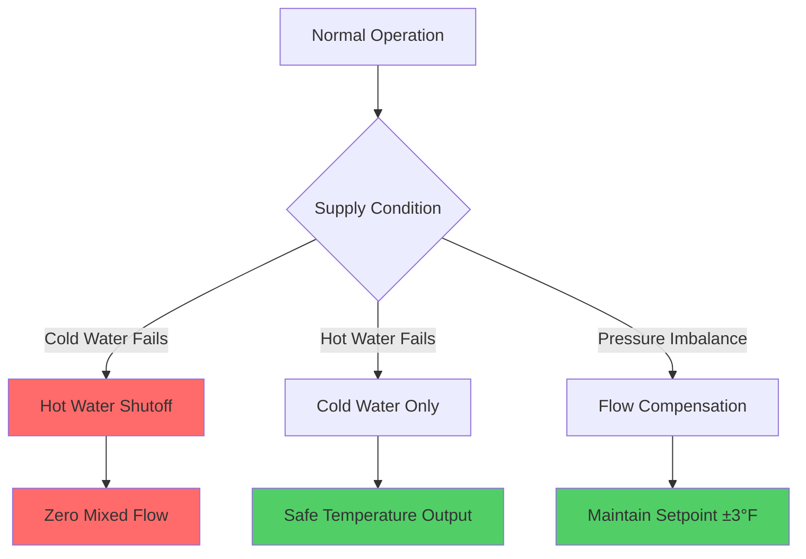
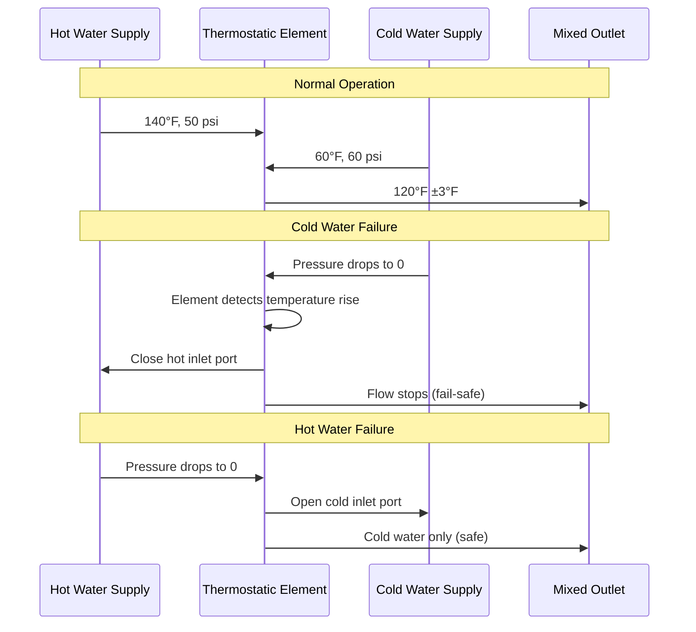

## ASSE 1017 Standard Overview

ASSE 1017 establishes performance requirements for thermostatic mixing valves (TMVs) designed to provide scald protection in domestic hot water systems. These valves automatically blend hot and cold water to deliver safe outlet temperatures, providing critical protection against thermal shock and scalding injuries. The standard mandates temperature stability, fail-safe operation, and response characteristics under varying supply conditions.

## Scald Protection Principles

Thermostatic mixing valves operate on the principle of temperature-actuated flow control. A thermostatic element responds to outlet water temperature, modulating hot and cold water inlet ports to maintain setpoint conditions.

### Temperature Mixing Equation

The basic energy balance for mixing valve operation:

$$Q_{mixed} = Q_{hot} + Q_{cold}$$

$$\dot{m}_{mixed} c_p T_{mixed} = \dot{m}_{hot} c_p T_{hot} + \dot{m}_{cold} c_p T_{cold}$$

Simplifying for constant specific heat:

$$T_{mixed} = \frac{\dot{m}_{hot} T_{hot} + \dot{m}_{cold} T_{cold}}{\dot{m}_{hot} + \dot{m}_{cold}}$$

Mixing ratio for desired outlet temperature:

$$\frac{\dot{m}_{hot}}{\dot{m}_{cold}} = \frac{T_{mixed} - T_{cold}}{T_{hot} - T_{mixed}}$$

### Maximum Safe Temperature Limits

| Application | Maximum Temperature | Code Reference |
|-------------|---------------------|----------------|
| Public lavatories | 110°F (43°C) | IPC 607.3 |
| Showers and tubs | 120°F (49°C) | ASSE 1016/1017 |
| Residential general | 120-125°F (49-52°C) | ASHRAE Guideline 12 |
| Healthcare facilities | 110°F (43°C) | FGI Guidelines |
| Schools and daycare | 105-110°F (41-43°C) | Local codes |

## ASSE 1017 Performance Requirements

### Temperature Stability Criteria

ASSE 1017 specifies maximum temperature deviation under normal and failure conditions:

**Normal Operation:**
- Outlet temperature must remain within ±3°F (±2°C) of setpoint
- Response time to inlet temperature changes: less than 5 seconds
- Maximum temperature variation during flow rate changes: ±5°F (±3°C)

**Failure Mode Protection:**
- Cold water failure: valve must shut off hot water supply
- Hot water pressure loss: valve must reduce or stop flow
- Maximum outlet temperature on cold water failure: +5°F above setpoint before shutoff

### Fail-Safe Operation Requirements

The fail-safe mechanism operates through:

1. **Thermostatic element expansion:** Wax or liquid-filled sensor expands/contracts with temperature
2. **Mechanical shutoff:** Element motion directly closes hot water inlet port
3. **Spring return:** Fails to cold water position on element failure
4. **No external power required:** Purely mechanical operation ensures reliability

## Testing Requirements and Protocols

### Factory Performance Testing

ASSE 1017 mandates the following test sequence:

| Test Parameter | Condition | Acceptance Criteria |
|----------------|-----------|---------------------|
| Temperature stability | 20 psi supply pressure differential | ±3°F (±2°C) variation |
| Cold water failure | Cold supply shut off | Hot shutoff within 5 seconds, +5°F max |
| Hot water failure | Hot supply shut off | Cold water flow only |
| Pressure fluctuation | 10-125 psi inlet pressure | ±5°F (±3°C) variation |
| Flow rate variation | 25% to 100% rated flow | ±5°F (±3°C) variation |
| High temperature limit | 140°F hot water supply | Outlet ≤ setpoint + tolerance |
| Cycling endurance | 150,000 thermal cycles | No performance degradation |

### Field Verification Procedures

Installation verification must confirm:

1. **Inlet temperature verification:** Hot supply ≥ 140°F (60°C), cold supply ≤ 80°F (27°C)
2. **Outlet temperature measurement:** Digital thermometer, 60-second stabilization
3. **Flow rate testing:** Measure at design flow conditions
4. **Fail-safe test:** Isolate cold water supply, verify shutoff occurs
5. **Pressure differential check:** Minimum 3 psi differential required for operation

### Thermostatic Element Response

The response time characteristic follows first-order dynamics:

$$T(t) = T_{final} + (T_{initial} - T_{final}) e^{-t/\tau}$$

Where:
- $\tau$ = thermal time constant (typically 2-4 seconds for ASSE 1017 valves)
- $t$ = time elapsed
- $T$ = outlet temperature

## Applications and Installation Requirements

### Primary Applications

**High-Risk Occupancies:**
- Healthcare facilities: patient bathing areas, therapy pools
- Schools and daycare: handwashing stations, showers
- Assisted living: all point-of-use fixtures
- Public accommodations: ADA-compliant installations

**System-Level Protection:**
- Master mixing valve for branch distribution systems
- Recirculation loop temperature control
- Storage tank tempering to reduce distribution temperature

### Installation Considerations

**Placement Requirements:**
1. Install as close to point-of-use as practical (minimize lag time)
2. Provide adequate clearance for maintenance and element replacement
3. Vertical orientation preferred for optimal thermostatic element response
4. Install downstream of backflow prevention devices

**Hydraulic Requirements:**
- Minimum inlet pressure: 15 psi (both supplies)
- Maximum pressure differential: 150 psi (hot to cold)
- Flow capacity: 0.5-20 gpm depending on valve size
- Pressure drop at rated flow: typically 5-10 psi

**Maintenance Schedule:**
- Annual temperature verification testing
- Element replacement every 5-7 years (preventive)
- Scale removal in hard water areas (as needed)
- Calibration check after any supply temperature changes

## Code Compliance and Certification

ASSE 1017 valves must be third-party certified and bear permanent identification. Model numbers and certification markings must be visible after installation. The International Plumbing Code (IPC Section 607) and Uniform Plumbing Code (UPC Section 607) reference ASSE 1017 for scald protection applications.

Designers must specify ASSE 1017 certified valves where code requires automatic temperature limiting. The valve alone does not eliminate the need for proper system design, including adequate hot water storage temperature (≥140°F for Legionella control) and appropriate distribution system configuration.

## Key Design Parameters

The effective thermal response of an ASSE 1017 valve installation depends on system thermal mass:

$$\tau_{system} = \frac{\rho V c_p}{UA + \dot{m} c_p}$$

Where:
- $\rho$ = water density
- $V$ = volume between valve and outlet
- $U$ = overall heat transfer coefficient
- $A$ = pipe surface area
- $\dot{m}$ = mass flow rate

Minimize downstream piping volume to reduce lag time and improve scald protection response.
