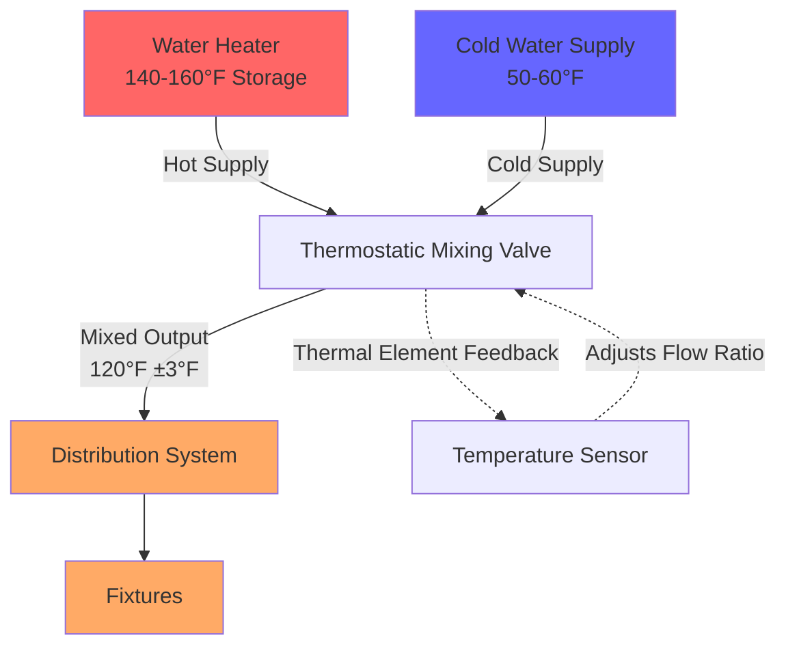
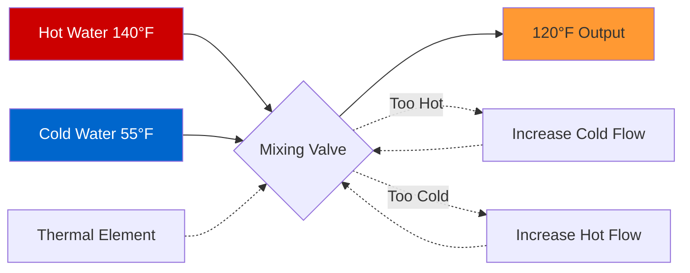

## 120°F Maximum Delivery Temperature

The 120°F (48.9°C) delivery temperature represents the maximum safe temperature for domestic hot water at fixtures, balancing scald prevention with effective cleaning and sanitation. Thermostatic mixing valves (TMVs) enable systems to store water at higher temperatures for Legionella control while delivering water at code-compliant temperatures.

## Physical Principles of Scald Prevention

Human skin damage follows exponential relationships with temperature and exposure time. The thermal energy transfer to skin follows:

$$Q = hA(T_w - T_s)t$$

Where:
- $Q$ = heat transferred to skin (J)
- $h$ = convective heat transfer coefficient (W/m²·K)
- $A$ = skin surface area (m²)
- $T_w$ = water temperature (°C)
- $T_s$ = skin surface temperature (~34°C)
- $t$ = exposure time (s)

### Scald Time-Temperature Relationship

| Water Temperature | Time to Serious Burn |
|-------------------|---------------------|
| 120°F (48.9°C) | 5-10 minutes |
| 130°F (54.4°C) | 30 seconds |
| 140°F (60°C) | 5 seconds |
| 150°F (65.6°C) | 1.5 seconds |
| 160°F (71.1°C) | 0.5 seconds |

At 120°F, the extended time-to-burn provides critical safety margin for vulnerable populations including children, elderly, and individuals with reduced mobility.

## Code Requirements and Standards

### ASSE 1017 Standard

ASSE 1017-certified thermostatic mixing valves must:
- Maintain outlet temperature ±3°F (±1.7°C) of setpoint
- Respond to supply temperature changes within 3 seconds
- Fail-safe to shut off upon cold water supply failure
- Include temperature-limiting adjustment mechanism

### Plumbing Code Mandates

**International Plumbing Code (IPC) Section 607.1:**
- Maximum 120°F at fixtures used for personal hygiene
- Applies to lavatories, showers, bathtubs, bidets
- Exception: clinical applications requiring higher temperatures

**Uniform Plumbing Code (UPC) Section 607.2:**
- 120°F maximum at fixtures accessible to children, elderly, disabled
- Point-of-use or central mixing valve requirement
- Annual temperature verification required

## Storage vs. Delivery Temperature Strategy

### High-Temperature Storage Rationale

Water heaters should maintain storage temperatures of 140°F (60°C) minimum to prevent Legionella pneumophila growth:

$$\text{Legionella Growth Rate} = f(T, t, \text{biofilm}, \text{stagnation})$$

**Temperature-Dependent Legionella Response:**

| Storage Temperature | Legionella Status |
|---------------------|-------------------|
| 68-122°F (20-50°C) | Optimal growth range |
| 122-140°F (50-60°C) | Survive but do not multiply |
| 140-150°F (60-66°C) | Die within 32 minutes at 140°F |
| 150-158°F (66-70°C) | Die within 2 minutes |
| >158°F (>70°C) | Die almost instantly |

### Mixing Valve Installation

Thermostatic mixing valves installed immediately downstream of water heaters provide:

1. **Legionella control** through high-temperature storage
2. **Scald prevention** through controlled delivery temperature
3. **Energy efficiency** by allowing tank temperature reduction
4. **Code compliance** without fixture temperature limiters

## Thermostatic Mixing Valve Operation

The mixing valve balances hot and cold water flows to maintain setpoint:

$$\dot{m}_{\text{mix}}T_{\text{mix}} = \dot{m}_h T_h + \dot{m}_c T_c$$

Where:
- $\dot{m}_{\text{mix}}$ = mixed water mass flow rate (kg/s)
- $T_{\text{mix}}$ = mixed outlet temperature (°C) = 48.9°C (120°F)
- $\dot{m}_h$ = hot water mass flow rate (kg/s)
- $T_h$ = hot water supply temperature (°C) = 60°C (140°F)
- $\dot{m}_c$ = cold water mass flow rate (kg/s)
- $T_c$ = cold water supply temperature (°C) = 10-15°C (50-59°F)

## Setpoint Adjustment and Calibration

### Typical Adjustment Range

TMVs provide adjustable setpoints within constrained ranges:

| Application | Setpoint Range | Typical Setting |
|-------------|----------------|-----------------|
| Residential lavatories | 105-120°F | 115-120°F |
| Residential showers | 110-120°F | 115-118°F |
| Commercial applications | 105-120°F | 110-115°F |
| Healthcare (non-patient) | 105-110°F | 105-108°F |

### Calibration Procedure

1. **Verify supply temperatures:** Hot ≥140°F, Cold 50-60°F
2. **Adjust setpoint screw:** Clockwise increases temperature
3. **Allow stabilization:** 30-60 seconds after adjustment
4. **Measure outlet:** Digital thermometer in flow stream
5. **Fine-tune:** ±3°F tolerance acceptable
6. **Lock adjustment:** Tamper-resistant cap installation
7. **Document:** Record temperatures and date

## Balancing Competing Requirements

### Energy Considerations

Lower storage temperatures reduce standby losses:

$$Q_{\text{loss}} = UA(T_{\text{tank}} - T_{\text{ambient}})$$

However, 140°F minimum storage temperature is non-negotiable for Legionella control in commercial and multi-family applications.

### Compromise Solutions

For single-family residential applications where Legionella risk is lower:
- **Option 1:** 120°F storage with periodic thermal disinfection (monthly boost to 140°F)
- **Option 2:** 140°F storage with master TMV (preferred)
- **Option 3:** Point-of-use TMVs at critical fixtures

## Installation Best Practices

1. **Location:** Install TMV immediately downstream of water heater
2. **Access:** Provide service access for calibration and maintenance
3. **Strainers:** Install inlet strainers to prevent debris fouling
4. **Pressure balancing:** Ensure adequate cold water pressure (within 15% of hot)
5. **Expansion control:** Account for thermal expansion in closed systems
6. **Labeling:** Clearly mark setpoint and calibration date

## Maintenance and Testing

### Annual Verification Requirements

ASSE 1017 and plumbing codes mandate annual testing:
- Measure outlet temperature under flow conditions
- Verify ±5°F of setpoint (recalibrate if outside tolerance)
- Test cold water fail-safe function
- Inspect for leaks, corrosion, and scale buildup
- Document results in facility maintenance log

### Troubleshooting Common Issues

| Symptom | Probable Cause | Solution |
|---------|----------------|----------|
| Outlet too hot | Cold supply restricted | Check cold water valve, strainer |
| Outlet too cold | Hot supply inadequate | Verify heater setpoint ≥140°F |
| Temperature fluctuation | Pressure imbalance | Install pressure-balancing valve |
| No flow | Debris blockage | Clean strainers, flush valve |
| Slow response | Thermal element failure | Replace valve assembly |

## Summary

The 120°F delivery temperature standard represents a critical balance between scald prevention and system functionality. Thermostatic mixing valves enable high-temperature storage (140-160°F) for Legionella control while providing code-compliant delivery temperatures. Proper installation, calibration, and annual testing ensure system safety and compliance with ASSE 1017, IPC, and UPC requirements.

**Key Takeaways:**
- Store domestic hot water at 140°F minimum for Legionella control
- Deliver water at 120°F maximum to prevent scalding
- Use ASSE 1017-certified thermostatic mixing valves
- Calibrate to ±3°F of setpoint during installation
- Test annually and document results
- Provide fail-safe cold water shutoff functionality
