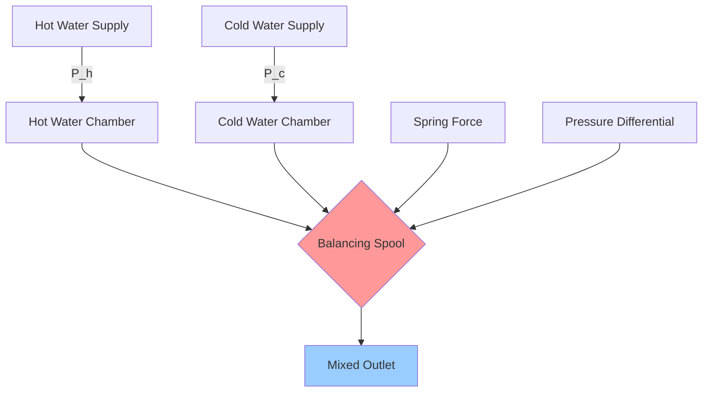
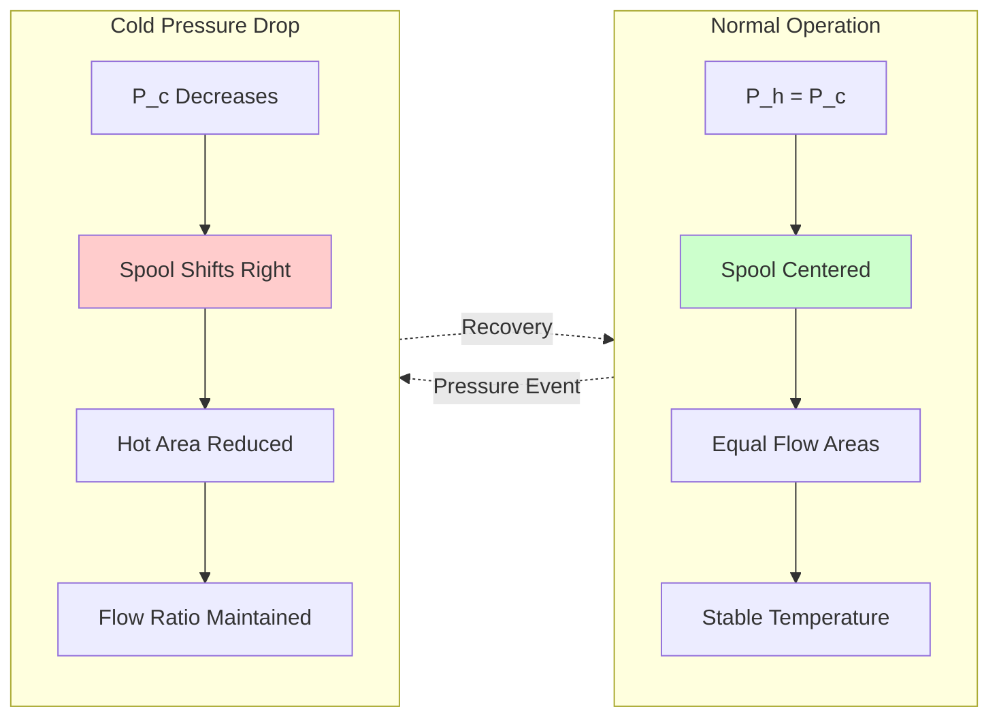

## Pressure Balancing Mechanism

Pressure balance mixing valves maintain temperature stability by compensating for supply pressure variations rather than sensing temperature directly. The mechanical balancing element responds to differential pressure changes between hot and cold water supplies, adjusting the valve orifices to maintain proportional flow.

The fundamental operating principle relies on pressure equilibrium:

$$\Delta P_h - \Delta P_c = 0$$

Where:
- $\Delta P_h$ = Hot water pressure drop across valve element (psi)
- $\Delta P_c$ = Cold water pressure drop across valve element (psi)

When cold water pressure drops (toilet flush, washing machine fill), the balancing spool shifts to reduce hot water flow proportionally, preventing thermal shock.

## Flow Compensation Principles

The balancing spool positions itself based on opposing spring forces and pressure differentials:

$$F_{spring} + F_{P_c} = F_{P_h}$$

The resulting flow relationship:

$$\frac{Q_h}{Q_c} = \sqrt{\frac{P_h}{P_c}} \cdot \frac{A_h}{A_c}$$

Where:
- $Q_h$, $Q_c$ = Hot and cold water flow rates (gpm)
- $P_h$, $P_c$ = Hot and cold supply pressures (psi)
- $A_h$, $A_c$ = Effective valve orifice areas (in²)

The spool adjusts $A_h$ and $A_c$ to maintain constant temperature despite pressure variations.

## Valve Mechanism Operation

## Thermal Shock Prevention

Thermal shock occurs when sudden pressure changes cause disproportionate hot/cold flow:

$$\Delta T_{shock} = T_{supply} - T_{desired}$$

Maximum allowable shock per ASSE 1016:

$$|\Delta T_{shock}| \leq 3.6°F \text{ (2°C)}$$

The pressure balance valve prevents shock by mechanical response time:

$$t_{response} < 1.0 \text{ second}$$

Pressure balance valves sacrifice flow rate to maintain temperature. When inlet pressures drop:

$$Q_{outlet} = Q_{min}(P_{lower})$$

Flow reduces proportionally with the lower supply pressure, preventing scalding or thermal shock.

## Performance Characteristics

| Parameter | Pressure Balance | Thermostatic | Manual Mixing |
|-----------|-----------------|--------------|---------------|
| Response Mechanism | Pressure differential | Wax element expansion | User adjustment |
| Scald Protection | Excellent | Superior | None |
| Temperature Precision | ±3.6°F | ±2°F | Variable |
| Flow Reduction | Yes (significant) | Minimal | None |
| Pressure Requirement | 15-80 psi balanced | 20-125 psi | Any |
| Cold Water Failure | Shuts off automatically | Shuts off automatically | Scalding risk |
| Hot Water Failure | Cold water only | Cold water only | Cold water only |
| Cost | Low | Moderate-High | Very Low |
| Application | Showers, tubs | All fixtures | Non-critical only |

## Valve Selection Criteria

### Pressure Requirements

Minimum inlet pressure differential for operation:

$$\Delta P_{min} = 15 \text{ psi}$$

Maximum recommended static pressure:

$$P_{static,max} = 80 \text{ psi}$$

For pressures exceeding 80 psi, install pressure reducing valves upstream.

### Flow Capacity

Pressure balance valves experience flow reduction under unbalanced conditions:

$$Q_{actual} = C_v \sqrt{\Delta P_{lower}}$$

Where:
- $C_v$ = Valve flow coefficient
- $\Delta P_{lower}$ = Lower of hot or cold supply pressures

Typical residential shower flow requirements:

$$Q_{shower} = 2.0-2.5 \text{ gpm (maximum per plumbing code)}$$

### Temperature Range

Supply temperature limits per ASSE 1016:

| Supply | Temperature Range |
|--------|-------------------|
| Hot Water | 120°F - 160°F |
| Cold Water | 40°F - 80°F |
| Mixed Outlet | 90°F - 120°F |

### Application Suitability

**Optimal Applications:**
- Residential showers and tub/shower combinations
- Hotels, dormitories, locker rooms
- Institutional settings where flow reduction is acceptable
- Retrofit installations in existing buildings
- Cost-sensitive projects

**Poor Applications:**
- Healthcare handwashing (flow reduction problematic)
- Commercial kitchens (thermostatic preferred)
- Process water requiring precise temperature
- Applications requiring high flow rates under all conditions

## Code and Standard Requirements

### ASSE 1016 Standard

Pressure balance valves for individual shower and tub-shower combinations must meet:

- Temperature variation limit: ±3.6°F (2°C) maximum
- Pressure variation test: ±50% inlet pressure change
- Cold water failure: automatic shutoff
- Maximum outlet temperature: 2°F above setpoint under failure
- Endurance testing: 40,000 cycles minimum

### Plumbing Code Compliance

International Plumbing Code (IPC) and Uniform Plumbing Code (UPC) require:

**Section 424.3 (IPC) / 607.3 (UPC):** Individual shower and tub-shower valves shall be pressure balance (ASSE 1016), thermostatic (ASSE 1070), or combination (ASSE 1069/1070) types.

**Maximum outlet temperature:**

$$T_{max} = 120°F \text{ (49°C)}$$

Healthcare facilities often require:

$$T_{max} = 110°F \text{ (43°C)}$$

### Installation Requirements

**Pressure balancing:**
- Hot and cold supplies from same pressure zone
- Equal pipe sizes and lengths to valve (within 10%)
- Install isolation valves with integral check stops
- Minimum 6" clearance behind finished wall for service access

**System design pressure differential:**

$$|\Delta P_h - \Delta P_c| \leq 10\% \text{ of nominal supply pressure}$$

Excessive static imbalance causes valve to operate at extreme positions, reducing effectiveness.

## Pressure Balance vs Thermostatic Selection

| Factor | Choose Pressure Balance | Choose Thermostatic |
|--------|-------------------------|---------------------|
| Budget | Limited | Adequate for premium |
| Flow priority | Temperature > Flow | Flow + Temperature |
| Pressure variation | Moderate (±30 psi) | Severe (±50 psi) or inconsistent |
| Temperature precision | ±3.6°F acceptable | ±2°F required |
| Installation | Retrofit, simple | New construction |
| Maintenance access | Limited | Good access available |
| User population | General public | Elderly, children, disabled |

## Conclusion

Pressure balance mixing valves provide cost-effective scald protection for shower and tub applications through mechanical pressure compensation. The balancing spool responds rapidly to pressure variations, maintaining temperature stability at the expense of flow rate. Proper valve selection requires analysis of supply pressure dynamics, flow requirements, and application-specific temperature precision needs. While thermostatic valves offer superior performance, pressure balance valves meet code requirements for most residential and light commercial applications where budget constraints exist and moderate flow reduction is acceptable.

## References

- ASSE 1016: Performance Requirements for Automatic Compensating Valves for Individual Showers and Tub/Shower Combinations
- International Plumbing Code (IPC), Section 424: Shower and Tub Valves
- Uniform Plumbing Code (UPC), Section 607: Temperature and Pressure Relief Devices
- ASHRAE Handbook—HVAC Applications, Chapter 50: Water Heating
