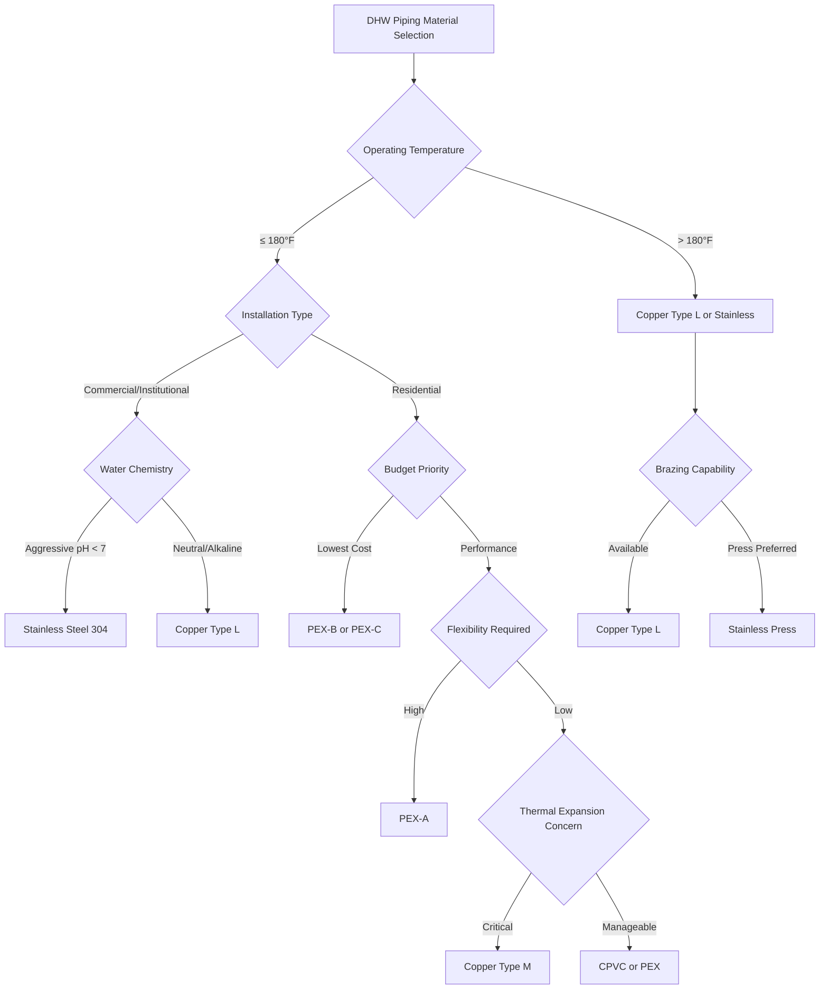

# Piping Materials for Domestic Hot Water Systems

Material selection for domestic hot water (DHW) distribution systems requires analysis of operating temperatures, pressure ratings, chemical compatibility, installation complexity, and long-term durability. The International Plumbing Code (IPC) and Uniform Plumbing Code (UPC) establish minimum requirements for materials in potable water service, while ASHRAE Standard 90.1 addresses thermal performance considerations.

## Material Selection Criteria

DHW systems operate at temperatures between 120°F and 140°F at distribution points, with storage temperatures reaching 160°F for Legionella control. Piping materials must maintain structural integrity under these thermal and pressure conditions while resisting corrosion and scaling.

### Thermal Expansion Considerations

Linear thermal expansion in piping systems follows:

$$\Delta L = L_0 \cdot \alpha \cdot \Delta T$$

where $\Delta L$ is the change in length (in), $L_0$ is the original length (in), $\alpha$ is the coefficient of linear expansion (in/in·°F), and $\Delta T$ is the temperature change (°F).

For a 100-foot copper pipe run experiencing a 70°F temperature rise:

$$\Delta L = 100 \text{ ft} \times 12 \text{ in/ft} \times 9.8 \times 10^{-6} \text{ in/in·°F} \times 70°F = 0.82 \text{ in}$$

PEX exhibits significantly higher expansion coefficients (approximately 1.0 × 10⁻⁴ in/in·°F), requiring expansion loops or offsets in long runs.

### Pressure-Temperature Relationships

Maximum allowable working pressure decreases with temperature. For Type L copper at 180°F, the pressure rating is approximately:

$$P_T = P_{ref} \times \frac{S_T}{S_{ref}}$$

where $P_T$ is pressure at elevated temperature, $P_{ref}$ is reference pressure at ambient conditions, and $S$ represents allowable stress values.

## Material Comparison

| Material | Max Temp (°F) | Pressure Rating | Expansion Coeff (×10⁻⁶ in/in·°F) | Corrosion Resistance | Cost Factor |
|----------|---------------|-----------------|-----------------------------------|---------------------|-------------|
| Copper Type L | 250 | 150 psi @ 180°F | 9.8 | Excellent (pH > 7) | 1.0× |
| Copper Type M | 250 | 125 psi @ 180°F | 9.8 | Excellent (pH > 7) | 0.8× |
| CPVC SCH 40 | 180 | 100 psi @ 180°F | 35 | Excellent | 0.5× |
| PEX-A | 200 | 160 psi @ 180°F | 100 | Excellent | 0.4× |
| PEX-B | 200 | 160 psi @ 180°F | 100 | Excellent | 0.3× |
| PEX-C | 200 | 160 psi @ 180°F | 100 | Excellent | 0.3× |
| Stainless 304 | 400+ | 300+ psi @ 180°F | 9.6 | Superior | 3.5× |

## Copper Piping

Copper remains the dominant material for commercial DHW systems. Type L provides heavier wall thickness suitable for pressures exceeding 150 psi, while Type M offers adequate performance for most residential applications. Copper demonstrates superior thermal conductivity (223 BTU/hr·ft·°F), though this increases heat loss in uninsulated runs.

IPC Section 605.3 and UPC Section 604.1 permit copper for potable water at temperatures up to 250°F. Brazed joints using BCuP (copper-phosphorus) alloys provide leak-tight connections rated for full system pressure.

Water chemistry affects copper longevity. Aggressive water (pH < 7.0, low alkalinity) accelerates corrosion. ASHRAE Standard 188 recommends water treatment for systems exhibiting blue-green staining or pinhole leaks.

## CPVC Systems

Chlorinated polyvinyl chloride (CPVC) offers lower material and installation costs. ASTM F441 Schedule 40 CPVC maintains structural integrity to 180°F with pressure ratings decreasing from 400 psi at 73°F to 100 psi at 180°F.

Solvent welding creates homogeneous joints that cure within 24 hours. CPVC exhibits low thermal conductivity (0.8 BTU/hr·ft·°F), reducing heat loss by approximately 72% compared to bare copper. The high expansion coefficient requires proper support spacing (3 feet maximum) and expansion compensation every 30 feet.

## PEX Tubing

Cross-linked polyethylene (PEX) dominates residential DHW distribution due to flexibility, freeze resistance, and reduced installation labor. Three manufacturing methods produce distinct characteristics:

- **PEX-A (Peroxide method)**: Highest flexibility, best thermal memory for kink repair
- **PEX-B (Silane method)**: Moderate flexibility, most common in North America
- **PEX-C (Radiation method)**: Lowest cost, reduced flexibility

ASTM F876 and F877 establish performance requirements. PEX operates continuously at 180°F with 200°F rating for intermittent exposure. Oxygen barrier PEX (ASTM F876) prevents diffusion into hydronic systems.

Connection methods include crimp rings (ASTM F1807), expansion fittings (ASTM F1960), and press fittings. Expansion fittings provide full-bore flow but require specialized tools.

## Stainless Steel

Type 304 stainless steel offers exceptional corrosion resistance in aggressive water conditions. Press-fit systems using EPDM O-rings simplify installation while maintaining pressure ratings exceeding 300 psi at elevated temperatures.

Stainless steel resists chlorine, chloramines, and low-pH conditions that degrade other materials. Applications include institutional facilities with chlorinated secondary disinfection and coastal installations with high chloride content.

## Material Selection Decision Tree

## Code Compliance and Installation

IPC Table 605.3 and UPC Table 6-1 list approved materials with maximum temperature and pressure limits. All piping requires listing to NSF/ANSI Standard 61 for potable water contact.

Support spacing follows material specifications:

- Copper: 6 feet horizontal, 10 feet vertical
- CPVC: 3 feet horizontal, 5 feet vertical
- PEX: 32 inches horizontal, 10 feet vertical (with continuous backing)

Insulation requirements per ASHRAE 90.1 Section 6.4.4.1.1 mandate R-3 minimum for pipes ≤ 1.5 inches and R-4 for larger diameters in conditioned spaces.

## Conclusion

Material selection balances initial cost, installation complexity, thermal performance, and service life. Copper provides proven reliability in commercial applications, while PEX dominates residential construction. CPVC offers intermediate performance, and stainless steel addresses aggressive water chemistry. Thermal expansion management and code-compliant installation ensure long-term system integrity.
