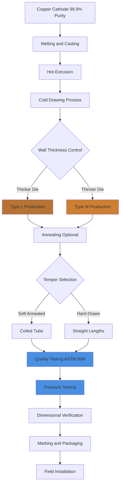

# Copper Type L and Type M for Domestic Hot Water Systems

Type L and Type M copper tubing represent the two most common copper pipe classifications for domestic hot water (DHW) distribution systems in North America. Both conform to ASTM B88 specifications for seamless copper water tube, but differ significantly in wall thickness, pressure rating, and application suitability. Understanding these differences is critical for proper system design, code compliance, and long-term reliability.

## ASTM B88 Classifications and Wall Thickness

ASTM B88 defines copper tubing by nominal size and wall thickness type. The key distinction between Type L and Type M lies in wall thickness, which directly affects pressure capacity and mechanical strength.

**Wall Thickness Relationship:**

$$t_L = t_M \times 1.5$$

where $t_L$ is Type L wall thickness and $t_M$ is Type M wall thickness (approximate ratio for common sizes).

For a 1-inch nominal copper tube:
- **Type L:** Wall thickness = 0.050 inches
- **Type M:** Wall thickness = 0.035 inches

This 43% increase in wall thickness gives Type L substantially higher pressure capacity and mechanical durability.

## Pressure Rating Calculations

The maximum working pressure for copper tubing depends on wall thickness, diameter, material yield strength, and operating temperature. Using the Barlow formula for thin-walled pressure vessels:

$$P_{max} = \frac{2 \times S \times t \times E}{D_o}$$

where:
- $P_{max}$ = maximum allowable pressure (psi)
- $S$ = allowable stress for copper (typically 7,000 psi for DHW service)
- $t$ = wall thickness (inches)
- $E$ = joint efficiency factor (0.9-1.0 for soldered joints)
- $D_o$ = outside diameter (inches)

**Example Calculation for 1-inch Copper at 140°F:**

Type L: $P_{max} = \frac{2 \times 7000 \times 0.050 \times 0.95}{1.125} = 589$ psi

Type M: $P_{max} = \frac{2 \times 7000 \times 0.035 \times 0.95}{1.125} = 412$ psi

These calculations demonstrate Type L's 43% higher pressure capacity, making it suitable for applications with pressure surges or higher working pressures.

## Type L vs Type M Comparison

| Parameter | Type L | Type M | Notes |
|-----------|--------|--------|-------|
| **Wall Thickness (1" nominal)** | 0.050 in | 0.035 in | Type L is 43% thicker |
| **Pressure Rating (140°F)** | 589 psi | 412 psi | Based on ASTM B88 |
| **Weight (1" nominal, per ft)** | 0.655 lb | 0.465 lb | Type L is 41% heavier |
| **Typical Applications** | Underground, commercial, high-rise | Residential, above-ground | Code dependent |
| **IPC/UPC Compliance** | All DHW applications | Above-ground residential | Verify local codes |
| **Relative Cost** | 30-40% higher | Baseline | Material cost differential |
| **Corrosion Allowance** | Higher | Lower | Better for aggressive water |
| **Mechanical Damage Resistance** | Superior | Adequate | Installation consideration |

## Code Requirements and Application Guidelines

**International Plumbing Code (IPC) and Uniform Plumbing Code (UPC):**
- **Type L:** Approved for all DHW applications, including underground installation
- **Type M:** Approved for above-ground residential DHW where permitted by local codes
- **Underground Service:** Type L required by most jurisdictions due to soil loading and potential damage

**Pressure and Temperature Limits:**
- Maximum DHW temperature: 180°F (per ASSE 1016/ASME A112.1016)
- Residential DHW typical: 120-140°F
- System pressure: Typically 40-80 psi static, with surge allowance to 150 psi

Many jurisdictions mandate Type L for:
- Commercial and institutional buildings
- Underground piping (supply lines from street to structure)
- High-rise buildings (>3 stories)
- Systems with working pressure >80 psi

## Joining Methods: Soldering and Brazing

### Soldering (Most Common)

**Solder Types:**
- **Lead-free solder** (required for potable water per Safe Drinking Water Act)
- 95/5 tin-antimony or silver-bearing solders
- Melting temperature: 430-450°F

**Soldering Process:**
1. Clean pipe and fitting with emery cloth or wire brush
2. Apply flux to both surfaces
3. Assemble joint
4. Heat evenly until flux bubbles, then apply solder
5. Allow to cool naturally (no water quenching)

**Joint Strength:** Properly soldered joints achieve 3,000-4,000 psi tensile strength, exceeding pipe burst pressure.

### Brazing

**Brazing Applications:**
- Higher temperature applications (>250°F)
- Fire suppression system connections
- Medical gas systems

**Brazing Alloys:**
- BCuP (copper-phosphorus): 1,300-1,500°F melting range
- BAg (silver-bearing): 1,200-1,400°F melting range

Brazing produces stronger joints (>20,000 psi) but requires higher skill level and controlled atmosphere to prevent oxidation.

## Manufacturing Process and Sizing

## Corrosion Resistance and Water Chemistry

Copper exhibits excellent corrosion resistance in most potable water environments due to formation of protective oxide layers. However, certain water chemistry conditions require consideration:

**Corrosive Conditions:**
- pH <6.5 (acidic water)
- Dissolved oxygen >5 mg/L combined with high temperature
- High chloride content (>250 mg/L)
- High flow velocity (>8 ft/s causing erosion-corrosion)

**Type L Advantage:** The increased wall thickness provides greater corrosion allowance, extending service life in marginally aggressive water by 30-50% compared to Type M.

**Dezincification Protection:** Modern copper alloys conform to ASTM B88 requirements for dezincification resistance, critical for hot water service above 140°F.

## Material Selection Decision Matrix

**Specify Type L when:**
- Underground installation required
- Commercial or institutional building
- System pressure >80 psi
- Water chemistry shows pH <7.0 or chlorides >150 mg/L
- Local code mandates (verify jurisdiction)
- Long-term reliability prioritized over first cost

**Type M acceptable when:**
- Above-ground residential application
- Local code permits for intended use
- System pressure <80 psi with minimal surge
- Protected installation environment
- Cost optimization critical

## Installation Best Practices

1. **Support Spacing:** Maximum 6 feet horizontal, 10 feet vertical (per IPC Table 305.5)
2. **Expansion Compensation:** Calculate thermal expansion: $\Delta L = \alpha \times L \times \Delta T$ where $\alpha = 9.8 \times 10^{-6}$ in/in·°F for copper
3. **Isolation:** Install dielectric unions where copper connects to dissimilar metals (prevents galvanic corrosion)
4. **Pressure Testing:** Test to 1.5× working pressure for minimum 15 minutes before concealment
5. **Insulation:** R-3 minimum for DHW piping per energy codes (IECC, Title 24)

## Conclusion

Type L and Type M copper tubing both provide reliable DHW distribution when properly applied. Type L offers superior pressure capacity, mechanical strength, and corrosion allowance, justifying its use in demanding applications and underground installations. Type M provides economical performance for protected residential above-ground systems where codes permit. Proper material selection requires analysis of system pressure, installation environment, water chemistry, code requirements, and life-cycle cost considerations.
