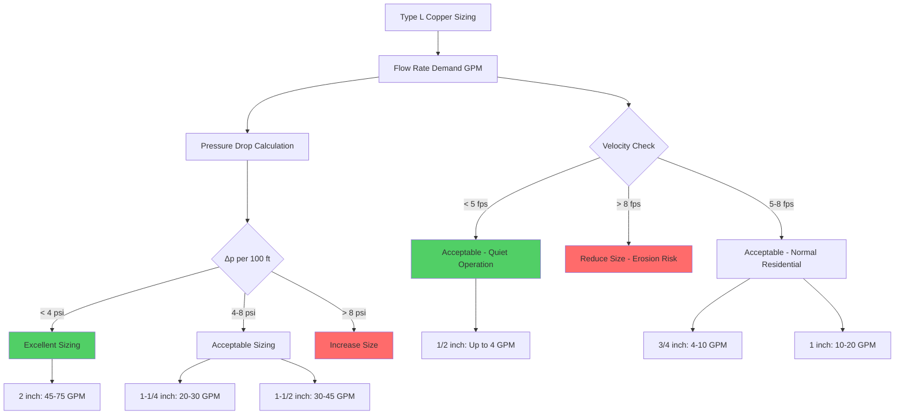

## Overview

Type L copper tubing represents the medium-wall thickness standard for domestic hot water (DHW) distribution systems, offering superior pressure capacity and durability compared to Type M copper. Manufactured to ASTM B88 specifications, Type L copper is the preferred choice for underground installations, higher-pressure applications, and environments requiring enhanced corrosion resistance.

The primary distinguishing characteristic of Type L copper is its wall thickness, which ranges from 0.045 inches (1.14 mm) for 1/2-inch nominal diameter up to 0.070 inches (1.78 mm) for larger sizes. This increased material thickness provides:

- Enhanced pressure rating capability
- Superior mechanical strength for underground burial
- Improved resistance to water hammer and pressure transients
- Extended service life in aggressive water conditions
- Better resistance to physical damage during installation

## Wall Thickness and Pressure Ratings

The wall thickness for Type L copper tubing is defined by ASTM B88 and varies with nominal pipe size. The relationship between internal pressure rating and wall thickness follows the Barlow formula:

$$P = \frac{2 \cdot S \cdot t}{D}$$

Where:
- $P$ = allowable internal pressure (psi)
- $S$ = allowable stress for copper (typically 6,000 psi for annealed, 10,000 psi for drawn temper)
- $t$ = wall thickness (inches)
- $D$ = outside diameter (inches)

For Type L copper, typical working pressure ratings at ambient temperature are:

| Nominal Size | Wall Thickness | Outside Diameter | Working Pressure (psi) |
|--------------|----------------|------------------|------------------------|
| 1/2" | 0.040" | 0.625" | 280 |
| 3/4" | 0.045" | 0.875" | 280 |
| 1" | 0.050" | 1.125" | 280 |
| 1-1/4" | 0.055" | 1.375" | 250 |
| 1-1/2" | 0.060" | 1.625" | 240 |
| 2" | 0.070" | 2.125" | 250 |

At elevated DHW temperatures (140°F), pressure ratings decrease by approximately 20% due to thermal degradation of material strength.

## Type L vs Type M Applications

The selection between Type L and Type M copper depends on installation conditions, local code requirements, and system operating parameters:

| Application Factor | Type L Copper | Type M Copper |
|-------------------|---------------|---------------|
| Underground installation | **Required** by most codes | Prohibited in most jurisdictions |
| Soft water conditions | Recommended | Acceptable for above-ground |
| Hard water (>150 mg/L CaCO₃) | Recommended | Acceptable |
| Pressure > 80 psi | **Preferred** | Acceptable if approved |
| Exposed to physical damage | **Required** | Not recommended |
| Cost differential | +15-25% vs Type M | Baseline |
| Wall thickness | 0.045-0.070" | 0.025-0.032" |
| Service life expectancy | 50+ years | 30-40 years |

## Underground Service Applications

Type L copper is the standard specification for underground water service for several critical reasons:

**Soil Conditions**: Underground piping experiences soil loading, potential settlement, and backfill compaction forces. The heavier wall thickness of Type L provides necessary resistance to crushing and deformation.

**Corrosion Environment**: Soil chemistry varies significantly. Type L's additional material provides a corrosion allowance, ensuring adequate remaining wall thickness even after localized corrosion occurs.

**Code Requirements**: The International Plumbing Code (IPC) Section 605.4 and Uniform Plumbing Code (UPC) Section 604.1 typically mandate Type L for underground installations. Type M is explicitly prohibited underground in most jurisdictions.

**Installation Protection**: Type L must be installed with:
- Minimum 12-inch burial depth below frost line
- Sand bedding and backfill (no sharp rocks or debris)
- Continuous support (no point loads or spanning)
- Proper identification tape located 6-12 inches above pipe

## Joining Methods

Type L copper for DHW systems utilizes several approved joining methods:

**Soldered Joints** (ASTM B828):
- 95-5 tin-antimony solder for potable water (lead-free)
- Joint temperature: 350-450°F
- Flux residue must be water-soluble and non-corrosive
- Provides tensile strength: 2,500-3,000 psi

**Brazed Joints** (AWS A5.8):
- BCuP series phosphor-copper alloys (typically BCuP-3 or BCuP-5)
- Joint temperature: 1,300-1,500°F
- No flux required for copper-to-copper joints
- Provides tensile strength: 25,000-40,000 psi
- Required for medical gas and critical systems

**Mechanical Joints**:
- Press-fit systems (Viega ProPress, Ridgid MegaPress)
- Compression fittings for smaller diameters (≤2")
- Grooved mechanical couplings for larger sizes

## Type L Sizing Chart

The following diagram illustrates the relationship between Type L copper sizing, flow velocity, and pressure drop considerations:

## Material Properties and Corrosion Resistance

Type L copper exhibits excellent corrosion resistance in most potable water conditions. The material composition per ASTM B88 requires:

- Copper content: 99.9% minimum
- Phosphorus: 0.015-0.040% (deoxidized grade)
- Thermal conductivity: 226 BTU/(hr·ft·°F) at 68°F
- Coefficient of thermal expansion: $9.8 \times 10^{-6}$ per °F

The phosphorus content provides deoxidation, preventing hydrogen embrittlement and improving resistance to oxygen corrosion in water service.

**Water Chemistry Considerations**:

Corrosion rate depends on water characteristics:

$$\text{Corrosion Rate} \propto \frac{[\text{Dissolved Oxygen}] \cdot [\text{Chlorides}]}{\text{pH} \cdot [\text{Alkalinity}]}$$

Type L performs well in:
- pH range: 6.5-8.5
- Total dissolved solids: <500 mg/L
- Chloride content: <250 mg/L
- Sulfate content: <250 mg/L

Waters outside these parameters may require water treatment or alternative piping materials.

## Installation and Service Life

Proper installation practices maximize Type L copper service life:

1. **Storage and Handling**: Protect tubing ends with plastic caps. Store on racks above ground. Avoid contamination.

2. **Cutting**: Use tubing cutters (not hacksaws). Ream all burrs completely.

3. **Cleaning**: Clean and flux within 4 hours of cutting. Use appropriate flux for solder type.

4. **Support Spacing**:
   - Horizontal runs: 6 feet for 1" and smaller, 8 feet for 1-1/4" and larger
   - Vertical runs: 10 feet maximum spacing

5. **Expansion Allowance**: Provide for thermal expansion at $9.8 \times 10^{-6}$ in/in/°F. A 100-foot run experiences 1.4-inch expansion from 40°F to 180°F.

Expected service life for properly installed Type L copper in DHW applications exceeds 50 years in normal water conditions, with many installations performing reliably for 75+ years.

## Code Compliance

Type L copper installations must comply with:

- **ASTM B88**: Standard specification for seamless copper water tube
- **IPC Section 605**: Materials for water distribution
- **UPC Section 604**: Materials and joints for water piping
- **NSF/ANSI 61**: Drinking water system components
- **Local amendments**: Always verify local code requirements

Type L copper is universally accepted by all model plumbing codes for both above-ground and underground potable water service.