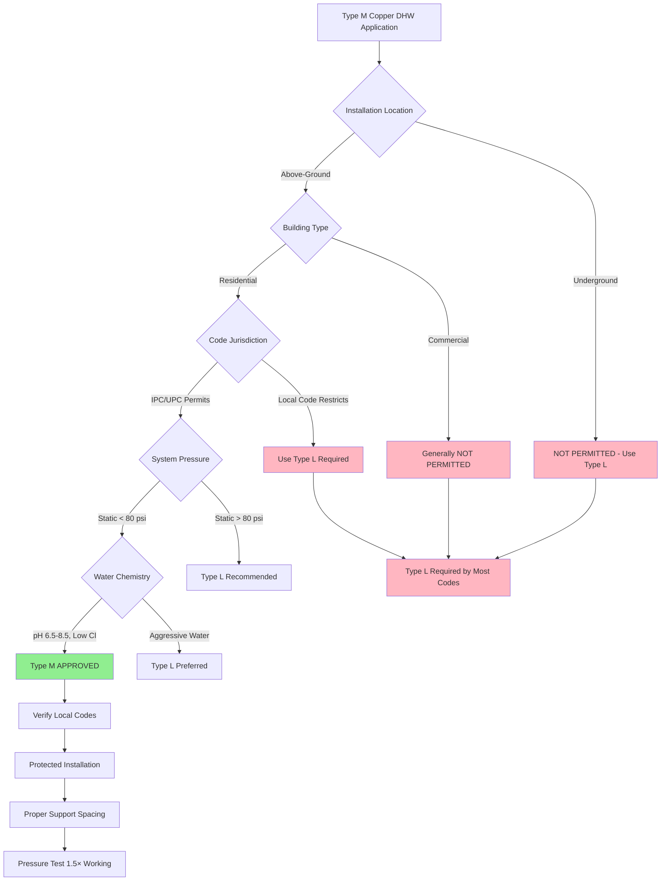

# Type M Copper Piping for Domestic Hot Water Systems

Type M copper tubing represents the lightest-weight classification of rigid copper pipe approved for potable water service under ASTM B88. With wall thickness approximately 30% thinner than Type L, Type M offers significant material cost savings for residential and light commercial domestic hot water (DHW) applications where installation conditions permit. However, this reduced wall thickness imposes specific limitations on pressure capacity, mechanical durability, and code-approved applications that require careful consideration during system design.

## ASTM B88 Type M Specifications

ASTM B88 defines Type M copper as seamless copper water tube with minimum wall thickness values that vary by nominal pipe size. The designation "M" historically stood for "medium" wall thickness when heavier Type K was more common, though Type M is now the thinnest commonly used classification for DHW service.

**Wall Thickness by Nominal Size:**

| Nominal Size | Outside Diameter | Type M Wall Thickness | Inside Diameter |
|--------------|------------------|----------------------|-----------------|
| 1/2 inch | 0.625 in | 0.028 in | 0.569 in |
| 3/4 inch | 0.875 in | 0.032 in | 0.811 in |
| 1 inch | 1.125 in | 0.035 in | 1.055 in |
| 1-1/4 inch | 1.375 in | 0.042 in | 1.291 in |
| 1-1/2 inch | 1.625 in | 0.049 in | 1.527 in |
| 2 inch | 2.125 in | 0.058 in | 2.009 in |

**Wall Thickness Formula:**

The minimum wall thickness for Type M copper follows the ASTM B88 relationship:

$$t_M = 0.025 \times D_o + 0.012$$

where:
- $t_M$ = Type M minimum wall thickness (inches)
- $D_o$ = outside diameter (inches)

This formula applies to sizes from 1/4 inch through 12 inch nominal.

## Pressure Rating Calculations

Type M copper's reduced wall thickness directly limits maximum allowable working pressure. Using the Barlow formula for thin-walled cylinders:

$$P_{max} = \frac{2 \times S \times t \times E \times SF}{D_o}$$

where:
- $P_{max}$ = maximum working pressure (psi)
- $S$ = allowable stress (7,000 psi for copper at DHW temperatures)
- $t$ = wall thickness (inches)
- $E$ = joint efficiency (0.95 for properly soldered joints)
- $SF$ = safety factor (typically 0.5 for working pressure vs. burst)
- $D_o$ = outside diameter (inches)

**Example: 1-inch Type M at 140°F DHW Service:**

$$P_{max} = \frac{2 \times 7000 \times 0.035 \times 0.95 \times 0.5}{1.125} = 206 \text{ psi (working pressure)}$$

**Pressure Ratings at Operating Temperature:**

| Temperature | Allowable Stress | 1" Type M Working Pressure | Safety Margin at 80 psi |
|-------------|------------------|---------------------------|------------------------|
| 100°F | 7,500 psi | 221 psi | 2.8× |
| 140°F | 7,000 psi | 206 psi | 2.6× |
| 180°F | 6,000 psi | 177 psi | 2.2× |
| 200°F | 5,500 psi | 162 psi | 2.0× |

The pressure de-rating at elevated temperature is critical for DHW applications. At 180°F (near-maximum DHW temperature), Type M provides only 2.2× safety factor against typical 80 psi residential water pressure.

## Type M Application Areas and Limitations

## Code Compliance and Restrictions

**International Plumbing Code (IPC) - Type M Requirements:**
- Permitted for above-ground potable water piping in buildings up to three stories
- NOT permitted for underground building supply piping
- May be restricted in commercial or institutional occupancies (verify local amendments)
- Must meet minimum working pressure requirements for system design

**Uniform Plumbing Code (UPC) - Type M Requirements:**
- Approved for above-ground installation where water pressure does not exceed 150 psi
- NOT approved for underground water service or distribution
- Individual jurisdictions frequently adopt more restrictive requirements

**Local Code Variations:**
Many jurisdictions impose additional restrictions beyond model codes:
- California: Many municipalities require Type L for all applications
- New York City: Type L required for all potable water systems
- Chicago: Type L mandatory for multi-family and commercial
- Florida: Type M permitted for single-family residential only

**Always verify local plumbing code amendments before specifying Type M copper.**

## Type M Limitations Comparison

| Limitation Factor | Type M Constraint | Type L Advantage | Impact on Application |
|-------------------|-------------------|------------------|----------------------|
| **Underground Use** | Prohibited by code | Approved all jurisdictions | Type M cannot be used for service lines or buried distribution |
| **Pressure Capacity (1")** | 206 psi @ 140°F | 294 psi @ 140°F | Type M unsuitable for high-pressure systems or pressure surges |
| **Mechanical Damage** | Thin wall vulnerable | 43% more material | Type M requires protected installation, more prone to job-site damage |
| **Corrosion Allowance** | 0.035" maximum | 0.050" available | Type M life reduced 30-50% in aggressive water chemistry |
| **Freeze Damage** | Bursts more readily | Greater strength | Type M more vulnerable in unconditioned spaces |
| **Commercial Buildings** | Often prohibited | Code compliant | Type M limited to residential and light commercial where permitted |
| **High-Rise (>3 floors)** | Not permitted | Approved | Type M unsuitable for buildings exceeding code height limits |
| **Seismic Zones** | Lower damage tolerance | Better performance | Type M requires additional support and bracing in seismic regions |

## Cost-Benefit Analysis

**Material Cost Savings:**

Type M copper provides 25-35% material cost reduction compared to Type L due to reduced copper content:

$$C_M = C_{Cu} \times \pi \times (D_o - t_M) \times t_M \times \rho_{Cu}$$

where:
- $C_M$ = Type M material cost per linear foot
- $C_{Cu}$ = copper price ($/lb)
- $\rho_{Cu}$ = copper density (0.324 lb/in³)

**Example Cost Calculation (1-inch nominal):**
- Type M weight: 0.465 lb/ft
- Type L weight: 0.655 lb/ft
- Material savings: 29% less copper
- At $4.00/lb copper: $0.76/ft savings

**Life-Cycle Considerations:**
- First cost savings: 25-35% for material only (labor unchanged)
- Reduced service life in aggressive water: 15-20 years vs. 25-30 years for Type L
- Higher leak risk over system lifetime
- Potential code non-compliance requiring replacement
- Lower salvage value if building undergoes renovation

**Appropriate Use Cases for Type M:**
- Single-family residential above-ground DHW distribution
- Protected installation within conditioned space
- Low-rise buildings (1-2 stories)
- System pressure reliably below 80 psi static
- Neutral water chemistry (pH 7.0-8.5, <100 mg/L chlorides)
- Budget-constrained projects where code permits

## Installation Requirements and Best Practices

**Support Spacing:**

Type M's reduced wall thickness requires more frequent support than Type L to prevent sagging and vibration:

| Nominal Size | Horizontal Support Spacing | Vertical Support Spacing |
|--------------|---------------------------|-------------------------|
| 1/2" to 3/4" | 4 feet maximum | 8 feet maximum |
| 1" to 1-1/4" | 5 feet maximum | 10 feet maximum |
| 1-1/2" to 2" | 6 feet maximum | 10 feet maximum |

Compare to Type L, which can span 6 feet horizontal regardless of size.

**Handling and Storage:**
- Store on flat, well-supported surface to prevent deformation
- Thin walls dent easily during transportation—inspect before installation
- Keep fittings and tube ends clean and protected
- Avoid dropping or impact that can cause out-of-round conditions

**Soldering Type M Copper:**

Type M requires careful soldering technique due to thin walls:

1. **Cleaning:** Remove oxidation with 220-grit emery cloth or approved wire brush
2. **Flux Application:** Use water-soluble flux (per ASTM B813) sparingly
3. **Heat Control:** Apply heat evenly around joint—Type M overheats more quickly
4. **Solder Feed:** Use lead-free solder (95/5 tin-antimony or silver-bearing per NSF/ANSI 61)
5. **Cooling:** Allow natural air cooling—never water-quench (causes stress cracks)

**Critical:** Overheating Type M copper during soldering can reduce wall thickness an additional 0.002-0.004 inches through grain growth, compromising pressure capacity.

**Pressure Testing:**

Test Type M installations to 1.5× working pressure (minimum 150 psi for residential) for 15 minutes minimum:

$$P_{test} = 1.5 \times P_{working}$$

Monitor for pressure drop exceeding 5 psi, which indicates leakage. Type M's thin walls show leaks more readily than Type L, making thorough testing essential.

**Thermal Expansion:**

Calculate DHW thermal expansion using copper's linear expansion coefficient:

$$\Delta L = \alpha \times L \times (T_{hot} - T_{ambient})$$

where:
- $\alpha = 9.8 \times 10^{-6}$ in/in·°F for copper
- $L$ = pipe length (inches)
- Temperature change typically 80-100°F for DHW

For 40 feet of Type M copper DHW piping:
$$\Delta L = 9.8 \times 10^{-6} \times (40 \times 12) \times 80 = 0.376 \text{ inches}$$

Install expansion loops or offsets every 50-60 feet to accommodate thermal movement. Type M's reduced stiffness requires careful attention to support placement near expansion offsets.

## Water Chemistry Compatibility

Type M's thin walls provide minimal corrosion allowance. Aggressive water conditions that would reduce Type L service life to 25-30 years can limit Type M to 15-20 years.

**Corrosive Conditions to Avoid with Type M:**
- pH below 6.8 (acidic water causes uniform corrosion)
- Chloride concentration above 150 mg/L (accelerates pitting)
- High dissolved oxygen (>5 mg/L) combined with temperature >140°F
- Water velocity exceeding 6 ft/s (erosion-corrosion at fittings)
- High total dissolved solids (>500 mg/L)

**Water Treatment Recommendations:**
- Install acid neutralizer for pH <7.0
- Consider phosphate corrosion inhibitor in moderately aggressive water
- Maintain DHW temperature at 120-130°F where Legionella risk permits
- Use dielectric unions at transitions to dissimilar metals

## Alternative Material Considerations

When Type M copper proves unsuitable due to code restrictions or application requirements, consider these alternatives:

**Type L Copper:**
- 43% thicker walls provide necessary pressure capacity and durability
- Code-compliant for all residential and commercial DHW applications
- 25-35% cost premium justified for long-term reliability

**PEX (Cross-Linked Polyethylene):**
- Approved for DHW service (ASTM F876, ASTM F877)
- Lower material cost than either Type M or Type L
- Flexible installation reduces fittings and labor
- Not suitable for exposed UV locations or high-temperature applications (>180°F)

**CPVC (Chlorinated Polyvinyl Chloride):**
- Lowest first cost for DHW distribution
- Maximum temperature limit 180°F
- Requires special solvent cement joining
- Brittle compared to copper, prone to impact damage

## Conclusion

Type M copper tubing provides economical DHW distribution for above-ground residential applications where local codes permit and installation conditions support its limitations. The 25-35% material cost savings compared to Type L make Type M attractive for budget-conscious projects, but these savings must be weighed against reduced pressure capacity, limited corrosion allowance, code restrictions, and shorter service life in demanding environments.

Proper application of Type M requires verification of local code compliance, system pressure analysis, water chemistry evaluation, and installation within protected building spaces. When any of these factors prove marginal, Type L copper represents the more reliable choice despite higher first cost. The decision between Type M and Type L should be based on comprehensive life-cycle cost analysis rather than initial material cost alone.

For underground service lines, commercial buildings, high-rise applications, aggressive water chemistry, or system pressures exceeding 80 psi, Type L copper or alternative piping materials must be specified. Type M's niche remains single-family residential above-ground DHW distribution in low-pressure systems with favorable water quality—a narrower application range than Type L, but one where it performs adequately when properly installed.
