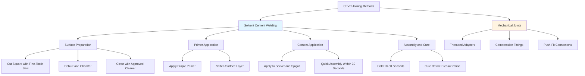

## Overview

Chlorinated Polyvinyl Chloride (CPVC) has become a prevalent material for domestic hot water distribution systems due to its corrosion resistance, ease of installation, and cost-effectiveness compared to traditional metallic piping. CPVC is manufactured by post-chlorinating PVC resin, increasing the chlorine content from approximately 57% to 63-69%, which significantly improves temperature resistance and mechanical strength.

CPVC piping systems are governed by ASTM D2846 (hot and cold water distribution) and ASTM F441/F442 (Schedule 40 and 80 CPVC pipe and fittings). These standards establish minimum requirements for materials, dimensions, burst pressure, and sustained pressure performance.

## Material Properties and Performance Characteristics

### Temperature and Pressure Ratings

CPVC exhibits temperature-dependent mechanical properties. The standard maximum operating temperature is 200°F (93°C) at reduced pressures, though continuous operation at 180°F (82°C) is recommended for maximum service life.

The pressure rating derates with increasing temperature according to the relationship:

$$P_T = P_{73} \times f_T$$

Where:
- $P_T$ = allowable pressure at temperature T
- $P_{73}$ = pressure rating at 73°F (standard condition)
- $f_T$ = temperature derating factor

**Pressure Derating Factors for CPVC:**

| Temperature (°F) | Temperature (°C) | Derating Factor | Rated Pressure (psi) for SDR 11 |
|------------------|------------------|-----------------|----------------------------------|
| 73 | 23 | 1.00 | 400 |
| 100 | 38 | 0.88 | 352 |
| 120 | 49 | 0.75 | 300 |
| 140 | 60 | 0.62 | 248 |
| 160 | 71 | 0.50 | 200 |
| 180 | 82 | 0.40 | 160 |
| 200 | 93 | 0.29 | 116 |

### Chemical Compatibility

CPVC demonstrates excellent resistance to chlorine, chloramines, and pH variations typical in municipal water supplies. Unlike copper, CPVC is immune to corrosion from aggressive water chemistry (low pH, high chloride content). However, incompatibility exists with petroleum-based products, aromatic hydrocarbons, and chlorinated solvents.

## Thermal Expansion Characteristics

CPVC has a significantly higher coefficient of linear thermal expansion compared to metallic piping systems:

$$\Delta L = \alpha \times L_0 \times \Delta T$$

Where:
- $\Delta L$ = change in length
- $\alpha$ = coefficient of linear expansion = $3.4 \times 10^{-5}$ in/in/°F
- $L_0$ = original length at installation temperature
- $\Delta T$ = temperature change

**Example calculation:**

For a 50-foot run of CPVC installed at 70°F and operating at 140°F:

$$\Delta L = 3.4 \times 10^{-5} \times (50 \times 12) \times (140 - 70) = 1.43 \text{ inches}$$

This expansion must be accommodated through expansion loops, offsets, or mechanical expansion compensators to prevent joint failure and excessive stress on connected equipment.

## Installation Methods and Joint Types

### Solvent Welding Process

Solvent cement welding creates a molecular bond between pipe and fitting by temporarily dissolving the CPVC surface. Proper technique is critical for leak-free joints:

1. **Cutting:** Use fine-tooth saw or plastic tubing cutter; maintain squareness within 1/2 degree
2. **Preparation:** Deburr inside and outside edges; chamfer outside edge at 10-15 degrees
3. **Dry-fit:** Verify proper interference fit (pipe should insert 1/3 to 2/3 socket depth)
4. **Priming:** Apply approved purple primer to both surfaces; primer contains aggressive solvents that prepare surfaces
5. **Cementing:** Apply cement liberally to both surfaces while still wet from primer
6. **Assembly:** Insert to full depth with 1/4 turn; hold firmly for 10-30 seconds
7. **Curing:** Allow minimum cure time before pressure testing (varies by temperature and diameter)

**Minimum cure times at 60-100°F:**

- 1/2" to 1": 15 minutes to handle, 2 hours to test
- 1-1/4" to 2": 30 minutes to handle, 4 hours to test
- 2-1/2" to 4": 2 hours to handle, 6 hours to test

Cold temperatures (below 40°F) significantly extend cure times and may require heating the work area.

## Material Comparison

| Property | CPVC | Copper (Type L) | PEX |
|----------|------|-----------------|-----|
| **Max Operating Temp** | 200°F (93°C) | 400°F (204°C) | 180-200°F (82-93°C) |
| **Working Pressure at 180°F** | 100-160 psi | 150+ psi | 80-100 psi |
| **Thermal Expansion Coeff** | $3.4 \times 10^{-5}$ in/in/°F | $9.3 \times 10^{-6}$ in/in/°F | $7.8 \times 10^{-5}$ in/in/°F |
| **Thermal Conductivity** | 0.084 BTU/(hr·ft·°F) | 226 BTU/(hr·ft·°F) | 0.23 BTU/(hr·ft·°F) |
| **Corrosion Resistance** | Excellent | Moderate (water chemistry dependent) | Excellent |
| **Chlorine Resistance** | Excellent (up to 5 ppm continuous) | N/A | Good (varies by formulation) |
| **UV Resistance** | Poor (degrades when exposed) | Excellent | Poor (requires protection) |
| **Joint Method** | Solvent cement | Sweat solder, press, compression | Crimp, clamp, expansion, press |
| **Installation Labor** | Low | Moderate to high | Low to moderate |
| **Material Cost (Relative)** | 1.0× | 3.0-4.0× | 1.5-2.0× |
| **Support Spacing (180°F)** | 3 ft horizontal | 6 ft horizontal | 2.67 ft horizontal |

## Support and Hanger Requirements

Due to CPVC's lower modulus of elasticity (particularly at elevated temperatures), closer support spacing is required compared to metallic systems. Per manufacturer recommendations and plumbing codes:

**Horizontal runs:**
- Cold water (≤80°F): 4 feet maximum
- Hot water (140-180°F): 3 feet maximum

**Vertical runs:**
- Support at every floor level
- Maximum 10 feet spacing

Hangers should be designed to allow axial movement while providing vertical support. Rigid clamping can induce stress concentrations and premature failure.

## Code Compliance and Standards

**Applicable Standards:**
- **ASTM D2846:** Standard Specification for Chlorinated Poly(Vinyl Chloride) (CPVC) Plastic Hot- and Cold-Water Distribution Systems
- **ASTM F441:** Standard Specification for CPVC Plastic Pipe, Schedules 40 and 80
- **ASTM F442:** Standard Specification for CPVC Plastic Pipe Fittings, Schedule 40 and 80
- **ASTM D1784:** Standard Specification for Rigid Poly(Vinyl Chloride) (PVC) Compounds and Chlorinated Poly(Vinyl Chloride) (CPVC) Compounds
- **NSF/ANSI 61:** Drinking Water System Components – Health Effects

**Model Code Acceptance:**
- International Plumbing Code (IPC): Approved for water distribution
- Uniform Plumbing Code (UPC): Approved for water distribution
- National Plumbing Code of Canada: Approved with temperature limitations

All CPVC systems must bear NSF-61 certification for potable water contact and display permanent markings indicating compliance with applicable ASTM standards, pressure rating, and SDR (Standard Dimension Ratio).

## Advantages and Limitations

**Advantages:**
- Superior corrosion and scale resistance
- Lower material cost than copper
- Reduced heat loss compared to metallic pipe
- Simplified installation (no flame required)
- Lighter weight facilitates handling
- Immune to electrolytic corrosion

**Limitations:**
- Higher thermal expansion requires careful design
- Cannot be exposed to UV radiation (outdoor/exposed installations)
- Incompatible with certain chemicals and solvents
- Lower temperature capability than copper
- More susceptible to impact damage
- Cannot be field-bent or formed
- Requires careful attention to installation procedures

## Conclusion

CPVC represents a viable, cost-effective alternative to traditional metallic piping for domestic hot water systems operating within its temperature and pressure limitations. Successful application requires understanding of thermal expansion behavior, proper solvent welding techniques, adequate support design, and compliance with applicable codes and standards. When properly designed and installed per manufacturer specifications and ASTM requirements, CPVC systems provide long-term, reliable service in residential and light commercial applications.
