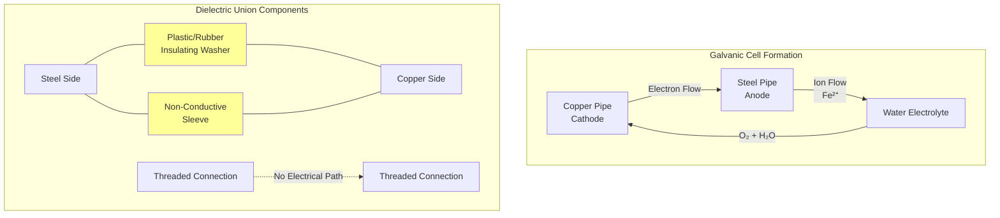

## Overview

Dielectric fittings provide electrical isolation between dissimilar metals in domestic hot water piping systems to prevent galvanic corrosion. When two metals with different electrode potentials are joined in an electrolyte solution (water), the more anodic metal corrodes preferentially. Dielectric fittings interrupt the electrical path while maintaining mechanical connection and pressure integrity.

**Primary applications:**
- Water heater connections (steel tank to copper distribution)
- Brass valve to steel pipe transitions
- Copper to galvanized steel interfaces
- Mixed-metal recirculation loops

## Galvanic Corrosion Fundamentals

### Electrochemical Potential

The driving force for galvanic corrosion is the potential difference between metals in the galvanic series. The galvanic potential $E_{galv}$ between two metals determines corrosion rate:

$$E_{galv} = E_{cathode} - E_{anode}$$

where $E_{cathode}$ is the more noble (less reactive) metal and $E_{anode}$ is the more active metal. Larger potential differences accelerate corrosion.

**Common DHW metal pairs (in seawater, volts vs saturated calomel electrode):**
| Metal | Potential (V) | Role in Cu-Steel |
|-------|---------------|------------------|
| Copper | -0.30 | Cathode |
| Brass | -0.35 | Cathode |
| Carbon Steel | -0.61 to -0.72 | Anode |
| Galvanized Steel | -1.03 | Anode |

### Corrosion Current

The corrosion current density $i_{corr}$ between dissimilar metals is approximated by:

$$i_{corr} = \frac{E_{galv}}{R_{total}} \cdot A_{effective}$$

where:
- $R_{total}$ = total circuit resistance (metal + electrolyte)
- $A_{effective}$ = effective contact area

The mass loss rate $\dot{m}$ at the anode follows Faraday's law:

$$\dot{m} = \frac{i_{corr} \cdot M}{n \cdot F}$$

where:
- $M$ = atomic mass of corroding metal (g/mol)
- $n$ = number of electrons transferred (typically 2 for Fe)
- $F$ = Faraday constant (96,485 C/mol)

## Galvanic Corrosion Process

## Dielectric Fitting Types

### Dielectric Unions

Dielectric unions consist of:
1. **Insulating washer** - gasket that separates metal faces (EPDM, neoprene, or fiber)
2. **Non-conductive sleeve** - isolates threaded connection
3. **Union nut** - allows disassembly

**Advantages:**
- Field-serviceable (can be disassembled)
- Visual inspection possible
- Suitable for replaceable equipment connections

**Installation requirements:**
- Maximum 180°F service temperature for standard EPDM gaskets
- Install in accessible locations
- Do not use pipe dope on insulating components
- Verify no metal-to-metal contact during assembly

### Dielectric Nipples

Pre-assembled nipples with integral dielectric isolation, typically brass body with plastic liner.

**Advantages:**
- More compact than unions
- No field assembly errors
- Higher temperature ratings (some rated to 400°F)
- Often lower cost

**Limitations:**
- Not field-serviceable
- Cannot be disassembled for inspection

### Comparison

| Feature | Dielectric Union | Dielectric Nipple |
|---------|------------------|-------------------|
| Serviceability | Removable | Permanent |
| Installation Complexity | Higher (assembly) | Lower (pre-assembled) |
| Temperature Limit | 180°F (std EPDM) | Up to 400°F |
| Pressure Rating | 150-300 psi | 150-300 psi |
| Inspection | Visual when opened | Not possible |
| Typical Cost | $8-25 | $5-15 |
| Failure Mode | Gasket degradation | Liner cracking |
| Code Acceptance | Universal | Check local AHJ |

## Code Requirements

### International Plumbing Code (IPC)

**IPC Section 605.23:** Dielectric fittings required where joining dissimilar metals in potable water systems. Approved dielectric fittings include:
- Dielectric unions
- Dielectric nipples
- Non-conductive flexible connectors
- Lined copper-to-steel adapters

### Uniform Plumbing Code (UPC)

**UPC Section 605.25:** Requires dielectric fittings or insulating materials to prevent galvanic action between dissimilar metals. Specifies:
- Fittings must conform to ASSE 1012 or equivalent
- Installation per manufacturer instructions
- Not required for brass-to-copper connections (similar nobility)

### Specific Applications

**Water heater connections (IPC 504.6, UPC 510.4):**
- Dielectric fittings mandatory on steel tank water heaters with copper distribution
- Install within first 18 inches of water heater outlet and inlet
- Not required on bronze or brass-lined water heaters

## Installation Best Practices

### Proper Installation Sequence

1. **Clean threads** - remove debris and old sealant from both metal components
2. **Apply sealant** - use pipe dope or PTFE tape on metal threads ONLY (not insulator)
3. **Assemble components** - hand-tighten union to steel side first
4. **Verify isolation** - ensure insulating washer and sleeve properly seated
5. **Final tightening** - wrench-tighten per manufacturer torque specifications
6. **Continuity check** - use multimeter to verify no electrical connection

### Common Installation Errors

**Metal-to-metal contact:**
- Over-tightening crushes insulating washer
- Misaligned threads allow bypass of sleeve
- Debris bridges insulating gap

**Gasket degradation:**
- Excessive temperature beyond rating
- Incompatible pipe dope attacks rubber
- Chemical exposure (chlorine, aggressive water)

**Orientation issues:**
- Installing dielectric union backwards (cathode/anode reversed has no effect on isolation but may affect gasket life)
- Insufficient clearance for future service

### Water Chemistry Considerations

Dielectric fittings do not eliminate all corrosion—they prevent galvanic corrosion specifically. Other corrosion modes require additional control:

**Pitting corrosion:** High chloride content attacks stainless steel and copper. Control through water treatment.

**Erosion corrosion:** High velocity (>8 ft/s in copper) causes mechanical wear. Control through proper sizing.

**Uniform corrosion:** Low pH (<6.5) attacks all metals. Control through pH adjustment.

## System Design Considerations

### Bonding and Grounding

Dielectric fittings interrupt electrical continuity. If piping serves as electrical ground path:
- Install separate grounding jumper wire across dielectric fitting
- Size per National Electrical Code (NEC Article 250)
- Common in older buildings using water pipes for electrical ground

### Recirculation Systems

In DHW recirculation loops with mixed metals:
- Install dielectric fittings at ALL dissimilar metal junctions
- Elevated temperature (120-140°F continuous) accelerates galvanic corrosion
- Consider single-metal system design to eliminate need for dielectric isolation

### Material Selection Hierarchy

**Preferred approach (most to least desirable):**

1. **Single metal system** - all copper or all steel (no dielectric fittings needed)
2. **Similar nobility metals** - copper to brass (minimal potential difference)
3. **Dielectric separation** - proper fittings at all dissimilar metal junctions
4. **Cathodic protection** - sacrificial anodes in unavoidable mixed-metal systems

## Performance and Longevity

Expected service life of dielectric fittings depends on installation quality and operating conditions:

**Optimal conditions (cool water, proper installation):** 20-30 years

**Typical DHW service (120°F, moderate hardness):** 10-15 years

**Aggressive conditions (high temperature, poor water quality):** 5-10 years

**Failure indicators:**
- Visible corrosion products at union interface
- Pinhole leaks near fitting
- Reduced flow (corrosion debris accumulation)
- Discolored water after long stagnation

## Summary

Dielectric fittings are essential components in mixed-metal DHW systems, preventing costly galvanic corrosion through electrical isolation. Proper selection, installation per code requirements, and attention to service conditions ensure reliable long-term performance. Where system design allows, specifying uniform piping materials eliminates the need for dielectric fittings entirely and represents the most robust corrosion prevention strategy.
