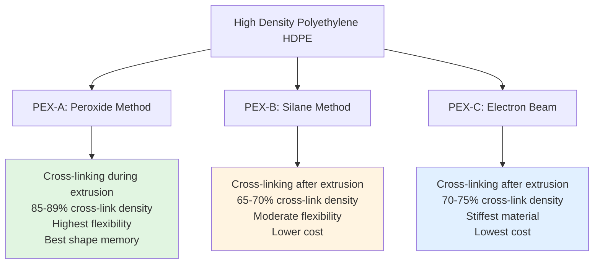

## Overview

Cross-linked polyethylene (PEX) piping represents a significant advancement in domestic hot water (DHW) distribution systems. The cross-linking process creates three-dimensional molecular bonds that transform standard polyethylene into a material capable of withstanding elevated temperatures and pressures. PEX offers flexibility, reduced installation time, and resistance to freeze damage compared to rigid piping materials.

## Manufacturing Methods and PEX Types

Three distinct cross-linking methods produce different performance characteristics:

**PEX-A (Peroxide/Engel Method)**: Cross-linking occurs during extrusion at elevated temperatures using peroxide catalysts. This produces uniform cross-link density throughout the material, resulting in superior flexibility and shape memory. When kinked, PEX-A can be restored using heat application.

**PEX-B (Silane/Moisture Cure Method)**: Polyethylene is extruded with silane compounds, then exposed to moisture and catalysts. Cross-linking proceeds from the outside toward the center, creating slightly less uniform properties. This method dominates the North American market due to cost effectiveness.

**PEX-C (Electron Beam/Cold Cross-linking)**: Extruded polyethylene passes through an electron beam radiation field. Cross-linking depth depends on beam penetration, making thick-wall pipes challenging to process uniformly. This is the least expensive manufacturing method.

## PEX Type Comparison

| Property | PEX-A | PEX-B | PEX-C |
|----------|-------|-------|-------|
| Cross-link Density | 85-89% | 65-70% | 70-75% |
| Flexibility | Highest | Moderate | Lowest |
| Shape Memory | Excellent | Good | Fair |
| Kink Resistance | Best | Good | Moderate |
| Temperature Rating | 200°F (93°C) | 180°F (82°C) | 180°F (82°C) |
| Pressure Rating @ 73°F | 160 psi | 160 psi | 160 psi |
| Pressure Rating @ 180°F | 100 psi | 80 psi | 80 psi |
| Expansion Fitting Compatibility | Yes | Limited | No |
| Cost | Highest | Moderate | Lowest |
| Primary Applications | Premium residential, radiant heating | Residential, commercial | Budget residential |

## Thermal Expansion Characteristics

PEX exhibits significantly higher thermal expansion than metallic piping. The linear thermal expansion coefficient for PEX is approximately $\alpha = 1.1 \times 10^{-4}$ per °F (1.98 × 10^-4 per °C).

The change in length due to temperature variation:

$$\Delta L = L_0 \cdot \alpha \cdot \Delta T$$

Where:
- $\Delta L$ = change in length (in or mm)
- $L_0$ = original length (in or mm)
- $\alpha$ = coefficient of thermal expansion (per °F or per °C)
- $\Delta T$ = temperature change (°F or °C)

**Example**: A 50-foot run of PEX installed at 70°F and operating at 140°F:

$$\Delta L = 50 \text{ ft} \times 12 \text{ in/ft} \times 1.1 \times 10^{-4} \text{ per °F} \times (140-70)\text{°F} = 4.62 \text{ inches}$$

This expansion must be accommodated through pipe flexibility, directional changes, or expansion loops. The inherent flexibility of PEX typically absorbs this movement without additional provisions in most residential installations.

## Pressure-Temperature Relationship

PEX pressure ratings decrease with increasing temperature according to ASTM F876 and ASTM F877 standards. The relationship follows:

$$P_T = P_{73} \cdot \left(\frac{T_{max} - T_{op}}{T_{max} - 73}\right)^n$$

Where:
- $P_T$ = pressure rating at operating temperature (psi)
- $P_{73}$ = pressure rating at 73°F, typically 160 psi (psi)
- $T_{max}$ = maximum rated temperature (°F)
- $T_{op}$ = operating temperature (°F)
- $n$ = material-dependent exponent (approximately 2.0 for PEX)

For a system operating at 140°F with PEX-A rated for 200°F maximum:

$$P_{140} = 160 \text{ psi} \cdot \left(\frac{200 - 140}{200 - 73}\right)^{2.0} = 160 \times 0.177 = 113 \text{ psi}$$

This derated pressure capacity must exceed system operating pressure plus water hammer allowances.

## Connection Methods

**Crimp Fittings**: Copper crimp rings compress over PEX and fitting barbs using specialized crimp tools. This method works with all PEX types and provides reliable, code-approved connections. Go/no-go gauges verify proper crimp dimensions.

**Clamp Fittings**: Stainless steel clamps with integral clamping mechanism fasten PEX to barbed fittings. These allow correction if improperly installed initially and don't require calibrated tools.

**Expansion Fittings**: Used exclusively with PEX-A, the pipe is expanded using a dedicated tool, then fits over the enlarged fitting. As the PEX contracts, it creates a strong, leak-resistant seal. This method eliminates flow restrictions at connections.

**Press Fittings**: Metal fittings with EPDM O-rings are pressed onto PEX using hydraulic tools, creating permanent connections compatible with PEX-A and PEX-B.

## Material Durability Considerations

**Chlorine Resistance**: PEX demonstrates good resistance to chlorinated water up to 4 ppm free chlorine at temperatures below 140°F. Higher temperatures or chlorine concentrations accelerate oxidative degradation over decades. ASTM F2023 provides chlorine resistance testing protocols.

**UV Sensitivity**: All PEX types degrade under ultraviolet exposure. Manufacturers typically specify maximum 30-60 days of direct sunlight exposure before installation. Surface degradation from UV creates brittleness requiring affected sections to be cut back before connection. PEX must be protected from sunlight in all exposed applications.

**Oxygen Permeation**: Standard PEX allows oxygen diffusion into water, problematic for closed-loop hydronic systems with ferrous components. PEX with EVOH (ethylene vinyl alcohol) oxygen barrier coating reduces permeation to <0.1 g/m³·day per DIN 4726, protecting against corrosion in radiant heating applications.

## Code Compliance and Standards

PEX installation must comply with:

- **ASTM F876**: Standard Specification for Crosslinked Polyethylene (PEX) Tubing
- **ASTM F877**: Standard Specification for Crosslinked Polyethylene (PEX) Hot and Cold Water Distribution Systems
- **ASTM F2023**: Standard Test Method for Evaluating the Oxidative Resistance of Crosslinked Polyethylene (PEX) Pipe, Tubing and Systems to Hot Chlorinated Water
- **NSF/ANSI 61**: Drinking Water System Components - Health Effects
- **International Plumbing Code (IPC)**: Section 605.17 permits PEX for water distribution
- **Uniform Plumbing Code (UPC)**: Section 604.0 addresses PEX piping systems

Size designation follows nominal dimensions (CTS - Copper Tube Size), with 1/2" and 3/4" being most common for residential branch lines. Maximum recommended flow velocity is 8 ft/s to minimize erosion and water hammer effects.

## Installation Advantages

PEX reduces installation labor through:
- Continuous runs from manifold to fixture minimize fittings
- Flexibility eliminates multiple rigid joints and directional changes
- Reduced freeze damage risk due to expansion capability
- Lower thermal conductivity (k = 0.23 BTU/hr·ft·°F) reduces heat loss
- Quieter operation with reduced water hammer transmission

Color coding (red for hot, blue for cold, white for either) simplifies installation and maintenance identification, though all colors possess identical physical properties within the same PEX type classification.