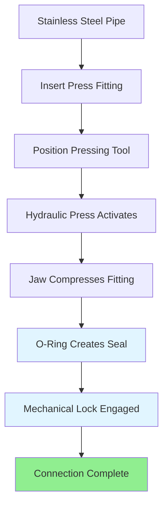

## Overview

Stainless steel piping represents a premium solution for domestic hot water (DHW) systems, offering exceptional corrosion resistance, longevity exceeding 50 years, and mechanical strength. Two primary configurations dominate the market: rigid stainless steel pipe with press-fit or threaded connections, and corrugated stainless steel tubing (CSST) for flexible installations. The material's chromium oxide passive layer provides inherent resistance to oxidation and scaling, making it ideal for challenging water chemistry conditions.

## Material Selection: Type 304 vs Type 316

The selection between austenitic stainless steel grades depends on chloride concentration and operating temperature.

| Parameter | Type 304 (18-8) | Type 316 (18-10-2) | Notes |
|-----------|-----------------|---------------------|-------|
| Chromium content | 18% | 16-18% | Passive layer formation |
| Nickel content | 8% | 10-14% | Austenite stabilization |
| Molybdenum content | 0% | 2-3% | Pitting resistance |
| Chloride limit | <50 ppm | <200 ppm | At 140°F (60°C) |
| Max temperature | 180°F | 200°F | Continuous service |
| Relative cost | 1.0× | 1.4-1.6× | Material only |
| Pitting resistance | Good | Excellent | PREN = 18 vs 25 |

The pitting resistance equivalent number (PREN) quantifies resistance to localized corrosion:

$$\text{PREN} = \%\text{Cr} + 3.3 \times \%\text{Mo} + 16 \times \%\text{N}$$

Type 316 achieves PREN ≈ 25 compared to Type 304 at PREN ≈ 18, providing superior resistance to chloride-induced pitting and crevice corrosion in coastal installations or facilities using chlorinated water treatment.

## Chloride Stress Corrosion Cracking

Austenitic stainless steels exhibit susceptibility to chloride stress corrosion cracking (CSCC) when three conditions coincide:

1. Tensile stress (residual or applied) > 30% yield strength
2. Chloride concentration > threshold (temperature-dependent)
3. Temperature > 140°F (60°C)

The threshold chloride concentration decreases exponentially with temperature:

$$C_{\text{threshold}} = C_0 \exp\left(-\frac{E_a}{RT}\right)$$

where $C_0$ is reference concentration, $E_a$ = 40 kJ/mol (activation energy), $R$ is gas constant, and $T$ is absolute temperature.

**Mitigation strategies:**

- Use Type 316L (low carbon) to reduce sensitization
- Limit operating temperature to <160°F in chlorinated water
- Specify solution-annealed condition to minimize residual stress
- Avoid crevices and stagnant zones where chlorides concentrate
- Maintain water velocity >3 ft/s to prevent concentration polarization

## Pressure Rating and Wall Thickness

Stainless steel pipe pressure rating follows the Barlow equation for thin-walled cylinders:

$$P = \frac{2St}{D}$$

where $P$ is allowable pressure (psi), $S$ is allowable stress (psi), $t$ is wall thickness (inches), and $D$ is outside diameter (inches).

For Schedule 5S stainless (common in press-fit systems):

- 1-inch pipe: OD = 1.315 in, wall = 0.065 in
- Allowable stress at 180°F: $S$ = 15,000 psi (Type 316)
- Maximum pressure: $P = \frac{2 \times 15000 \times 0.065}{1.315} = 1482$ psi

Working pressure for DHW applications typically limits to 150-200 psi with appropriate safety factors.

## Press-Fit Connection Technology

Press-fit mechanical connections have revolutionized stainless steel DHW installations, reducing labor costs by 40-60% compared to welded or threaded joints.

**Press-fit system components:**

1. **Stainless steel fitting body** - typically 316L with pressing zone
2. **EPDM or FKM O-ring** - provides hydraulic seal, rated to 250°F
3. **Pressing profile** - manufacturer-specific geometry (M, V, or TH profile)
4. **Visual leak indicator** - reveals unpressed joints during pressure test

The pressing operation creates radial compression that generates both mechanical interference and elastomeric sealing:

$$F_{\text{seal}} = P \times A_{\text{contact}} \times \mu$$

where $P$ is compression pressure (typically 2000-3000 psi), $A_{\text{contact}}$ is O-ring contact area, and $\mu$ is coefficient of friction.

## Corrugated Stainless Steel Tubing (CSST)

CSST provides flexibility for complex routing while maintaining stainless corrosion resistance. The annular corrugations allow bending without kinking:

**Advantages:**
- Reduces fittings by 60-80% versus rigid pipe
- Installation labor 50% less than copper
- Vibration dampening from corrugation compliance
- Suitable for seismic zones (flexibility accommodates movement)

**Limitations:**
- Reduced flow capacity due to corrugation friction (C-factor ≈ 120 vs 140 smooth)
- Limited to concealed applications per IPC 605.23
- Requires manufacturer-specific termination fittings
- Higher material cost per linear foot than Schedule 5S

## Code Compliance and Standards

**Applicable codes:**
- **International Plumbing Code (IPC)** Section 605: requires stainless steel to meet ASTM A312
- **Uniform Plumbing Code (UPC)** Section 604: permits Type 304/316 for potable water
- **NSF/ANSI 61** certification required for all wetted components
- **ASME B16.9** fittings for welded systems
- **ASTM A312** seamless and welded pipe specification

**Installation requirements:**
- Support spacing: 10 feet maximum horizontal, 15 feet vertical (IPC Table 308.5)
- Expansion compensation: $\Delta L = \alpha L \Delta T$ where $\alpha$ = 9.6 × 10⁻⁶ in/in/°F
- Joining methods: press-fit per manufacturer IFU, orbital welding, or threaded (Schedule 40 only)
- Insulation: R-3 minimum for recirculation mains per IECC C404.5

## Economic Analysis

Initial installed cost comparison (per 100 linear feet, 1-inch diameter):

| Material | Material cost | Labor cost | Total installed | Service life |
|----------|--------------|------------|-----------------|--------------|
| Type L copper | 550 | 800 | 1,350 | 20-30 years |
| Type 316 Schedule 5S | 1,200 | 500 | 1,700 | 50+ years |
| CSST stainless | 1,400 | 400 | 1,800 | 50+ years |

Life-cycle cost analysis over 50 years demonstrates stainless steel economic viability despite 25-35% higher first cost. Elimination of corrosion-related failures and maintenance yields total ownership cost parity or advantage in aggressive water conditions.

## Best Practices

**Water chemistry management:**
- Monitor chloride levels quarterly; limit <100 ppm for Type 304, <200 ppm for Type 316
- Maintain pH 6.5-8.5 to preserve passive layer
- Control dissolved oxygen <8 ppm to minimize pitting initiation
- Flush systems thoroughly after construction to remove particulates

**Installation quality:**
- Verify all press connections with leak detection dye or pressure test at 150% working pressure
- Use unpressed fitting as intentional leak point during commissioning
- Deburr all cut ends to prevent turbulence and erosion
- Maintain 6-inch minimum separation from dissimilar metals

**System design:**
- Size for velocity 4-8 ft/s; avoid <3 ft/s (scaling) and >10 ft/s (erosion)
- Provide expansion loops or offsets for runs >50 feet
- Slope drainable legs minimum 1/4 inch per foot
- Install dielectric unions at transitions to copper or steel

## Conclusion

Stainless steel piping delivers unmatched durability and corrosion resistance for domestic hot water systems in demanding applications. Type 316 offers superior performance in chlorinated or coastal environments, while Type 304 suffices for controlled water chemistry conditions. Press-fit connection technology has transformed installation economics, making stainless steel competitive with traditional copper systems when evaluating life-cycle costs. Proper material selection, installation per manufacturer instructions, and water chemistry management ensure optimal system performance over multi-decade service life.
