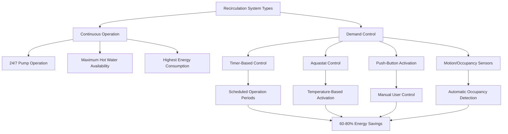
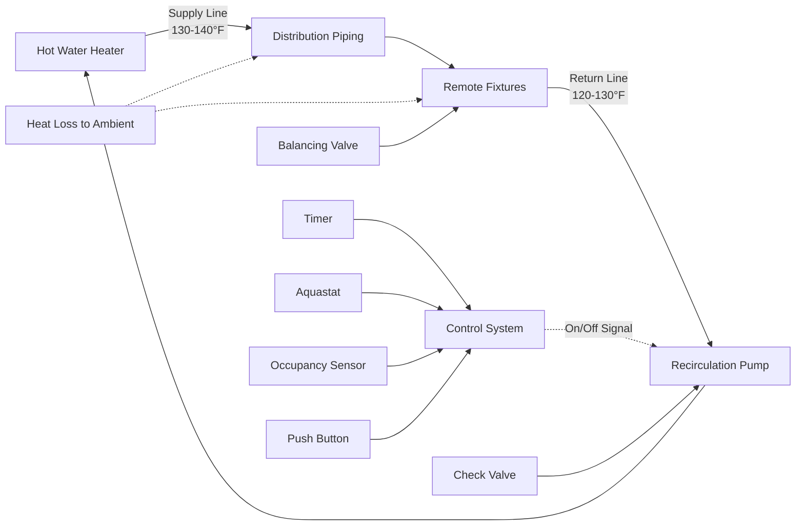

Recirculation pump systems maintain hot water temperature throughout distribution piping by continuously or intermittently circulating water from remote fixtures back to the water heater. These systems eliminate the wait time for hot water delivery but introduce parasitic energy losses and pumping energy consumption that require careful engineering analysis.

## Heat Loss Physics in Recirculation Systems

The fundamental driver of recirculation system operation is heat loss from distribution piping to ambient air. The rate of heat loss from a bare or insulated pipe is governed by:

$$Q_{loss} = U \cdot A \cdot \Delta T = U \cdot (\pi D L) \cdot (T_{water} - T_{ambient})$$

where $U$ is the overall heat transfer coefficient (Btu/hr·ft²·°F), $A$ is the exterior pipe surface area, $D$ is the outer diameter, $L$ is the pipe length, and $\Delta T$ is the temperature difference.

For insulated piping, the overall heat transfer coefficient depends on conduction through insulation and convection at the outer surface:

$$\frac{1}{U} = \frac{r_{out}}{r_{pipe}} \cdot \frac{1}{h_{inner}} + \frac{r_{out} \ln(r_{ins}/r_{pipe})}{k_{ins}} + \frac{1}{h_{outer}}$$

The recirculation pump must deliver sufficient flow to offset this heat loss and maintain minimum loop temperature, typically 120-140°F at the furthest fixture.

## Continuous vs Demand Recirculation

### Continuous Operation

Continuous recirculation maintains hot water availability 24/7 by running the circulation pump constantly. The thermal energy required is:

$$Q_{annual} = Q_{loss} \times 8760 \text{ hours/year}$$

For a typical 200-foot loop with 3/4-inch copper piping insulated with 1-inch fiberglass ($k$ = 0.025 Btu/hr·ft·°F), maintaining 130°F water in 70°F ambient:

- Heat loss per linear foot: 10-15 Btu/hr·ft
- Total loop loss: 2,000-3,000 Btu/hr
- Annual thermal energy: 17.5-26.3 MMBtu/year

### Demand-Controlled Recirculation

Demand systems activate the recirculation pump only when needed, using timer controls, push-button activation, temperature sensors (aquastats), or motion sensors. Operating schedules typically match building occupancy patterns.

**Energy Savings Calculation:**

If a continuous system operates 8,760 hours/year but demand control reduces operation to 2,920 hours/year (8 hours/day, 365 days):

$$\text{Savings ratio} = \frac{8760 - 2920}{8760} = 67\%$$

Actual savings are slightly less due to increased heat loss during pump-off periods requiring extra energy during recovery.

## System Sizing and Design

### Recirculation Flow Rate

The required recirculation flow rate must satisfy heat loss replacement:

$$\dot{m} = \frac{Q_{loss}}{c_p \Delta T_{loop}}$$

where $c_p$ = 1.0 Btu/lb·°F for water and $\Delta T_{loop}$ is the allowable temperature drop around the loop (typically 5-10°F).

For a 3,000 Btu/hr system loss with 10°F allowable drop:

$$\dot{m} = \frac{3000}{1.0 \times 10} = 300 \text{ lb/hr} = 0.60 \text{ gpm}$$

### Pump Head Requirements

Total pump head must overcome friction losses in supply and return piping plus fitting and valve losses:

$$H_{total} = H_{friction} + H_{fittings} + H_{valves}$$

Using the Darcy-Weisbach equation for friction head loss:

$$H_{friction} = f \cdot \frac{L}{D} \cdot \frac{v^2}{2g}$$

For small-diameter piping at low flow rates, friction losses typically range from 1-5 feet of head per 100 feet of pipe.

| Pipe Size | Flow Rate | Velocity | Friction Loss |
|-----------|-----------|----------|---------------|
| 1/2" | 1 gpm | 2.4 ft/s | 8.5 ft/100 ft |
| 3/4" | 2 gpm | 3.1 ft/s | 9.2 ft/100 ft |
| 1" | 3 gpm | 2.8 ft/s | 4.8 ft/100 ft |
| 1-1/4" | 5 gpm | 3.5 ft/s | 5.2 ft/100 ft |

### Pump Power Consumption

Electrical power consumption of the recirculation pump:

$$P_{pump} = \frac{\rho g Q H}{3960 \eta_{pump}}$$

where $P_{pump}$ is in horsepower, $Q$ is flow in gpm, $H$ is total head in feet, and $\eta_{pump}$ is pump efficiency (typically 15-30% for small circulators).

A typical small recirculation pump (1 gpm, 10 ft head, 20% efficiency) consumes:

$$P_{pump} = \frac{1 \times 10}{3960 \times 0.20} = 0.013 \text{ hp} = 9.5 \text{ watts}$$

Annual pump energy consumption for continuous operation:

$$E_{annual} = 9.5 \text{ W} \times 8760 \text{ hr} = 83 \text{ kWh/year}$$

## Control Strategies and Optimization

### Aquastat-Based Control

Aquastats measure return water temperature and activate the pump when temperature falls below setpoint (typically 95-105°F). This balances hot water availability with energy consumption:

$$\text{Runtime fraction} = \frac{Q_{loss,avg}}{Q_{pump,capacity}}$$

where average heat loss depends on ambient temperature variation and insulation effectiveness.

### Temperature-Time Control

Combined timer and aquastat control provides superior performance:

- Timers restrict operation to occupancy periods
- Aquastats prevent unnecessary pump operation when loop temperature is adequate
- Typical energy savings: 70-85% compared to continuous operation

### Balancing Valves

Return line balancing valves ensure equal flow distribution to multiple recirculation loops:

$$\Delta P_{valve} = K \cdot \frac{\rho v^2}{2}$$

Proper balancing maintains uniform temperature throughout the distribution system and prevents short-circuiting of flow.

## Water Conservation Benefits

Recirculation systems eliminate water waste during the wait period for hot water delivery. For a fixture 50 feet from the water heater:

**Without Recirculation:**
- Pipe volume: 0.5 gal (1/2" pipe, 50 ft)
- Water wasted per use: 0.5 gal
- Typical household uses: 20/day
- Annual water waste: 3,650 gallons/year

**With Recirculation:**
- Water waste: Near zero
- Annual water savings: 3,650 gallons/year

The environmental and cost benefit must be weighed against increased thermal energy consumption from pipe heat losses.

## Code Requirements and Standards

**ASHRAE 90.1-2019:**
- Automatic pump shutoff when hot water demand ceases
- Minimum pipe insulation: R-3 for pipes ≤1.5", R-4 for larger pipes
- Maximum recirculation loop temperature drop: 10°F

**Uniform Plumbing Code (UPC):**
- Recirculation return temperature ≥95°F at most remote fixture
- Check valve required in return line
- Shutoff valves for pump isolation

**International Plumbing Code (IPC):**
- Circulating pumps rated for 180°F minimum
- Bronze or stainless construction for corrosion resistance
- Pressure relief provision in closed loops

## System Performance Comparison

| Parameter | Continuous | Timer Control | Aquastat | Timer + Aquastat |
|-----------|-----------|---------------|----------|------------------|
| Hot Water Wait Time | 0 seconds | 0-30 seconds | 10-45 seconds | 10-30 seconds |
| Annual Runtime | 8,760 hr | 2,920 hr | 3,500 hr | 2,200 hr |
| Energy Savings | Baseline | 67% | 60% | 75% |
| Water Savings | 100% | 95% | 100% | 95% |
| Control Complexity | Low | Medium | Medium | High |
| Initial Cost | Low | Medium | Medium | High |

The optimal recirculation system design balances hot water availability, energy efficiency, water conservation, and capital cost through proper pump sizing, control strategy selection, and insulation specification. Energy modeling should account for both thermal losses and pumping power to accurately assess lifecycle costs and environmental impacts.

