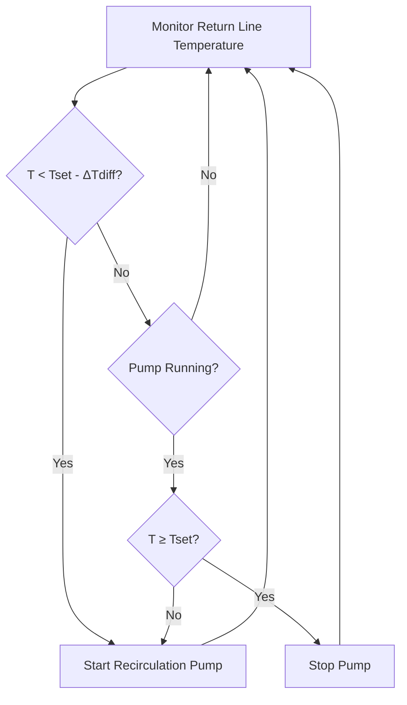
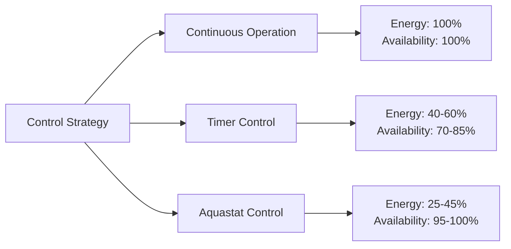

## Aquastat Control Fundamentals

Aquastat control represents the most energy-efficient method for operating domestic hot water (DHW) recirculation systems. Unlike continuous operation that wastes substantial pump energy and increases heat loss, aquastat control cycles the recirculation pump based on actual return line temperature, maintaining hot water availability while minimizing energy consumption.

The control strategy employs a temperature sensor in the return line—the coldest point in the recirculation loop—to determine when circulation is necessary. When the return temperature drops below the control setpoint, the pump activates to restore hot water throughout the distribution system.

## Operating Principle and Control Logic

The aquastat operates on a differential control strategy defined by two critical parameters:

**Setpoint Temperature ($T_{set}$):** The minimum acceptable return line temperature, typically 120-130°F (49-54°C)

**Differential ($\Delta T_{diff}$):** The temperature band that prevents rapid cycling, typically 5-10°F (3-6°C)

The pump control logic follows this sequence:

$$T_{start} = T_{set} - \Delta T_{diff}$$

$$T_{stop} = T_{set}$$

When the return line temperature falls to $T_{start}$, the pump energizes. It continues operation until the temperature rises to $T_{stop}$, then de-energizes until the next cycle.

## Control Component Configuration

### Temperature Sensor Placement

The aquastat sensor must be installed at the return line entry point to the water heater or immediately upstream of the recirculation pump. This location represents the coolest water temperature in the system and provides the most conservative control point.

Sensor installation methods:

- **Immersion well:** Most accurate, requires pipe penetration
- **Strap-on sensor:** Adequate for most applications when insulated over the sensor
- **Insertion sensor:** Direct contact with water flow, highest accuracy

### Setpoint Selection

Setpoint temperature selection balances user comfort, Legionella control, and energy efficiency per ASHRAE Standard 188 and the International Plumbing Code (IPC).

| Application Type | Recommended Setpoint | Rationale |
|-----------------|---------------------|-----------|
| Residential | 120-122°F (49-50°C) | Minimum for comfort, reduced scald risk |
| Commercial Office | 122-125°F (50-52°C) | Balance of comfort and Legionella control |
| Healthcare | 130-140°F (54-60°C) | Legionella prevention per ASHRAE 188 |
| Industrial/Food Service | 140°F+ (60°C+) | Sanitization requirements |

The system storage temperature must exceed the recirculation setpoint by at least 10°F to provide adequate temperature differential for heat transfer throughout the distribution loop.

### Differential Setting Optimization

The differential setting directly impacts pump cycling frequency and energy consumption. The relationship between differential and cycling can be expressed as:

$$N_{cycles} = \frac{Q_{loss}}{V \cdot \rho \cdot c_p \cdot \Delta T_{diff}}$$

Where:
- $N_{cycles}$ = cycles per hour
- $Q_{loss}$ = system heat loss rate (BTU/hr)
- $V$ = system water volume (gallons)
- $\rho$ = water density (8.33 lb/gal)
- $c_p$ = specific heat of water (1.0 BTU/lb·°F)
- $\Delta T_{diff}$ = differential setting (°F)

**Differential Setting Guidelines:**

| Differential | Cycling Frequency | Application |
|--------------|------------------|-------------|
| 5°F (3°C) | High (8-12 cycles/hr) | Small systems, rapid response required |
| 7°F (4°C) | Moderate (4-8 cycles/hr) | Standard commercial systems |
| 10°F (6°C) | Low (2-4 cycles/hr) | Large systems, reduced wear priority |

Smaller differentials provide tighter temperature control but increase pump starts and electrical contact wear. Larger differentials reduce cycling but may result in user complaints about initial water temperature at distant fixtures.

## Energy Performance Comparison

Aquastat control typically achieves 55-75% energy savings compared to continuous operation while maintaining superior hot water availability compared to simple timer controls.

The total energy consumption for recirculation includes both pumping energy and thermal losses:

$$E_{total} = E_{pump} + E_{thermal}$$

$$E_{pump} = P_{pump} \cdot t_{run} \cdot 365 \text{ days/year}$$

$$E_{thermal} = Q_{loss} \cdot t_{run} \cdot 365 \text{ days/year}$$

For a typical commercial system with 500 feet of 1-inch insulated piping:

| Operating Mode | Annual Pump Energy | Annual Heat Loss | Total Annual Cost* |
|----------------|-------------------|------------------|-------------------|
| Continuous (8760 hrs) | 350 kWh | 175 MMBtu | $2,800 |
| Aquastat (3500 hrs) | 140 kWh | 70 MMBtu | $1,150 |
| Savings | 210 kWh | 105 MMBtu | $1,650 (59%) |

*Based on $0.12/kWh electricity and $12/MMBtu natural gas

## Freeze Protection Benefit

In systems with exterior piping or piping in unconditioned spaces, aquastat control provides inherent freeze protection. When ambient temperatures cause return line cooling, the control automatically initiates circulation before freezing can occur.

The minimum safe setpoint for freeze protection:

$$T_{set,freeze} = 45°F + \frac{Q_{loss,design}}{\.{m} \cdot c_p}$$

This calculation ensures adequate circulation frequency to prevent freezing during design winter conditions.

## Control Wiring and Integration

Standard aquastat controls operate on 24VAC control voltage with the pump connected through a relay or contactor. The basic wiring follows the HVAC convention for temperature controls:

- R terminal: 24VAC supply
- C terminal: Common return
- W terminal: Heat call output (pump relay)

Advanced systems integrate with building automation systems (BAS) via BACnet, Modbus, or 0-10V analog signals, allowing remote monitoring of return temperature, cycle counts, and pump runtime for maintenance scheduling.

## Code Compliance and Standards

- **International Plumbing Code (IPC):** Section 607.2 requires hot water temperatures at fixture outlets not to exceed 140°F in residential occupancies
- **ASHRAE Standard 188:** Recommends maintaining recirculation return temperatures at or above 122°F for Legionella control in healthcare facilities
- **California Title 24:** Requires automatic controls for recirculation pumps; continuous operation prohibited in new construction
- **ASHRAE 90.1:** Energy Standard for Buildings requires controls that limit pump operation to periods of demand

## Maintenance and Troubleshooting

Temperature sensor calibration drift represents the primary failure mode. Annual verification against a calibrated reference thermometer ensures accurate control. Pump cycling frequency outside normal parameters indicates sensor failure, excessive system heat loss, or inadequate water heater capacity.

Monitor these parameters:
- Cycles per hour during steady-state conditions
- Temperature differential between storage and return
- Pump runtime percentage
- Elapsed time from pump start to setpoint achievement

Excessive cycling (>15 cycles/hour) indicates insufficient differential setting or sensor location issues. Insufficient cycling (<1 cycle/hour) suggests sensor failure, excessive setpoint, or inadequate system heat loss.
