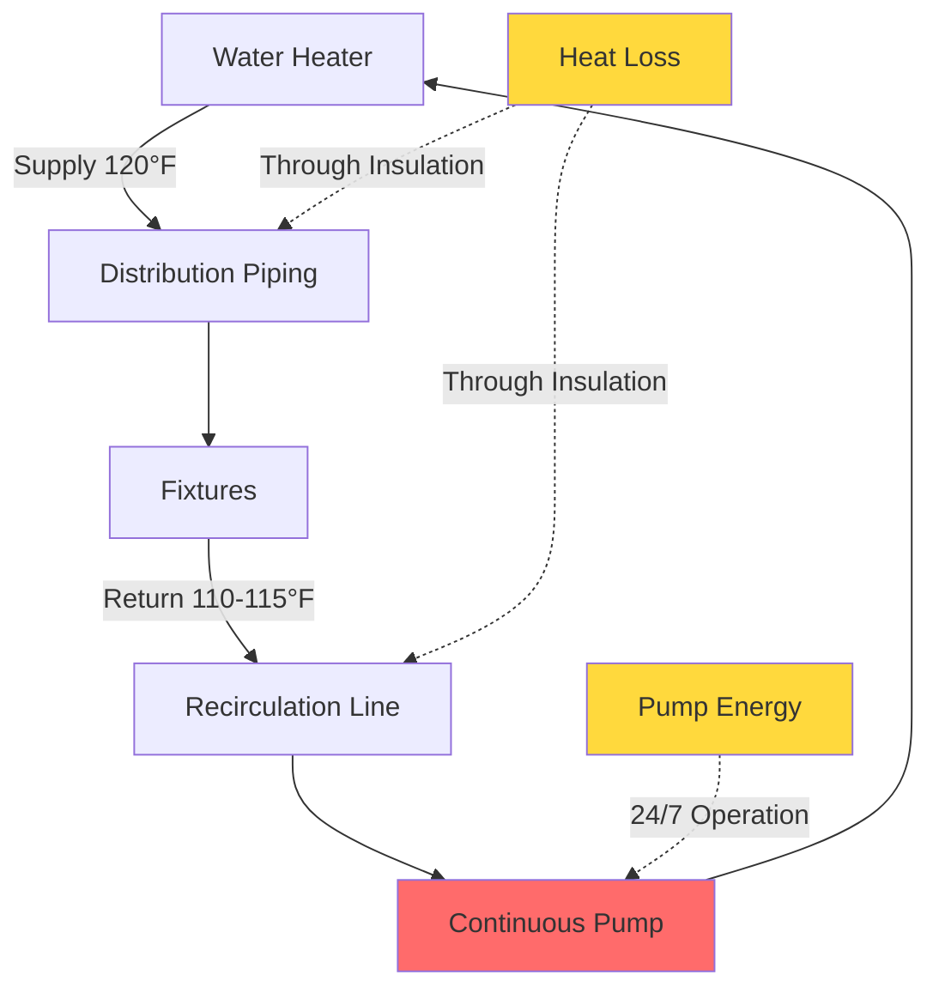
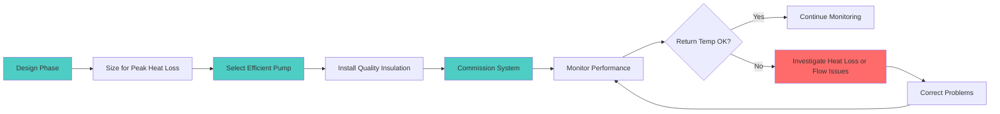

## Overview

Continuous operation recirculation pumps provide uninterrupted circulation of domestic hot water throughout the distribution system, ensuring instant hot water availability at all fixtures 24 hours per day, 7 days per week. This configuration prioritizes occupant comfort and convenience at the expense of maximum energy consumption and heat loss from piping systems.

Continuous operation represents the simplest control strategy but carries the highest operational costs. Understanding the physics of continuous recirculation is essential for proper system design, pump sizing, and determining when this approach is justified.

## Physical Principles

### Heat Loss Mechanisms

In a continuously operating recirculation system, heat is lost through three primary mechanisms:

1. **Conduction through pipe insulation** - Primary heat loss pathway
2. **Convection from exposed piping surfaces** - Uninsulated fittings, valves, hangers
3. **Radiation from high-temperature surfaces** - Minor contributor at DHW temperatures

The steady-state heat loss from insulated piping is calculated as:

$$Q_{loss} = \frac{2\pi L k}{\ln(r_o/r_i)} (T_{pipe} - T_{ambient})$$

Where:
- $Q_{loss}$ = heat loss rate (W)
- $L$ = pipe length (m)
- $k$ = thermal conductivity of insulation (W/m·K)
- $r_o$ = outer radius of insulation (m)
- $r_i$ = inner radius of insulation (m)
- $T_{pipe}$ = pipe surface temperature (°C)
- $T_{ambient}$ = ambient temperature (°C)

For practical system design, simplified heat loss per unit length values from ASHRAE Handbook - HVAC Systems and Equipment Table 50.19 should be used.

### Pump Energy Consumption

The electrical energy consumed by continuous operation is:

$$E_{annual} = \frac{P_{pump} \times 8760}{1000}$$

Where:
- $E_{annual}$ = annual energy consumption (kWh)
- $P_{pump}$ = pump power draw (W)
- $8760$ = hours per year

The total annual energy penalty includes both pump energy and heat loss energy:

$$E_{total} = E_{pump} + \frac{Q_{loss} \times 8760}{\eta_{WH} \times 1000}$$

Where $\eta_{WH}$ is the water heater efficiency (decimal).

## Pump Sizing Methodology

### Flow Rate Determination

Continuous recirculation systems must be sized to maintain acceptable temperature drop in the return line. ASHRAE Standard 90.1 requires the temperature drop not exceed 10°F (5.6°C) under design conditions.

The required recirculation flow rate is:

$$\dot{m} = \frac{Q_{loss}}{c_p \Delta T_{max}}$$

Where:
- $\dot{m}$ = mass flow rate (kg/s)
- $c_p$ = specific heat of water, 4.186 kJ/kg·K
- $\Delta T_{max}$ = maximum allowable temperature drop (K)

Converting to volumetric flow in gallons per minute:

$$Q_{recirc} = \frac{Q_{loss} \times 0.479}{\Delta T_{max}}$$

Where $Q_{loss}$ is in Btu/h and $\Delta T_{max}$ is in °F.

### Pressure Drop Calculation

Total system pressure drop determines pump head requirements:

$$\Delta P_{total} = \Delta P_{pipe} + \Delta P_{fittings} + \Delta P_{valves} + \Delta P_{balancing}$$

For turbulent flow in pipes:

$$\Delta P_{pipe} = f \frac{L}{D} \frac{\rho v^2}{2}$$

Where:
- $f$ = Darcy friction factor
- $L$ = pipe length (m)
- $D$ = pipe diameter (m)
- $\rho$ = fluid density (kg/m³)
- $v$ = flow velocity (m/s)

## Energy Consumption Analysis

### Typical Energy Penalties

The following table shows typical annual energy consumption for continuous operation systems in residential and light commercial applications:

| System Size | Pipe Length | Pump Power | Annual Pump Energy | Heat Loss Rate | Annual Heat Loss | Total Annual Energy |
|-------------|-------------|------------|-------------------|----------------|------------------|---------------------|
| Small Residential | 100 ft | 25 W | 219 kWh | 2,000 Btu/h | 6,132 kWh | 6,351 kWh |
| Large Residential | 200 ft | 35 W | 307 kWh | 4,000 Btu/h | 12,264 kWh | 12,571 kWh |
| Small Commercial | 500 ft | 75 W | 657 kWh | 10,000 Btu/h | 30,660 kWh | 31,317 kWh |
| Large Commercial | 1,000 ft | 150 W | 1,314 kWh | 20,000 Btu/h | 61,320 kWh | 62,634 kWh |

Assumptions: R-3 insulation, 72°F ambient, 10°F ΔT, 0.95 water heater efficiency.

## Continuous vs Demand-Controlled Operation

| Parameter | Continuous Operation | Demand-Controlled |
|-----------|---------------------|-------------------|
| Hot Water Wait Time | 0 seconds | 5-30 seconds |
| Annual Pump Runtime | 8,760 hours | 1,000-3,000 hours |
| Pump Energy Consumption | 100% | 11-34% |
| Heat Loss Energy | 100% | 40-70% |
| Control Complexity | Minimal | Moderate to High |
| First Cost | Lowest | 15-40% higher |
| Operating Cost | Highest | 30-70% lower |
| Occupant Satisfaction | Maximum | High |
| Code Compliance | Requires justification per ASHRAE 90.1 | Preferred method |
| Maintenance Requirements | Low | Moderate |

## When Continuous Operation is Appropriate

Continuous operation should be considered only in specific circumstances:

**Healthcare Facilities**
- Infection control requirements mandate immediate hot water availability
- Patient safety takes precedence over energy considerations
- Legionella control protocols may require continuous circulation above 124°F

**Critical Process Applications**
- Pharmaceutical manufacturing with stringent temperature control
- Food service with health department requirements for instant hot water
- Laboratory applications requiring immediate access to hot water

**High-Occupancy Facilities**
- Hotels and resorts with demanding guest expectations
- Multi-family residential with near-continuous usage patterns
- Facilities where usage patterns justify 24/7 availability

**Code Compliance Considerations**

ASHRAE Standard 90.1-2019 Section 7.4.4.3 requires automatic controls to limit pump operation to periods of demand unless:

1. The system serves patient care areas in healthcare facilities
2. Continuous operation is required for health or safety
3. The system cannot be controlled due to physical limitations

California Title 24 and other energy codes impose similar restrictions, requiring demand-controlled operation as the default approach with specific exemptions.

## System Design Recommendations

**Pipe Insulation Requirements**
- Minimum R-3 insulation on all recirculation piping per ASHRAE 90.1
- R-4 or higher strongly recommended for continuous systems
- Insulate all fittings, valves, and accessories to minimize exposed surface area

**Temperature Control**
- Maintain supply temperature at 120-124°F for domestic use
- Higher temperatures (140°F+) if Legionella risk requires it, with mixing valves at fixtures
- Monitor return temperature; excessive drop indicates undersized pump or excessive heat loss

**Pump Selection**
- Use ECM or permanent magnet motors for improved efficiency
- Select pumps with flat efficiency curves to maintain performance across load variations
- Oversize minimally; excessive flow increases pumping energy without benefit

**Balancing and Commissioning**
- Install balancing valves on branch circuits to ensure uniform flow distribution
- Commission system to verify temperature maintenance throughout distribution system
- Document flow rates and pressure drops for future reference

## Operational Monitoring

Continuous systems should be monitored for:
- Return water temperature (should remain within 5-10°F of supply)
- Pump power draw (increasing draw indicates bearing wear or fouling)
- Energy consumption trending (seasonal variations indicate control or insulation issues)

Temperature sensors at the furthest fixture provide verification that the system maintains design conditions under all operating scenarios.

## Conclusion

Continuous operation recirculation represents the highest energy consumption approach to domestic hot water distribution but provides maximum occupant comfort through instant hot water availability. The decision to implement continuous operation must be based on genuine operational requirements, code compliance exemptions, or occupancy patterns that justify the energy penalty. In most applications, demand-controlled or time-scheduled operation provides a superior balance of comfort and efficiency.

Proper sizing, high-quality insulation, and efficient pump selection are critical to minimizing the energy penalty when continuous operation is selected. Design professionals should document the justification for continuous operation to demonstrate code compliance and inform future operational decisions.
