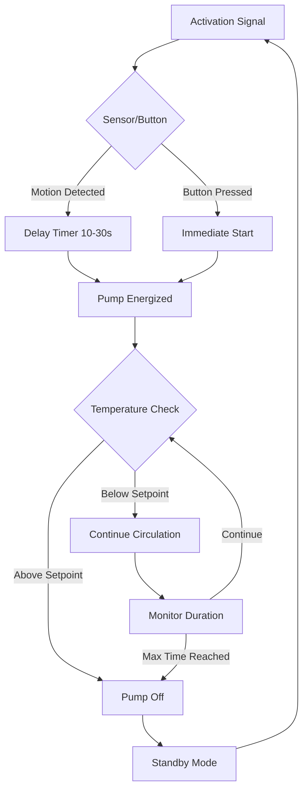

Demand-controlled recirculation systems activate the circulation pump only when hot water delivery is required, dramatically reducing pump operating hours and distribution heat losses compared to continuous operation. These systems employ push-button switches, motion sensors, or occupancy-based triggers to initiate recirculation cycles, providing energy savings while maintaining acceptable wait times for hot water delivery.

## Operating Principles

Demand-controlled systems rely on the physical principle of forced convection initiated by user request. When activated, the pump creates pressure differential that overcomes flow resistance in the distribution piping:

$$\Delta P = \rho g h + f \frac{L}{D} \frac{\rho V^2}{2}$$

where $\Delta P$ is the required pressure rise (Pa), $\rho$ is water density (kg/m³), $g$ is gravitational acceleration (9.81 m/s²), $h$ is vertical rise (m), $f$ is friction factor, $L$ is pipe length (m), $D$ is pipe diameter (m), and $V$ is flow velocity (m/s).

The pump operates until a preset temperature threshold is reached at the farthest fixture or after a timed duration, then shuts off. During standby periods, water in the distribution loop cools by conductive and convective heat transfer through the pipe wall insulation.

## Activation Methods

### Push-Button Control

Hardwired or wireless push-buttons installed at fixture locations provide manual activation. Users press the button 30-90 seconds before needing hot water, allowing time for circulation to establish hot water at the fixture. The pump runs for a programmed duration (typically 3-10 minutes) or until the return line aquastat reaches setpoint.

**Installation Requirements:**
- Low-voltage wiring (24V typical) from button to pump relay
- Wireless systems use battery-powered transmitters (433 MHz or 915 MHz)
- Multiple buttons can activate a single pump in parallel
- Indicator LED confirms activation status

### Motion Sensor Activation

Passive infrared (PIR) sensors detect occupancy in bathrooms or kitchen areas, triggering pump operation before the occupant reaches the fixture. Sensor placement requires careful consideration of detection zones and typical user patterns.

**Detection Physics:**
PIR sensors measure infrared radiation changes:

$$\Phi = \epsilon \sigma A T^4$$

where $\Phi$ is radiated power (W), $\epsilon$ is emissivity (0.95-0.98 for human skin), $\sigma$ is Stefan-Boltzmann constant (5.67 × 10⁻⁸ W/m²·K⁴), $A$ is surface area (m²), and $T$ is absolute temperature (K).

Sensor sensitivity and time delay settings prevent false triggering while ensuring adequate pre-circulation time.

### Smart Controls

Advanced systems integrate occupancy schedules, fixture usage patterns, and temperature monitoring:
- Machine learning algorithms predict demand based on historical patterns
- Smartphone app control for remote activation
- Integration with home automation platforms
- Adaptive timing based on measured delivery time

## Energy Performance Analysis

The annual energy consumption for demand-controlled systems depends on activation frequency and cycle duration:

$$E_{annual} = P_{pump} \times N_{cycles} \times t_{cycle} \times \eta_{motor}^{-1} + Q_{dist}$$

where $E_{annual}$ is annual energy (kWh), $P_{pump}$ is pump power (W), $N_{cycles}$ is annual activation count, $t_{cycle}$ is average cycle duration (hours), $\eta_{motor}$ is motor efficiency, and $Q_{dist}$ is distribution heat loss during circulation (kWh).

## Comparative Performance

| Control Strategy | Pump Hours/Day | Annual Energy (kWh) | Energy Savings vs Continuous | Hot Water Wait Time |
|-----------------|----------------|---------------------|------------------------------|---------------------|
| Continuous Operation | 24 | 175-350 | Baseline | 0 seconds |
| Timer-Controlled | 8-12 | 70-150 | 50-65% | 0-180 seconds |
| Demand-Controlled | 2-6 | 25-90 | 70-85% | 30-90 seconds |
| Smart Adaptive | 1.5-4 | 20-60 | 80-90% | 15-60 seconds |

*Based on typical residential installation, 5/8 HP pump, 100 ft loop length, R-3 insulation*

## Installation Configurations

### Dedicated Return Line

Standard configuration with separate return piping from the farthest fixture back to the water heater. Requires:
- Return line sized at 50-75% of supply line diameter
- Aquastat on return near pump inlet for temperature feedback
- Check valve to prevent gravity circulation during standby
- Balancing valve for flow adjustment

### Swing Return System

Uses the cold water line as the return path through a crossover valve at the farthest fixture. Installation considerations:
- Thermostatic crossover valve opens when water temperature drops below setpoint
- Eliminates dedicated return piping
- May deliver initially lukewarm cold water at distant fixtures
- Not suitable for buildings with separate cold water risers

### Pump-at-Fixture Configuration

Small pump installed under the farthest fixture eliminates return line requirement:
- 1/25 HP to 1/12 HP centrifugal pump
- Timer or button-activated operation
- Returns water through cold line until temperature rises
- Ideal for retrofit applications

## Code and Standard Requirements

**ASHRAE 90.1-2019** Section 7.4.4.4 requires:
- Automatic controls to turn off recirculation pumps when not required
- Temperature-modulating controls or off-time controls
- Pipe insulation meeting Table 6.8.3

**California Title 24** mandates demand-controlled recirculation for:
- Distribution loops exceeding 50 feet
- Multiple dwelling units sharing central water heating
- Time-based or demand-based controls required

**International Energy Conservation Code (IECC)** C404.6:
- Circulation systems must have automatic controls responsive to occupancy or scheduled operation
- Manual activation meets code requirements

## Energy Calculation Example

For a residential system with 80-foot loop operating in Southern California:

**Continuous Operation:**
- Pump power: 25 W
- Operating hours: 24 × 365 = 8,760 hr/yr
- Pump energy: 25 W × 8,760 hr = 219 kWh/yr
- Distribution loss (estimated): 150 kWh/yr
- **Total: 369 kWh/yr**

**Demand-Controlled (12 activations/day, 5 min/cycle):**
- Operating hours: 12 × 5/60 × 365 = 365 hr/yr
- Pump energy: 25 W × 365 hr = 9.1 kWh/yr
- Distribution loss (reduced): 25 kWh/yr
- **Total: 34.1 kWh/yr**
- **Savings: 335 kWh/yr (91%)**

At $0.18/kWh, annual savings equal $60, providing simple payback under 3 years for typical system costs.

## Design Considerations

**Pump Sizing:**
Select pumps to achieve 2-4 ft/s velocity in supply piping, with head capacity to overcome friction losses and vertical lift. ECM (electronically commutated motor) pumps provide variable speed capability for optimized energy use.

**Control Response Time:**
Balance pre-activation time against user acceptance. Motion sensors require 10-30 second lead time to establish circulation before fixture use. Push-button systems educate users to activate 30-60 seconds before showering.

**Multiple Zone Systems:**
Large buildings may require multiple pumps or zone valves to serve different risers or wings. Coordinate controls to prevent simultaneous operation of all zones.

**Sensor Placement:**
Position motion sensors to detect entry into bathroom/kitchen spaces before the user reaches fixtures. Avoid placement where detection occurs after the user already expects hot water.

Demand-controlled recirculation represents the optimal balance between instant hot water convenience and energy conservation, achieving 70-90% energy savings compared to continuous operation while maintaining acceptable user experience through intelligent activation strategies.
