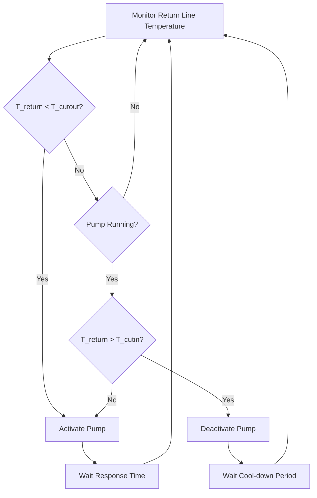

## Operating Principle

Temperature-controlled recirculation pumps use an aquastat or temperature sensor on the return line to activate circulation only when water temperature drops below a setpoint. This on-demand operation reduces pump runtime by 40-60% compared to continuous operation while maintaining minimum temperature requirements throughout the distribution system.

The control logic activates the pump when return line temperature falls below the cutout setpoint and deactivates when temperature rises to the cutin setpoint. This differential prevents short-cycling and reduces thermal stress on system components.

## Control Logic and Setpoint Configuration

### Setpoint Deadband

The temperature differential between cutin and cutout setpoints defines the control deadband. Proper sizing prevents excessive cycling while maintaining acceptable temperature variation.

**Deadband Selection Criteria:**

| System Type | Deadband Range | Typical Setpoint | Cycle Frequency |
|-------------|----------------|------------------|-----------------|
| Residential (< 50 gpm) | 3-5°F | Cutout: 105°F, Cutin: 110°F | 6-12 cycles/hr |
| Light Commercial (50-200 gpm) | 5-8°F | Cutout: 110°F, Cutin: 118°F | 4-8 cycles/hr |
| Large Commercial (> 200 gpm) | 8-12°F | Cutout: 115°F, Cutin: 125°F | 2-6 cycles/hr |
| Healthcare/Critical | 2-3°F | Cutout: 122°F, Cutin: 125°F | 10-20 cycles/hr |

Narrow deadbands maintain tighter temperature control but increase cycling frequency and pump wear. Wider deadbands reduce energy consumption but allow greater temperature variation at remote fixtures.

## Heat Loss Calculations

Return line temperature decay follows Newton's Law of Cooling, modified for pipe thermal mass:

$$Q_{loss} = UA(T_{avg} - T_{ambient})$$

where:
- $Q_{loss}$ = heat loss rate (BTU/hr)
- $U$ = overall heat transfer coefficient (BTU/hr·ft²·°F)
- $A$ = pipe surface area (ft²)
- $T_{avg}$ = average water temperature (°F)
- $T_{ambient}$ = ambient temperature (°F)

**Temperature decay rate in return line:**

$$\frac{dT}{dt} = -\frac{UA}{m c_p}(T - T_{ambient})$$

where:
- $m$ = water mass in system (lbm)
- $c_p$ = specific heat of water (1.0 BTU/lbm·°F)

**Time to cutout temperature:**

$$t_{cutout} = \frac{m c_p}{UA} \ln\left(\frac{T_{initial} - T_{ambient}}{T_{cutout} - T_{ambient}}\right)$$

This equation determines pump-off duration and establishes minimum acceptable insulation levels to prevent excessive cycling.

## Sensor Placement Strategy

Sensor location critically affects control accuracy and system performance. ASHRAE Guideline 12-2020 recommends return line sensing at the point representing the coldest expected return temperature.

**Optimal Placement Hierarchy:**

1. **Primary Location:** Return line immediately before entry to water heater, after final fixture branch
2. **Multi-Zone Systems:** Return line at hydraulically remote zone terminus
3. **Multiple Risers:** Sensor at coldest riser return, with mixing valve if needed
4. **Stratified Returns:** Lower third of vertical return pipe to avoid stratification effects

**Installation Requirements:**

- Install in thermally insulated section to read water temperature, not ambient
- Minimum 6 pipe diameters downstream from fittings or valves
- Immersion wells preferred over strap-on sensors for accuracy ±1°F
- Mount horizontally in vertical pipes to avoid stratification sensing errors
- Provide service isolation valves for sensor replacement without system drain

## Response Time Characteristics

System response time comprises sensor thermal lag, control processing delay, and hydraulic transport time. Total response affects cycling frequency and temperature stability.

**Response Time Components:**

$$t_{total} = t_{sensor} + t_{control} + t_{hydraulic}$$

**Sensor thermal time constant:**

$$\tau_{sensor} = \frac{m_{sensor} c_{p,sensor}}{h A_{sensor}}$$

Typical values:
- Immersion thermistor: 8-15 seconds
- Strap-on RTD: 25-45 seconds
- Averaging sensor: 40-90 seconds

**Hydraulic transport time:**

$$t_{hydraulic} = \frac{V_{system}}{\dot{V}_{pump}}$$

where $V_{system}$ is total piping volume (gallons) and $\dot{V}_{pump}$ is pump flow rate (gpm).

Fast response (< 30 sec total) improves temperature control but may increase cycling. Slower response (> 120 sec) reduces cycling but allows greater temperature droop at fixtures.

## Energy Optimization

Temperature-controlled operation reduces energy consumption through three mechanisms:

1. **Reduced Pumping Energy:** Fractional runtime typically 0.35-0.55 vs continuous operation
2. **Reduced Standby Losses:** Lower average system temperature reduces pipe heat loss
3. **Reduced Thermal Expansion Losses:** Fewer hot-cold cycles reduce PRV discharge

**Annual energy savings calculation:**

$$E_{saved} = 8760 \times (1 - f_{runtime}) \times P_{pump} + Q_{standby,reduced}$$

where $f_{runtime}$ is the fraction of time pump operates (0.35-0.55 typical).

**Comparative Annual Operating Costs:**

| Control Type | Runtime Fraction | Annual Pump Energy (kWh) | Annual Heat Loss (MMBtu) | Total Annual Cost* |
|--------------|------------------|--------------------------|--------------------------|-------------------|
| Continuous | 1.00 | 2,190 | 145 | $2,850 |
| Temperature (5°F deadband) | 0.45 | 985 | 98 | $1,650 |
| Temperature (8°F deadband) | 0.38 | 832 | 87 | $1,475 |
| Timer + Temperature | 0.28 | 613 | 75 | $1,225 |

*Assumes $0.12/kWh electricity, $12/MMBtu gas, 250 ft return piping, 1-inch copper

## Design Recommendations

Per ASHRAE Standard 90.1-2022, temperature-controlled recirculation is mandatory for systems serving fixtures > 50 feet from the water heater. Optimal implementation requires:

- Cutout setpoint minimum 95°F to maintain ASSE 1016 anti-scald compliance at fixtures
- Deadband 5-8°F for balanced cycling and temperature control
- Sensor time constant < 20 seconds for systems requiring tight control (±2°F)
- Return line insulation minimum R-3.0 to achieve 0.40-0.50 runtime fraction
- Control override capability for periodic high-temperature disinfection (140°F minimum)

Temperature control provides superior energy efficiency compared to continuous operation while maintaining code-required minimum temperatures throughout the distribution system. Proper sensor placement and deadband configuration ensure reliable operation and maximized energy savings.
