## Overview

Timer-controlled recirculation pumps operate on predetermined schedules aligned with building occupancy patterns and hot water demand cycles. This control strategy reduces unnecessary circulation during periods of low or no demand, directly minimizing standby thermal losses and pumping energy consumption while maintaining acceptable hot water delivery performance during occupied hours.

## Operating Principles

### Time-of-Day Scheduling

Timer control systems activate the recirculation pump only during programmed intervals, typically corresponding to:

- Morning peak demand periods (0600-0900 hours)
- Midday usage windows (1100-1300 hours)
- Evening high-demand periods (1700-2200 hours)
- Overnight setback or complete shutdown (2200-0600 hours)

The pump cycles on and off according to the programmed schedule regardless of instantaneous demand, making this approach most effective in facilities with predictable, repeatable occupancy patterns.

### Occupancy Pattern Alignment

Optimal timer programming requires analysis of actual hot water usage patterns. Buildings with consistent schedules—office buildings, schools, healthcare facilities with regular shift changes—benefit most from timer control. Facilities with irregular or 24-hour occupancy see diminished effectiveness.

```mermaid
gantt
    title Daily Recirculation Pump Schedule - Office Building
    dateFormat HH:mm
    axisFormat %H:%M

    section Pump Operation
    Morning Circulation    :active, 06:00, 3h
    Midday Circulation     :active, 11:00, 2h
    Evening Circulation    :active, 17:00, 5h
    Night Shutdown         :crit, 22:00, 8h

    section Demand Profile
    Peak Morning Demand    :done, 07:00, 2h
    Lunch Period Demand    :done, 12:00, 1h
    Peak Evening Demand    :done, 18:00, 3h
```

## Energy Savings Analysis

### Standby Loss Reduction

Standby thermal losses from recirculation piping occur continuously when the system maintains circulation. Timer control reduces these losses proportionally to the reduction in operating hours.

**Daily standby loss with continuous circulation:**

$$Q_{standby,continuous} = UA \cdot \Delta T \cdot 24$$

**Daily standby loss with timer control:**

$$Q_{standby,timer} = UA \cdot \Delta T \cdot t_{on}$$

**Energy savings:**

$$\Delta Q = UA \cdot \Delta T \cdot (24 - t_{on})$$

Where:
- $Q$ = heat loss (Btu/day or kWh/day)
- $U$ = overall heat transfer coefficient (Btu/hr·ft²·°F or W/m²·K)
- $A$ = pipe surface area (ft² or m²)
- $\Delta T$ = temperature difference between water and ambient (°F or K)
- $t_{on}$ = hours of pump operation per day (hr)

**Example calculation:**

For a system with 500 ft of 1-inch copper pipe, 1-inch insulation (R-3.3), water temperature 120°F, ambient 70°F:

$$U = \frac{1}{R} = \frac{1}{3.3} = 0.303 \text{ Btu/hr·ft²·°F}$$

$$A = \pi \cdot d \cdot L = 3.14 \cdot \frac{2.5}{12} \cdot 500 = 327 \text{ ft²}$$

$$Q_{standby,continuous} = 0.303 \cdot 327 \cdot 50 \cdot 24 = 119,127 \text{ Btu/day}$$

With 10 hours/day timer operation:

$$Q_{standby,timer} = 0.303 \cdot 327 \cdot 50 \cdot 10 = 49,636 \text{ Btu/day}$$

$$\Delta Q = 69,491 \text{ Btu/day} = 58.3\% \text{ reduction}$$

### Pump Energy Consumption

**Annual pumping energy with continuous operation:**

$$E_{pump,continuous} = \frac{P_{pump} \cdot 8760}{\eta_{motor}}$$

**Annual pumping energy with timer control:**

$$E_{pump,timer} = \frac{P_{pump} \cdot h_{annual}}{\eta_{motor}}$$

Where:
- $P_{pump}$ = pump power (W)
- $h_{annual}$ = annual operating hours (hr/year)
- $\eta_{motor}$ = motor efficiency (decimal)

## Performance Comparison

| Parameter | Continuous Circulation | Timer-Controlled (10 hr/day) |
|-----------|------------------------|------------------------------|
| **Operating Hours/Day** | 24 | 10 |
| **Annual Operating Hours** | 8,760 | 3,650 |
| **Standby Loss (% of continuous)** | 100% | 41.7% |
| **Pump Energy (% of continuous)** | 100% | 41.7% |
| **Hot Water Availability** | 24/7 instant | Programmed periods only |
| **Wait Time (off periods)** | 0 seconds | 30-120 seconds |
| **Initial Cost Premium** | Baseline | +$150-$400 |
| **Maintenance Complexity** | Low | Low-Medium |
| **User Adjustment Required** | None | Periodic reprogramming |

## Pump Cycling Considerations

### Start-Stop Cycles

Timer-controlled pumps experience more frequent starts than continuously operating pumps. Proper sizing and motor selection must account for:

- Inrush current during starting
- Mechanical wear from repeated cycling
- Motor design suitable for frequent starts (minimum 10-20 starts/day)

ASHRAE Standard 90.1 allows timer control as a compliance path for domestic hot water systems, provided the system maintains temperatures above 110°F at fixtures during occupied periods.

### Temperature Swing During Off Cycles

When circulation stops, pipe temperatures decay according to:

$$T(t) = T_{ambient} + (T_{initial} - T_{ambient}) \cdot e^{-\frac{UA}{mc}t}$$

Where:
- $T(t)$ = pipe water temperature at time $t$ (°F)
- $m$ = water mass in pipe (lb)
- $c$ = specific heat of water (1 Btu/lb·°F)

This temperature decay determines the acceptable off-cycle duration before reheat is required.

## Code Requirements and Standards

**ASHRAE 90.1 Energy Standard:**
- Allows timer control for recirculation systems
- Requires insulation per Table 6.8.3
- Mandates automatic shutoff during unoccupied periods

**International Plumbing Code (IPC):**
- Requires maintenance of 110°F minimum at fixtures
- Does not mandate continuous circulation
- Allows time-based control strategies

**California Title 24:**
- Requires demand-controlled or timer-controlled pumps in most applications
- Prohibits continuous circulation in many occupancy types
- Specifies maximum allowable pump power

## Implementation Best Practices

**Schedule Programming:**

1. Conduct 2-week hot water usage monitoring
2. Identify demand peaks and low-usage periods
3. Program pump operation 30 minutes before peak demand
4. Extend operation 30 minutes after demand cessation
5. Review and adjust quarterly based on seasonal patterns

**System Design Optimization:**

- Minimize recirculation loop length and volume
- Insulate piping to R-4 minimum, R-8 preferred
- Size pump for design flow, not oversized
- Install isolation valves for loop balancing
- Consider zone-based circulation for large facilities

**Control Integration:**

Timer control can integrate with building automation systems for:
- Holiday schedule adjustments
- Seasonal reprogramming
- Remote monitoring and adjustment
- Energy consumption tracking
- Integration with occupancy sensors

## Conclusion

Timer-controlled recirculation pumps provide substantial energy savings—typically 50-60% reduction in combined standby losses and pump energy—in buildings with predictable occupancy patterns. The control strategy requires minimal additional investment, simple programming, and periodic schedule review. Optimal performance depends on accurate occupancy analysis, proper system design, and adequate pipe insulation to minimize temperature decay during off cycles.
