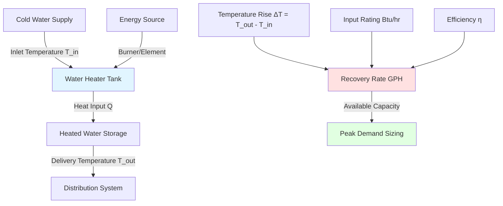
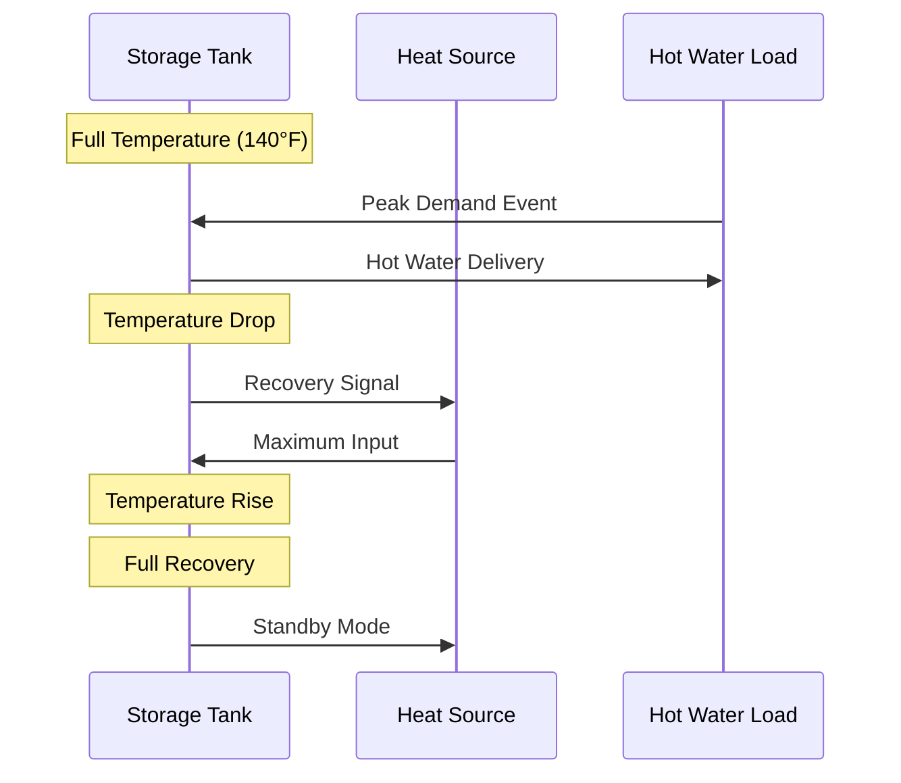

Recovery time calculations determine how quickly a water heater can restore its storage volume to the desired temperature after a draw event. These calculations form the foundation of proper water heater sizing for residential, commercial, and industrial applications.

## Fundamental Heat Transfer Principles

Water heater recovery performance is governed by the energy balance between heat input and energy storage in water. The heat required to raise water temperature follows the sensible heat equation:

$$Q = m \cdot c_p \cdot \Delta T$$

Where:
- $Q$ = heat energy (Btu)
- $m$ = mass of water (lb)
- $c_p$ = specific heat of water (1.0 Btu/lb·°F)
- $\Delta T$ = temperature rise (°F)

Since one gallon of water weighs approximately 8.33 pounds at standard conditions, the energy required per gallon becomes:

$$Q_{gallon} = 8.33 \cdot 1.0 \cdot \Delta T = 8.33 \cdot \Delta T \text{ Btu/gallon}$$

This constant (8.33 Btu/lb·°F) appears in all recovery calculations and represents the thermal mass characteristic of water.

## Recovery Rate Formula

The recovery rate in gallons per hour (GPH) depends on the burner or element input rating, heater efficiency, and temperature rise:

$$GPH = \frac{\text{Input}_{Btu/hr} \times \eta}{8.33 \times \Delta T}$$

Where:
- $\text{Input}_{Btu/hr}$ = burner or element rated input
- $\eta$ = thermal efficiency (decimal)
- $\Delta T$ = temperature rise (°F)

**Example Calculation:**

For a gas water heater with 40,000 Btu/hr input, 80% efficiency, heating water from 50°F to 140°F:

$$\Delta T = 140 - 50 = 90°F$$

$$GPH = \frac{40,000 \times 0.80}{8.33 \times 90} = \frac{32,000}{749.7} = 42.7 \text{ GPH}$$

This heater recovers approximately 43 gallons per hour under these conditions.

## Input Requirement Calculations

When designing for a specific recovery rate, the required input is calculated by rearranging the recovery formula:

$$\text{Input}_{Btu/hr} = \frac{GPH \times 8.33 \times \Delta T}{\eta}$$

This equation determines the minimum burner or element size needed to achieve target recovery performance.

**Sizing Example:**

A commercial facility requires 100 GPH recovery with 100°F temperature rise and expects 85% efficiency:

$$\text{Input}_{Btu/hr} = \frac{100 \times 8.33 \times 100}{0.85} = \frac{83,300}{0.85} = 98,000 \text{ Btu/hr}$$

Select a burner rated at 100,000 Btu/hr to provide adequate capacity with safety margin.

## Recovery Time Calculation

The time required to heat a specific volume from cold to setpoint temperature:

$$t_{recovery} = \frac{V \times 8.33 \times \Delta T}{\text{Input}_{Btu/hr} \times \eta}$$

Where:
- $t_{recovery}$ = recovery time (hours)
- $V$ = tank volume (gallons)

**Example:**

A 50-gallon electric water heater with dual 4,500-watt elements (15,330 Btu/hr total) heating from 60°F to 140°F:

$$\Delta T = 140 - 60 = 80°F$$

$$t_{recovery} = \frac{50 \times 8.33 \times 80}{15,330 \times 0.98} = \frac{33,320}{15,023} = 2.22 \text{ hours}$$

The tank requires approximately 2 hours and 13 minutes for complete recovery.

## Efficiency Factors

Heater efficiency significantly impacts recovery performance:

| Heater Type | Typical Efficiency Range | Recovery Impact |
|-------------|-------------------------|-----------------|
| Gas Storage (Atmospheric) | 75% - 82% | Moderate recovery |
| Gas Storage (Power Vent) | 80% - 86% | Improved recovery |
| Gas Condensing | 90% - 98% | Excellent recovery |
| Electric Resistance | 95% - 99% | Maximum efficiency |
| Heat Pump Water Heater | 200% - 350% COP | High efficiency, slower recovery |

Heat pump water heaters show high energy efficiency (COP 2.0-3.5) but lower recovery rates due to limited heat transfer capacity (typically 4,000-5,000 Btu/hr equivalent).

## Peak Demand Considerations

Recovery rate must satisfy peak hourly demand plus a safety factor. ASHRAE Handbook - HVAC Applications recommends:

$$\text{Required GPH} = \frac{\text{Peak Hour Demand (gallons)}}{\text{Recovery Period (hours)}}$$

For systems with storage:

$$\text{Available Hot Water} = \text{Storage Volume} + (\text{GPH Recovery} \times \text{Draw Duration})$$

**Design Strategy:**

1. Calculate maximum hourly hot water demand
2. Determine temperature rise based on coldest inlet water temperature
3. Select heater with recovery rate meeting 80-100% of peak demand
4. Add storage volume to handle demand surges

## Seasonal Variation Impact

Inlet water temperature varies seasonally, affecting recovery requirements:

| Season | Typical Inlet Temp | ΔT to 140°F | Recovery Impact |
|--------|-------------------|-------------|-----------------|
| Winter | 40°F - 50°F | 90°F - 100°F | Maximum load |
| Spring/Fall | 50°F - 60°F | 80°F - 90°F | Moderate load |
| Summer | 60°F - 70°F | 70°F - 80°F | Minimum load |

Winter conditions require 25-30% higher input capacity compared to summer for equivalent recovery rates. Size heaters based on worst-case (winter) inlet temperatures.

## Continuous Draw vs. Recovery Mode

Water heaters operate in two distinct thermal modes:

**Continuous Draw:**

$$Q_{continuous} = GPH_{draw} \times 8.33 \times \Delta T \times \frac{1}{\eta}$$

The input must equal or exceed the continuous draw heat loss for steady-state operation.

**Recovery Mode:**

Following a large draw, the heater operates at full input to restore tank temperature. Recovery time depends on volume depleted and available input:

$$t = \frac{V_{depleted} \times 8.33 \times \Delta T}{\text{Input} \times \eta}$$

## Application-Specific Sizing

Different applications require different recovery approaches:

**Residential:** Size for morning peak (showers) plus dishwasher/laundry. Typical 40-50 gallon tanks with 30-40 GPH recovery.

**Commercial Kitchen:** Size for continuous demand during service hours. Recovery rate should equal or exceed peak GPH usage.

**Industrial Process:** Calculate based on batch cycle time and volume requirements. May require multiple heaters or continuous flow design.

**Healthcare:** ASHRAE 170 mandates 140°F delivery for patient care. Size for continuous 24-hour demand with redundancy.

## First Hour Rating

The First Hour Rating (FHR) combines storage and recovery:

$$FHR = 0.7 \times \text{Tank Volume} + \text{GPH Recovery}$$

The 0.7 factor represents usable storage (70% of tank volume at delivery temperature). FHR must meet or exceed peak hour demand for proper sizing.

ASHRAE Standard 118.2 provides standardized testing procedures for determining FHR values under controlled conditions.

## Design Recommendations

1. **Calculate worst-case conditions:** Use minimum inlet temperature and maximum demand simultaneously
2. **Apply safety factors:** Size for 120-130% of calculated peak demand
3. **Consider modulation:** Modern heaters with modulating burners optimize efficiency across varying loads
4. **Account for distribution losses:** Add 10-15% for recirculation systems or long pipe runs
5. **Verify code compliance:** Meet minimum recovery rates per local plumbing codes

Proper recovery time calculations ensure adequate hot water supply while avoiding oversized equipment that wastes energy during standby periods. The balance between storage volume and recovery rate determines overall system performance and operating cost.
