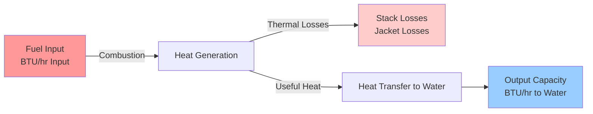
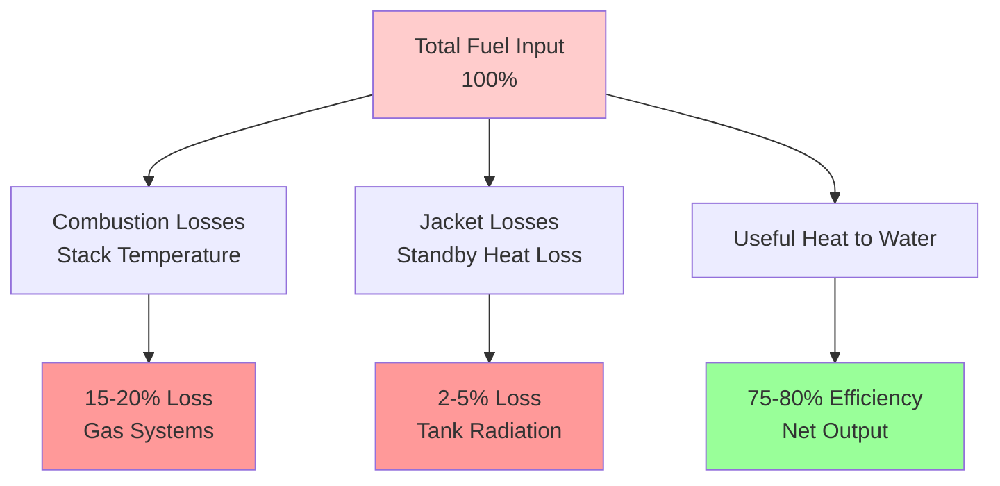

## Fundamental BTU Input Calculation

The BTU input requirement determines the fuel or electrical energy input needed to achieve the desired water heating capacity. Unlike output capacity, input rating must account for system inefficiencies inherent to the heating equipment and fuel type.

### Basic Heat Transfer Equation

The foundational energy requirement for heating water is:

$$Q = m \times c_p \times \Delta T$$

Where:
- $Q$ = Heat energy (BTU)
- $m$ = Mass of water (lb)
- $c_p$ = Specific heat of water (1.0 BTU/lb·°F)
- $\Delta T$ = Temperature rise (°F)

### Conversion to Gallons Per Hour

For practical water heater sizing, the calculation converts to volumetric flow:

$$Q_{output} = GPH \times 8.33 \times \Delta T \times 1.0$$

Where:
- $GPH$ = Gallons per hour recovery rate
- $8.33$ = Weight of water (lb/gallon)
- $\Delta T$ = Temperature rise (°F)

This yields the **output capacity** in BTU/hr.

## Input Rating Calculation with Efficiency Factor

The actual input requirement compensates for thermal losses and combustion inefficiencies:

$$Q_{input} = \frac{GPH \times 8.33 \times \Delta T}{Efficiency}$$

Or expressed as:

$$BTU_{input} = \frac{GPH \times 8.33 \times \Delta T}{\eta}$$

Where $\eta$ represents the thermal efficiency as a decimal (0.75 = 75%).

### Energy Flow Through Water Heater System

## Efficiency Factors by Fuel Type

Different water heater technologies exhibit distinct efficiency characteristics:

| Fuel Type | Typical Efficiency Range | Input Calculation Factor |
|-----------|-------------------------|-------------------------|
| Natural Gas (Standard) | 75% - 80% | Divide output by 0.75 - 0.80 |
| Natural Gas (High-Efficiency) | 90% - 95% | Divide output by 0.90 - 0.95 |
| Propane (Standard) | 75% - 82% | Divide output by 0.75 - 0.82 |
| Oil-Fired | 70% - 85% | Divide output by 0.70 - 0.85 |
| Electric Resistance | 98% - 100% | Divide output by 0.98 - 1.00 |
| Heat Pump (Electric) | 200% - 350% COP | Multiply output by reciprocal |

**ASHRAE Reference:** ASHRAE Handbook—HVAC Applications Chapter 51 provides detailed efficiency data for various water heating equipment types.

## Sizing Calculation Examples

### Example 1: Gas Water Heater Sizing

**Requirements:**
- Recovery rate: 40 GPH
- Temperature rise: 90°F (50°F inlet to 140°F setpoint)
- Equipment: Standard atmospheric gas heater
- Efficiency: 78%

**Calculation:**

Output capacity required:
$$Q_{output} = 40 \times 8.33 \times 90 = 29,988 \text{ BTU/hr}$$

Input rating required:
$$Q_{input} = \frac{29,988}{0.78} = 38,446 \text{ BTU/hr}$$

**Result:** Specify a gas water heater with minimum 40,000 BTU/hr input rating.

### Example 2: Electric Water Heater Sizing

**Requirements:**
- Recovery rate: 25 GPH
- Temperature rise: 80°F
- Equipment: Electric resistance elements
- Efficiency: 100%

**Calculation:**

Output capacity required:
$$Q_{output} = 25 \times 8.33 \times 80 = 16,660 \text{ BTU/hr}$$

Input rating required (kW):
$$kW = \frac{16,660}{3,412} = 4.88 \text{ kW}$$

**Result:** Specify dual 2.5 kW elements or single 5.0 kW element.

## Efficiency Loss Components

### Loss Mechanisms

**Stack Losses (Combustion Systems):**
- Hot flue gases carry energy out of the system
- Increase with excessive air (improper combustion)
- Typically 15-25% of input energy

**Jacket Losses:**
- Radiant and convective losses from tank surface
- Continuous during standby periods
- Minimized by insulation (R-12 to R-24)

**Cycling Losses:**
- Purge air cooling of heat exchanger (gas units)
- Off-cycle draft losses through flue
- Eliminated in electric resistance systems

## First Hour Rating vs. Input Capacity

Input capacity determines **recovery rate**, but storage volume determines **first hour rating (FHR)**:

$$FHR = Tank Volume \times 0.70 + Recovery Rate$$

Where 0.70 represents 70% usable hot water from storage.

| Input Rating | Recovery Rate @ 90°F Rise | With 40 Gal Tank (FHR) | With 50 Gal Tank (FHR) |
|--------------|--------------------------|------------------------|------------------------|
| 30,000 BTU/hr | 30 GPH | 58 gallons | 65 gallons |
| 40,000 BTU/hr | 40 GPH | 68 gallons | 75 gallons |
| 50,000 BTU/hr | 50 GPH | 78 gallons | 85 gallons |
| 75,000 BTU/hr | 75 GPH | 103 gallons | 110 gallons |

## Code and Standard Requirements

**ASHRAE Standard 118.1** specifies efficiency testing procedures for commercial water heaters, establishing minimum thermal efficiency and standby loss requirements.

**ASHRAE Standard 90.1** mandates minimum energy factors:
- Gas storage water heaters: EF ≥ 0.67 - (0.0019 × Volume)
- Electric storage water heaters: EF ≥ 0.97 - (0.00132 × Volume)

**DOE Federal Standards** regulate residential water heater efficiency through Uniform Energy Factor (UEF) metrics, superseding older Energy Factor (EF) ratings.

## Practical Sizing Methodology

1. **Calculate heat load:** Determine required output capacity using 8.33 × GPH × ΔT
2. **Select fuel type:** Consider availability, cost, and efficiency characteristics
3. **Apply efficiency factor:** Divide output by thermal efficiency to determine input
4. **Add safety margin:** Increase by 10-15% for degradation and safety
5. **Verify code compliance:** Confirm minimum efficiency standards are met
6. **Evaluate first hour rating:** Ensure storage meets peak demand requirements

## High-Efficiency Considerations

Condensing gas water heaters achieve 90-98% efficiency by recovering latent heat from flue gases. The input calculation changes significantly:

$$Q_{input} = \frac{GPH \times 8.33 \times \Delta T}{0.95}$$

This reduces fuel consumption by approximately 20% compared to standard atmospheric heaters, yielding lower operating costs despite higher initial investment.

**Condensing technology requirements:**
- Flue gas temperature below 140°F
- Corrosion-resistant materials (stainless steel)
- Condensate drainage and neutralization
- Category IV venting (PVC or CPVC acceptable)

---

**Engineering Note:** Always verify manufacturer performance data at specific operating conditions. Published efficiency ratings reflect standardized test conditions that may not represent actual installation environments. Account for altitude, inlet water temperature variations, and simultaneous usage patterns when finalizing equipment selection.
