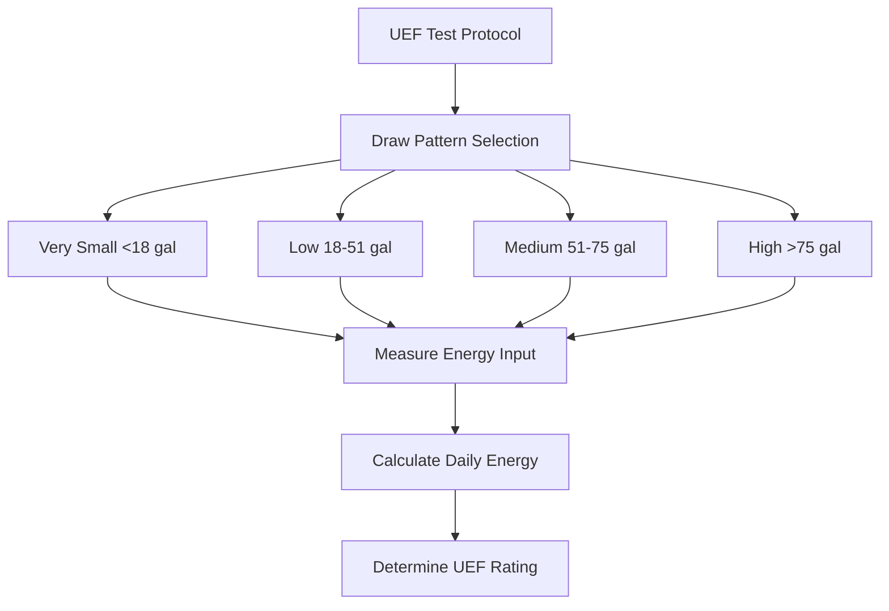
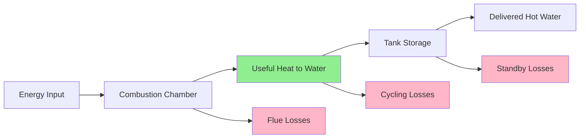

## Overview

Water heater efficiency encompasses multiple performance metrics that quantify energy conversion effectiveness, thermal storage losses, and operational cycling behavior. Understanding these factors is essential for accurate recovery time calculations and system selection.

## Thermal Efficiency

Thermal efficiency represents the ratio of useful heat delivered to the water versus total energy input during active heating. This steady-state metric excludes standby and cycling losses.

**Gas-Fired Systems:**

$$\eta_t = \frac{m \cdot c_p \cdot \Delta T}{Q_{input} \cdot t} \times 100\%$$

Where:
- $\eta_t$ = Thermal efficiency (%)
- $m$ = Mass flow rate of water (kg/s)
- $c_p$ = Specific heat of water (4.186 kJ/kg·K)
- $\Delta T$ = Temperature rise (K)
- $Q_{input}$ = Fuel input rate (kW)
- $t$ = Time interval (s)

**Electric Resistance Systems:**

Electric resistance heaters typically achieve 98-100% thermal efficiency, as nearly all electrical energy converts directly to heat within the tank. The efficiency equation simplifies to:

$$\eta_t = \frac{P_{output}}{P_{input}} \times 100\%$$

## Combustion Efficiency

For gas-fired and oil-fired water heaters, combustion efficiency measures how effectively fuel energy converts to heat in the combustion chamber before accounting for flue losses.

$$\eta_c = 100\% - \left(\frac{T_{flue} - T_{ambient}}{T_{flue}} \times K\right)$$

Where:
- $\eta_c$ = Combustion efficiency (%)
- $T_{flue}$ = Flue gas temperature (K)
- $T_{ambient}$ = Ambient air temperature (K)
- $K$ = Fuel-specific constant (0.5 for natural gas, 0.6 for propane)

Typical combustion efficiencies:

| Equipment Type | Combustion Efficiency | Notes |
|----------------|----------------------|-------|
| Atmospheric gas | 76-82% | Draft hood losses significant |
| Power-vented gas | 82-88% | Reduced flue losses |
| Condensing gas | 90-98% | Recovers latent heat |
| Oil-fired | 80-88% | Depends on burner tuning |

## Energy Factor (EF)

The Energy Factor represents the overall system efficiency including recovery efficiency, standby losses, and cycling losses under DOE test conditions. This metric was the primary efficiency rating until 2017.

$$EF = \frac{Q_{delivered}}{Q_{consumed}}$$

**Calculation Components:**

$$EF = \frac{V \cdot \rho \cdot c_p \cdot \Delta T}{Q_{daily}}$$

Where:
- $V$ = Daily hot water consumption (L)
- $\rho$ = Water density (kg/L)
- $Q_{daily}$ = Total daily energy consumption (kJ)

## Uniform Energy Factor (UEF)

The Uniform Energy Factor replaced EF in 2017, providing a more realistic assessment based on updated DOE test procedures. UEF accounts for four distinct usage patterns.

**UEF Test Cycles:**

$$UEF = \frac{E_{delivered}}{E_{input}} = \frac{\sum_{i=1}^{n} m_i \cdot c_p \cdot \Delta T_i}{Q_{total}}$$

**UEF by Technology:**

| Technology | Typical UEF Range | Recovery Efficiency |
|------------|-------------------|---------------------|
| Electric resistance | 0.90-0.95 | 98% |
| Gas atmospheric | 0.58-0.65 | 76-82% |
| Gas power-vented | 0.62-0.68 | 82-88% |
| Gas condensing | 0.80-0.96 | 90-98% |
| Electric heat pump | 2.0-4.0 | 200-400% COP |
| Solar with backup | 1.5-3.0 | Varies with insolation |

## Standby Loss Factor

Standby losses represent heat dissipation from the storage tank to the surrounding environment during idle periods. This passive loss directly impacts recovery time calculations.

**Standby Loss Coefficient:**

$$Q_{standby} = UA \cdot (T_{tank} - T_{ambient})$$

Where:
- $Q_{standby}$ = Standby heat loss rate (W)
- $U$ = Overall heat transfer coefficient (W/m²·K)
- $A$ = Tank surface area (m²)

**Normalized Standby Loss:**

$$S = \frac{Q_{standby}}{Q_{storage}} \times 100\% \text{ per hour}$$

ASHRAE 118.1 specifies maximum standby loss percentages:

| Tank Volume (L) | Maximum Standby Loss (%/hr) |
|----------------|----------------------------|
| <190 | 3.0 |
| 190-270 | 2.5 |
| 270-450 | 2.0 |
| >450 | 1.5 |

## Cycling Losses

Cycling losses occur during the heating cycle from:
- Heat loss through flue during burner operation
- Thermal stratification disruption
- Post-purge air flow (gas systems)

**Cycling Loss Impact:**

$$\eta_{effective} = \eta_t - L_{cycling}$$

Where:
- $L_{cycling}$ = Energy lost per cycle divided by energy delivered

## Energy Flow Analysis

The complete energy balance for a storage water heater:

$$Q_{input} = Q_{useful} + Q_{flue} + Q_{standby} + Q_{cycling} + Q_{jacket}$$

**Efficiency Relationship:**

$$UEF = \frac{Q_{useful}}{Q_{input}} = \eta_c \cdot \eta_{transfer} \cdot (1 - L_{standby}) \cdot (1 - L_{cycling})$$

## Recovery Efficiency Application

When calculating recovery time, apply the appropriate efficiency factor:

**For Initial Heating:**

$$t_{recovery} = \frac{V \cdot \rho \cdot c_p \cdot \Delta T}{P_{input} \cdot \eta_t}$$

**For Operating Systems:**

$$t_{effective} = \frac{V \cdot \rho \cdot c_p \cdot \Delta T}{P_{input} \cdot UEF}$$

The difference between $\eta_t$ and UEF can increase recovery time by 15-40% depending on system type and operating conditions.

## Standards References

**ASHRAE Standards:**
- ASHRAE 118.1: Method of Testing for Rating Residential Water Heaters
- ASHRAE 118.2: Method of Testing for Rating Commercial Water Heaters

**DOE Regulations:**
- 10 CFR Part 430, Subpart B, Appendix E: Uniform Test Method for Measuring Energy Consumption
- Federal efficiency standards mandate minimum UEF values based on tank size and fuel type

## Practical Considerations

**System Selection Factors:**

1. **High Demand Applications:** Prioritize thermal efficiency ($\eta_t$) over UEF
2. **Low Utilization:** Minimize standby losses through enhanced insulation
3. **Cycling Frequency:** Condensing units reduce cycling losses significantly
4. **Life Cycle Costs:** UEF provides the most accurate energy cost projection

**Efficiency Degradation:**

Water heater efficiency decreases over time due to:
- Scale accumulation on heat exchanger surfaces (5-15% reduction)
- Insulation compression and degradation (2-5% increase in standby loss)
- Combustion system fouling (3-8% efficiency reduction)

Regular maintenance preserves design efficiency and ensures accurate recovery time predictions.
