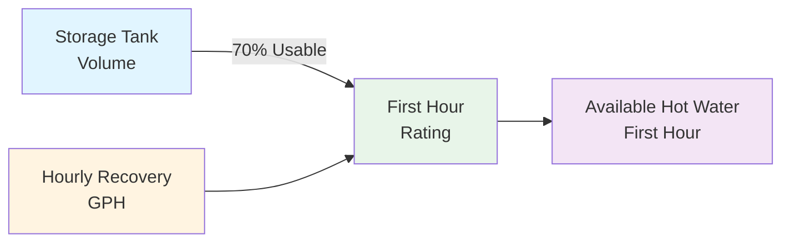
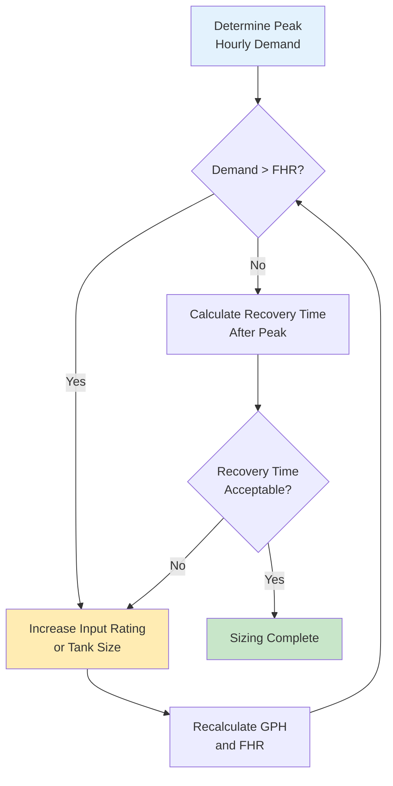
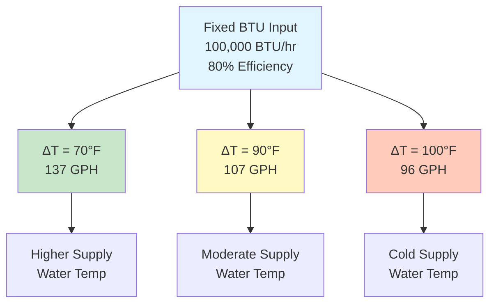

## Fundamental Recovery Rate Formula

The gallons per hour (GPH) recovery rate determines how quickly a water heater can heat incoming cold water to the desired delivery temperature. This metric is essential for proper sizing and evaluating a water heater's ability to meet demand.

The fundamental equation is:

$$\text{GPH} = \frac{\text{BTU/hr} \times \eta}{8.33 \times \Delta T}$$

Where:
- **GPH** = Recovery rate (gallons per hour)
- **BTU/hr** = Input rating of the heater
- **η** = Efficiency factor (decimal form: 0.80 for 80%)
- **8.33** = Weight of water in pounds per gallon
- **ΔT** = Temperature rise required (°F)

## Physical Basis

The constant 8.33 lb/gal represents water's density at standard conditions. The temperature rise calculation follows the sensible heat equation:

$$Q = m \times c_p \times \Delta T$$

Where:
- **Q** = Heat energy (BTU)
- **m** = Mass of water (lb)
- **c_p** = Specific heat of water (1.0 BTU/lb·°F)
- **ΔT** = Temperature change (°F)

Since one gallon of water weighs 8.33 pounds and has a specific heat of 1.0 BTU/lb·°F, heating one gallon through one degree Fahrenheit requires 8.33 BTU.

## Temperature Rise Determination

Temperature rise depends on incoming water temperature and desired delivery temperature:

$$\Delta T = T_{\text{delivery}} - T_{\text{supply}}$$

Typical supply water temperatures vary by region and season:

| Region | Winter Supply | Summer Supply | Design ΔT (to 140°F) |
|--------|--------------|--------------|---------------------|
| Southern US | 55-60°F | 70-75°F | 80-85°F |
| Central US | 45-50°F | 65-70°F | 90-95°F |
| Northern US | 40-45°F | 60-65°F | 95-100°F |

ASHRAE 90.1 recommends using 40°F supply water temperature for conservative design calculations in most applications.

## Recovery Rate Calculation Examples

### Example 1: Residential Gas Water Heater

Given:
- Input: 40,000 BTU/hr
- Efficiency: 0.62 (62% for atmospheric gas)
- Supply water: 50°F
- Delivery temperature: 140°F
- Temperature rise: 90°F

$$\text{GPH} = \frac{40,000 \times 0.62}{8.33 \times 90} = \frac{24,800}{749.7} = 33.1 \text{ GPH}$$

### Example 2: Commercial Electric Water Heater

Given:
- Input: 18,000 watts = 61,425 BTU/hr
- Efficiency: 0.98 (98% electric resistance)
- Temperature rise: 100°F

$$\text{GPH} = \frac{61,425 \times 0.98}{8.33 \times 100} = \frac{60,197}{833} = 72.3 \text{ GPH}$$

### Example 3: High-Efficiency Condensing Gas

Given:
- Input: 199,000 BTU/hr
- Efficiency: 0.96 (96% condensing)
- Temperature rise: 90°F

$$\text{GPH} = \frac{199,000 \times 0.96}{8.33 \times 90} = \frac{191,040}{749.7} = 254.9 \text{ GPH}$$

## Recovery Rate Comparison Table

| Input (BTU/hr) | Efficiency | ΔT = 70°F | ΔT = 90°F | ΔT = 100°F |
|----------------|-----------|-----------|-----------|------------|
| 30,000 | 0.60 | 30.9 GPH | 24.0 GPH | 21.6 GPH |
| 40,000 | 0.62 | 42.7 GPH | 33.1 GPH | 29.8 GPH |
| 75,000 | 0.80 | 103.0 GPH | 80.0 GPH | 72.0 GPH |
| 100,000 | 0.82 | 140.8 GPH | 109.3 GPH | 98.4 GPH |
| 199,000 | 0.96 | 327.6 GPH | 254.3 GPH | 228.9 GPH |

## First Hour Rating (FHR)

The first hour rating combines storage capacity with recovery rate:

$$\text{FHR} = (\text{Tank Volume} \times 0.70) + \text{GPH}$$

The 0.70 factor accounts for usable hot water from the tank (typically 70% before significant temperature drop occurs).

### FHR Calculation Example

50-gallon tank with 40 GPH recovery:

$$\text{FHR} = (50 \times 0.70) + 40 = 35 + 40 = 75 \text{ gallons}$$

## Efficiency Factor by Heater Type

| Heater Type | Typical Efficiency | Range |
|-------------|-------------------|-------|
| Electric Resistance | 0.95-0.98 | High (minimal losses) |
| Atmospheric Gas | 0.58-0.64 | Lower (flue losses) |
| Power Vent Gas | 0.62-0.67 | Moderate improvement |
| Condensing Gas | 0.90-0.98 | High (captures latent heat) |
| Heat Pump Water Heater | 2.0-3.5 COP* | Electric equivalent |
| Indirect (from boiler) | 0.70-0.85 | Depends on boiler efficiency |

*Heat pump COP converts to equivalent efficiency >200% but uses different calculation method per ASHRAE 118.2.

## Sizing Methodology

### Sizing Steps

1. **Determine peak hourly demand** from fixture units or actual usage data (ASHRAE Handbook - HVAC Applications Chapter 51)
2. **Select delivery temperature** (typically 140°F for storage, 120°F for point-of-use)
3. **Establish supply water temperature** (use 40-50°F for design)
4. **Calculate required GPH** to meet demand
5. **Verify recovery time** between peak usage periods
6. **Apply safety factor** (1.2-1.5× for critical applications)

## Conversion Factors

### BTU/hr to Kilowatts

$$\text{kW} = \frac{\text{BTU/hr}}{3,412.14}$$

### Electric Input to GPH

For electric heaters with 98% efficiency:

$$\text{GPH} = \frac{\text{Watts} \times 3.35}{\Delta T}$$

This simplified formula incorporates the BTU conversion and typical electric efficiency.

## ASHRAE Standards References

- **ASHRAE 90.1**: Energy efficiency requirements for service water heating equipment
- **ASHRAE 118.2**: Method of testing for rating residential water heaters
- **ASHRAE Handbook - HVAC Applications, Chapter 51**: Service water heating system design, storage capacity, and recovery requirements
- **ASHRAE 90.2**: Energy-efficient design of low-rise residential buildings, water heating provisions

## Practical Sizing Considerations

### Continuous Draw Applications

For applications with sustained draw (commercial kitchens, laundries), recovery rate becomes more critical than storage capacity. Size based on:

$$\text{Required GPH} \geq \text{Continuous Draw Rate} \times 1.25$$

### Peak Draw Applications

For applications with short, intense peaks (morning residential use), storage capacity is more important. Use FHR method with adequate recovery to replenish between peaks.

### Multiple Heater Arrays

When using multiple heaters, total recovery is additive:

$$\text{Total GPH} = \text{GPH}_1 + \text{GPH}_2 + \text{GPH}_3 + \ldots$$

This provides redundancy and allows for staged operation during partial loads.

## Temperature Rise Impact on Capacity

Recovery capacity decreases proportionally as temperature rise increases. A 30% increase in temperature rise (70°F to 100°F) reduces GPH capacity by 30%.

## Field Verification

To verify actual recovery rate:

1. Drain heater to 50% capacity
2. Record time to return to setpoint
3. Calculate gallons heated and time elapsed
4. Compare to rated GPH

Significant deviation indicates efficiency loss, scaling, or component failure requiring maintenance.