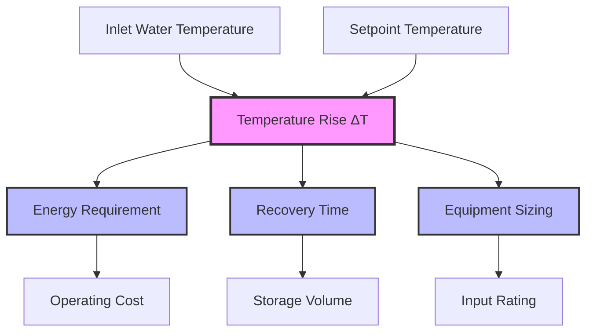
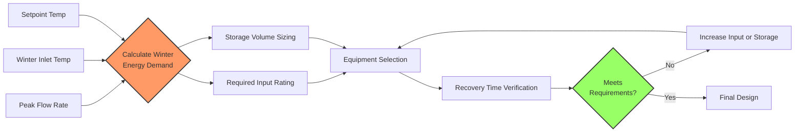

Temperature rise (ΔT) represents the critical thermal differential between inlet cold water and the desired hot water setpoint. This parameter fundamentally governs energy requirements, recovery time, and proper equipment sizing for domestic hot water systems.

## Fundamental Temperature Rise Equation

The energy required to raise water temperature follows the sensible heat equation:

$$Q = \dot{m} \cdot c_p \cdot \Delta T$$

Where:
- $Q$ = Heat transfer rate (BTU/hr or kW)
- $\dot{m}$ = Mass flow rate (lb/hr or kg/s)
- $c_p$ = Specific heat of water (1.0 BTU/lb-°F or 4.186 kJ/kg-°C)
- $\Delta T$ = Temperature rise (°F or °C)

For practical water heater calculations in IP units:

$$Q_{BTU/hr} = GPM \times 500 \times \Delta T$$

This simplified form incorporates water density (8.33 lb/gal), specific heat (1.0 BTU/lb-°F), and unit conversions (60 min/hr).

## Inlet Water Temperature Variations

Inlet cold water temperature varies significantly by geography and season, directly impacting the required temperature rise:

| Season | Typical Inlet Range | Common Design Value | ΔT to 140°F |
|--------|---------------------|---------------------|-------------|
| Winter | 40-50°F | 45°F | 95°F |
| Summer | 60-70°F | 65°F | 75°F |
| Spring/Fall | 50-60°F | 55°F | 85°F |
| Year-Round Design | 40-50°F | 50°F | 90°F |

ASHRAE Handbook—HVAC Applications recommends using the coldest expected inlet temperature for sizing calculations to ensure adequate capacity during peak demand conditions.

### Geographic Considerations

Inlet water temperature correlates with local groundwater and municipal supply temperatures:

- **Northern climates**: 40-45°F winter inlet temperatures common
- **Southern climates**: 50-55°F winter inlet temperatures typical
- **Coastal regions**: Moderated seasonal variations
- **Desert regions**: Greater seasonal temperature swings

## Temperature Rise Impact on System Performance

### Energy Requirement Relationship

The direct proportionality between ΔT and energy demand creates significant seasonal variations:

**Example Calculation:**
- Flow rate: 10 GPM
- Winter inlet: 45°F, ΔT = 95°F
- Summer inlet: 65°F, ΔT = 75°F
- Setpoint: 140°F

Winter energy requirement:
$$Q_{winter} = 10 \times 500 \times 95 = 475,000 \text{ BTU/hr}$$

Summer energy requirement:
$$Q_{summer} = 10 \times 500 \times 75 = 375,000 \text{ BTU/hr}$$

The winter condition requires 26.7% more energy than summer for identical flow rates.

## Recovery Time Calculations

Recovery time depends on storage volume, input rating, and temperature rise:

$$t_{recovery} = \frac{V \times 8.33 \times \Delta T}{Q_{input} \times \eta}$$

Where:
- $t_{recovery}$ = Time to heat stored volume (hours)
- $V$ = Storage volume (gallons)
- $8.33$ = Water density (lb/gal)
- $\Delta T$ = Temperature rise (°F)
- $Q_{input}$ = Heater input rating (BTU/hr)
- $\eta$ = Thermal efficiency (decimal)

### Recovery Time Comparison Table

| Storage Volume | Input Rating | Winter ΔT (95°F) | Summer ΔT (75°F) | Time Difference |
|----------------|--------------|------------------|------------------|-----------------|
| 80 gallons | 75,000 BTU/hr (0.80 η) | 1.32 hours | 1.04 hours | +27% |
| 120 gallons | 100,000 BTU/hr (0.80 η) | 1.48 hours | 1.17 hours | +27% |
| 200 gallons | 150,000 BTU/hr (0.80 η) | 1.65 hours | 1.30 hours | +27% |

## Sizing Impact and Design Considerations

### Equipment Selection Criteria

Proper sizing must account for worst-case temperature rise conditions:

1. **Design ΔT Selection**: Use winter inlet temperature (coldest month average minus 5°F safety factor)
2. **Peak Demand Analysis**: Calculate maximum simultaneous fixture flow rates
3. **Recovery Time Requirements**: Establish acceptable reheating periods between demand cycles
4. **Storage vs. Input Trade-off**: Balance tank size against input rating

### Undersizing Consequences

Inadequate consideration of temperature rise leads to:

- Insufficient hot water availability during cold months
- Extended recovery periods exceeding demand cycles
- User complaints and system modifications
- Increased operating costs from continuous heating attempts

### Oversizing Considerations

While conservative sizing provides safety margin, excessive capacity results in:

- Higher equipment first costs
- Increased standby losses from larger storage volumes
- Reduced part-load efficiency
- Unnecessary energy consumption

## Seasonal Efficiency Variations

Annual efficiency analysis requires temperature rise integration:

$$\text{Annual Energy} = \sum_{month=1}^{12} \text{Usage}_{month} \times \Delta T_{month}$$

Systems sized for winter conditions operate at partial capacity during summer months, potentially reducing combustion efficiency for fuel-fired units and cycling losses for all equipment types.

## ASHRAE Design References

ASHRAE Standard 90.1 Energy Standard for Buildings Except Low-Rise Residential Buildings provides minimum efficiency requirements that interact with temperature rise sizing:

- Section 7: Service Water Heating efficiency requirements
- Table 7.8: Performance requirements for water heaters

ASHRAE Handbook—HVAC Applications Chapter 51 Service Water Heating:

- Table 7: Hot water demand per fixture
- Table 10: Storage capacity and recovery requirements
- Figure 11: Sizing curves incorporating temperature rise factors

## Practical Design Recommendations

1. **Design Basis**: Use winter inlet temperature for all capacity calculations
2. **Safety Factor**: Apply 10-15% capacity margin beyond calculated peak demand
3. **Local Data**: Obtain actual municipal water temperatures from utility providers
4. **Monitoring**: Install inlet temperature sensors for seasonal verification
5. **Efficiency**: Consider modulating equipment that adapts to seasonal ΔT variations
6. **Preheating**: Evaluate solar thermal or heat recovery to reduce effective ΔT

Temperature rise calculations form the foundation of reliable domestic hot water system design. Accurate assessment of inlet temperature variations, particularly winter conditions, ensures adequate capacity while avoiding costly oversizing.
