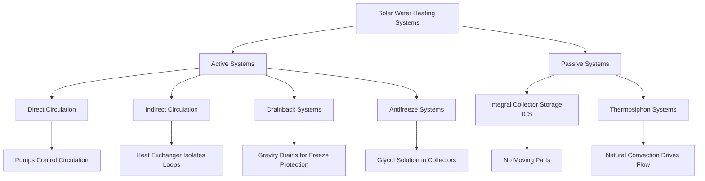

Solar water heating systems harness radiant energy from the sun to preheat or fully heat domestic hot water, reducing conventional energy consumption by 50-80% in optimal conditions. These systems convert short-wave solar radiation into thermal energy through selective absorption surfaces, transferring heat to a working fluid via conduction and forced or natural convection.

## Solar Thermal Collection Fundamentals

The instantaneous useful energy gain from a solar collector follows the Hottel-Whillier-Bliss equation:

$$Q_u = A_c \cdot F_R \left[ I_T \cdot (\tau\alpha) - U_L(T_{in} - T_a) \right]$$

Where:
- $Q_u$ = useful energy gain (W)
- $A_c$ = collector aperture area (m²)
- $F_R$ = heat removal factor (dimensionless, typically 0.85-0.95)
- $I_T$ = total incident solar radiation (W/m²)
- $(\tau\alpha)$ = transmittance-absorptance product (typically 0.75-0.90)
- $U_L$ = overall heat loss coefficient (W/m²·K)
- $T_{in}$ = collector inlet fluid temperature (°C)
- $T_a$ = ambient air temperature (°C)

SRCC (Solar Rating and Certification Corporation) testing per ASHRAE 93 determines collector performance parameters under controlled conditions.

## Active vs Passive Solar Water Heating Systems

| System Type | Complexity | Freeze Protection | Efficiency | Maintenance | Cost |
|-------------|------------|-------------------|------------|-------------|------|
| **Direct Active** | Moderate | External heater | 60-70% | Moderate | $$ |
| **Indirect Active** | High | Heat exchanger | 50-65% | Low | $$$ |
| **Drainback** | High | Automatic drain | 55-70% | Low | $$$ |
| **Antifreeze** | Moderate | Glycol solution | 50-65% | Moderate | $$ |
| **ICS Passive** | Low | Insulated tank | 40-50% | Minimal | $ |
| **Thermosiphon** | Low | Tank elevation | 45-60% | Minimal | $ |

## Solar Collector Technologies

### Flat Plate Collectors

Flat plate collectors consist of an absorber plate with integral or attached flow passages, covered by one or two transparent glazing layers. The absorber features a selective coating with high absorptance ($\alpha$ = 0.92-0.96) in the short-wave solar spectrum (0.3-2.5 μm) and low emittance ($\epsilon$ = 0.05-0.15) in the long-wave infrared spectrum (2.5-40 μm).

Heat transfer from absorber to working fluid:

$$q = h \cdot A \cdot (T_{plate} - T_{fluid})$$

Where $h$ is the convective heat transfer coefficient (W/m²·K), influenced by flow regime and channel geometry. Turbulent flow ($Re > 2300$) in riser tubes maximizes heat transfer while maintaining acceptable pressure drop.

**Typical Performance:**
- Efficiency at zero temperature difference: 70-80%
- Heat loss coefficient: 3.5-6.0 W/m²·K
- Optimal tilt angle: latitude ± 15°
- Service life: 20-25 years

### Evacuated Tube Collectors

Evacuated tube collectors utilize vacuum insulation (pressure < 0.01 Pa) between concentric glass tubes to eliminate conductive and convective heat losses. The evacuated space reduces $U_L$ to 0.5-1.5 W/m²·K, enabling efficient operation at elevated temperatures.

Two primary configurations exist:

**Direct Flow Tubes:** Working fluid flows through absorber tube inside vacuum envelope. Heat pipe transfers thermal energy via phase change of sealed fluid (water, alcohol, or refrigerant). The heat pipe operates on the Rankine cycle:
1. Solar energy vaporizes liquid in evaporator section
2. Vapor rises to condenser (dry connection manifold)
3. Condensation releases latent heat to transfer fluid
4. Condensate returns via gravity and capillary action

**Performance Characteristics:**
- Efficiency at 50°C above ambient: 50-65%
- Heat loss coefficient: 0.5-1.5 W/m²·K
- Operates effectively in diffuse radiation
- Individual tube replacement capability
- Higher cost per unit area

## Storage Tank Sizing Methodology

Storage capacity must balance solar collection potential with hot water demand patterns. ASHRAE recommends 1.5-2.0 gallons storage per square foot of collector area (60-80 L/m²) for residential applications.

$$V_{storage} = A_c \cdot SR \cdot \rho \cdot c_p \cdot \frac{\Delta T_{useful}}{Q_{daily}}$$

Where:
- $V_{storage}$ = storage tank volume (L)
- $SR$ = storage ratio, typically 60-80 L/m²
- $\rho$ = water density (kg/L)
- $c_p$ = specific heat of water, 4.186 kJ/kg·K
- $\Delta T_{useful}$ = usable temperature rise (K)
- $Q_{daily}$ = daily hot water energy demand (kJ)

**Tank Configuration Considerations:**

- Vertical orientation maximizes thermal stratification
- Height-to-diameter ratio ≥ 2.5 preferred
- Thermocline preservation reduces mixing
- Dual-tank systems separate solar preheat from auxiliary heating
- Insulation R-value ≥ R-16 (RSI-2.8) reduces standby losses to < 2% per hour

## System Efficiency Factors

The solar fraction ($SF$) represents the portion of total hot water energy supplied by solar:

$$SF = \frac{Q_{solar}}{Q_{total}} = \frac{Q_{solar}}{Q_{solar} + Q_{auxiliary}}$$

Factors affecting system efficiency:

**Environmental:**
- Collector tilt and orientation (azimuth within ±15° of true south optimal)
- Shading analysis using solar path diagrams
- Climate and solar resource (insolation 4-7 kWh/m²/day)
- Ambient temperature and wind speed

**System Design:**
- Collector area to load ratio (30-50 ft²/100 gal daily demand)
- Flow rate optimization (0.015-0.025 gpm/ft² collector area)
- Heat exchanger effectiveness (ε > 0.5 for indirect systems)
- Pipe insulation (R-4 minimum, R-8 preferred)
- Control strategy and differential temperature setpoints (8-12°F on, 3-5°F off)

**Operational:**
- Storage temperature maintenance
- Load profile matching with solar availability
- Auxiliary backup integration
- Freeze protection system effectiveness
- Regular maintenance and fluid degradation monitoring

Properly designed solar water heating systems deliver 40-70% annual solar fraction in most US climates, with simple payback periods of 6-12 years when displacing electric resistance heating. Systems must comply with local plumbing codes and integrate seamlessly with conventional water heaters to ensure reliable hot water delivery regardless of weather conditions.

