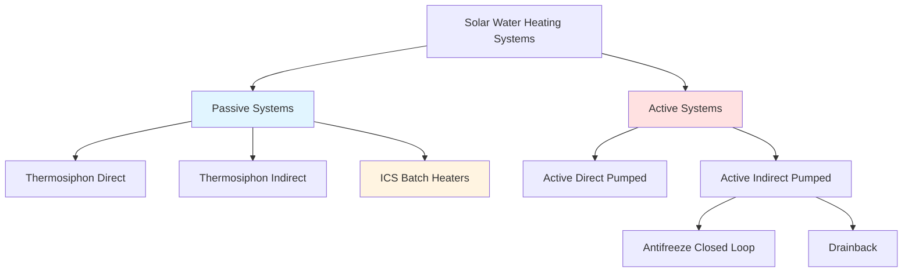
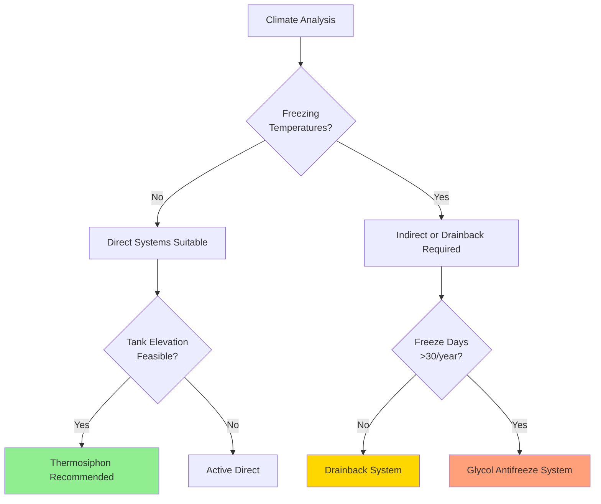

# Active vs Passive Solar Water Heating Systems

Solar water heating systems divide into two fundamental categories based on their circulation mechanism: **passive systems** that rely on natural convection, and **active systems** that use pumps to circulate heat transfer fluid. Understanding the physics governing each approach is critical for proper system selection and performance prediction.

## Fundamental Operating Principles

### Passive Thermosiphon Systems

Thermosiphon systems exploit the density difference between hot and cold water to establish natural circulation. The driving force for flow originates from the buoyancy pressure differential:

$$\Delta P_{buoyancy} = g H (\rho_{cold} - \rho_{hot})$$

Where:
- $g$ = gravitational acceleration (9.81 m/s²)
- $H$ = vertical height between collector outlet and storage tank inlet (m)
- $\rho_{cold}$, $\rho_{hot}$ = density of cold and hot water (kg/m³)

This pressure differential must overcome friction losses throughout the circuit:

$$\Delta P_{friction} = f \frac{L}{D} \frac{\rho v^2}{2} + \sum K \frac{\rho v^2}{2}$$

The system reaches equilibrium when buoyancy pressure equals friction losses, establishing the natural circulation flow rate. For water heated from 15°C to 60°C with 1 meter elevation, the available driving pressure is approximately 180 Pa.

**Key design requirement:** The storage tank must be positioned **above** the collector outlet for thermosiphon operation. Minimum elevation difference typically ranges from 0.3 to 1.0 meters depending on piping configuration.

### Active Pumped Systems

Active systems use circulation pumps controlled by differential temperature sensors. The pump operates when:

$$T_{collector} > T_{storage} + \Delta T_{on}$$

Where $\Delta T_{on}$ typically ranges from 5-10°C to prevent cycling and ensure net energy gain. Pump power requirements are generally 50-100 watts for residential systems, with annual electrical consumption of 200-400 kWh depending on climate and control strategy.

The pump provides sufficient pressure to overcome all system resistances and enables design flexibility regarding component placement and piping configuration.

## System Configuration Types

### Direct vs Indirect Systems

**Direct systems** circulate potable water through the solar collectors:
- Lower cost (single-loop design)
- Higher efficiency (no heat exchanger penalty)
- Freeze risk in climates with temperatures below 0°C
- Scaling risk with hard water
- Limited to non-toxic, non-corrosive water chemistry

**Indirect systems** use a separate heat transfer fluid loop with a heat exchanger:
- Freeze protection via antifreeze solutions (propylene glycol typical)
- Isolation from water chemistry issues
- Heat exchanger effectiveness penalty: 5-15% thermal loss
- Higher initial cost and complexity
- Drainback variants use water but require proper slope for drainage

The heat exchanger effectiveness in indirect systems follows:

$$\epsilon = \frac{Q_{actual}}{Q_{maximum}} = \frac{T_{storage,out} - T_{storage,in}}{T_{fluid,in} - T_{storage,in}}$$

Typical effectiveness values range from 0.6 to 0.8 for immersed coil heat exchangers and 0.7 to 0.85 for external plate heat exchangers.

### ICS (Integrated Collector Storage) Batch Heaters

ICS systems combine collection and storage in a single unit. The storage tank itself serves as the absorber, with insulation on five sides and glazing on the sixth. These represent the simplest passive solar water heater:

**Advantages:**
- Minimal components (no separate collector or circulation system)
- Extremely reliable (no moving parts or controls)
- Low maintenance requirements

**Disadvantages:**
- High nighttime heat loss (storage exposed to outdoor conditions)
- Large thermal mass limits daily temperature rise
- Heavy roof loads (150-300 kg when filled)
- Aesthetic concerns (visible tank profile)

Thermal performance of ICS systems degrades significantly during cold, cloudy periods due to the thermal coupling between storage and ambient conditions. Heat loss coefficient for ICS units typically ranges from 5-10 W/m²·K, compared to 1-3 W/m²·K for insulated storage tanks.

## Performance Comparison

| Parameter | Passive Thermosiphon | Active Pumped | ICS Batch |
|-----------|---------------------|---------------|-----------|
| Annual Efficiency | 35-50% | 40-60% | 25-40% |
| Freeze Protection | Indirect loop required | Antifreeze or drainback | Requires draining |
| Installation Complexity | Medium | High | Low |
| Maintenance | Low | Medium (pump, controls) | Minimal |
| Capital Cost ($/m² collector) | $400-600 | $600-900 | $300-500 |
| Operating Cost | Zero | $30-60/year (pump power) | Zero |
| Design Flexibility | Limited (tank elevation) | High | Very limited |
| Typical Lifespan | 15-20 years | 12-18 years | 20-25 years |

## Climate Applicability

### Climate-Specific Recommendations

**Tropical/Subtropical (ASHRAE Climate Zones 1-3):**
- Direct thermosiphon systems optimal
- ICS batch heaters viable but lower efficiency
- No freeze protection required
- Corrosion considerations for coastal installations

**Temperate (Climate Zones 4-5):**
- Indirect thermosiphon or active systems
- Drainback systems preferred over glycol (no degradation)
- ICS requires winterization (draining) during cold months

**Cold (Climate Zones 6-8):**
- Active indirect glycol systems required
- Periodic glycol testing and replacement necessary (3-5 year intervals)
- Higher performance justification threshold due to lower solar resource
- Snow load and wind considerations for collector mounting

## Efficiency Determinants

System efficiency depends on several interrelated factors:

$$\eta_{system} = \eta_{optical} \cdot \eta_{thermal} \cdot \eta_{transfer} \cdot \eta_{storage}$$

Where:
- $\eta_{optical}$ = collector optical efficiency (0.7-0.85 for selective coatings)
- $\eta_{thermal}$ = collector thermal efficiency (function of operating temperature)
- $\eta_{transfer}$ = circulation and heat exchange efficiency (0.85-1.0)
- $\eta_{storage}$ = storage tank thermal retention (0.90-0.98)

The thermal efficiency component follows:

$$\eta_{thermal} = 1 - \frac{U_L (T_{collector} - T_{ambient})}{I}$$

Where $U_L$ is the collector heat loss coefficient (3-6 W/m²·K for flat plate collectors) and $I$ is incident solar irradiance (W/m²). This relationship demonstrates why thermosiphon systems, operating at slightly higher collector temperatures due to lower flow rates, experience marginally reduced efficiency compared to optimized active systems.

## System Selection Framework

**Choose passive thermosiphon when:**
- Site allows tank elevation above collectors
- Minimal maintenance infrastructure available
- Electrical reliability concerns exist
- Lifetime cost minimization is priority
- Freeze-free climate or indirect loop acceptable

**Choose active pumped when:**
- Tank location flexibility required
- Optimized efficiency justifies added complexity
- Integration with existing hydronic systems needed
- Monitoring and control capabilities desired
- Roof load limits exist (remote storage)

**Choose ICS batch when:**
- Simplicity outweighs efficiency
- Roof structure can support load
- Moderate hot water demands (1-2 occupants)
- Seasonal/vacation property application
- Budget constraints significant

## Standards and Testing

Solar water heater performance rating follows **SRCC OG-300** (Solar Rating and Certification Corporation) protocol, which establishes standardized testing conditions:
- Reference irradiance: 1000 W/m²
- Ambient temperature: 20°C
- Inlet water temperature: 11°C
- Draw profile: 243 liters/day (64 gallons/day)

Performance is reported as Solar Energy Factor (SEF), with typical values:
- Active indirect systems: 2.0-3.0
- Passive thermosiphon: 1.5-2.5
- ICS batch: 1.0-1.8

Higher SEF indicates greater energy delivery per unit of auxiliary energy consumed. Systems must be selected based on certified ratings rather than theoretical collector area alone.

---

**File:** `/Users/evgenygantman/Documents/github/gantmane/hvac/content/specialty-applications-testing/specialty-hvac-applications/service-water-heating-domestic-hot-water/solar-water-heating/active-vs-passive/_index.md`
