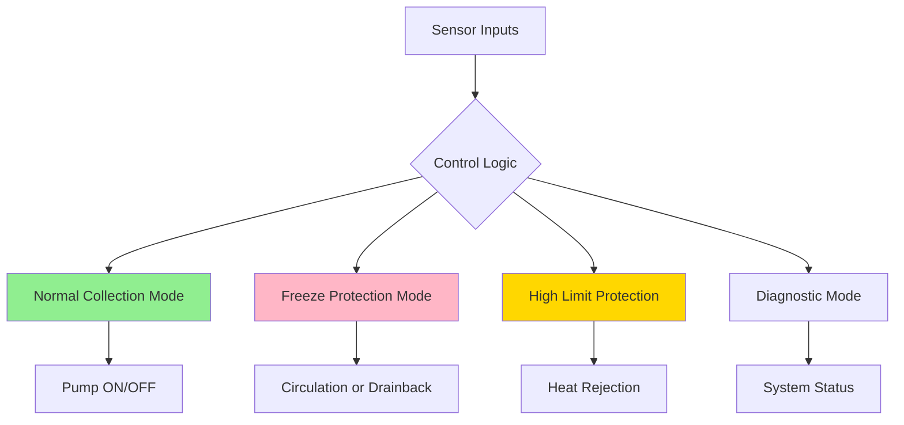

## System Overview

Active solar water heating systems employ mechanical circulation to transfer heat from solar collectors to storage tanks. Unlike passive systems that rely on thermosiphon action, active systems use pumps controlled by differential temperature controllers to achieve precise thermal management and higher efficiency across varied installation configurations.

The fundamental operating principle involves continuous monitoring of collector and storage temperatures. When the collector temperature exceeds the storage temperature by a predetermined differential (typically 15-20°F or 8-11°C), the controller activates the circulation pump, initiating heat transfer. This forced circulation enables installations where collectors cannot be positioned below storage tanks and allows for optimized flow rates independent of natural convection limitations.

## Circulation Pumps

### Pump Selection Criteria

Circulation pumps in active solar systems must satisfy specific performance requirements dictated by system hydraulics and thermal characteristics. The required pump head is determined by:

$$H_p = H_{static} + H_{friction} + H_{collector}$$

where:
- $H_{static}$ = vertical elevation difference between collector and storage
- $H_{friction}$ = pressure losses in piping, fittings, and heat exchangers
- $H_{collector}$ = pressure drop through collector array

For glycol-based systems, friction losses increase due to higher fluid viscosity. The Darcy-Weisbach equation applies with viscosity corrections:

$$\Delta P = f \frac{L}{D} \frac{\rho v^2}{2}$$

The friction factor $f$ varies with Reynolds number, which decreases with increasing glycol concentration and decreasing temperature. At 50% propylene glycol and 40°F, viscosity approximately doubles compared to water, requiring higher pump power.

### Pump Types and Applications

**Centrifugal Pumps**: Standard choice for most residential and light commercial installations. Variable-speed ECM (electronically commutated motor) pumps offer energy savings by modulating flow rates based on insolation levels. Flow rates typically range from 0.02-0.03 GPM per square foot of collector area.

**Positive Displacement Pumps**: Used in large commercial systems or applications requiring high head pressures. Gear pumps handle glycol solutions effectively but require careful sizing to avoid over-pressurization.

### Pump Sizing

The optimal flow rate balances thermal performance against parasitic power consumption:

$$\dot{Q}_{useful} = \dot{m} c_p (T_{out} - T_{in}) = A_c F_R[S - U_L(T_{in} - T_a)]$$

where $F_R$ is the collector heat removal factor, which decreases with reduced flow rates. SRCC OG-100 testing uses flow rates of 0.022 GPM/ft² as the reference condition. Operating at 50% of this flow typically reduces efficiency by 5-7%.

## Differential Temperature Controllers

### Control Logic

Differential controllers compare collector outlet temperature ($T_c$) against storage tank temperature ($T_s$) and activate pumps when:

$$\Delta T_{on} = T_c - T_s > T_{set,on}$$

Pump deactivation occurs at a lower differential to prevent short-cycling:

$$\Delta T_{off} = T_c - T_s < T_{set,off}$$

Typical settings: $T_{set,on}$ = 15-20°F, $T_{set,off}$ = 3-5°F. This hysteresis prevents rapid cycling during marginal solar conditions.

### Advanced Control Features

Modern controllers incorporate multiple operational modes:

**Freeze Protection**: Activates circulation when collector temperature approaches freezing, using stored heat to warm collectors. Effective only when storage contains sufficient thermal energy.

**High-Limit Control**: Prevents storage overheating by stopping circulation when tank reaches maximum setpoint (typically 180°F/82°C for domestic systems).

**Vacation Mode**: Enables nighttime heat rejection to prevent boiling during extended periods without water draw.

## Heat Exchangers

### Heat Transfer Fundamentals

Heat exchangers enable separation of collector fluid (often glycol-based) from potable water. The rate of heat transfer follows:

$$\dot{Q} = UA \cdot LMTD$$

where:
- $U$ = overall heat transfer coefficient (Btu/hr·ft²·°F)
- $A$ = heat transfer surface area (ft²)
- $LMTD$ = log mean temperature difference

For counterflow exchangers:

$$LMTD = \frac{(T_{c,in} - T_{s,out}) - (T_{c,out} - T_{s,in})}{\ln\left(\frac{T_{c,in} - T_{s,out}}{T_{c,out} - T_{s,in}}\right)}$$

### Heat Exchanger Types

| Type | Effectiveness | Application | Pressure Drop | Cost |
|------|--------------|-------------|---------------|------|
| Immersed coil | 0.3-0.5 | Small residential | Low | Low |
| External shell-tube | 0.5-0.7 | Medium commercial | Medium | Medium |
| Plate heat exchanger | 0.7-0.9 | Large systems | High | High |
| Tank wrap | 0.4-0.6 | Retrofit applications | Very low | Low |

Effectiveness ($\varepsilon$) represents the ratio of actual heat transfer to maximum theoretical:

$$\varepsilon = \frac{\dot{Q}_{actual}}{\dot{Q}_{max}} = \frac{\dot{Q}_{actual}}{C_{min}(T_{c,in} - T_{s,in})}$$

Higher effectiveness reduces the required heat transfer area but increases pressure drop and cost. ASHRAE Standard 90.1 recommends minimum effectiveness of 0.60 for commercial installations.

### Sizing Considerations

Heat exchanger performance directly impacts system efficiency. Undersized exchangers create thermal bottlenecks, increasing collector operating temperature and reducing output. The heat exchanger penalty factor:

$$F_X = \frac{1}{1 + \frac{A_c F_R U_L}{\varepsilon C_{min}}}$$

represents the efficiency reduction due to heat exchange. For a system with $\varepsilon$ = 0.7, typical penalty is 10-15%.

## Freeze Protection Methods

### Closed-Loop Glycol Systems

The most common active system configuration uses propylene glycol antifreeze solution in the collector loop. Heat transfers through a heat exchanger to potable water storage.

**Glycol Concentration**: Determined by minimum design temperature with 5-10°F safety factor. For -20°F design temperature, 40-50% propylene glycol provides adequate protection while maintaining reasonable heat transfer properties.

**Thermal Performance Impact**: Glycol solutions have lower specific heat capacity than water:

$$c_{p,glycol} = c_{p,water} \times (1 - 0.25 \times \text{concentration})$$

At 50% concentration, specific heat decreases approximately 12%, requiring increased flow rates to maintain equivalent heat transfer.

**Degradation and Maintenance**: Glycol degrades over time due to high-temperature exposure, requiring periodic testing (pH, reserve alkalinity) and replacement every 3-5 years per SRCC guidelines.

### Drainback Systems

Drainback systems use pure water as heat transfer fluid but drain collectors and exposed piping when circulation stops. This eliminates freeze risk and glycol maintenance.

**Design Requirements**:
- All piping must slope continuously (minimum 1/4" per foot) toward drainback reservoir
- No check valves or flow restrictions preventing drainage
- Pump must overcome additional head to lift fluid to highest collector point
- Drainback tank sized for collector and piping volume plus 15% expansion allowance

**Operational Advantages**: No fluid degradation, no contamination risk, unlimited life expectancy. System pressure remains low (less than 15 psig) during operation.

**Limitations**: Requires specific piping configuration, larger pump, potential air entrainment issues, not suitable for all installation geometries.

### Recirculation Freeze Protection

Standard closed-loop systems can employ recirculation for freeze protection in moderate climates. When collector temperature approaches 38-40°F, the controller activates circulation to transfer stored heat to collectors.

**Effectiveness**: Provides protection to approximately 20°F ambient temperature depending on storage volume and insulation quality. Below this threshold, system depletes stored heat faster than solar recovery during short winter days.

**Energy Penalty**: Each freeze protection cycle consumes stored energy, reducing net system output. In climates with frequent near-freezing conditions, parasitic heat loss can reduce seasonal efficiency by 5-10%.

## System Performance Comparison

| System Type | Efficiency | Freeze Protection | Complexity | Maintenance | Initial Cost |
|-------------|-----------|-------------------|------------|-------------|--------------|
| Glycol closed-loop | 35-50% | Excellent | Medium | Medium (fluid replacement) | Medium |
| Drainback | 40-55% | Excellent | High | Low | Medium-High |
| Recirculation | 30-45% | Moderate | Low | Low | Low |

Performance values represent annual system efficiency (solar energy delivered / total insolation on collector plane) per SRCC OG-300 rating methodology.

## Installation Considerations

Active systems require careful attention to hydraulic balance, sensor placement, and control configuration. Differential controller sensors must accurately represent collector outlet and storage temperatures with proper thermal bonding and insulation. Collector sensor placement at outlet manifold ensures response to actual fluid temperature rather than absorber surface temperature.

Pump location should be on the cool side of the collector loop (return from storage) to avoid cavitation and extend seal life. Expansion tanks must accommodate fluid volume changes across the operating temperature range, with sizing based on system volume and maximum/minimum temperatures per ASHRAE Standard 12.

System commissioning includes verification of flow rates, differential settings, and freeze protection operation. SRCC OG-300 certification provides performance ratings based on standardized testing, enabling accurate system sizing and performance prediction.

---

**References**:
- SRCC OG-100: Minimum Standards for Solar Thermal Collectors
- SRCC OG-300: Minimum Standards for Solar Thermal Systems
- ASHRAE Handbook - HVAC Applications, Chapter 35: Solar Energy Use
- ASHRAE Standard 90.1: Energy Standard for Buildings
- ASHRAE Standard 12: Expansion Tank Sizing