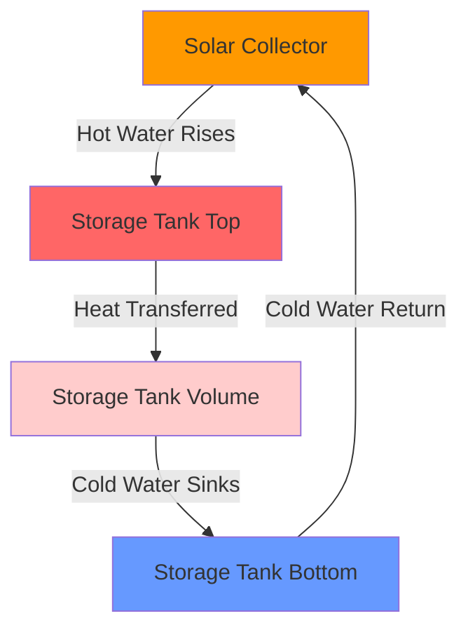
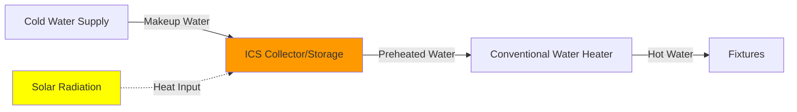

Passive solar water heating systems utilize natural convection and thermosiphon principles to circulate water without mechanical pumps or electronic controls. These systems offer simplicity, reliability, and reduced maintenance compared to active systems, though performance depends heavily on proper installation geometry and climate conditions.

## Thermosiphon System Principles

Thermosiphon systems operate on buoyancy-driven natural circulation created by density differences in heated water. The driving force for flow is governed by the hydrostatic pressure difference between hot and cold water columns.

### Natural Circulation Physics

The circulation rate in a thermosiphon loop depends on the buoyant force:

$$\Delta P = g \cdot H \cdot (\rho_c - \rho_h)$$

where:
- $\Delta P$ = driving pressure difference (Pa)
- $g$ = gravitational acceleration (9.81 m/s²)
- $H$ = vertical height difference between collector and storage (m)
- $\rho_c$ = density of cold water (kg/m³)
- $\rho_h$ = density of hot water (kg/m³)

Water density varies with temperature according to:

$$\rho_T \approx 1000 - 0.2 \cdot (T - 4)$$

At 20°C, $\rho = 998.2$ kg/m³; at 60°C, $\rho = 983.2$ kg/m³. This 15 kg/m³ density difference drives circulation.

The volumetric flow rate achievable depends on balancing buoyant force against friction losses:

$$\dot{V} = \sqrt{\frac{2 \cdot g \cdot H \cdot \Delta\rho}{\rho \cdot (f \cdot L/D + \Sigma K)}}$$

where:
- $\dot{V}$ = volumetric flow rate (m³/s)
- $f$ = friction factor (dimensionless)
- $L/D$ = pipe length-to-diameter ratio
- $\Sigma K$ = sum of minor loss coefficients

### Critical Installation Requirements

**Elevation Differential**: Storage tank bottom must be positioned 0.3-0.6 m (12-24 inches) above the collector top to ensure reliable thermosiphon action. Insufficient elevation creates weak circulation; excessive elevation increases pipe friction losses.

**Piping Geometry**:
- Continuous upward slope from collector outlet to storage inlet (minimum 1:40 rise)
- No horizontal runs or sags that trap air
- Short, direct piping routes minimize friction
- Pipe diameter typically 19-25 mm (3/4-1 inch) for residential systems

**Reverse Thermosiphon Prevention**: During nighttime cooling, reverse circulation can occur if the collector cools below storage temperature. Heat loss from uninsulated piping creates a reverse density gradient. Solutions include:
- Check valves (reduce flow during operation)
- Collector tilt optimization to resist reverse flow
- Insulated piping to minimize nighttime losses

## Integral Collector Storage (ICS) Systems

ICS or "batch" collectors combine the solar absorber and storage tank in a single unit. Water remains in the collector continuously, eliminating circulation requirements but creating freeze vulnerability.

### ICS Design Configurations

**Single Tank Design**: One large cylindrical tank (150-300 L) with selective surface coating, enclosed in an insulated glazed box. Simple but prone to significant nighttime heat loss.

**Multiple Tube Design**: Several parallel tubes (75-100 mm diameter) increase surface area-to-volume ratio, improving collection efficiency by 15-20% compared to single tanks.

The heat gain for an ICS collector follows:

$$Q_u = A_c \cdot F_R \cdot [S - U_L \cdot (T_i - T_a)]$$

where:
- $Q_u$ = useful heat gain (W)
- $A_c$ = collector aperture area (m²)
- $F_R$ = heat removal factor (0.6-0.8 for ICS)
- $S$ = absorbed solar radiation (W/m²)
- $U_L$ = overall loss coefficient (3-5 W/m²·K for ICS)
- $T_i$ = initial water temperature (°C)
- $T_a$ = ambient temperature (°C)

ICS systems have higher loss coefficients than thermosiphon collectors because the storage mass remains in the collector enclosure, exposed to outdoor temperatures. Nighttime heat loss can reach 20-30% of daily gains in cold climates.

### ICS Performance Characteristics

The instantaneous efficiency of ICS collectors decreases with temperature differential:

$$\eta = F_R \cdot \tau\alpha - F_R \cdot U_L \cdot \frac{(T_i - T_a)}{G_T}$$

where:
- $\eta$ = instantaneous efficiency
- $\tau\alpha$ = transmittance-absorptance product (0.7-0.85)
- $G_T$ = incident solar radiation (W/m²)

At $G_T = 800$ W/m² and $(T_i - T_a) = 30$°C, typical ICS efficiency is 40-50%, compared to 60-70% for thermosiphon systems with separate storage.

## System Type Comparison

| Parameter | Thermosiphon | ICS (Batch) |
|-----------|--------------|-------------|
| **Efficiency** | 60-70% | 40-50% |
| **Freeze Protection** | Draining required | Critical vulnerability |
| **Installation Complexity** | Moderate | Simple |
| **Tank Location** | Indoor/protected | Outdoor exposure |
| **Nighttime Heat Loss** | Low (5-10%) | High (20-30%) |
| **Cost** | $2,000-3,500 | $1,500-2,500 |
| **Lifespan** | 20-25 years | 15-20 years |
| **Weight (filled)** | 250-400 kg | 200-350 kg |

## Climate Limitations and Freeze Protection

Passive systems face critical constraints in freezing climates due to the absence of active freeze protection mechanisms.

### Freeze Risk Analysis

Water freezes at 0°C (273.15 K), expanding approximately 9% in volume. This expansion generates pressures exceeding 200 MPa, sufficient to rupture copper tubing and tank walls.

**Critical Temperature Thresholds**:
- **-5°C**: Risk of freeze damage in unprotected collectors
- **-10°C**: High probability of damage without intervention
- **-15°C**: Certain damage to water-filled systems

### Protection Strategies

**Manual Draining**: In mild freeze climates (5-15 freeze days/year), manual draining before freeze events provides adequate protection. Requires:
- Drain valves at all low points
- Air vents at all high points
- User awareness and discipline

**Recirculation Protection**: Some thermosiphon systems employ gravity-driven recirculation from warm storage through collectors during freeze risk, utilizing stored heat for protection. Effective only when storage maintains >15°C and freeze duration <6 hours.

**Freeze-Tolerant Collectors**: Copper fin-tube collectors with expansion compensation can survive occasional freezing, though repeated freeze-thaw cycles degrade performance and lifespan.

## SRCC Certification and Performance

The Solar Rating and Certification Corporation (SRCC) provides standardized testing for passive solar water heaters under OG-300 protocol. SRCC ratings include:

**OG-300 System Rating**: Annual solar fraction and energy delivery based on climate zone, orientation, and typical loads. Provides Solar Energy Factor (SEF) ranging from 0.85-1.8 for passive systems.

**Climate Zones**: SRCC testing covers six climate zones from Miami (hot/humid) to Albuquerque (cold/dry). Passive systems perform optimally in zones 1-3 (minimal freeze risk).

Performance degrades significantly in freeze-prone climates:
- Zone 1-2: 90-100% of rated capacity
- Zone 3-4: 70-80% of rated capacity (seasonal draining reduces availability)
- Zone 5-6: <50% of rated capacity (extended drain periods)

## Optimal Applications

Passive solar water heating systems achieve best performance under specific conditions:

**Geographic Suitability**:
- Latitudes 25-35° with >300 sunny days/year
- Minimal freeze risk (<10 freeze days annually)
- Moderate summer temperatures (<35°C ambient)

**Building Requirements**:
- Unshaded south-facing roof area (northern hemisphere)
- Structural capacity for 300-400 kg concentrated load
- Space for elevated storage tank in thermosiphon systems

**Load Profiles**:
- Consistent daily hot water demand (150-300 L/day)
- Daytime or evening draw patterns (poor morning performance)
- Backup heating acceptance during extended cloudy periods

**Economic Factors**:
- Electricity costs >$0.12/kWh or gas >$1.20/therm
- Available solar incentives or tax credits
- 8-15 year acceptable payback period

Passive systems provide reliable, low-maintenance solar water heating in appropriate climates, leveraging fundamental thermodynamic principles without mechanical complexity. Proper installation geometry and climate matching determine success.
