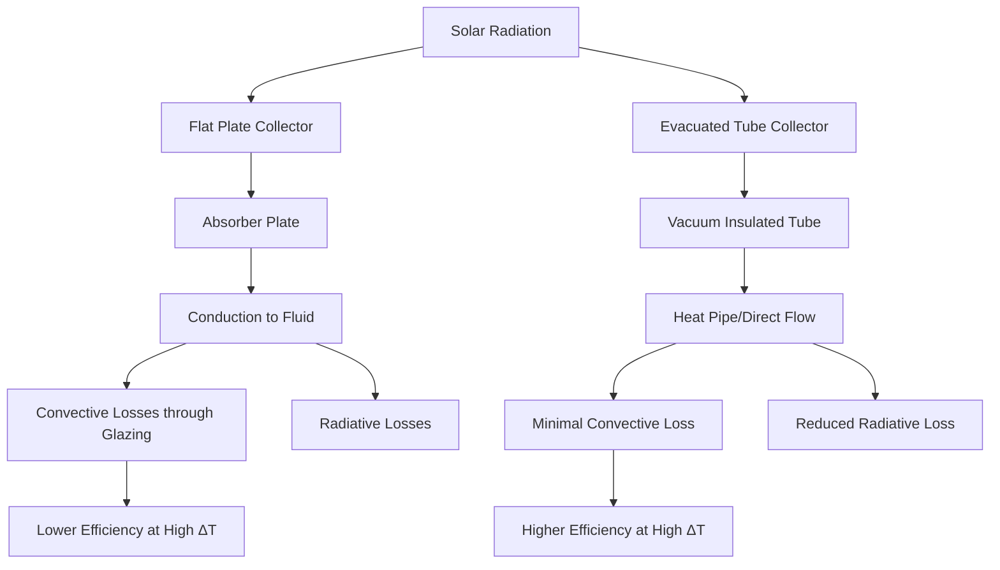

## Construction and Heat Transfer Principles

**Flat plate collectors** consist of a copper absorber plate with integral flow tubes, enclosed in an insulated weatherproof box with a transparent glazing. The absorber features a selective coating (typically black chrome or cermet) with high solar absorptivity (α ≈ 0.95) and low thermal emissivity (ε ≈ 0.10). Heat transfer occurs through three mechanisms:

- Solar radiation absorbed by the selective surface
- Conduction from absorber to fluid through copper tubes
- Convective and radiative losses from the glazing

**Evacuated tube collectors** employ double-wall borosilicate glass tubes with a vacuum between walls (pressure < 10⁻³ Pa). Each tube contains either a direct flow absorber or a heat pipe with phase-change fluid. The vacuum eliminates conductive and convective losses, leaving only radiative losses governed by the Stefan-Boltzmann law:

$$Q_{loss} = \epsilon \sigma A (T_{absorber}^4 - T_{ambient}^4)$$

where $\sigma = 5.67 \times 10^{-8}$ W/(m²·K⁴) is the Stefan-Boltzmann constant.

## Efficiency Characteristics

Collector efficiency follows the modified Hottel-Whillier equation per ASHRAE 93 and SRCC Standard 100:

$$\eta = F_R(\tau\alpha) - F_R U_L \frac{T_{inlet} - T_{ambient}}{G_T}$$

where:
- $F_R$ = heat removal factor (0.85-0.95)
- $(\tau\alpha)$ = transmittance-absorptance product
- $U_L$ = overall heat loss coefficient (W/m²·K)
- $G_T$ = incident solar radiation (W/m²)

| Parameter | Flat Plate | Evacuated Tube |
|-----------|-----------|----------------|
| Zero-loss efficiency $F_R(\tau\alpha)$ | 0.70-0.80 | 0.60-0.70 |
| Loss coefficient $F_R U_L$ | 3.5-5.0 W/(m²·K) | 1.0-2.0 W/(m²·K) |
| Efficiency at ΔT = 50°C | 50-60% | 60-70% |
| Incident angle modifier (45°) | 0.90-0.95 | 0.95-1.00 |

Evacuated tubes exhibit superior performance at elevated temperature differentials due to vacuum insulation. The crossover point occurs at approximately:

$$\Delta T_{crossover} = \frac{(\tau\alpha)_{fp} - (\tau\alpha)_{et}}{(U_L)_{et} - (U_L)_{fp}} \times G_T$$

For typical conditions (1000 W/m² irradiance), this equals 25-35°C temperature rise.

## Cold Climate Performance

Low ambient temperature operation reveals fundamental differences. For flat plate collectors, heat loss increases linearly with temperature differential:

$$Q_{loss,fp} = U_L \times A \times (T_{fluid} - T_{ambient})$$

At -20°C ambient with 60°C fluid temperature, a flat plate experiences 280-400 W/m² loss. Evacuated tubes lose 80-160 W/m², maintaining 60-75% efficiency under identical conditions where flat plates drop to 20-35%.

**Critical considerations for cold climates:**
- Wind speed increases convective losses on flat plates by 15-25%
- Snow accumulation on flat plates requires 30-45° tilt angle
- Evacuated tubes shed snow due to cylindrical geometry and minimal heat loss
- Freeze protection drainback systems favor evacuated tubes in extreme cold

## Stagnation and Overheating Risk

During no-flow conditions, both collector types reach stagnation temperature $T_{stag}$ when losses equal absorption:

$$T_{stag} = T_{ambient} + \frac{G_T \times (\tau\alpha)}{U_L}$$

| Condition | Flat Plate | Evacuated Tube |
|-----------|-----------|----------------|
| Stagnation temperature | 150-180°C | 220-280°C |
| Glycol degradation risk | Moderate | High |
| Steam pressure risk | Low | Significant |
| Thermal shock potential | Minimal | Elevated |

Evacuated tubes present greater overheating challenges due to superior insulation. Mitigation strategies include:

1. **Hydraulic protection**: Drainback systems eliminate fluid exposure to stagnation temperatures
2. **Optical control**: Temperature-sensitive coatings or shutters (rarely practical)
3. **Heat rejection**: Auxiliary cooling loops or night sky radiators
4. **System sizing**: Conservative area-to-load ratio (< 0.02 m²/L daily usage)

## Economic and Durability Comparison

**Installation costs** (2024, per m² aperture area):

| Component | Flat Plate | Evacuated Tube |
|-----------|-----------|----------------|
| Collector hardware | $250-400 | $400-600 |
| Mounting structure | $80-120 | $100-150 |
| Installation labor | $150-200 | $200-280 |
| **Total installed** | **$480-720** | **$700-1030** |

**Service life and maintenance:**

Flat plate collectors offer 20-25 year service life with minimal maintenance beyond periodic glycol testing (3-5 year intervals). Glazing remains intact with proper installation. Selective coating degradation occurs slowly (< 5% efficiency loss per decade).

Evacuated tubes provide 15-20 year service with individual tube replacement capability. Vacuum loss in 1-3% of tubes over 10 years is typical. Barium getter indicators signal vacuum integrity. Heat pipe seals represent the primary failure mode.

**Lifecycle cost analysis** (20-year NPV, 3% discount rate):

For a 4.5 m² residential system delivering 3000 kWh/year:
- Flat plate: $6500 initial + $800 maintenance = $7300 total
- Evacuated tube: $9500 initial + $1200 maintenance = $10,700 total

Evacuated tubes justify their premium in applications requiring:
- High temperature output (> 70°C)
- Cold climate operation (< -10°C design)
- Space-constrained installations (higher output per area)
- Vertical or non-optimal orientations

## Selection Guidelines

**Choose flat plate collectors when:**
- Temperature requirements < 60°C
- Adequate roof area available
- Mild climate (winter design > 0°C)
- Budget constraints exist
- Long-term reliability prioritized

**Choose evacuated tube collectors when:**
- High temperature applications (70-90°C)
- Cold climate with frequent subzero temperatures
- Limited installation area
- Non-optimal orientation (< 30° tilt, east/west facing)
- Space heating integration required

The optimal selection balances initial investment against the delivered energy increase from superior efficiency. For most domestic hot water applications in temperate climates, flat plate collectors provide superior value. Cold climate and high-temperature applications favor evacuated tubes despite higher cost.
