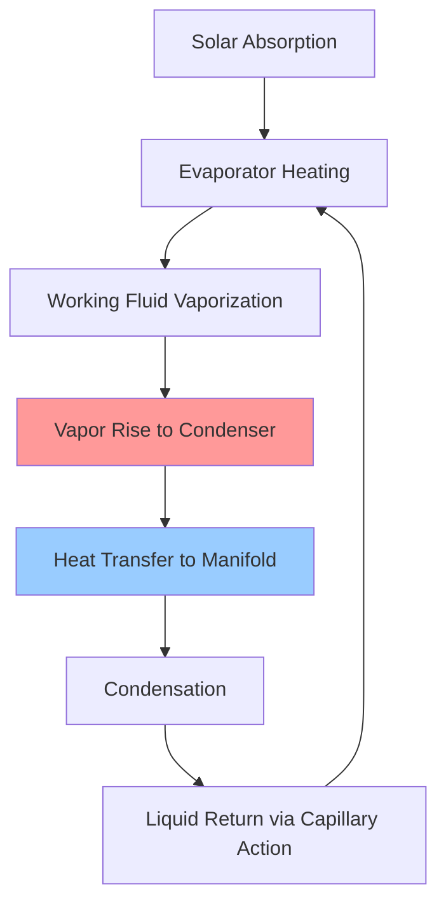

Evacuated tube collectors provide performance advantages over flat plate designs through vacuum insulation, advanced heat transfer mechanisms, and geometric optimization. The technology excels in cold climates, cloudy conditions, and high-temperature applications.

## Vacuum Insulation Physics

The vacuum envelope surrounding the absorber eliminates conductive and convective heat losses, leaving only radiative losses governed by the Stefan-Boltzmann law.

### Heat Loss Mechanisms

Heat loss from the absorber surface follows:

$$Q_{loss} = A \cdot U_L \cdot (T_{absorber} - T_{ambient})$$

where the overall heat loss coefficient $U_L$ for evacuated tubes ranges from 0.5-1.5 W/m²·K compared to 4-8 W/m²·K for flat plates. The vacuum pressure maintained at $10^{-5}$ to $10^{-6}$ torr eliminates molecular collisions that would otherwise conduct heat.

### Radiative Loss Reduction

Selective coatings minimize radiative losses through high absorptance ($\alpha = 0.92-0.96$) in the solar spectrum and low emittance ($\epsilon = 0.04-0.08$) in the thermal infrared region. Net radiative exchange becomes:

$$Q_{rad} = A \cdot \sigma \cdot \epsilon \cdot (T_{absorber}^4 - T_{sky}^4)$$

where $\sigma = 5.67 \times 10^{-8}$ W/m²·K⁴. The fourth-power relationship means radiative losses only dominate at temperatures exceeding 150°C.

## Heat Pipe Technology

Heat pipes provide passive, one-way heat transfer with effective thermal conductivity 100-1000 times higher than solid copper.

### Heat Pipe Operation

The heat pipe cycle involves phase change heat transfer with latent heat providing the dominant transport mechanism:

$$Q_{pipe} = \dot{m} \cdot h_{fg}$$

where $h_{fg}$ for typical working fluids (water, methanol, acetone) ranges from 200-2400 kJ/kg. This massive energy density enables compact heat transport with minimal temperature gradient.

### Freeze Protection

Heat pipes provide inherent freeze protection. When temperatures drop below the working fluid freezing point, the pipe becomes inactive but undamaged. Operation resumes automatically upon warming, unlike flat plate collectors that require antifreeze solutions reducing heat capacity by 15-20%.

## Cold Climate Performance

Evacuated tubes maintain efficiency at low ambient temperatures and high wind speeds due to vacuum insulation.

### Performance Comparison

| Operating Condition | Evacuated Tube η | Flat Plate η | Advantage |
|---------------------|------------------|--------------|-----------|
| Sunny, -20°C, calm | 0.65-0.72 | 0.35-0.45 | +55% |
| Cloudy, 0°C, 20 mph wind | 0.45-0.55 | 0.15-0.25 | +80% |
| Sunny, 20°C, calm | 0.70-0.75 | 0.65-0.72 | +8% |

The efficiency advantage increases as the temperature differential $(T_{collector} - T_{ambient})$ grows.

### Efficiency Equation

SRCC testing quantifies performance through the efficiency equation:

$$\eta = F_R(\tau\alpha) - F_R U_L \frac{(T_{in} - T_{ambient})}{I}$$

For evacuated tubes, the intercept efficiency $F_R(\tau\alpha)$ ranges from 0.65-0.75, while the heat loss coefficient $F_R U_L$ remains 0.5-1.5 W/m²·K. Flat plates typically show $F_R(\tau\alpha) = 0.70-0.80$ but $F_R U_L = 3.5-5.5$ W/m²·K.

## High Temperature Capability

Vacuum insulation enables stagnation temperatures exceeding 200°C, supporting high-temperature applications.

### Temperature Potential

Maximum achievable temperature occurs when heat loss equals solar gain:

$$I \cdot A \cdot \eta_{optical} = A \cdot \sigma \cdot \epsilon \cdot (T_{max}^4 - T_{ambient}^4)$$

Solving for maximum temperature:

$$T_{max} = \left(\frac{I \cdot \eta_{optical}}{\sigma \cdot \epsilon} + T_{ambient}^4\right)^{0.25}$$

At 1000 W/m² insolation with $\eta_{optical} = 0.90$ and $\epsilon = 0.06$, maximum temperature reaches 260°C for evacuated tubes versus 140°C for flat plates.

### Application Temperature Ranges

| Application | Required Temp | Collector Type |
|-------------|--------------|----------------|
| Domestic hot water | 50-60°C | Both suitable |
| Space heating | 40-80°C | Both suitable |
| Absorption cooling | 80-120°C | Evacuated tube preferred |
| Process heating | 100-150°C | Evacuated tube required |
| Steam generation | 150-200°C | Evacuated tube only |

## Diffuse Radiation Performance

The cylindrical geometry captures diffuse radiation from all directions, improving cloudy-day performance.

### Incidence Angle Effects

Evacuated tubes maintain near-constant projected area for solar angles varying ±30° from perpendicular due to their circular cross-section. The incidence angle modifier remains:

$$K_{\theta} = 1 - b_0 \left(\frac{1}{\cos\theta} - 1\right)$$

with $b_0 = 0.05-0.10$ for evacuated tubes versus $b_0 = 0.10-0.20$ for flat plates. This reduces morning and evening performance losses by 30-40%.

## Modular Replacement

Individual tube failure requires replacing only the damaged component rather than the entire collector array.

### Maintenance Economics

- Single tube cost: $30-80
- Replacement time: 15-30 minutes
- No system draining required
- Minimal performance loss (1-2% per failed tube)

Compare to flat plate repair requiring panel removal, fluid draining, and potential absorber replacement costing $500-2000.

## SRCC Certification

The Solar Rating and Certification Corporation tests evacuated tube collectors per OG-100 standards using the ASHRAE 93 methodology. Ratings specify:

- Daily energy output (MJ/day) at multiple temperature differentials
- Efficiency curve parameters validated through outdoor testing
- Stagnation temperature and pressure drop characteristics
- Durability through thermal shock and impact testing

Higher-rated systems demonstrate $F_R(\tau\alpha) > 0.70$ and $F_R U_L < 1.2$ W/m²·K with proven performance across climate zones.

## Wind Load Considerations

The cylindrical profile presents lower aerodynamic drag than flat panels:

$$F_{wind} = C_d \cdot \frac{1}{2} \rho v^2 \cdot A_{projected}$$

where drag coefficient $C_d = 0.4-0.6$ for evacuated tubes versus $C_d = 1.2-1.5$ for flat plates. At 100 mph wind velocity, forces reduce by 50-60%, enabling lighter mounting structures.

## System Design Implications

Evacuated tube advantages influence system architecture:

- **Cold climates**: Eliminate glycol antifreeze, use drainback or heat pipe designs
- **High temperature loads**: Direct integration with absorption chillers and process heating
- **Cloudy regions**: Higher annual energy yield despite lower clear-sky peak output
- **Aesthetic integration**: Tubular form factor offers architectural flexibility
- **Space constraints**: Higher efficiency per unit area reduces collector footprint by 20-30%

The performance premium justifies 30-50% higher initial costs in applications requiring cold weather operation, high temperatures, or maximum energy density.
