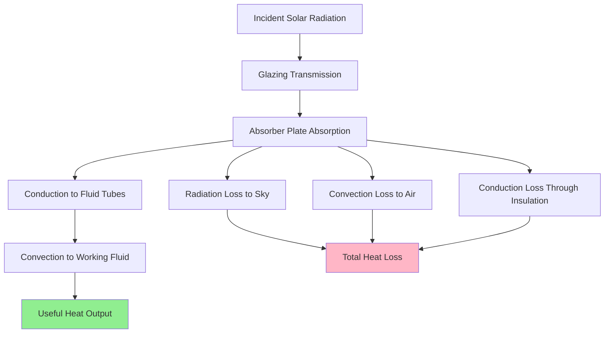

Flat plate solar collectors represent the most established and widely deployed technology for residential and commercial solar water heating systems. Their mature design combines proven thermodynamic principles with robust construction methods, delivering reliable performance across diverse climate zones while maintaining favorable economic characteristics.

## Fundamental Construction Principles

The flat plate collector converts solar radiation into thermal energy through a straightforward heat transfer mechanism. The absorber plate—typically constructed from copper, aluminum, or steel—receives incident solar radiation and converts it to heat. This thermal energy transfers to the working fluid flowing through integral or attached tubing.

The energy balance governing collector performance is expressed as:

$$Q_u = A_c F_R [G_T (\tau\alpha) - U_L(T_{f,i} - T_a)]$$

Where:
- $Q_u$ = useful energy gain (W)
- $A_c$ = collector gross area (m²)
- $F_R$ = collector heat removal factor (dimensionless)
- $G_T$ = total solar irradiance (W/m²)
- $(\tau\alpha)$ = transmittance-absorptance product (dimensionless)
- $U_L$ = overall heat loss coefficient (W/m²·K)
- $T_{f,i}$ = inlet fluid temperature (°C)
- $T_a$ = ambient temperature (°C)

This equation reveals the fundamental advantage of flat plate collectors: optimized performance when the temperature differential $(T_{f,i} - T_a)$ remains moderate, precisely matching domestic hot water requirements.

## Primary Performance Advantages

### Superior Cost-Effectiveness

Flat plate collectors deliver the lowest installed cost per unit of aperture area among solar thermal technologies. Manufacturing processes leverage established metal forming, welding, and glazing techniques without requiring specialized vacuum equipment or exotic materials.

SRCC-certified flat plate collectors typically achieve installed costs 30-50% lower than evacuated tube alternatives while delivering comparable annual energy production in moderate climates. The economic advantage stems from simplified construction and higher production volumes driving economies of scale.

### Robust Mechanical Durability

The rigid aluminum or steel frame provides exceptional structural strength with minimal deflection under snow and wind loading. Glazing materials—either tempered glass or polycarbonate—withstand impact from hail and debris far better than evacuated tube assemblies.

Field reliability data from SRCC OG-100 certified systems demonstrates flat plate collectors maintaining 95%+ performance after 20 years when properly maintained. The monolithic absorber plate construction eliminates individual tube failure modes present in evacuated tube designs.

### Optimal Performance in Moderate Climates

When ambient temperatures exceed 0°C and solar radiation remains relatively constant, flat plate collectors achieve peak efficiency. The heat loss coefficient $U_L$ (typically 4-6 W/m²·K for quality units) becomes less significant when temperature differentials remain below 40-50 K.

## Construction Components and Materials

### Absorber Plate Design

High-performance flat plate absorbers utilize selective surface coatings that maximize solar absorptance $\alpha$ (typically 0.94-0.96) while minimizing thermal emittance $\varepsilon$ (typically 0.04-0.10). This selectivity ratio $\alpha/\varepsilon > 10$ significantly reduces radiative heat loss:

$$Q_{rad} = \varepsilon \sigma A (T_p^4 - T_{sky}^4)$$

Where $\sigma$ = Stefan-Boltzmann constant (5.67×10⁻⁸ W/m²·K⁴) and $T_p$ = absorber plate temperature.

Common selective coatings include:
- Black chrome (electroplated)
- Black nickel (electroplated)
- Titanium oxynitride (PVD)
- Cermet coatings (aluminum nitride in aluminum oxide matrix)

### Glazing Options and Performance

| Glazing Type | Solar Transmittance | Thermal Performance | Durability Rating | Cost Factor |
|--------------|---------------------|---------------------|-------------------|-------------|
| Low-iron tempered glass | 0.90-0.92 | Excellent | 25+ years | 1.0× |
| Standard tempered glass | 0.85-0.87 | Very good | 25+ years | 0.8× |
| Polycarbonate twin-wall | 0.80-0.82 | Good | 10-15 years | 0.6× |
| Acrylic single-sheet | 0.88-0.90 | Fair | 8-12 years | 0.5× |

Low-iron tempered glass delivers optimal long-term performance through superior transmittance and weather resistance. The 3-4 mm thickness provides adequate strength while minimizing absorption losses.

### Insulation and Enclosure

Back insulation thickness critically affects heat loss through the collector rear surface. Quality designs incorporate 50-75 mm of mineral wool, fiberglass, or polyisocyanurate foam, achieving thermal resistance values R = 2.0-3.5 m²·K/W.

Edge insulation prevents thermal bridging through the frame and seals. The enclosure must accommodate thermal expansion while maintaining weathertight integrity across temperature swings from -40°C to +150°C.

## Installation and Maintenance Advantages

### Simplified Mounting Requirements

The flat, rectangular form factor integrates readily with standard roofing profiles. Mounting hardware attaches through conventional lag bolts or structural screws without specialized penetrations. The distributed load pattern (typically 25-35 kg/m²) accommodates most residential roof structures without reinforcement.

### Reduced Maintenance Requirements

The sealed enclosure design protects internal components from moisture intrusion and debris accumulation. Unlike evacuated tubes requiring individual seal integrity, flat plate collectors need only periodic glazing inspection and cleaning.

SRCC guidelines recommend:
- Glazing cleaning: annually or semi-annually
- Fluid system inspection: 3-5 year intervals
- Pressure testing: 5-year intervals
- Selective coating inspection: visual check during cleaning

### System Integration Compatibility

Flat plate collectors interface directly with standard hydronic components including pumps, heat exchangers, expansion tanks, and controllers. The large fluid passage volumes (typically 1-2 liters per collector) tolerate higher particulate levels and resist freezing blockage better than small-diameter tube designs.

## Performance Comparison Under Standard Conditions

SRCC OG-100 testing establishes performance metrics under controlled conditions. Representative certified flat plate collectors demonstrate:

| Parameter | Typical Range | Units |
|-----------|---------------|-------|
| Peak efficiency $\eta_0$ | 0.72-0.78 | Dimensionless |
| Heat loss coefficient $a_1$ | 3.5-5.5 | W/m²·K |
| Temperature dependence $a_2$ | 0.010-0.018 | W/m²·K² |
| Incident angle modifier 50° | 0.92-0.96 | Dimensionless |
| Stagnation temperature | 160-190 | °C |

The efficiency curve follows:

$$\eta = \eta_0 - a_1 \frac{(T_m - T_a)}{G_T} - a_2 \frac{(T_m - T_a)^2}{G_T}$$

Where $T_m$ = mean fluid temperature and the second-order term $a_2$ accounts for temperature-dependent heat loss at elevated temperatures.

## Economic and Environmental Benefits

Life-cycle cost analysis consistently favors flat plate collectors for domestic hot water applications in climate zones with moderate winter temperatures (ASHRAE zones 3-5). The combination of lower capital costs, minimal maintenance requirements, and 20-25 year service life yields payback periods of 6-12 years against conventional electric or gas water heating.

The embodied energy in flat plate manufacturing—primarily aluminum extrusion and glass production—returns through displaced fossil fuel consumption within 1-3 years of operation, establishing a favorable energy payback ratio exceeding 10:1 over the system lifetime.

## Application Recommendations

Flat plate collectors provide optimal performance for:
- Residential domestic hot water (DHW) systems
- Commercial DHW preheating
- Pool heating applications
- Space heating systems with moderate supply temperatures (<60°C)
- Solar combisystems in mild to moderate climates

Selection criteria favoring flat plate technology include ambient winter temperatures >-15°C, adequate roof-mounting area, and emphasis on system longevity and low maintenance over maximum efficiency.

SRCC certification ensures performance verification and durability testing under OG-100 standards, providing specifiers with reliable comparative data for system design and selection decisions.
