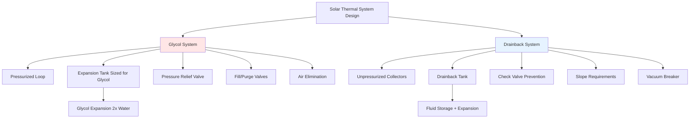

Solar water heating systems operating in freezing climates require reliable freeze protection. The two dominant approaches—pressurized glycol systems and drainback systems—represent fundamentally different engineering philosophies with distinct performance characteristics, maintenance demands, and failure modes.

## Freeze Protection Mechanisms

### Glycol Systems: Chemical Depression of Freezing Point

Glycol-based systems use propylene glycol (preferred for potable applications) or ethylene glycol mixed with water to lower the freezing point of the heat transfer fluid. The freezing point depression follows colligative properties, where the presence of glycol molecules disrupts ice crystal formation.

The freezing point of glycol-water solutions is non-linear with concentration:

$$T_f = T_{water} - K_f \cdot m \cdot i$$

where $T_f$ is the freezing point, $K_f$ is the cryoscopic constant, $m$ is molality, and $i$ is the van't Hoff factor. For practical applications, manufacturers provide freezing point curves showing that 50% propylene glycol protects to approximately -26°F (-32°C).

The system operates continuously pressurized, maintaining fluid in collectors regardless of operating conditions.

### Drainback Systems: Gravity-Driven Fluid Removal

Drainback systems eliminate freeze risk by physically removing fluid from exposed components when the circulation pump stops. When the differential controller de-energizes the pump, gravity drains all fluid from collectors and exposed piping into a protected drainback tank located in conditioned space.

The draining process requires:

1. Proper pitch (minimum 1/4 inch per foot, 2% slope) in all horizontal runs
2. No traps or low points that could retain fluid
3. Air entry path to prevent siphon formation
4. Adequate drainback tank volume for all drained fluid plus expansion reserve

Drainback systems operate unpressurized during off-cycles, with air occupying the collectors.

## Heat Transfer Performance Analysis

### Thermal Conductivity and Specific Heat Impact

Glycol addition significantly affects heat transfer properties. The thermal conductivity of propylene glycol solutions decreases with concentration:

| Concentration | Thermal Conductivity | Specific Heat | Density |
|---------------|---------------------|---------------|---------|
| 0% (water) | 0.361 Btu/(hr·ft·°F) | 1.00 Btu/(lb·°F) | 62.4 lb/ft³ |
| 30% glycol | 0.325 Btu/(hr·ft·°F) | 0.95 Btu/(lb·°F) | 64.1 lb/ft³ |
| 50% glycol | 0.283 Btu/(hr·ft·°F) | 0.88 Btu/(lb·°F) | 65.2 lb/ft³ |

The heat transfer rate through the collector absorber to fluid follows:

$$Q = \frac{UA\Delta T_{lm}}{1 + \frac{UA}{mc_p}}$$

The reduced specific heat ($c_p$) of glycol solutions requires higher flow rates to transfer equivalent energy, increasing pumping power requirements by 15-25% for 50% glycol solutions.

### Convective Heat Transfer Coefficients

The convective heat transfer coefficient in collector risers depends on fluid properties:

$$h = \frac{k \cdot Nu}{D}$$

where Nusselt number $Nu$ relates to Reynolds and Prandtl numbers. Glycol solutions exhibit higher viscosity (approximately 3× higher at 50% concentration), reducing Reynolds number and convective performance by 8-12% compared to water.

Drainback systems using water achieve superior heat transfer coefficients but must overcome the thermal inertia of refilling cold collectors during startup.

## System Complexity Comparison

### Glycol System Components

**Expansion tank sizing:** Glycol exhibits greater thermal expansion than water. The coefficient of volumetric expansion for 50% propylene glycol is approximately 0.00055 per °F compared to 0.00012 for water at 100°F. Required expansion tank volume:

$$V_{exp} = \frac{V_s \cdot \beta \cdot \Delta T}{1 - \frac{P_i}{P_f}}$$

where $V_s$ is system volume, $\beta$ is expansion coefficient, $\Delta T$ is temperature rise, $P_i$ is initial pressure, and $P_f$ is final pressure.

**Pressure relief:** Systems require 30 psi relief valves per SRCC standards, protecting against stagnation temperatures exceeding 400°F in high-performance evacuated tube collectors.

### Drainback System Requirements

**Drainback tank sizing:** The tank must accommodate:

$$V_{tank} = V_{collectors} + V_{piping} + V_{expansion} + V_{reserve}$$

Typical minimum reserve is 10% of drained volume. For a system with 2 gallons in collectors and 1 gallon in supply/return piping, minimum tank volume is 3.3 gallons.

**Pump sizing:** Pumps must overcome static head to lift fluid to collectors plus friction losses. Head requirement:

$$H_{total} = H_{static} + H_{friction} + H_{HX}$$

where $H_{static}$ equals the vertical distance from drainback tank to the highest collector point. This imposes a practical limit of approximately 25-30 feet for residential systems using standard circulators.

## Maintenance Requirements

| Aspect | Glycol System | Drainback System |
|--------|---------------|------------------|
| Fluid replacement | Every 3-5 years | None (uses water) |
| pH monitoring | Required annually | Not required |
| Freeze protection verification | Refractometer testing | Visual inspection of slopes |
| System complexity | Higher component count | Simpler loop design |
| Leak consequences | Glycol contamination | Water damage only |
| Stagnation handling | Degradation above 300°F | No fluid degradation |
| Air purging | Critical for performance | Air naturally present |

### Glycol Degradation Mechanisms

Glycol degrades through thermal and oxidative pathways. Stagnation temperatures above 300°F accelerate breakdown, producing organic acids that lower pH and promote corrosion. The degradation rate follows Arrhenius kinetics:

$$k = A \cdot e^{-\frac{E_a}{RT}}$$

where elevated temperatures exponentially increase degradation rate constant $k$. Annual pH testing (target pH 8.5-10.5) and visual inspection for discoloration indicate degradation requiring fluid replacement.

### Drainback System Longevity

Water-based drainback systems avoid chemical degradation but require attention to:

- **Air binding:** Improper pipe sizing or slope can trap air pockets preventing complete filling
- **Mineral buildup:** Hard water may deposit scale in heat exchangers; water softening or distilled water use prevents this
- **Pump wear:** Repeated start-stop cycling and higher head requirements may reduce pump life compared to glycol systems

## Selection Criteria

**Choose glycol systems when:**

- Roof pitch prevents adequate drainage slope
- Multiple elevation changes create potential traps
- Installer experience with drainback is limited
- System integration into existing pressurized loops

**Choose drainback systems when:**

- Collector location permits straight pipe runs with consistent slope
- Long-term maintenance cost minimization is priority
- Maximum heat transfer efficiency is required
- Avoiding chemical additives is preferred

Both approaches provide reliable freeze protection when properly designed and installed per SRCC Standard 100 and local plumbing codes. The selection involves balancing first cost, maintenance requirements, and site-specific installation constraints.
