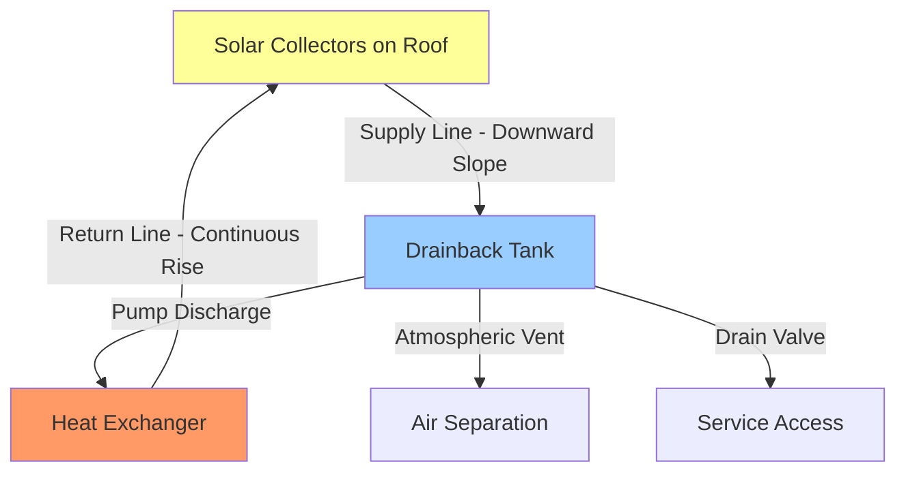
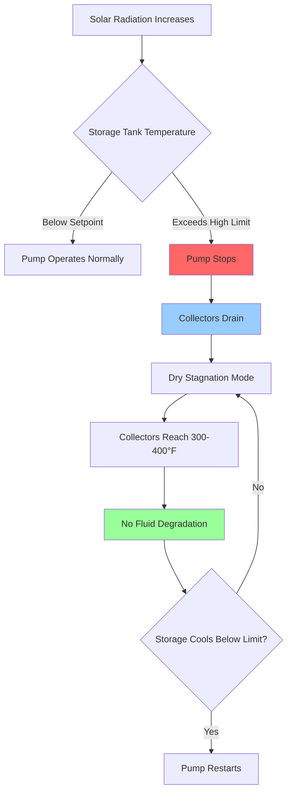

Drainback solar water heating systems represent an elegantly simple approach to freeze and overheat protection through gravity drainage. When the circulation pump stops, the fluid drains completely from the collectors and exposed piping into a protected reservoir, eliminating the need for antifreeze solutions.

## Operating Principle

The drainback system relies on fundamental gravitational physics. During operation, the pump lifts water from the drainback tank through the collectors and back to storage. When conditions become unfavorable (freezing temperatures, excessive heat, or loss of power), the pump stops and gravity pulls all fluid back to the protected reservoir.

### Gravity Drainage Physics

Complete drainage depends on overcoming surface tension and establishing a continuous drainage path. The drainback velocity follows free-fall physics modified by pipe friction:

$$v_{drain} = \sqrt{2gh - f\frac{L}{D}\frac{v^2}{2}}$$

Where:
- $v_{drain}$ = drainage velocity (ft/s)
- $g$ = gravitational acceleration (32.2 ft/s²)
- $h$ = vertical drop (ft)
- $f$ = Darcy friction factor (dimensionless)
- $L$ = pipe length (ft)
- $D$ = pipe diameter (ft)

The drainage time must be sufficiently rapid to prevent freezing during cold weather stagnation:

$$t_{drain} = \frac{V_{sys}}{Q_{drain}} = \frac{V_{sys}}{A_{pipe} \cdot v_{drain}}$$

Where $V_{sys}$ is the total system fluid volume and $A_{pipe}$ is the pipe cross-sectional area.

## Drainback Tank Design

The drainback tank serves multiple critical functions: fluid storage during drainage, air separation during operation, and thermal expansion accommodation.

### Tank Sizing Requirements

The minimum tank volume must accommodate all fluid from collectors, piping, and heat exchanger:

$$V_{tank,min} = V_{collectors} + V_{piping} + V_{HX} + V_{expansion}$$

SRCC standards recommend adding 25-30% safety margin for complete drainage assurance and thermal expansion. A typical residential system requires:

| Component | Volume Range |
|-----------|-------------|
| Flat plate collectors (per panel) | 0.8-1.2 gallons |
| Evacuated tube collectors (per panel) | 0.3-0.5 gallons |
| Piping (per 100 ft of 3/4" copper) | 2.3 gallons |
| Heat exchanger | 0.5-2.0 gallons |
| Expansion allowance | 20-30% of total |

### Tank Location and Configuration

The drainback tank must be positioned below the lowest collector point with adequate clearance for air separation. The tank operates at atmospheric pressure, simplifying construction but requiring careful venting:

## Piping Slope Requirements

Proper piping slope is absolutely critical for reliable drainback operation. Inadequate slope creates fluid traps that prevent complete drainage.

### Minimum Slope Standards

All piping from the collector outlet to the drainback tank must maintain continuous downward slope:

- **Minimum slope**: 1/4 inch per foot (2% grade)
- **Recommended slope**: 1/2 inch per foot (4% grade)
- **No horizontal runs**: Even small dips create drainage barriers

The return line from the heat exchanger to collectors must slope continuously upward to prevent air pockets during pump operation. This creates a natural "U-trap" configuration with the drainback tank at the bottom.

### Piping Material Considerations

Drainback systems experience alternating wet/dry cycles and must accommodate air/water interfaces:

| Material | Suitability | Notes |
|----------|-------------|-------|
| Copper (Type L/M) | Excellent | Standard choice, sized for both liquid and drainage flow |
| Stainless steel | Excellent | Corrosion-resistant, higher cost |
| CPVC | Poor | Not rated for solar temperatures |
| PEX | Conditional | Only in protected sections below 180°F |

Pipe diameter must be adequate for both pumped flow and drainage. Undersized piping restricts drainage velocity and can trap fluid:

$$D_{min} = \sqrt{\frac{4Q}{\pi v_{max}}}$$

For drainage flows, $v_{max}$ should not exceed 8 ft/s to prevent noise and erosion.

## Freeze Protection Mechanism

The drainback system provides inherent freeze protection through complete fluid removal from exposed components.

### Drainage Initiation

The differential controller stops the pump when:

$$T_{collector} - T_{storage} < \Delta T_{off}$$

Where $\Delta T_{off}$ typically equals 3-5°F. During freezing conditions, the controller prevents pump operation entirely when collector temperature drops below a freeze threshold (typically 40°F).

### Critical Freeze Protection Points

1. **Complete collector drainage**: No fluid remnants in absorber tubes
2. **Exposed piping drainage**: All outdoor piping must drain to tank
3. **Valve positioning**: All valves must allow free drainage path
4. **Air entry**: Adequate venting to break vacuum and enable drainage

The freeze damage threshold occurs when residual water volume exceeds approximately 10% and temperatures fall below 25°F for extended periods.

## Overheat Protection

Drainback systems provide superior stagnation temperature control compared to pressurized glycol systems.

### Stagnation Temperature Limits

During stagnation (pump off, no heat removal), collector temperatures rise according to:

$$T_{stag} = T_{ambient} + \frac{\alpha \tau I}{U_L}$$

Where:
- $\alpha$ = absorber absorptance (typically 0.95)
- $\tau$ = glazing transmittance (typically 0.90)
- $I$ = solar irradiance (Btu/hr·ft²)
- $U_L$ = heat loss coefficient (Btu/hr·ft²·°F)

Dry stagnation temperatures reach 300-400°F in flat plate collectors and 500-600°F in evacuated tubes. The drainback tank remains at moderate temperature (120-160°F) since no fluid circulates.

### Overheat Protection Features

The absence of fluid during stagnation prevents:
- Glycol degradation and acidification
- Excessive pressure buildup
- Fluid vaporization
- Heat exchanger thermal stress

## Pump Sizing and Selection

Drainback pumps must overcome static lift plus system friction during startup and maintain adequate flow during operation.

### Pump Head Requirements

Total pump head includes:

$$H_{total} = H_{static} + H_{friction} + H_{fill}$$

Where:
- $H_{static}$ = vertical lift from tank to collector top (ft)
- $H_{friction}$ = pipe friction losses at design flow (ft)
- $H_{fill}$ = additional head to fill collector void (typically 5-8 ft)

The fill head requirement is unique to drainback systems. During startup, the pump must push water up into dry collectors, displacing air downward through the return line. This creates temporary resistance until collectors fill completely.

### Flow Rate Determination

Design flow rate follows SRCC recommendations:

$$\dot{m} = 0.015 \times A_{collector} \text{ to } 0.025 \times A_{collector}$$

In GPM per square foot of collector area. Lower flow rates (0.015 GPM/ft²) provide higher temperature rise but risk incomplete collector wetting. Higher flow rates (0.025 GPM/ft²) ensure complete wetting but reduce temperature differential.

## System Performance Optimization

Drainback systems achieve optimal performance through careful attention to hydraulic design and control strategies.

### Pump Speed Control

Variable-speed pumps optimize energy collection by modulating flow based on:

$$\dot{Q}_{useful} = \dot{m} c_p (T_{out} - T_{in}) - P_{pump}$$

The optimal flow rate maximizes net energy delivery, accounting for parasitic pump consumption. During high-radiation conditions, increased flow captures more energy. During marginal conditions, reduced flow minimizes pumping penalties.

### Air Management

Proper air handling is critical for reliable operation. The system must:

1. **Allow air exit during filling**: Automatic air vents at high points
2. **Prevent air entrainment**: Adequate drainback tank baffling
3. **Separate air during operation**: Tank design promotes air-water separation
4. **Enable drainage airflow**: Vent sizing for drainage air displacement

The air vent capacity must accommodate filling flow plus drainage return air:

$$Q_{air,vent} = Q_{fill} + Q_{drain,air}$$

## Advantages Over Glycol Systems

Drainback systems offer several operational benefits:

| Feature | Drainback | Glycol |
|---------|-----------|--------|
| Freeze protection | Automatic, permanent | Requires glycol maintenance |
| Overheat protection | Inherent | Requires pressure relief |
| Heat transfer fluid | Pure water (optimal) | Glycol (reduced performance) |
| Maintenance | Minimal | Annual glycol testing required |
| Stagnation tolerance | Excellent | Risk of glycol degradation |
| System pressure | Atmospheric in tank | Pressurized throughout |

### Efficiency Advantage

Water provides superior heat transfer compared to glycol solutions:

$$\frac{Q_{water}}{Q_{glycol}} = \frac{(c_p)_{water}}{(c_p)_{glycol}} \approx 1.15$$

This 15% improvement in heat capacity translates directly to higher system efficiency for equivalent flow rates.

## Installation Considerations

Successful drainback installation requires attention to several critical details:

1. **Verify continuous slope**: Use levels and slope indicators throughout
2. **Minimize piping length**: Shorter runs reduce fill volume and drainage time
3. **Eliminate sags**: Any low point creates potential trap
4. **Proper tank venting**: Atmospheric vent prevents vacuum formation
5. **Adequate pump sizing**: Must overcome lift plus fill resistance
6. **Air vent placement**: Strategic location at system high points

SRCC-certified drainback systems provide tested performance data and installation guidelines validated through laboratory and field testing. OG-100 certification confirms thermal performance ratings while OG-300 certification validates complete system design including drainback functionality.

## Conclusion

Drainback solar water heating systems provide reliable, low-maintenance operation through elegant application of gravitational physics. Proper design ensures complete drainage for freeze protection while pure water operation maximizes heat transfer efficiency. The system's inherent overheat protection and atmospheric pressure operation contribute to long service life with minimal maintenance requirements.
