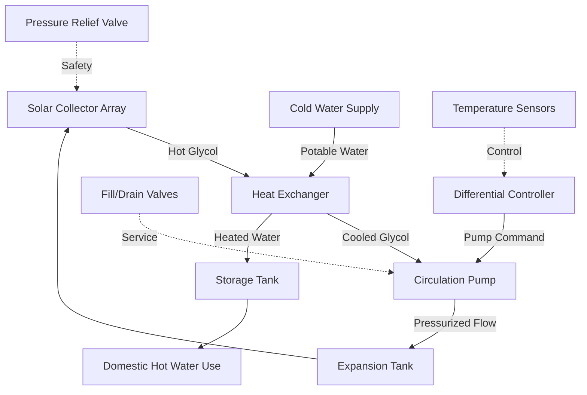

Glycol-based solar water heating systems employ antifreeze solutions to provide freeze protection in climates where ambient temperatures drop below 32°F (0°C). These closed-loop pressurized systems circulate propylene glycol mixtures through the solar collector array, transferring thermal energy to potable water through a heat exchanger. Understanding the thermophysical properties, system behavior, and maintenance requirements is essential for reliable operation.

## Propylene Glycol Properties and Selection

### Freeze Point Depression

Glycol solutions depress the freezing point through colligative properties, where dissolved molecules disrupt ice crystal formation. The relationship between glycol concentration and freeze protection follows:

$$\Delta T_f = K_f \cdot m$$

Where $\Delta T_f$ is the freezing point depression (°F or °C), $K_f$ is the cryoscopic constant for water (1.86 °C·kg/mol), and $m$ is the molality of the solution.

For practical applications, propylene glycol concentration determines freeze protection levels:

| Glycol Concentration | Freeze Point | Burst Protection | Application |
|---------------------|--------------|------------------|-------------|
| 30% by volume | +10°F (-12°C) | -20°F (-29°C) | Mild climates |
| 40% by volume | -10°F (-23°C) | -40°F (-40°C) | Moderate climates |
| 50% by volume | -26°F (-32°C) | -60°F (-51°C) | Cold climates |
| 60% by volume | -50°F (-46°C) | -75°F (-59°C) | Extreme cold |

ASHRAE Standard 90.1 recommends designing for the 99.6% winter design temperature with a 10°F (5.6°C) safety margin.

### Thermophysical Property Changes

Glycol addition significantly alters fluid properties, directly impacting system performance:

**Specific Heat Capacity Reduction:**

The mixture specific heat follows a mass-weighted relationship:

$$c_{p,mix} = x_{glycol} \cdot c_{p,glycol} + (1 - x_{glycol}) \cdot c_{p,water}$$

At 50% concentration and 120°F (49°C):
- Pure water: $c_p = 1.0$ Btu/lb·°F (4.19 kJ/kg·K)
- 50% glycol: $c_p = 0.90$ Btu/lb·°F (3.77 kJ/kg·K)

This 10% reduction in heat capacity requires proportionally higher flow rates to transfer equivalent thermal energy:

$$\dot{m}_{glycol} = \dot{m}_{water} \cdot \frac{c_{p,water}}{c_{p,glycol}}$$

**Viscosity Increase:**

Dynamic viscosity increases exponentially with glycol concentration, directly affecting pumping power:

$$\eta_{mix} = \eta_{water} \cdot e^{(a \cdot x_{glycol} + b \cdot x_{glycol}^2)}$$

At 100°F (38°C), 50% propylene glycol exhibits viscosity approximately 3.5 times that of water, increasing pressure drop and pumping energy.

**Thermal Conductivity Degradation:**

Glycol solutions have lower thermal conductivity than water:

$$k_{mix} \approx k_{water} \cdot (1 - 0.25 \cdot x_{glycol})$$

This reduces heat transfer effectiveness in both collectors and heat exchangers.

## System Architecture and Components

### Critical Components

**Heat Exchanger Requirements:**

The heat exchanger introduces thermal resistance between collector fluid and potable water, reducing overall efficiency:

$$\eta_{system} = \eta_{collector} \cdot \epsilon_{HX}$$

Where $\epsilon_{HX}$ is the heat exchanger effectiveness, typically 0.80-0.90 for properly sized units.

Heat exchanger effectiveness follows:

$$\epsilon_{HX} = \frac{Q_{actual}}{Q_{maximum}} = \frac{C_{min}(T_{h,in} - T_{c,out})}{C_{min}(T_{h,in} - T_{c,in})}$$

For counterflow exchangers with equal capacitance rates, effectiveness depends on NTU (Number of Transfer Units):

$$\epsilon = \frac{1 - e^{-NTU(1-C_r)}}{1 - C_r \cdot e^{-NTU(1-C_r)}}$$

**Expansion Tank Sizing:**

Glycol solutions expand more than water with temperature. The expansion tank must accommodate volumetric changes:

$$V_{expansion} = V_{system} \cdot (\beta_{glycol} \cdot \Delta T)$$

Where $\beta_{glycol}$ is the volumetric expansion coefficient (approximately 0.0006/°F for 50% glycol, compared to 0.0002/°F for water).

For a 30-gallon system with 100°F temperature swing:
- Water expansion: $30 \times 0.0002 \times 100 = 0.6$ gallons
- 50% glycol: $30 \times 0.0006 \times 100 = 1.8$ gallons

The expansion tank must be sized for 3 times calculated expansion:

$$V_{tank} = 3 \cdot V_{expansion} \cdot \frac{P_{max}}{P_{max} - P_{min}}$$

## Glycol Degradation Mechanisms

### Thermal Breakdown

High stagnation temperatures in collectors (250-400°F / 121-204°C) cause glycol degradation through oxidation and thermal decomposition:

$$\text{Propylene Glycol} + O_2 \xrightarrow{\Delta T} \text{Organic Acids} + \text{Aldehydes} + \text{CO}_2$$

Degradation products lower pH, becoming corrosive to system components. The degradation rate follows Arrhenius behavior:

$$k_{degradation} = A \cdot e^{-E_a/(R \cdot T)}$$

Where degradation accelerates exponentially with temperature. Each 18°F (10°C) increase approximately doubles degradation rate.

### pH Monitoring and Testing

Fresh propylene glycol maintains pH 10-11 with corrosion inhibitors. As degradation occurs:

1. Organic acids form, reducing pH below 8.5
2. Corrosion inhibitors deplete
3. Metal corrosion accelerates

**Testing Protocol (ASHRAE Guideline 3):**

- Test pH annually
- Replace fluid when pH drops below 8.5
- Test freeze protection with refractometer
- Visual inspection for color change (brown indicates degradation)

### Maintenance Requirements

**Annual Service:**

- Measure system pressure (maintain 15-30 psi when cold)
- Test glycol concentration and freeze protection
- Test pH with calibrated meter
- Inspect for leaks at fittings and valve seals
- Verify pump operation and flow rate

**Fluid Replacement Criteria:**

Replace glycol solution when:
- pH < 8.5
- Freeze protection exceeds design temperature by 10°F
- Fluid appears dark brown or black
- System efficiency drops >15% from baseline

**Expected Service Life:**

- Non-stagnating systems: 5-7 years
- Systems with occasional stagnation: 3-5 years
- Frequent stagnation (>10 days/year): 2-3 years

## Performance Impact Analysis

The efficiency penalty from glycol systems compared to direct water circulation includes:

**Heat Transfer Reduction:**

$$Q_{glycol} = Q_{water} \cdot \left(\frac{c_{p,glycol}}{c_{p,water}}\right) \cdot \epsilon_{HX}$$

For 50% glycol with 85% effective heat exchanger:

$$Q_{glycol} = Q_{water} \cdot 0.90 \cdot 0.85 = 0.765 \cdot Q_{water}$$

This represents approximately 23.5% reduction in useful energy delivery compared to direct water systems.

**Pumping Energy Increase:**

Higher viscosity increases pressure drop through piping and collectors:

$$\Delta P_{glycol} = \Delta P_{water} \cdot \left(\frac{\eta_{glycol}}{\eta_{water}}\right)$$

At typical operating temperatures, pumping power increases 150-200%.

## Climate Suitability and Design Considerations

Glycol systems remain the preferred choice for:

- Climates with freezing temperatures (below 32°F / 0°C)
- Locations where drainback piping slope cannot be maintained
- Roof-mounted collectors with complex piping runs
- Systems requiring high pressure operation
- Applications where potable water quality must be isolated

**Design Temperature Selection:**

Select glycol concentration for the 99.6% winter design dry-bulb temperature with 10°F margin. For Chicago (99.6% = -7°F):

$$T_{design} = -7°F - 10°F = -17°F$$

This requires 40% glycol concentration minimum (freeze point -10°F, burst protection -40°F).

## Operational Advantages and Limitations

**Advantages:**

- Reliable freeze protection independent of power supply
- Pressurized operation enables flexible piping configurations
- No minimum pipe slope requirements
- Suitable for all collector types and orientations
- Well-established technology with proven reliability

**Limitations:**

- Reduced thermal efficiency due to heat exchanger
- Regular maintenance required for fluid quality
- Periodic fluid replacement costs
- Higher pumping energy consumption
- Potential for leaks introducing antifreeze odors
- Environmental disposal considerations for spent fluid

Understanding these technical factors enables proper system selection, design, and maintenance for long-term reliable performance in freeze-prone climates.
