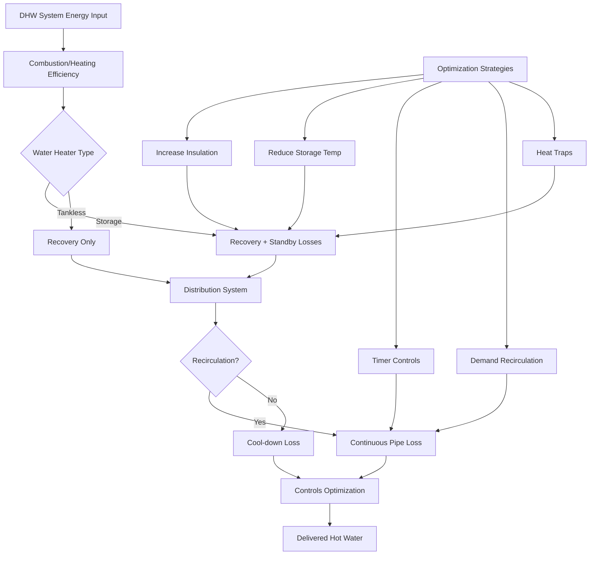

Domestic hot water (DHW) system efficiency depends on multiple energy loss mechanisms that occur from fuel input through final delivery. Understanding the physics of heat transfer, fluid mechanics, and thermodynamic cycles allows systematic optimization of overall system performance.

## Overall System Efficiency

The total system efficiency $\eta_{system}$ represents the ratio of useful energy delivered to load versus total energy input:

$$\eta_{system} = \frac{Q_{delivered}}{Q_{input}} = \eta_{combustion} \times \eta_{recovery} \times \eta_{standby} \times \eta_{distribution}$$

Each component efficiency multiplies to yield overall performance, making even small improvements in individual factors significant to total energy consumption.

### Energy Balance Approach

The first law of thermodynamics applied to a water heater control volume:

$$Q_{input} = Q_{useful} + Q_{standby} + Q_{flue} + Q_{pilot}$$

Where:
- $Q_{input}$ = fuel energy input (Btu/hr or kW)
- $Q_{useful}$ = energy transferred to water, $\dot{m}c_p\Delta T$
- $Q_{standby}$ = jacket and piping losses during idle periods
- $Q_{flue}$ = combustion products energy loss
- $Q_{pilot}$ = continuous pilot light consumption (gas units)

## Recovery Efficiency

Recovery efficiency $\eta_r$ measures how effectively input energy heats water during active firing:

$$\eta_r = \frac{\dot{m}c_p(T_{out} - T_{in})}{Q_{firing}} \times 100\%$$

For gas-fired storage water heaters, typical recovery efficiencies range 76-84%, limited by flue gas losses. Electric resistance units achieve 98-100% recovery efficiency since nearly all electrical energy converts to heat within the tank.

**Physics of Combustion Losses:**

Stack losses result from sensible and latent heat carried away in flue gases:

$$Q_{flue} = \dot{m}_{flue}c_{p,flue}(T_{flue} - T_{ambient}) + \dot{m}_{vapor}h_{fg}$$

Condensing water heaters recover latent heat by cooling flue gases below the water vapor dew point (approximately 135°F for natural gas combustion), achieving recovery efficiencies of 90-98%.

## Standby Loss Mechanisms

Standby losses occur continuously through tank walls, connections, and associated piping when no draw occurs. These losses follow Newton's law of cooling:

$$Q_{standby} = UA(T_{stored} - T_{ambient})$$

Where:
- $U$ = overall heat transfer coefficient (Btu/hr·ft²·°F)
- $A$ = surface area exposed to ambient (ft²)
- $T_{stored}$ = water storage temperature (typically 120-140°F)
- $T_{ambient}$ = surrounding air temperature

### Standby Loss Coefficient

ASHRAE 90.1 defines maximum standby loss for storage water heaters:

$$SL_{max} = \frac{Q_{standby}}{V^{0.6}} \leq \text{code limit}$$

Where $V$ = tank volume in gallons. The exponent 0.6 accounts for surface area scaling with volume (surface area increases proportionally to $V^{2/3}$ in geometrically similar vessels).

**Typical standby loss rates:**

| Equipment Type | Standby Loss | Heat Loss % per Hour |
|----------------|--------------|---------------------|
| Standard gas storage | 3-5% | 1.5-2.5% |
| Electric storage | 2-4% | 1-2% |
| High-efficiency gas | 1-2% | 0.5-1% |
| Indirect water heater | 0.5-1.5% | 0.25-0.75% |
| Tankless (off) | <0.1% | <0.05% |

## Distribution System Losses

Distribution losses occur through piping between the water heater and fixtures. For recirculating systems operating continuously:

$$Q_{distribution} = \sum_{i=1}^{n} U_i A_i (T_{water} - T_{ambient})$$

Summing losses from all pipe segments exposed to unconditioned space.

### Pipe Heat Loss Calculation

For insulated piping, the overall heat transfer coefficient includes conduction through pipe wall and insulation, plus convection at outer surface:

$$U = \frac{1}{\frac{r_2}{h_i r_1} + \frac{r_2 \ln(r_2/r_1)}{k_{pipe}} + \frac{r_2 \ln(r_3/r_2)}{k_{insul}} + \frac{1}{h_o}}$$

Where:
- $r_1, r_2, r_3$ = inner radius, outer pipe radius, outer insulation radius
- $k_{pipe}, k_{insul}$ = thermal conductivities
- $h_i, h_o$ = inner and outer convection coefficients

ASHRAE 90.1 requires minimum pipe insulation thickness per Table 6.8.3:

| Pipe Size | Minimum Insulation | k = 0.27 Btu·in/hr·ft²·°F |
|-----------|-------------------|---------------------------|
| <1" | 0.5" | 1.3 cm |
| 1" to <1.5" | 0.75" | 1.9 cm |
| 1.5" to <4" | 1.0" | 2.5 cm |
| 4" to <8" | 1.5" | 3.8 cm |
| ≥8" | 2.0" | 5.1 cm |

## Energy Factor and Uniform Energy Factor

The Energy Factor (EF) provides a standardized efficiency metric combining recovery efficiency and standby losses under DOE test procedures:

$$EF = \frac{\text{Energy delivered in standard test}}{\text{Total energy consumed}}$$

For storage water heaters tested per 10 CFR Part 430:

$$EF = \frac{V \times 8.25 \times \Delta T}{Q_{input,daily}}$$

Where $V$ = tank volume (gallons), $\Delta T$ = 67°F temperature rise, and 8.25 lb/gallon is water density.

The newer Uniform Energy Factor (UEF) replaced EF in 2017, using realistic draw patterns:

$$UEF = \frac{\sum_{i=1}^{n} M_i c_p \Delta T_i}{\sum_{i=1}^{n} Q_{input,i} + Q_{standby}}$$

Based on four representative usage profiles (low, medium, high, very high).

## System Efficiency Optimization

### Primary Optimization Strategies

**1. Enhanced Insulation**

Increasing tank insulation from R-12 to R-24 reduces standby losses by approximately 40-50%. The heat transfer reduction follows:

$$\frac{Q_2}{Q_1} = \frac{R_1}{R_2}$$

For example, doubling R-value halves standby heat loss rate.

**2. Temperature Setpoint Optimization**

Lowering storage temperature reduces both standby and distribution losses proportionally to temperature difference. However, Legionella control requires maintaining at least 140°F in storage with thermostatic mixing valves at fixtures.

**3. Recirculation Control**

Continuous recirculation maintains instant hot water but incurs substantial distribution losses. DOE estimates continuous recirculation adds 40-80 kBtu/day compared to non-recirculating systems.

Smart controls reduce losses:
- **Timer controls**: Operate during high-use periods (40-60% energy reduction)
- **Temperature-controlled**: Pump cycles to maintain minimum return temperature
- **Demand-activated**: Push-button or occupancy sensor activation (60-80% reduction)

**4. Heat Traps**

Heat trap valves or piping loops prevent thermosiphoning in vertical piping connected to water heater. Natural convection drives hot water upward when no flow occurs:

$$\dot{Q}_{thermosiphon} \propto g\beta\Delta T \frac{D^4}{L}$$

Where $g$ = gravitational acceleration, $\beta$ = thermal expansion coefficient, $D$ = pipe diameter, $L$ = loop length. Heat traps reduce this loss by 75-90%.

## Combined System Performance

**Example calculation:**

A commercial building DHW system serves 100 occupants with the following characteristics:
- Gas-fired storage water heater: 80% recovery efficiency
- Standby loss: 2% per hour average
- 200 ft of insulated recirculation piping: 150 Btu/hr·ft loss
- Operating 8 hours/day with timer control

Daily energy balance:
- Useful hot water: 100 occupants × 10 gal/day × 8.25 lb/gal × 1 Btu/lb·°F × 90°F = 742,500 Btu/day
- Standby loss: 2%/hr × 16 hr idle × 742,500 Btu = 237,600 Btu/day
- Distribution loss: 150 Btu/hr·ft × 200 ft × 8 hr = 240,000 Btu/day
- Total input required: (742,500 + 237,600 + 240,000) / 0.80 = 1,525,125 Btu/day

System efficiency: 742,500 / 1,525,125 = 48.7%

Implementing demand recirculation (90% reduction) and enhanced insulation (40% standby reduction):
- Modified standby: 237,600 × 0.6 = 142,560 Btu/day
- Modified distribution: 240,000 × 0.1 = 24,000 Btu/day
- New total input: (742,500 + 142,560 + 24,000) / 0.80 = 1,136,325 Btu/day
- Improved efficiency: 742,500 / 1,136,325 = 65.3%

Annual savings: (1,525,125 - 1,136,325) Btu/day × 365 days = 141.9 MMBtu/year

## Performance Comparison by Technology

| Technology | Recovery Efficiency | Standby Loss | Distribution Impact | Overall System Efficiency |
|------------|-------------------|--------------|---------------------|--------------------------|
| Standard gas storage | 76-80% | High | Moderate-High | 45-55% |
| High-efficiency gas storage | 80-84% | Moderate | Moderate-High | 55-65% |
| Condensing gas storage | 90-98% | Low-Moderate | Moderate-High | 65-80% |
| Electric storage | 98-100% | Moderate | Moderate-High | 60-75% |
| Heat pump water heater | COP 2.0-3.5 | Moderate | Moderate-High | 80-95%* |
| Gas tankless | 80-96% | Negligible | Low-Moderate | 70-85% |
| Condensing gas tankless | 94-98% | Negligible | Low-Moderate | 80-90% |

*Heat pump efficiency expressed as equivalent fuel conversion accounting for source energy

## Code Requirements and Standards

**ASHRAE 90.1-2019** Section 7.4 establishes minimum equipment efficiency and maximum standby loss. Key provisions:

- Water heaters ≥20 gallons: Minimum thermal efficiency and maximum standby loss per Tables 7.8-1 through 7.8-4
- Service water heating piping insulation: Table 6.8.3 requirements
- Recirculation systems: Temperature maintenance controls required (Section 7.4.4.5)
- Heat traps required on storage water heaters (Section 7.4.4.6)

**DOE 10 CFR 430** defines test procedures and minimum efficiency standards for residential water heaters, establishing UEF requirements by tank volume and input rate.

The comprehensive system approach—considering recovery, standby, and distribution losses together—enables identifying the most cost-effective efficiency improvements for specific applications and usage patterns.

