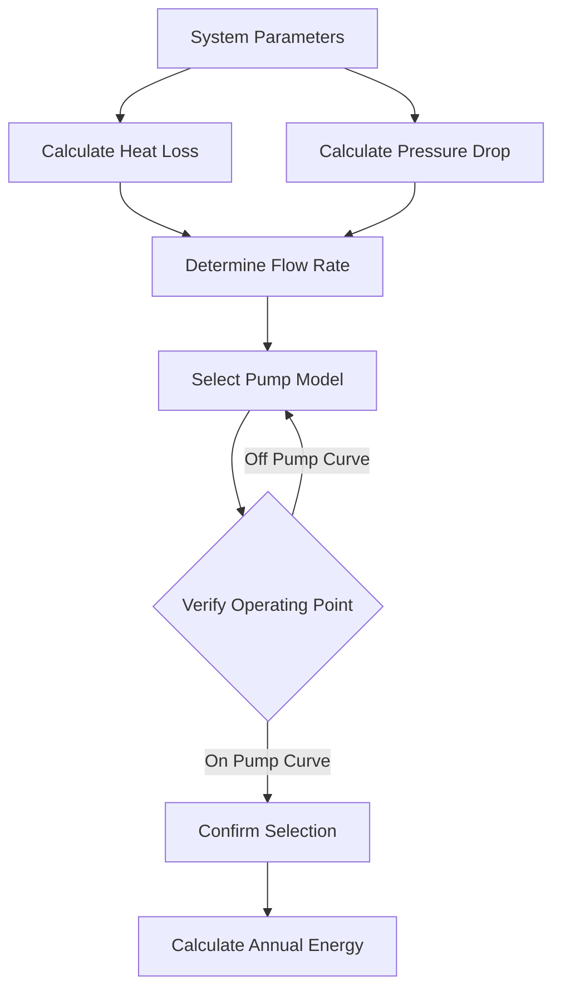
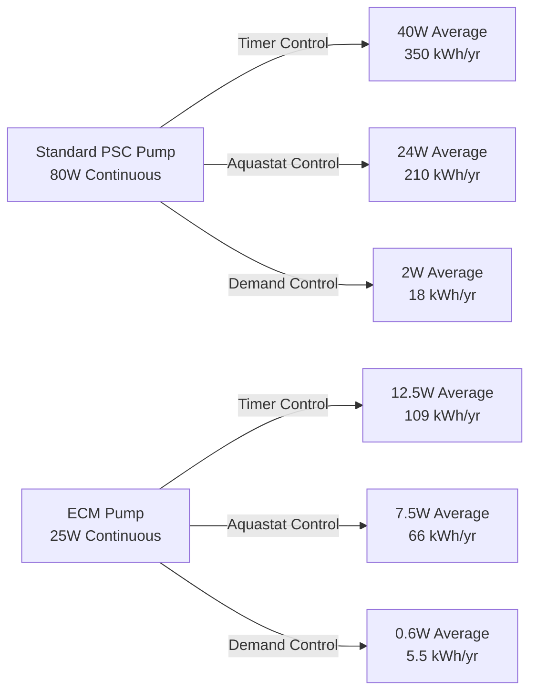

Recirculation pumps in domestic hot water systems maintain hot water availability at fixtures, eliminating wait time. The energy penalty for this convenience ranges from 50 to 400 kWh annually per pump depending on control strategy, pump efficiency, and system design. Understanding pump power requirements and implementing efficient control strategies minimizes parasitic energy consumption while maintaining thermal performance.

## Pump Power Fundamentals

Circulation pump power consumption derives from the work required to overcome friction losses in the distribution piping network. The hydraulic power requirement follows from fundamental fluid mechanics:

$$P_{\text{hydraulic}} = \frac{Q \cdot \Delta P}{1000}$$

Where:
- $P_{\text{hydraulic}}$ = hydraulic power (W)
- $Q$ = flow rate (L/s)
- $\Delta P$ = pressure drop (kPa)

The electrical power drawn by the pump motor accounts for wire-to-water efficiency losses:

$$P_{\text{electrical}} = \frac{P_{\text{hydraulic}}}{\eta_{\text{pump}} \cdot \eta_{\text{motor}}}$$

Where:
- $\eta_{\text{pump}}$ = pump hydraulic efficiency (0.30-0.60 typical)
- $\eta_{\text{motor}}$ = motor electrical efficiency (0.50-0.90 typical)

Standard wet-rotor circulator pumps operate at combined wire-to-water efficiencies of 15% to 35%. Electronically commutated motor (ECM) pumps achieve 35% to 50% efficiency through improved motor design and magnetic bearing systems.

## Pump Sizing Calculation

Proper pump selection requires accurate determination of system flow requirements and total pressure drop across the recirculation loop.

### Flow Rate Determination

The required flow rate maintains acceptable temperature drop in the return line, preventing Legionella growth risk and ensuring adequate hot water temperature at the furthest fixture:

$$Q = \frac{q_{\text{loss}}}{\rho \cdot c_p \cdot \Delta T_{\text{allow}}}$$

Where:
- $q_{\text{loss}}$ = heat loss from distribution piping (W)
- $\rho$ = water density (1000 kg/m³)
- $c_p$ = specific heat of water (4186 J/kg·K)
- $\Delta T_{\text{allow}}$ = allowable temperature drop (typically 2-5°F or 1-3°C)

For insulated piping, heat loss per unit length approximates:

$$q_{\text{loss}} = \frac{2\pi k_{\text{ins}} L (T_{\text{water}} - T_{\text{amb}})}{\ln(r_{\text{out}}/r_{\text{in}})}$$

Where:
- $k_{\text{ins}}$ = insulation thermal conductivity (W/m·K)
- $L$ = pipe length (m)
- $r_{\text{out}}$, $r_{\text{in}}$ = outer and inner insulation radii (m)

### Pressure Drop Calculation

Total system pressure drop combines friction losses in straight piping and minor losses at fittings:

$$\Delta P_{\text{total}} = \Delta P_{\text{friction}} + \Delta P_{\text{fittings}}$$

$$\Delta P_{\text{friction}} = f \cdot \frac{L}{D} \cdot \frac{\rho v^2}{2}$$

Where:
- $f$ = Darcy friction factor (function of Reynolds number and roughness)
- $L$ = pipe length (m)
- $D$ = pipe diameter (m)
- $v$ = flow velocity (m/s)

Fitting losses sum individual loss coefficients:

$$\Delta P_{\text{fittings}} = \sum K \cdot \frac{\rho v^2}{2}$$

For residential recirculation systems, total pressure drop typically ranges from 1 to 5 psi (7-35 kPa).

## Operating Strategies and Energy Consumption

Control strategy selection fundamentally determines annual energy consumption, with continuous operation consuming 5 to 10 times more energy than optimized demand-based control.

### Continuous Operation

Continuous pump operation provides instant hot water delivery but consumes maximum energy:

$$E_{\text{annual}} = P_{\text{pump}} \cdot t_{\text{operation}}$$

For a 25 W pump operating 8760 hours annually:

$$E_{\text{annual}} = 25 \text{ W} \times 8760 \text{ hr} = 219 \text{ kWh/yr}$$

At $0.12/kWh, annual operating cost reaches $26.

### Timer Control

Time clock operation restricts pump runtime to occupied hours, typically reducing annual operating hours by 50-70%:

$$E_{\text{annual}} = P_{\text{pump}} \cdot t_{\text{timer}}$$

With 12 hours daily operation:

$$E_{\text{annual}} = 25 \text{ W} \times 4380 \text{ hr} = 109.5 \text{ kWh/yr}$$

This reduces annual cost to $13, saving $13 annually compared to continuous operation.

### Aquastat Control

Temperature-based control activates the pump when return line temperature drops below setpoint (typically 95-105°F). Duty cycle depends on system heat loss and ambient conditions:

$$E_{\text{annual}} = P_{\text{pump}} \cdot t_{\text{operation}} \cdot DC$$

Where $DC$ = duty cycle fraction (0.10-0.40 typical)

For 30% duty cycle:

$$E_{\text{annual}} = 25 \text{ W} \times 8760 \text{ hr} \times 0.30 = 65.7 \text{ kWh/yr}$$

Annual cost drops to $8, saving $18 compared to continuous operation.

### Demand Control

Push-button or motion-activated systems operate only when fixtures require hot water, minimizing runtime to actual usage periods. Typical residential demand systems operate 30-90 minutes daily:

$$E_{\text{annual}} = P_{\text{pump}} \cdot \frac{t_{\text{daily}} \cdot 365}{1000}$$

For 60 minutes daily operation:

$$E_{\text{annual}} = 25 \text{ W} \times 365 \text{ hr} = 9.1 \text{ kWh/yr}$$

Annual cost reaches only $1.10, representing 96% savings versus continuous operation.

## Pump Technology Comparison

| Pump Type | Wire-to-Water Efficiency | Power Draw (Typical Residential) | Annual Energy (Continuous) | Relative Cost |
|-----------|-------------------------|----------------------------------|----------------------------|---------------|
| Standard PSC Motor | 15-25% | 60-100 W | 525-875 kWh | Baseline |
| High-Efficiency PSC | 25-35% | 40-60 W | 350-525 kWh | +$50-100 |
| ECM (Fixed Speed) | 35-45% | 20-35 W | 175-305 kWh | +$150-250 |
| ECM (Variable Speed) | 40-50% | 15-25 W | 130-220 kWh | +$200-350 |

ECM pumps incorporate permanent magnet motors with electronic commutation, eliminating rotor resistance losses inherent in induction motors. Variable speed capability allows proportional pressure control, further reducing energy consumption when the system operates at partial flow conditions.

## Energy Code Requirements

ASHRAE 90.1-2019 Section 7.4.4.4 requires automatic controls that limit recirculation pump operation for hot water systems. Acceptable control methods include:

- **Temperature modulation** - Automatic control that limits operation based on water temperature
- **Time-of-day scheduling** - Automatic shutoff during unoccupied periods
- **Demand-initiated control** - Operation only when hot water draw occurs

The International Energy Conservation Code (IECC) 2021 Section C404.7 mandates automatic shutoff controls or temperature-actuated circulation controls for service hot water systems with circulation loops.

California Title 24 Part 6 Section 120.3(b) specifies demand recirculation controls for single-family residential applications, with exemptions only for continuously occupied facilities where instant hot water delivery serves operational requirements.

## Variable Speed Optimization

Variable speed pumps modulate flow rate to match system requirements, reducing power consumption according to affinity laws:

$$\frac{P_2}{P_1} = \left(\frac{N_2}{N_1}\right)^3$$

Where:
- $P_1$, $P_2$ = power at speeds 1 and 2
- $N_1$, $N_2$ = pump speeds 1 and 2

Operating at 50% speed reduces power consumption to 12.5% of full-speed power:

$$P_2 = 25 \text{ W} \times (0.50)^3 = 3.1 \text{ W}$$

This cubic relationship between speed and power creates substantial energy savings potential when systems operate at reduced flow rates during partial load conditions.

Variable speed pumps with integrated pressure sensors maintain constant differential pressure across the distribution system, automatically reducing speed as fewer fixtures demand hot water. In multi-unit residential buildings, this strategy reduces average pump power by 40-60% compared to constant speed operation.

## Practical Application Example

Consider a single-family residence with 120 feet of 3/4" copper recirculation piping, insulated to R-3. System parameters:

- Heat loss: 1200 W (insulated piping at 120°F water, 70°F ambient)
- Allowable temperature drop: 5°F
- Required flow rate: 0.57 GPM
- System pressure drop: 3.5 psi

**Option 1: Standard 60W pump, continuous operation**
- Annual energy: 525 kWh
- Annual cost (at $0.12/kWh): $63

**Option 2: Standard 60W pump, aquastat control (25% duty cycle)**
- Annual energy: 131 kWh
- Annual cost: $16
- Savings: $47/yr (75% reduction)

**Option 3: ECM 20W pump, aquastat control (25% duty cycle)**
- Annual energy: 44 kWh
- Annual cost: $5
- Savings: $58/yr (92% reduction)
- Incremental cost: ~$200
- Simple payback: 3.4 years

**Option 4: ECM 20W pump, demand control (60 min/day)**
- Annual energy: 7.3 kWh
- Annual cost: $0.88
- Savings: $62/yr (99% reduction)
- Incremental cost: ~$250
- Simple payback: 4.0 years

## Implementation Considerations

Pump selection requires balancing first cost against lifecycle energy consumption. ECM pumps command 3 to 5 times higher initial investment than standard PSC circulators but deliver 60-75% energy reduction. In continuously operated systems, payback periods range from 2 to 5 years depending on electricity rates and system runtime.

Control strategy selection depends on occupancy patterns and hot water demand profiles. Demand-initiated controls provide maximum energy savings but require user interaction or sensor integration. Aquastat controls offer autonomous operation with substantial savings compared to continuous operation, particularly when combined with time-of-day scheduling during unoccupied periods.

System commissioning must verify proper pump operation across the full operating range. Variable speed pumps require pressure sensor calibration and minimum speed adjustment to prevent short-cycling. Temperature control setpoints should maintain return line temperature above 122°F for Legionella prevention while minimizing unnecessary pump runtime.

Energy monitoring systems that track pump runtime and power consumption enable data-driven optimization of control parameters, identifying opportunities to reduce circulation duration without compromising hot water delivery performance.
