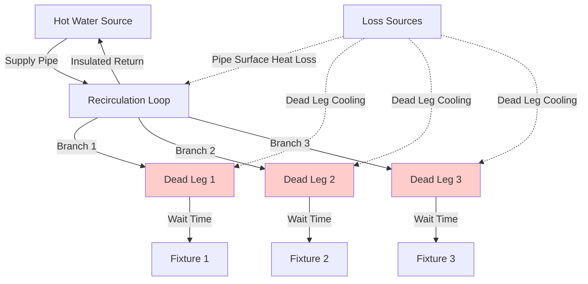

Distribution system losses represent the largest energy penalty in most domestic hot water (DHW) systems, often exceeding water heating equipment inefficiencies by a factor of 2-3 in poorly designed installations. Heat transfer from hot water piping to surrounding spaces and water waste from dead legs constitute the primary loss mechanisms requiring rigorous analysis.

## Pipe Heat Loss Fundamentals

Heat transfer from insulated piping follows the cylindrical geometry solution to Fourier's law. The radial heat flux per unit length is:

$$q_L = \frac{2\pi L (T_w - T_\infty)}{\frac{1}{h_i r_i} + \frac{\ln(r_2/r_1)}{k_{pipe}} + \frac{\ln(r_3/r_2)}{k_{ins}} + \frac{1}{h_o r_3}}$$

where $q_L$ is heat loss rate (W/m), $L$ is pipe length (m), $T_w$ is water temperature, $T_\infty$ is ambient temperature, $r_1, r_2, r_3$ are inner pipe radius, outer pipe radius, and outer insulation radius respectively, $k_{pipe}$ and $k_{ins}$ are thermal conductivities, and $h_i, h_o$ are inside and outside convection coefficients.

For practical calculations, the insulation thermal resistance dominates, allowing the simplified expression:

$$q_L \approx \frac{2\pi k_{ins} (T_w - T_\infty)}{\ln(r_3/r_2)}$$

This relationship demonstrates that doubling insulation thickness reduces heat loss by only $\ln(2) \approx 0.69$ factor, explaining diminishing returns beyond code-minimum thicknesses.

## ASHRAE 90.1 Insulation Requirements

ASHRAE 90.1-2019 Section 7.4.4.2 specifies minimum pipe insulation thickness based on fluid operating temperature and pipe size.

| Pipe Size (in) | Fluid Temp 105-140°F | Fluid Temp 141-200°F | Fluid Temp >200°F |
|----------------|----------------------|----------------------|-------------------|
| < 1            | 0.5 in              | 1.0 in              | 1.5 in           |
| 1 to < 1.5     | 1.0 in              | 1.5 in              | 1.5 in           |
| 1.5 to < 4     | 1.5 in              | 1.5 in              | 2.0 in           |
| 4 to < 8       | 2.0 in              | 2.5 in              | 2.5 in           |
| ≥ 8            | 2.5 in              | 3.0 in              | 3.5 in           |

These thicknesses assume insulation with thermal conductivity 0.25-0.29 Btu·in/(h·ft²·°F) at 75°F mean temperature, typical of fiberglass and elastomeric foam products.

## Heat Loss Calculation Example

Consider a 100-ft run of 3/4-in copper pipe (0.875 in OD) carrying 140°F water through a 70°F mechanical room, insulated with 1-in fiberglass (k = 0.27 Btu·in/(h·ft²·°F)):

$$r_2 = 0.4375 \text{ in}, \quad r_3 = 1.4375 \text{ in}$$

$$q_L = \frac{2\pi (0.27)(140-70)}{\ln(1.4375/0.4375)} = \frac{118.7}{1.197} = 99.2 \text{ Btu/(h·ft)}$$

For 100 ft: $Q_{total} = 9,920$ Btu/h or 2.9 kW continuous loss.

Over 8,760 hours annually: $25,500$ kWh lost. At $0.12/kWh, this represents $3,060 annual energy cost from a single pipe run, demonstrating the economic imperative for proper insulation.

## Dead Leg Water Waste

Dead legs—piping segments between the last recirculation loop connection and the fixture—waste both water and energy during each draw event. The volume of a cylindrical pipe is:

$$V = \frac{\pi d^2 L}{4}$$

where $d$ is inside diameter and $L$ is length. For a 30-ft dead leg of 1/2-in copper (0.527 in ID):

$$V = \frac{\pi (0.527/12)^2 (30)}{4} = 0.0455 \text{ ft}^3 = 0.34 \text{ gal}$$

If this water cools from 140°F to 70°F between draws:

$$Q_{sensible} = m c_p \Delta T = (0.34 \times 8.34)(1.0)(70) = 198 \text{ Btu}$$

For 10 daily uses, annual waste equals 723,000 Btu or 212 kWh—equivalent to $25/year per fixture in energy alone, plus sewer charges for wasted water.

## Distribution Layout Optimization

Minimizing distribution losses requires systematic layout strategies:

**Core piping configuration** locates water heating equipment centrally relative to major fixture groups, minimizing total pipe length. For a building with fixtures distributed across 200 ft, central equipment placement reduces average run to 50 ft versus 150 ft for corner placement—a 67% reduction in heat loss surface area.

**Vertical stacking** aligns plumbing fixtures in multi-story buildings, allowing a single vertical riser to serve multiple floors. Each floor requires only short horizontal branches rather than independent long runs.

**Pipe sizing discipline** prevents oversized pipes that increase both heat loss surface area and dead leg volume. A 1-in pipe has 2.67× the surface area and 7.11× the volume of 1/2-in pipe.

## Recirculation System Considerations

Continuous recirculation eliminates wait time but imposes 24/7 heat loss from both supply and return piping:

$$Q_{recirc} = q_{L,supply} L_{supply} + q_{L,return} L_{return}$$

For 300 ft total loop length at 95 Btu/(h·ft) average heat loss: $Q_{recirc} = 28,500$ Btu/h = 8.35 kW continuous.

Annual energy: 73,100 kWh costing $8,770 at $0.12/kWh—far exceeding dead leg losses but providing instant hot water delivery.

**Time-clock control** reduces recirculation to occupied hours, typically 6 AM to 10 PM (16 hours), cutting annual runtime to 5,840 hours and energy cost to $5,070.

**Demand-controlled recirculation** uses pushbutton or occupancy sensors to activate pumps only when hot water is needed, achieving 60-80% energy savings versus continuous operation while maintaining acceptable wait times.

## Insulation System Design Comparison

| System Type | First Cost | Annual Energy | 20-Year Life Cycle | Heat Loss Rate |
|-------------|------------|---------------|-------------------|----------------|
| Bare copper | Baseline | $12,500 | $250,000 | 450 Btu/(h·ft) |
| Code minimum insulation | +15% | $3,100 | $62,000 | 95 Btu/(h·ft) |
| Double code thickness | +22% | $1,850 | $37,000 | 58 Btu/(h·ft) |
| Heat trace + minimal insulation | +180% | $9,200 | $184,000 | 280 Btu/(h·ft) |

This comparison for 300-ft distribution system demonstrates code-minimum insulation provides 75% energy reduction versus bare pipe, while enhanced insulation yields an additional 40% savings at minimal incremental cost.

## Practical Implementation

Effective distribution loss mitigation combines multiple strategies. Compact piping layouts reduce total length, properly sized pipes minimize volume and surface area, code-exceeding insulation reduces heat transfer, and intelligent recirculation controls balance convenience with efficiency. System designers must evaluate these measures holistically, recognizing that a $500 investment in layout optimization often saves more energy than $5,000 in exotic equipment upgrades.
