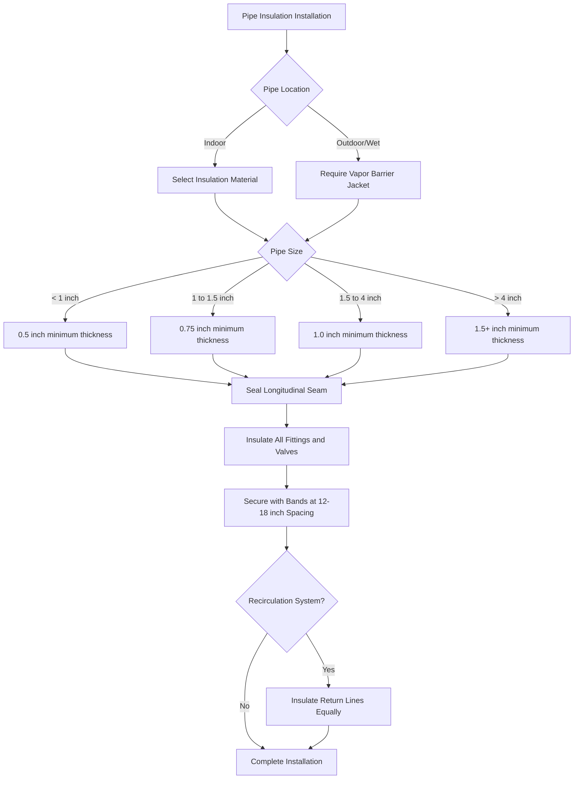

Insulation applied to domestic hot water (DHW) distribution piping and storage tanks reduces heat transfer to surrounding air, minimizing standby losses and maintaining supply water temperature. The energy savings from proper insulation typically provide payback periods under three years, making it one of the most cost-effective efficiency measures in building systems.

## Heat Transfer Fundamentals

Heat loss from uninsulated or poorly insulated hot water systems occurs through three mechanisms: conduction through pipe or tank walls, convection from surfaces to surrounding air, and radiation from hot surfaces. For typical DHW systems operating at 120–140°F, conduction through the insulation material and convection at the outer surface dominate the heat transfer process.

The steady-state heat loss from an insulated cylindrical pipe per unit length is calculated using:

$$Q = \frac{2\pi L (T_w - T_a)}{\frac{1}{h_i r_i} + \frac{\ln(r_o/r_i)}{k_{pipe}} + \frac{\ln(r_{ins}/r_o)}{k_{ins}} + \frac{1}{h_o r_{ins}}}$$

Where:
- $Q$ = heat loss rate (Btu/hr)
- $L$ = pipe length (ft)
- $T_w$ = water temperature (°F)
- $T_a$ = ambient air temperature (°F)
- $r_i$ = inside pipe radius (ft)
- $r_o$ = outside pipe radius (ft)
- $r_{ins}$ = outside insulation radius (ft)
- $k_{pipe}$ = thermal conductivity of pipe material (Btu·ft/hr·ft²·°F)
- $k_{ins}$ = thermal conductivity of insulation (Btu·ft/hr·ft²·°F)
- $h_i$ = inside convection coefficient (Btu/hr·ft²·°F)
- $h_o$ = outside convection coefficient (Btu/hr·ft²·°F)

For practical applications, the thermal resistance of the pipe wall and internal convection are negligible compared to insulation resistance, simplifying the calculation to focus on insulation thermal resistance and external convection.

## Code-Mandated Insulation Requirements

### ASHRAE 90.1-2019 Requirements

ASHRAE 90.1 Section 7.4.4.1 specifies minimum insulation thickness based on pipe size and operating temperature. For DHW systems operating below 140°F:

| Nominal Pipe Size | Minimum Insulation Thickness | Minimum R-Value |
|-------------------|------------------------------|-----------------|
| < 1" | 0.5" | R-2.0 |
| 1" to < 1.5" | 0.75" | R-2.5 |
| 1.5" to < 4" | 1.0" | R-3.0 |
| 4" to < 8" | 1.5" | R-4.0 |
| ≥ 8" | 2.0" | R-5.0 |

For recirculation systems and systems operating above 140°F, the minimum thickness increases by 0.5 inches in each category.

### IECC 2021 Commercial Requirements

The International Energy Conservation Code (IECC) Section C403.11.3 requires pipe insulation with thermal resistance (R-value) determined by:

$$R_{required} = \frac{t}{12k}$$

Where $t$ is the insulation thickness in inches and $k$ is the thermal conductivity in Btu·in/hr·ft²·°F. Common materials include fiberglass (k = 0.23–0.26), elastomeric foam (k = 0.27–0.28), and polyisocyanurate (k = 0.16–0.19).

### Recirculation System Requirements

Recirculation return piping must be insulated identically to supply piping. This requirement prevents the return line from acting as a radiator, which would increase pump energy, reduce delivered water temperature, and negate the thermal benefits of insulating the supply piping.

## Pipe Insulation Selection and Application

### Material Properties Comparison

| Material | Thermal Conductivity (k) | Max Temp | Cost Relative | Vapor Permeability |
|----------|-------------------------|----------|---------------|-------------------|
| Fiberglass | 0.23–0.26 | 450°F | Low | High (requires jacket) |
| Elastomeric Foam | 0.27–0.28 | 220°F | Medium | Very Low (self-sealing) |
| Polyisocyanurate | 0.16–0.19 | 300°F | High | Medium (requires jacket) |
| Cellular Glass | 0.29–0.38 | 900°F | Very High | Zero (impermeable) |

The selection process considers operating temperature, ambient conditions, space constraints, and whether the installation is indoors or outdoors. Elastomeric foam dominates residential and light commercial applications due to its self-sealing vapor barrier and ease of installation. Fiberglass with all-service jacket (ASJ) is preferred in larger commercial systems for its lower cost and higher temperature rating.

### Fitting and Valve Insulation

Fittings, valves, and flanges create thermal bridges if left uninsulated. Code requires insulation of all fittings to the same level as adjacent piping. Pre-molded fitting covers, insulation cement, or removable blankets satisfy this requirement. Heat loss from an uninsulated valve can equal 50–100 linear feet of uninsulated pipe, making fitting coverage critical for system performance.

## Storage Tank Insulation

Storage tanks lose heat through the cylindrical walls, top head, and bottom head. Factory-insulated tanks typically provide R-10 to R-16 tank insulation. Older tanks or tanks with inadequate factory insulation benefit from supplemental insulation blankets.

The standby heat loss coefficient (UA value) for a cylindrical tank is:

$$UA = \frac{2\pi r L}{R_{wall}} + \frac{2\pi r^2}{R_{head,top}} + \frac{2\pi r^2}{R_{head,bottom}}$$

Where $r$ is the tank radius, $L$ is the tank height, and $R$ values represent the thermal resistance of each surface. ASHRAE 90.1 requires a maximum standby loss of 1.3% of tank volume per hour (Btu/hr) at a 70°F temperature difference.

For an 80-gallon tank at 140°F in a 70°F ambient:

$$Q_{standby,max} = 0.013 \times V \times 8.33 \times (T_{tank} - T_{amb})$$
$$Q_{standby,max} = 0.013 \times 80 \times 8.33 \times 70 = 608 \text{ Btu/hr}$$

This equates to approximately 5,325 kWh/year for an electric resistance heater or 53 therms/year for a gas heater, representing measurable operating cost.

## Heat Loss Calculation Example

Calculate heat loss from 100 feet of 1-inch copper pipe carrying 140°F water through a 70°F space, comparing uninsulated pipe to pipe with 1-inch fiberglass insulation:

**Uninsulated pipe:**
- Outside diameter: 1.315 inches = 0.1096 ft
- Surface area: $A = \pi DL = \pi \times 0.1096 \times 100 = 34.4 \text{ ft}^2$
- Combined convection/radiation coefficient: $h_o = 2.0 \text{ Btu/hr·ft}^2\text{·°F}$
- Heat loss: $Q = h_o A \Delta T = 2.0 \times 34.4 \times 70 = 4,816 \text{ Btu/hr}$

**Insulated pipe (1-inch fiberglass, k = 0.25 Btu·in/hr·ft²·°F):**
- Insulation outer diameter: 3.315 inches = 0.276 ft
- Thermal resistance: $R = \frac{\ln(r_{ins}/r_o)}{2\pi k L} = \frac{\ln(1.658/0.658)}{2\pi \times (0.25/12) \times 100} = 3.68 \text{ hr·°F/Btu}$
- Outer surface resistance: $R_o = \frac{1}{h_o A_{ins}} = \frac{1}{2.0 \times 86.8} = 0.0058 \text{ hr·°F/Btu}$
- Total resistance: $R_{total} = 3.68 + 0.0058 = 3.69 \text{ hr·°F/Btu}$
- Heat loss: $Q = \frac{\Delta T}{R_{total}} = \frac{70}{3.69} = 19.0 \text{ Btu/hr}$

The insulation reduces heat loss by 99.6%, from 4,816 to 19 Btu/hr. Annual energy savings for this 100-foot run equals 42.1 million Btu, or approximately 421 therms at 80% combustion efficiency.

## Installation Requirements

Proper installation requires:
- Continuous insulation coverage with no gaps at supports, penetrations, or joints
- Longitudinal seams sealed with vapor-seal mastic or self-sealing materials
- Support bands over insulation, not compressing it
- Vapor barrier jacketing on all outdoor or condensation-prone locations
- Protection from physical damage in mechanical rooms and accessible locations

## Performance Verification

Thermal imaging surveys identify insulation deficiencies, including missing insulation, compressed sections, and gaps at fittings. Temperature measurements at the insulation outer surface confirm proper installation. For properly installed insulation, the outer jacket temperature should be within 10–15°F of ambient air temperature.

Annual energy monitoring quantifies actual savings by comparing fuel or electricity consumption before and after insulation upgrades. Savings typically range from 3–10% of total DHW energy use, with higher percentages in systems with extensive distribution piping or continuous recirculation.

## Economic Analysis

Material costs for pipe insulation range from $0.50 to $3.00 per linear foot depending on pipe size and insulation type. Installation labor adds $1.00 to $4.00 per linear foot. For a typical 500-foot DHW distribution system, total project cost ranges from $750 to $3,500.

Energy cost savings depend on system operating hours, pipe length, temperature differential, and energy costs. Typical payback periods range from 0.5 to 3.0 years, making insulation one of the highest-return efficiency investments in commercial buildings.
