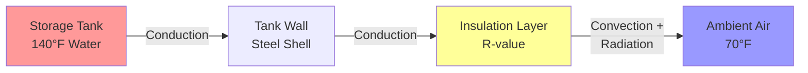
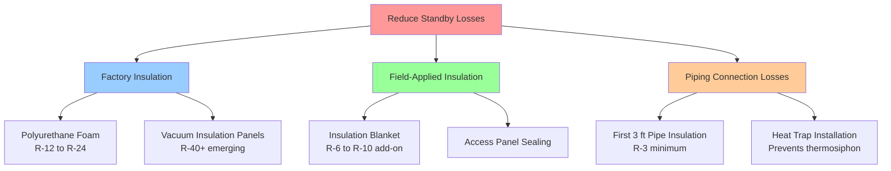

## Standby Loss Fundamentals

Standby losses represent the continuous heat transfer from stored hot water through the tank walls, piping connections, and access ports to the surrounding environment. These losses occur whenever water temperature exceeds ambient conditions, requiring periodic burner firing or element activation to maintain setpoint temperature even with zero draw demand.

The rate of standby loss governs the parasitic energy consumption of storage-type water heaters, directly impacting annual operating costs and system efficiency metrics.

## Heat Transfer Physics

Heat loss from a cylindrical storage tank follows fundamental conductive and convective heat transfer principles. The thermal resistance pathway consists of three series components:

1. **Internal convection** from water to inner tank wall
2. **Conduction** through tank wall and insulation layer
3. **External convection and radiation** from outer surface to ambient air

The overall heat transfer coefficient combines these resistances:

$$\frac{1}{U_o} = \frac{1}{h_i} + \frac{t_{steel}}{k_{steel}} + \frac{t_{ins}}{k_{ins}} + \frac{1}{h_o}$$

where:
- $U_o$ = overall heat transfer coefficient (Btu/hr·ft²·°F)
- $h_i$ = inside convection coefficient (≈100-200 Btu/hr·ft²·°F for water)
- $h_o$ = outside combined convection and radiation coefficient (≈2-3 Btu/hr·ft²·°F)
- $t_{steel}$, $t_{ins}$ = steel and insulation thickness (ft)
- $k_{steel}$, $k_{ins}$ = thermal conductivity (Btu/hr·ft·°F)

The insulation resistance term dominates this series network. For typical polyurethane foam insulation ($k_{ins}$ = 0.015 Btu/hr·ft·°F), the thermal resistance is:

$$R_{ins} = \frac{t_{ins}}{k_{ins}} = \frac{t_{ins} \text{ (inches)}}{0.015 \times 12} = 5.56 \times t_{ins}$$

Therefore, 2 inches of foam provides R-11, while 3 inches yields R-17 insulation value.

## Standby Heat Loss Calculation

The steady-state heat loss from a water heater can be calculated using the surface area-weighted temperature difference:

$$Q_{standby} = U_o \cdot A_{total} \cdot (T_{water} - T_{ambient})$$

For a cylindrical tank with height $H$ and diameter $D$:

$$A_{total} = \pi D H + 2 \times \frac{\pi D^2}{4} = \pi D (H + \frac{D}{2})$$

**Example calculation** for a 50-gallon residential tank:
- Tank dimensions: D = 20 inches, H = 60 inches
- Surface area: $A_{total}$ = π × (20/12) × (60/12 + 20/24) = 27.5 ft²
- Insulation: R-16 (U = 0.0625 Btu/hr·ft²·°F)
- Temperature difference: 140°F - 70°F = 70°F
- Standby loss: Q = 0.0625 × 27.5 × 70 = **121 Btu/hr**

This represents approximately 2.9 kBtu/day or 1,060 kBtu/year in continuous standby losses.

## Standby Loss Percentage

Standby loss percentage expresses hourly heat loss as a fraction of tank thermal storage capacity:

$$\text{Standby Loss \%} = \frac{Q_{standby} \times 1 \text{ hour}}{V_{tank} \times 8.33 \times (T_{water} - T_{incoming})} \times 100\%$$

where $V_{tank}$ is tank volume in gallons.

| Insulation Level | R-Value | Standby Loss (50 gal tank) | Standby Loss Percentage/hr |
|-----------------|---------|-------------------------------|-------------------------------|
| Minimal (legacy) | R-8 | 215 Btu/hr | 0.7% |
| Standard residential | R-12 to R-16 | 120-160 Btu/hr | 0.4-0.5% |
| High-efficiency | R-20 to R-24 | 75-95 Btu/hr | 0.25-0.3% |
| Premium/commercial | R-30+ | <60 Btu/hr | <0.2% |

Modern residential tanks typically exhibit 2-6% standby loss per hour, meaning the stored energy decreases by this fraction hourly if no makeup heat is added.

## Ambient Temperature Impact

Standby losses scale linearly with the temperature differential between stored water and surrounding air. The location of the water heater significantly impacts annual energy consumption:

$$Q_{annual} = Q_{standby} \times 8760 \text{ hours} \times \frac{(T_{water} - T_{ambient,avg})}{(T_{water} - T_{ambient,test})}$$

DOE test conditions use 70°F ambient temperature. Real-world installations vary:

| Installation Location | Typical Ambient | ΔT from 140°F | Relative Standby Loss |
|----------------------|----------------|---------------|----------------------|
| Unconditioned basement (winter) | 50-55°F | 85-90°F | 121-129% |
| Conditioned living space | 68-72°F | 68-72°F | 97-103% |
| Heated mechanical room | 65-75°F | 65-75°F | 93-107% |
| Unconditioned garage (summer) | 85-95°F | 45-55°F | 64-79% |
| Attic space (summer) | 110-130°F | 10-30°F | 14-43% |

Locating water heaters in conditioned space increases standby losses (higher ambient temperature reduces losses) but the heat contributes to space heating during winter months, potentially reducing net energy consumption in heating-dominated climates.

## DOE Energy Factor Rating

The Energy Factor (EF) metric combines recovery efficiency and standby losses into a single performance measure defined by DOE test procedure 10 CFR Part 430, Subpart B, Appendix E:

$$\text{Energy Factor} = \frac{\text{Energy delivered to water}}{\text{Total energy input}}$$

The standardized test draws six equal volumes totaling 64.3 gallons (for nominal 50-gallon tank) over a 24-hour period, measuring both recovery efficiency and standby losses.

For storage water heaters, EF can be approximated by:

$$EF \approx \frac{\eta_{recovery}}{1 + \frac{UA_{standby} \times 24 \times 70}{V_{draw} \times 8.33 \times \Delta T}}$$

where:
- $\eta_{recovery}$ = combustion or element efficiency during firing
- $UA_{standby}$ = standby loss coefficient (Btu/hr·°F)
- $V_{draw}$ = daily hot water draw (gallons)
- $\Delta T$ = temperature rise (°F)

**Current DOE minimum standards** (effective 2015):

| Water Heater Type | Storage Volume | Minimum EF |
|------------------|---------------|-----------|
| Gas storage | ≤55 gallons | 0.675 - (0.0015 × V) |
| Gas storage | >55 gallons | 0.8012 - (0.00078 × V) |
| Electric storage | ≤55 gallons | 0.960 - (0.0003 × V) |
| Electric storage | >55 gallons | 2.057 - (0.00113 × V) |

The stronger insulation requirements for larger tanks reflect the increased surface-to-volume ratio penalty.

## Insulation Upgrade Strategies

Reducing standby losses involves increasing thermal resistance through improved insulation:

### Factory Insulation

Modern water heaters use polyurethane or polyisocyanurate foam injected between the steel tank and outer jacket. Thickness ranges from 1.5 inches (R-8) in economy models to 3+ inches (R-20+) in high-efficiency units. The foam simultaneously provides thermal resistance and structural support for the outer shell.

### Tank Blankets

Aftermarket insulation blankets wrap the exterior jacket with fiberglass batts faced with vinyl or reinforced foil. These add R-6 to R-10 thermal resistance for minimal cost ($20-40). Installation requirements:

- Leave top access panel uncovered for safety/access
- Avoid covering temperature-pressure relief valve
- Maintain clearances from flue vent on gas units
- Secure with tape or straps to prevent sagging

Energy savings calculation:

$$\text{Annual Savings} = \frac{Q_{before} - Q_{after}}{3412} \times 8760 \times \text{Energy Cost}$$

Adding R-10 blanket to an R-12 tank reduces standby loss by approximately 45%, saving 150-250 kWh/year electric or 15-25 therms/year gas.

### Heat Trap Valves

Thermosiphon circulation at tank connections causes additional standby loss by allowing hot water to rise into uninsulated piping. Heat trap valves (ANSI Z21.22) incorporate check valves or ball-and-seat mechanisms preventing reverse circulation while allowing normal flow. These reduce standby losses by 15-30 Btu/hr on typical residential installations.

## Regulatory Requirements

**ASHRAE Standard 90.1-2019** (Commercial Buildings):
- Storage tanks ≤120 gallons: Maximum standby loss varies by volume and input
- Tanks must meet SL ≤ (Q/800 + 110√V) where Q is input (Btu/hr) and V is volume (gallons)

**International Energy Conservation Code (IECC) 2021**:
- References DOE minimum efficiency standards
- Requires first 5 feet of inlet/outlet piping insulated to R-3 minimum
- Prohibits circulation pumps without automatic temperature or timer controls

**California Title 24**:
- More stringent than federal minimums
- Requires external pipe insulation within 10 feet of water heater
- Mandates insulation on recirculation systems

## Field Measurement

Standby loss can be measured in the field using a simple energy balance over a no-draw period:

1. Record initial water temperature with heater at setpoint
2. Disable heating element or gas valve for known period (2-4 hours)
3. Measure temperature drop: $\Delta T_{drop}$
4. Calculate loss rate:

$$Q_{standby} = \frac{V_{tank} \times 8.33 \times \Delta T_{drop}}{\Delta t_{hours}}$$

This method accounts for all thermal losses including piping and connection losses in the as-installed configuration.

## Optimization Recommendations

To minimize standby losses:

1. **Specify high-efficiency models** with R-16+ insulation for new construction
2. **Install in conditioned space** where waste heat offsets heating loads in winter
3. **Add insulation blankets** to existing tanks with R-12 or less factory insulation
4. **Insulate connected piping** for minimum 3 feet from tank connections
5. **Install heat traps** if not factory-equipped (pre-2000 units)
6. **Lower setpoint temperature** to 120-130°F where Legionella risk is managed
7. **Consider tankless** for low-usage applications where standby dominates
8. **Consolidate storage** using fewer large tanks rather than multiple small units to reduce surface area ratio

The optimal strategy balances first cost, operating expense, available space, and usage patterns. For high-usage applications, recovery capacity matters more than standby losses; for low-usage scenarios, minimizing standby loss becomes paramount to system efficiency.
