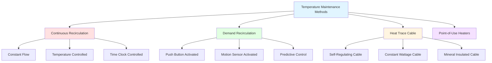

# Domestic Hot Water Temperature Maintenance

Temperature maintenance systems prevent heat loss in distribution piping to ensure hot water arrives at fixtures within acceptable delivery times while maintaining minimum temperatures for safety and comfort. The fundamental challenge is balancing delivery performance, energy efficiency, and bacterial control.

## Physical Principles of Heat Loss

Heat loss from piping drives the need for temperature maintenance. The steady-state heat loss from insulated piping follows:

$$Q = \frac{2\pi L(T_w - T_a)}{\frac{1}{h_i r_i} + \frac{\ln(r_o/r_i)}{k_{pipe}} + \frac{\ln(r_{ins}/r_o)}{k_{ins}} + \frac{1}{h_o r_{ins}}}$$

Where:
- $Q$ = heat loss rate (W)
- $L$ = pipe length (m)
- $T_w$ = water temperature (°C)
- $T_a$ = ambient temperature (°C)
- $r_i$, $r_o$, $r_{ins}$ = inner pipe, outer pipe, and insulation outer radii (m)
- $k_{pipe}$, $k_{ins}$ = thermal conductivity of pipe and insulation (W/m·K)
- $h_i$, $h_o$ = internal and external convection coefficients (W/m²·K)

For practical calculations, simplified linear approximations are used:

$$Q = U \cdot A \cdot \Delta T = U \cdot \pi D L \cdot (T_w - T_a)$$

The overall heat transfer coefficient $U$ depends on insulation thickness and quality. Uninsulated copper piping typically exhibits $U \approx 10-15$ W/m²·K, while 1-inch fiberglass insulation reduces this to $U \approx 0.4-0.6$ W/m²·K.

## Temperature Maintenance Methods

### Recirculation Systems

Continuous or demand-controlled recirculation maintains water temperature by pumping cooled water back to the heater. The required pump flow rate is determined by acceptable temperature drop:

$$\dot{m} = \frac{Q}{c_p \Delta T_{allow}}$$

Where:
- $\dot{m}$ = mass flow rate (kg/s)
- $Q$ = total system heat loss (W)
- $c_p$ = specific heat of water (4,186 J/kg·K)
- $\Delta T_{allow}$ = allowable temperature drop (°C)

For a system with 300 m of 1-inch insulated piping at 60°C in a 20°C environment with $U = 0.5$ W/m²·K:

$$Q = 0.5 \times \pi \times 0.0254 \times 300 \times (60-20) = 478 \text{ W}$$

Allowing a 5°C drop requires:

$$\dot{m} = \frac{478}{4186 \times 5} = 0.023 \text{ kg/s} = 0.36 \text{ gpm}$$

### Heat Trace Systems

Electric heat trace cable compensates for heat loss directly at the pipe. Self-regulating cables automatically adjust output based on pipe temperature, providing energy efficiency and freeze protection. Cable power density typically ranges from 3-12 W/ft depending on application.

## Comparison of Maintenance Methods

| Method | Energy Efficiency | Installation Cost | Operating Cost | Response Time | Best Application |
|--------|------------------|-------------------|----------------|---------------|------------------|
| Continuous Recirc | Low (24/7 losses) | Medium | High | Instant | High-use facilities |
| Demand Recirc | Medium (on-demand) | Medium-High | Medium | 30-60 seconds | Residential, moderate use |
| Temperature Control Recirc | Medium-High | Medium-High | Medium-Low | Instant when active | Commercial buildings |
| Self-Regulating Heat Trace | High (auto-adjusting) | High | Low-Medium | Continuous | Long runs, exposed piping |
| Constant Wattage Heat Trace | Medium | Medium-High | Medium | Continuous | Process applications |
| Point-of-Use Heaters | Highest | Low-Medium | Low | Instant | Remote fixtures, additions |

## Energy Code Requirements

ASHRAE 90.1-2019 Section 7.4.4.3 mandates temperature maintenance system controls:

**Automatic Shut-off**: Recirculation systems serving dwelling units, hotel/motel guest rooms, or demand recirculation systems must have automatic controls to limit pump operation.

**Temperature Control**: Systems must include controls to limit return temperature, preventing excessive pump operation when heat loss is minimal.

**Pipe Insulation**: Service water heating piping must meet minimum insulation requirements per Table 6.8.3A, typically R-3 for pipes ≤1 inch and R-4 for pipes 1-2 inches in nominal diameter.

**Pump Power Limits**: Recirculation pumps must not exceed 0.02 kW per gallon per minute of pump flow rate, encouraging efficient pump selection.

### Energy Performance Factors

Annual energy consumption for continuous recirculation approximates:

$$E_{annual} = Q_{loss} \times t_{operation} + P_{pump} \times t_{pump}$$

Where $P_{pump}$ is pump electrical power. For the previous example operating 24/7:

$$E_{annual} = 478 \text{ W} \times 8760 \text{ hr} + 50 \text{ W} \times 8760 \text{ hr} = 4,625 \text{ kWh/year}$$

At $0.12 per kWh, annual cost is $555. Implementing time-of-day controls reducing operation to 12 hours daily cuts this by approximately 50%.

## System Design Considerations

**Balancing Valves**: Multi-loop systems require balancing to ensure adequate flow to distant branches. Each branch should experience similar pressure drop to promote natural flow distribution.

**Return Line Sizing**: Return piping should be sized for 2-4 ft/s velocity to maintain reasonable pressure drop while ensuring adequate flow. Undersized returns increase pump energy consumption.

**Legionella Control**: Temperature maintenance must balance energy efficiency against bacterial growth prevention. Maintain delivery temperatures above 120°F (49°C) in high-risk facilities, with periodic thermal disinfection to 160°F (71°C) where required.

**Thermal Expansion**: Systems operating at elevated temperatures require expansion tanks sized per system volume and temperature rise. Pressure relief valves protect against over-pressurization.

**System Monitoring**: Temperature sensors at critical points verify maintenance effectiveness. Data logging identifies operational issues and validates energy savings from control strategies.

## Control Strategies for Efficiency

Modern temperature maintenance systems employ advanced controls:

1. **Aquastat Control**: Pump operates only when return temperature drops below setpoint
2. **Time-of-Day Scheduling**: Reduces or suspends operation during low-demand periods
3. **Occupancy-Based Control**: Links operation to building occupancy schedules
4. **Variable Speed Pumps**: Modulate flow based on temperature differential
5. **Predictive Learning**: Anticipates demand patterns to minimize energy while ensuring availability

Proper design, installation, and control of temperature maintenance systems ensures reliable hot water delivery while minimizing energy consumption and meeting code requirements for efficiency and safety.
