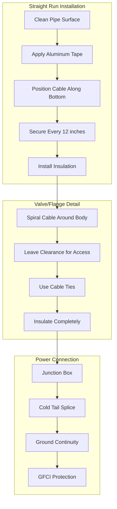

Heat tape tracing provides electrical resistance heating to maintain water pipes above freezing temperatures or sustain specific process temperatures in domestic hot water systems. The technology prevents costly freeze damage and ensures continuous service water availability in exposed or unheated spaces.

## Heat Trace Cable Types

Three primary cable technologies serve different applications based on temperature requirements, regulation capability, and installation environment.

### Comparison of Heat Trace Technologies

| Cable Type | Temperature Range | Regulation Method | Typical Output | Circuit Length | Applications |
|------------|-------------------|-------------------|----------------|----------------|--------------|
| Self-Regulating | -40°F to 185°F | Conductive polymer matrix | 3-12 W/ft | Up to 250 ft | Freeze protection, general use |
| Constant Wattage | -40°F to 400°F | Fixed resistance wire | 5-20 W/ft | Up to 500 ft | Process heating, precise control |
| Mineral Insulated | Up to 1200°F | Fixed resistance in MgO | 10-50 W/ft | Custom | High temperature industrial |

### Self-Regulating Cable

Self-regulating heat trace contains a conductive polymer core between two parallel bus wires. The polymer's electrical resistance increases as temperature rises, automatically reducing power output. This inherent feedback mechanism provides:

- Automatic temperature compensation along pipe length
- Elimination of burnout risk from cable overlap
- Energy efficiency through reduced output at higher temperatures
- No external controllers required for freeze protection

The polymer matrix exhibits positive temperature coefficient (PTC) behavior where molecular expansion at elevated temperatures reduces conductive pathways between carbon particles, increasing resistance.

### Constant Wattage Cable

Constant wattage systems use resistance wire with fixed output regardless of temperature. They require external temperature controllers and high-limit thermostats to prevent overheating. Applications include:

- Process temperature maintenance where precise control is critical
- High-temperature applications exceeding self-regulating limits
- Long circuit runs where consistent output is required
- Systems integrated with building automation

## Heat Output Calculations

Heat trace sizing requires calculating heat loss from the pipe and selecting cable with adequate output to compensate.

### Pipe Heat Loss

The steady-state heat loss from an insulated pipe to ambient air:

$$Q = \frac{2\pi k L (T_p - T_a)}{\ln\left(\frac{r_o}{r_i}\right)}$$

Where:
- $Q$ = heat loss (W)
- $k$ = insulation thermal conductivity (W/m·K)
- $L$ = pipe length (m)
- $T_p$ = pipe maintenance temperature (°C)
- $T_a$ = ambient temperature (°C)
- $r_o$ = outer insulation radius (m)
- $r_i$ = pipe outer radius (m)

### Required Heat Trace Output

The minimum cable output per unit length:

$$q_{min} = \frac{Q}{L} \times SF$$

Where:
- $q_{min}$ = minimum cable output (W/m)
- $SF$ = safety factor (typically 1.2-1.5)

The safety factor accounts for thermal bridging at pipe supports, power supply voltage variations, and aging effects.

### Practical Sizing Example

For a 1-inch copper pipe with 1-inch fiberglass insulation ($k = 0.04$ W/m·K) maintaining 40°F in 0°F ambient:

$$Q = \frac{2\pi (0.04)(1)(4.4 - (-17.8))}{\ln\left(\frac{0.044}{0.019}\right)} = 6.7 \text{ W/m}$$

With a 1.3 safety factor:

$$q_{min} = 6.7 \times 1.3 = 8.7 \text{ W/m}$$

Select cable rated 10 W/m (3 W/ft) at minimum expected temperature.

## Installation Methods

Proper installation ensures thermal coupling between cable and pipe while preventing damage to the heating element.

### Installation Configuration

The cable routing pattern affects heat transfer efficiency:

**Straight Run**
- Position cable along bottom of horizontal pipes (6 o'clock position)
- Maintains contact with coldest pipe section where condensation forms
- Simplest installation requiring minimum cable length

**Spiral Wrap**
- Helical pattern around pipe circumference
- Used for high heat loss applications or process heating
- Increases effective heat transfer area
- Pitch typically 6-12 inches per wrap

**Dual Cable**
- Two cables at 4 and 8 o'clock positions
- Provides redundancy for critical services
- Distributes heat more uniformly around circumference

### NEC Compliance Requirements

Heat trace systems must comply with NEC Article 427 (Electric Heating Equipment for Pipelines and Vessels):

1. **Ground Fault Protection**: GFCI protection required for all circuits (427.22)
2. **Disconnect Means**: Readily accessible disconnect within sight (427.55)
3. **Identification**: Cables marked with voltage, wattage, and manufacturer (427.23)
4. **Thermal Insulation**: Suitable for maximum cable temperature (427.16)
5. **Installation**: Secured at intervals not exceeding manufacturer specifications
6. **Controller**: Temperature limiting device for constant wattage systems (427.56)

## Energy Consumption Analysis

Heat trace represents a continuous electrical load during heating season. Energy analysis guides economic decisions.

### Annual Operating Cost

$$C = P \times H \times R$$

Where:
- $C$ = annual operating cost ($)
- $P$ = installed power (kW)
- $H$ = heating hours per year (hours)
- $R$ = electricity rate ($/kWh)

### Self-Regulating vs Constant Wattage Energy Use

Self-regulating cable typically consumes 20-40% less energy than constant wattage systems due to automatic output reduction as pipe temperature increases. For a 100-foot residential installation:

**Constant Wattage (10 W/ft with thermostat)**
- Average power during operation: 700 W (70% duty cycle)
- Annual consumption (3000 hours): 2,100 kWh
- Annual cost at $0.12/kWh: $252

**Self-Regulating (10 W/ft at 32°F)**
- Average power during operation: 450 W (auto-regulation)
- Annual consumption (3000 hours): 1,350 kWh
- Annual cost at $0.12/kWh: $162

The self-regulating system saves $90 annually in this scenario, often recovering its higher initial cost within 3-5 years.

## Application Guidelines

### Freeze Protection Applications

Standard freeze protection maintains pipes at 40-50°F minimum:
- Exposed domestic water lines in crawl spaces
- Outdoor hose bibs and yard hydrants
- Lines in unheated garages or storage areas
- Roof and gutter de-icing systems

**Design Criteria**:
- Maintain temperature 8-10°F above freezing
- Use self-regulating cable rated 3-5 W/ft
- Install beneath minimum 1-inch pipe insulation
- Provide power before first freeze event

### Temperature Maintenance Applications

Process applications require sustained elevated temperatures:
- Hot water recirculation alternative in long runs
- Tempered water delivery systems
- Chemical feed lines requiring viscosity control
- Water treatment equipment freeze protection

**Design Criteria**:
- Calculate heat loss at design ambient conditions
- Select cable output with 30-50% safety margin
- Use constant wattage with temperature controller for precision
- Monitor and alarm critical systems

### System Selection Matrix

Choose heat trace technology based on application requirements:

- **Self-Regulating**: Freeze protection, general water pipes, difficult-to-control areas, energy-sensitive applications
- **Constant Wattage**: Process heating, precise temperature control, long circuits, high ambient temperatures
- **Mineral Insulated**: Industrial high-temperature applications, corrosive environments, mechanical protection required

## Maintenance and Troubleshooting

Periodic inspection ensures continued operation and identifies failures before freeze events.

**Annual Inspection Items**:
- Measure insulation resistance (megohmmeter test)
- Verify GFCI operation under load
- Check controller setpoints and limit switch function
- Inspect cable for physical damage or insulation degradation
- Confirm proper cable attachment to pipe surface
- Review energy consumption trends for anomalies

**Common Failure Modes**:
- Ground fault from moisture infiltration (most common)
- Open circuit from physical damage during maintenance
- Controller malfunction preventing energization
- Inadequate insulation allowing excessive heat loss
- Power supply interruption or circuit breaker trip

Properly designed and installed heat trace systems provide reliable freeze protection with minimal maintenance over 15-20 year service life.
