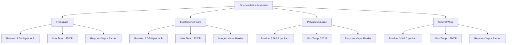
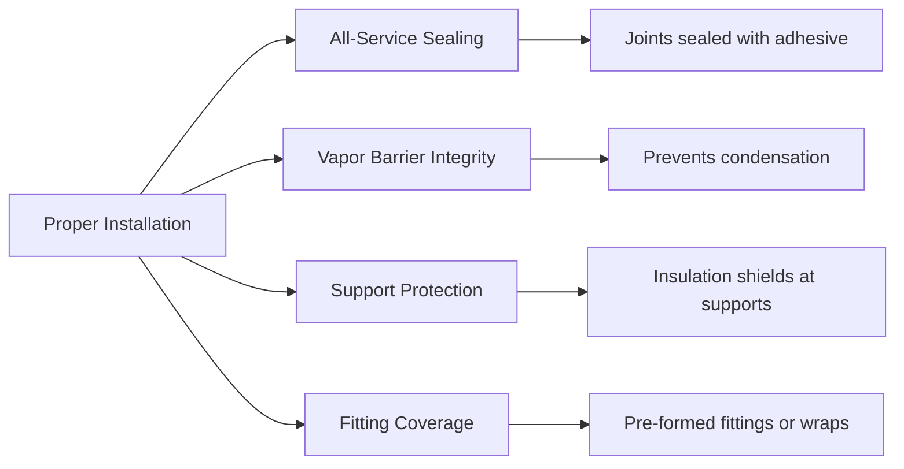

## Overview

Pipe insulation is a critical component in domestic hot water temperature maintenance systems, reducing heat loss by 80-90% when properly specified and installed. The selection of insulation materials, thickness, and application methods directly impacts energy consumption, water delivery temperature, and compliance with energy codes.

## Heat Loss Fundamentals

Heat loss from uninsulated piping occurs through conduction, convection, and radiation. The rate of heat transfer depends on pipe diameter, fluid temperature, ambient conditions, and surface emissivity.

### Heat Loss Calculation

The heat loss per unit length of insulated pipe is calculated using:

$$Q = \frac{2\pi L(T_f - T_a)}{\frac{1}{h_i r_i} + \frac{\ln(r_o/r_i)}{k_p} + \frac{\ln(r_{ins}/r_o)}{k_{ins}} + \frac{1}{h_o r_{ins}}}$$

Where:
- $Q$ = heat loss rate (Btu/hr)
- $L$ = pipe length (ft)
- $T_f$ = fluid temperature (°F)
- $T_a$ = ambient temperature (°F)
- $h_i$ = inside convection coefficient (Btu/hr·ft²·°F)
- $h_o$ = outside convection coefficient (Btu/hr·ft²·°F)
- $r_i$ = inside pipe radius (ft)
- $r_o$ = outside pipe radius (ft)
- $r_{ins}$ = insulation outer radius (ft)
- $k_p$ = pipe thermal conductivity (Btu/hr·ft·°F)
- $k_{ins}$ = insulation thermal conductivity (Btu/hr·ft·°F)

### Simplified Heat Loss Formula

For practical applications with known insulation R-value:

$$Q = \frac{\pi D_o L (T_f - T_a)}{R_{ins}}$$

Where $R_{ins}$ is the insulation thermal resistance (hr·ft²·°F/Btu) and $D_o$ is the outer pipe diameter (ft).

## Code Requirements

### ASHRAE 90.1 Minimum Insulation

ASHRAE 90.1 Table 6.8.3 specifies minimum insulation thickness based on fluid operating temperature and pipe size:

| Pipe Size (in) | Fluid Temp 105-140°F | Fluid Temp 141-200°F | Fluid Temp >200°F |
|----------------|---------------------|---------------------|-------------------|
| <1             | 0.5                 | 1.0                 | 1.5               |
| 1 to <1.5      | 1.0                 | 1.5                 | 2.0               |
| 1.5 to <4      | 1.5                 | 2.0                 | 2.5               |
| 4 to <8        | 2.0                 | 2.5                 | 3.5               |
| ≥8             | 2.5                 | 3.0                 | 4.0               |

*Thicknesses in inches for insulation with thermal conductivity of 0.24-0.29 Btu·in/hr·ft²·°F at 75°F mean temperature.*

### International Energy Conservation Code (IECC)

The IECC references ASHRAE 90.1 requirements for commercial buildings and specifies R-3 minimum for residential domestic hot water piping within conditioned space.

## Insulation Materials

### Material Comparison

| Material | Thermal Conductivity (k) | R-value/inch | Water Resistance | Cost |
|----------|-------------------------|--------------|------------------|------|
| Fiberglass | 0.23-0.26 | 3.8-4.3 | Low | Low |
| Elastomeric Foam | 0.26-0.28 | 4.0-4.6 | Excellent | Medium |
| Polyisocyanurate | 0.19-0.22 | 5.5-6.3 | Fair | High |
| Mineral Wool | 0.23-0.26 | 3.8-4.3 | Fair | Medium |

## System Design Considerations

### Insulation Thickness Selection

Beyond minimum code requirements, optimal insulation thickness is determined by economic analysis balancing installed cost against energy savings:

$$\text{Payback Period} = \frac{\text{Installed Cost Differential}}{\text{Annual Energy Savings}}$$

For DHW systems operating continuously, increased insulation thickness typically shows payback periods of 1-3 years.

### Installation Requirements

**Critical Installation Details:**

- **Joint Sealing**: All longitudinal and butt joints sealed with manufacturer-approved adhesive to prevent moisture infiltration
- **Vapor Barrier**: Continuous vapor retarder with permeance ≤0.02 perms for systems below ambient dewpoint
- **Support Insulation**: Insulation shields installed at pipe supports to prevent thermal bridging
- **Fitting Insulation**: Valves, fittings, and flanges insulated with pre-molded sections or multiple-layer wraps achieving equivalent R-value
- **Penetrations**: Sealed with compatible materials maintaining fire rating where applicable

## Heat Loss Reduction Performance

Properly installed pipe insulation reduces heat loss by 80-90% compared to bare pipe. For a 1-inch copper pipe carrying 140°F water in 70°F ambient:

| Condition | Heat Loss (Btu/hr·ft) | Reduction |
|-----------|----------------------|-----------|
| Bare Pipe | 45-55 | Baseline |
| 0.5" Insulation (R-2) | 12-15 | 73-75% |
| 1.0" Insulation (R-4) | 6-8 | 85-87% |
| 1.5" Insulation (R-6) | 4-5 | 90-91% |

## Material Selection Criteria

**Fiberglass Pipe Insulation:**
- Cost-effective for large diameter pipes
- Requires separate vapor barrier jacket
- Ideal for high-temperature applications (>220°F)
- Available in rigid half-sections

**Elastomeric Foam Insulation:**
- Preferred for small diameter DHW systems
- Integral closed-cell vapor barrier
- Easy field installation with self-sealing slit
- Limited to 220°F maximum operating temperature

**Polyisocyanurate Insulation:**
- Highest R-value per inch
- Economical for space-constrained installations
- Requires protective jacketing
- Suitable for buried or concealed piping

**Mineral Wool:**
- Fire-resistant applications
- High-temperature tolerance
- More expensive than fiberglass
- Requires moisture protection

## Compliance Verification

Energy code compliance requires documentation of:

1. Insulation material thermal conductivity
2. Installed thickness by pipe size and temperature
3. Vapor barrier specification
4. Sealing and joint treatment methods
5. Manufacturer product data sheets

Field inspection should verify continuous insulation coverage, proper thickness, sealed joints, and protection at supports before concealment.

## Summary

Pipe insulation specification for domestic hot water temperature maintenance requires analysis of heat loss physics, code minimum requirements, material properties, and economic optimization. Selection of insulation type and thickness based on operating temperature, pipe size, and ambient conditions ensures energy-efficient DHW delivery while maintaining code compliance. Proper installation with attention to joint sealing, vapor barrier integrity, and support protection is essential to achieve designed thermal performance.
