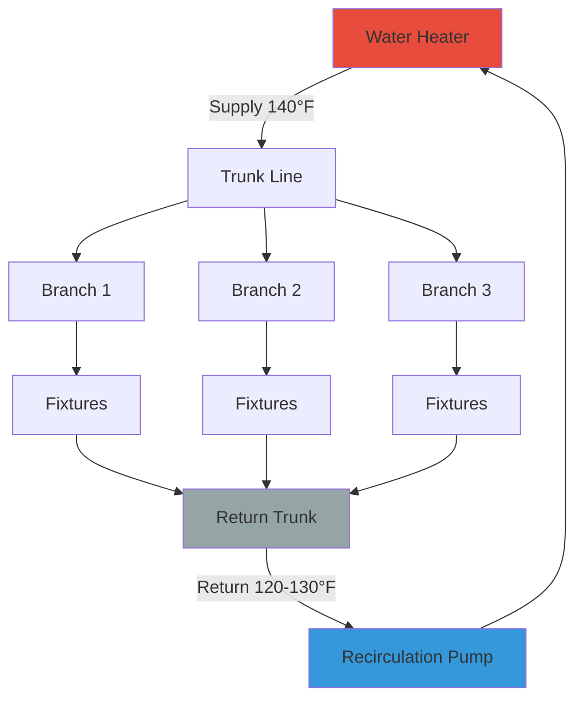

## Overview

Recirculation loops maintain hot water at fixtures by continuously circulating heated water through supply and return piping networks. Proper design requires balancing immediate hot water availability against heat loss and pumping energy. Critical parameters include loop layout, pipe sizing, insulation thickness, flow rates, and return temperature control.

## Loop Heat Loss Calculations

Heat loss from the recirculation loop determines the required heating capacity and operating cost. For insulated horizontal piping:

$$Q_{\text{loss}} = \frac{2\pi k L (T_w - T_a)}{\ln(r_o/r_i)}$$

Where:
- $Q_{\text{loss}}$ = heat loss rate (W)
- $k$ = insulation thermal conductivity (W/m·K)
- $L$ = pipe length (m)
- $T_w$ = water temperature (°C)
- $T_a$ = ambient temperature (°C)
- $r_o$ = outer insulation radius (m)
- $r_i$ = pipe outer radius (m)

For systems with multiple pipe sizes and insulation conditions, calculate total heat loss as:

$$Q_{\text{total}} = \sum_{i=1}^{n} Q_i \times L_i$$

ASHRAE 90.1 requires minimum insulation thickness based on pipe size and fluid temperature. For 140°F water in conditioned spaces, minimum 1-inch fiberglass insulation on pipes ≤1.5 inches, 1.5-inch insulation on larger pipes.

## Recirculation Flow Rate Sizing

Minimum circulation flow rate must replace heat losses while maintaining return temperature:

$$\dot{m} = \frac{Q_{\text{total}}}{c_p \Delta T}$$

Where:
- $\dot{m}$ = mass flow rate (kg/s)
- $c_p$ = specific heat of water = 4.186 kJ/(kg·K)
- $\Delta T$ = supply-to-return temperature difference (K)

Convert to volumetric flow:

$$\dot{V} = \frac{\dot{m}}{\rho} = \frac{Q_{\text{total}}}{\rho c_p \Delta T}$$

Typical design maintains 10-20°F temperature drop from supply to return. Smaller drops improve comfort but increase flow rate and pumping energy.

## Loop Configurations

### Direct Return vs Reverse Return

**Direct Return:** Shortest branches return first, creating unequal pressure drops. Requires balancing valves on each branch to equalize flow distribution.

**Reverse Return:** Last branch served returns first, creating equal pipe lengths and inherent hydraulic balance. Increases installation cost but simplifies commissioning.

## Pump Sizing and Selection

Required pump head overcomes friction losses through supply, return, and longest branch circuit:

$$H_{\text{pump}} = \Delta P_{\text{friction}} + \Delta P_{\text{fittings}} + \Delta P_{\text{valve}}$$

Friction loss calculation using Darcy-Weisbach equation:

$$\Delta P_f = f \frac{L}{D} \frac{\rho v^2}{2}$$

For typical recirculation velocities (2-4 ft/s), use simplified estimation or pipe friction charts from ASHRAE Fundamentals Chapter 22.

### Design Parameters

| Parameter | Recommended Range | Notes |
|-----------|------------------|-------|
| Return temperature | 120-130°F | Higher reduces wait time, increases loss |
| Supply-return ΔT | 10-20°F | Lower ΔT = higher flow, better uniformity |
| Pipe velocity | 2-4 ft/s | Balance erosion vs pressure drop |
| Insulation (conditioned) | R-3 to R-4 | Per ASHRAE 90.1 minimum |
| Insulation (unconditioned) | R-5 to R-6 | Increase for energy efficiency |
| Pump runtime | Continuous or scheduled | Aquastats and timers reduce waste |

## System Balancing

Proper balancing ensures adequate flow to all branches while preventing short-circuiting through low-resistance paths.

**Balancing Procedure:**

1. Measure supply and return temperatures at each branch endpoint
2. Adjust balancing valves to achieve target return temperature (within ±5°F)
3. Verify total system flow matches design using pump performance curve
4. Recheck branch temperatures after adjustments
5. Document final valve positions and flow rates

Install balancing valves with pressure taps for flow measurement. Calibrated ball valves or automatic balancing valves may be used depending on budget and complexity.

## Energy Efficiency Strategies

### Aquastat Control
Install aquastat on return line to cycle pump only when return temperature drops below setpoint (typically 120°F). Reduces pumping energy by 30-50% in many applications.

### Time Clock Scheduling
Operate recirculation during occupied hours only. Nighttime shutdown in commercial buildings can reduce heat loss by 8-12 hours daily. Combine with morning pre-heat cycle.

### Demand-Activated Systems
Motion sensors or push-button activation triggers pump operation. Best for low-usage facilities or remote fixture groups.

### Temperature Modulation
Reduce loop temperature during low-demand periods. Lower from 140°F to 120°F overnight reduces heat loss by approximately 15-20% while maintaining Legionella control.

## Code Requirements

**Uniform Plumbing Code (UPC) Section 607:** Requires hot water delivery within reasonable time frame. Recirculation systems or point-of-use heaters satisfy this requirement for fixtures >50 feet from heater.

**International Plumbing Code (IPC) Section 607.2:** Mandates hot water delivery or heat trace for fixtures exceeding developed length limits based on pipe size.

**ASHRAE 90.1 Section 7.4.4.4:** Requires automatic controls (aquastat, time clock, or demand) to limit recirculation pump operation. Prohibits continuous operation without temperature-based shutoff.

**NSF/ANSI 61:** All materials in contact with potable water must be certified for drinking water applications, including pumps, valves, and pipe insulation vapor barriers.

## Design Checklist

- Calculate total loop heat loss including all supply and return piping
- Size circulation flow rate for maximum allowable temperature drop
- Select pump for total system head at design flow rate
- Specify insulation meeting or exceeding ASHRAE 90.1 minimums
- Provide balancing valves on all parallel branches (direct return systems)
- Install aquastat control and/or time clock per energy code
- Verify materials comply with NSF/ANSI 61 potable water standards
- Design for maintenance access to pump, valves, and controls
- Consider expansion tank if system includes check valves or backflow preventers

Effective recirculation loop design delivers immediate hot water while minimizing ongoing energy waste through proper sizing, insulation, and intelligent controls.
